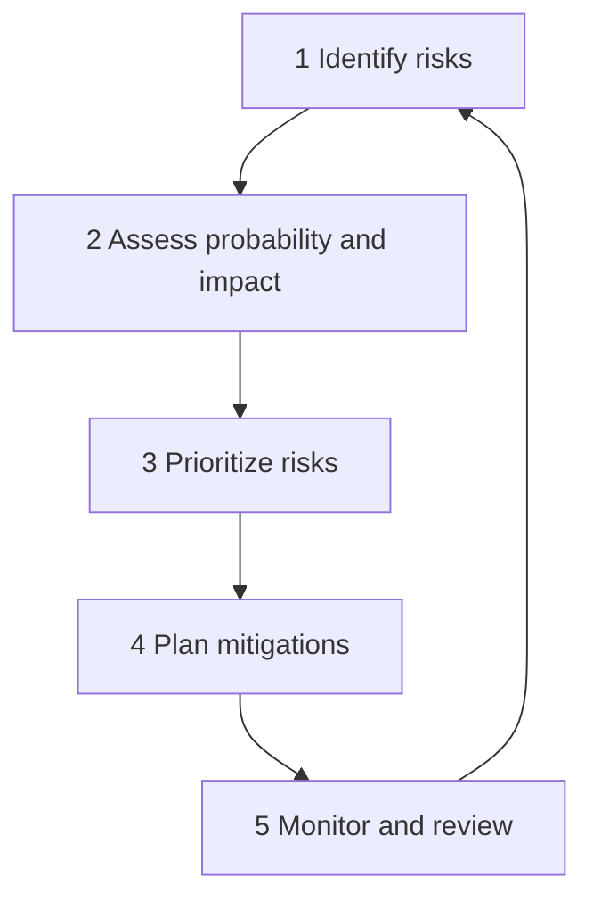

# Requirements Risk Management

> **One-line definition:** Identifying, assessing, and mitigating risks that arise from requirements themselves: incomplete requirements, changing requirements, conflicting requirements, and requirements that cannot be met.

## Why This Is a Senior Skill

A mid-level engineer treats requirements risks as someone else's problem (the product manager's, the project manager's). A senior engineer **actively identifies and mitigates requirements risks** because they understand that requirements problems become engineering problems if left unaddressed.

Requirements risks are among the most expensive risks in software projects because they affect the foundation of what is being built. A technical risk might cause rework in one component. A requirements risk can cause rework across the entire system.

## The Requirements Risk Taxonomy

| Risk category | Description | Examples |
|---|---|---|
| **Completeness risks** | Requirements are missing or incomplete | Undiscovered stakeholder needs, unaddressed edge cases, missing non-functional requirements |
| **Correctness risks** | Requirements are wrong or based on incorrect assumptions | Misunderstood user needs, incorrect business rules, outdated market assumptions |
| **Consistency risks** | Requirements conflict with each other | Feature A requires real-time data, Feature B requires batch processing; both cannot be satisfied simultaneously |
| **Feasibility risks** | Requirements cannot be met within constraints | Performance target exceeds technology limits, budget insufficient for scope, timeline unrealistic |
| **Volatility risks** | Requirements are likely to change | Market is evolving, regulatory landscape is shifting, stakeholder needs are not yet stable |
| **Ambiguity risks** | Requirements can be interpreted in multiple ways | Vague language, undefined terms, unstated assumptions |
| **Dependency risks** | Requirements depend on external factors | Third-party API availability, regulatory approval, other team's delivery |

## The Risk Management Process

### Step 1: Identify risks

A senior engineer systematically identifies requirements risks using:

**Checklist-based identification:**

| Check | Risk if not addressed |
|---|---|
| Have all stakeholder groups been consulted? | Completeness risk: undiscovered needs |
| Have non-functional requirements been defined? | Completeness risk: performance, security, scalability gaps |
| Have requirements been reviewed for conflicts? | Consistency risk: contradictory requirements |
| Have feasibility constraints been validated? | Feasibility risk: requirements that cannot be met |
| Are requirements stable or likely to change? | Volatility risk: rework due to changing requirements |
| Are requirements written in unambiguous language? | Ambiguity risk: misinterpretation during implementation |
| Do requirements depend on external factors? | Dependency risk: blocked by external delivery or approval |

**Experience-based identification:**

A senior engineer draws on past projects to anticipate common risks:

- "In our last project, we discovered the compliance requirements after design was complete. Let's engage compliance now."
- "The stakeholder who defined these requirements left the company. We need to validate with their replacement."
- "This requirement depends on a third-party API that has a history of breaking changes. We need a fallback plan."

### Step 2: Assess probability and impact

For each identified risk, assess:

| | Low impact | Medium impact | High impact |
|---|---|---|---|
| **High probability** | Medium risk | High risk | Critical risk |
| **Medium probability** | Low risk | Medium risk | High risk |
| **Low probability** | Low risk | Low risk | Medium risk |

**Impact dimensions:**

- **Rework:** How much work would need to be redone if this risk materializes?
- **Delay:** How much would the project be delayed?
- **Cost:** What is the financial impact?
- **Quality:** How would the product quality be affected?
- **Stakeholder satisfaction:** How would stakeholders react?

### Step 3: Prioritize risks

Focus mitigation effort on high and critical risks. Low risks are monitored but not actively mitigated.

### Step 4: Plan mitigations

For each high or critical risk, define a mitigation strategy:

| Strategy | When to use | Example |
|---|---|---|
| **Avoid** | Change the plan to eliminate the risk | Remove a high-risk requirement from scope |
| **Mitigate** | Reduce the probability or impact | Prototype a risky requirement to validate feasibility |
| **Transfer** | Shift the risk to a third party | Use a managed service instead of building in-house |
| **Accept** | The risk is worth taking given the value | Document the risk and plan to respond if it materializes |
| **Contingency** | Plan a response for if the risk materializes | Define a fallback approach if a dependency fails |

### Step 5: Monitor and review

Risks change over time. A senior engineer reviews the risk register regularly:

- Have any risks materialized? Activate the contingency plan.
- Have any risks decreased in probability or impact? Reduce mitigation effort.
- Have new risks emerged? Add them to the register.
- Are mitigations working? Adjust if not.

## Common Requirements Risks and Mitigations

### Risk: Incomplete requirements

**Probability:** High in most projects

**Impact:** High : undiscovered requirements cause rework late in the project

**Mitigations:**

- Conduct stakeholder identification workshop early
- Use multiple elicitation techniques (interviews, workshops, observation)
- Review requirements against a completeness checklist
- Prototype early to surface hidden requirements
- Plan for requirements discovery sprints before full implementation

### Risk: Requirements volatility

**Probability:** High in innovative or market-facing projects

**Impact:** Medium to high : changing requirements cause rework and scope creep

**Mitigations:**

- Identify which requirements are stable and which are volatile
- Design the architecture to accommodate change in volatile areas (modularity, feature flags, configuration)
- Use iterative development to get feedback early
- Negotiate a change freeze date after which only critical changes are accepted
- Track requirement change rate as a metric

### Risk: Conflicting requirements

**Probability:** Medium in projects with multiple stakeholders

**Impact:** High : conflicts cause delays and political friction

**Mitigations:**

- Review requirements for conflicts during the requirements review
- Facilitate stakeholder alignment workshops to resolve conflicts
- Document the resolution and the reasoning
- Escalate unresolvable conflicts to the executive sponsor

### Risk: Infeasible requirements

**Probability:** Medium in projects with ambitious targets

**Impact:** High : discovered late, infeasible requirements cause major rework

**Mitigations:**

- Conduct feasibility analysis for high-risk requirements early
- Prototype or spike the riskiest technical requirements
- Define fallback approaches if the primary approach is not feasible
- Communicate feasibility constraints to stakeholders early

### Risk: Ambiguous requirements

**Probability:** High in most projects

**Impact:** Medium : ambiguity causes misinterpretation and rework

**Mitigations:**

- Review requirements for ambiguity using the ambiguity reduction techniques from [[06_Ambiguity_Reduction]]
- Define acceptance conditions before implementation (see [[05_Acceptance_Conditions]])
- Use structured formats (Given-When-Then) for user-facing requirements
- Prototype to validate understanding

## The Requirements Risk Register

A senior engineer maintains a requirements risk register:

| ID | Risk | Category | Probability | Impact | Risk level | Mitigation | Owner | Status |
|---|---|---|---|---|---|---|---|---|
| RR-001 | Compliance requirements not yet defined | Completeness | High | High | Critical | Engage compliance team by sprint 2 | [Name] | Open |
| RR-002 | Third-party API may change before launch | Dependency | Medium | High | High | Build adapter layer, define fallback | [Name] | Open |
| RR-003 | Performance target may not be achievable | Feasibility | Medium | High | High | Spike in sprint 1, define fallback target | [Name] | Mitigating |
| RR-004 | User needs in international markets unclear | Completeness | Medium | Medium | Medium | User research in target markets | [Name] | Open |

## Requirements Risk in Agile

In agile projects, requirements risk management is continuous:

- **Sprint planning:** Review the risk register and plan risk mitigation activities
- **Daily standup:** Surface new risks as they emerge
- **Sprint review:** Validate requirements with stakeholders to reduce correctness risk
- **Retrospective:** Review risk management effectiveness and adjust the approach

A senior engineer ensures that risk management is not a separate activity but integrated into the regular agile cadence.

## Practical Exercise

**For your current project:**

1. **Identify risks:** Use the checklist-based identification to find requirements risks in your current project

2. **Assess each risk:** Rate probability and impact for each identified risk

3. **Prioritize:** Identify the top 3 risks (high or critical)

4. **Plan mitigations:** For each top risk, define a mitigation strategy and assign an owner

5. **Create a risk register:** Document all risks in the risk register template

**Bonus:** Find a project from the past year where a requirements risk materialized. What was the impact? What mitigation could have prevented or reduced it?

## Knowledge Connections

- [[01_Problem_Statement_Definition]] : problem framing reduces completeness and correctness risks
- [[03_Stakeholder_Management]] : stakeholder identification reduces completeness risks
- [[05_Acceptance_Conditions]] : acceptance conditions reduce ambiguity risks
- [[06_Ambiguity_Reduction]] : ambiguity reduction techniques address ambiguity risks
- [[07_Prioritization]] : prioritization decisions affect which risks are accepted
- [[software-engineering-note/01_Software_Requirements/11_Tools_Process_Improvement_and_Risk]] : requirements tools and risk management
- [[software-engineering-note/10_Software_Engineering_Project_Management/02_Risk_and_Quality]] : project risk management

## Key Takeaways

- Requirements risks are among the most expensive risks because they affect the foundation of what is being built
- Seven risk categories: completeness, correctness, consistency, feasibility, volatility, ambiguity, dependency
- Follow the five-step process: identify, assess, prioritize, mitigate, monitor
- Five mitigation strategies: avoid, mitigate, transfer, accept, contingency
- Maintain a requirements risk register and review it regularly
- In agile, risk management is continuous and integrated into the regular cadence
