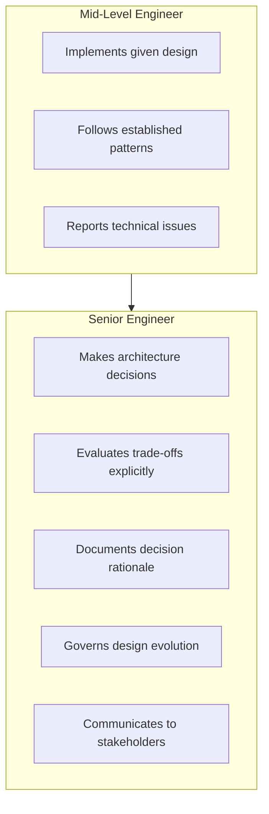
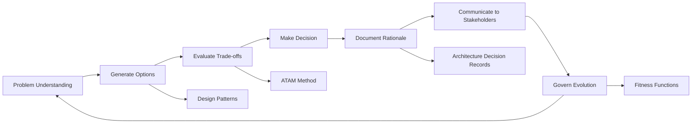

# Architecture and Design Judgment

> **One-line definition:** The ability to make sound technical decisions under uncertainty, evaluate architecture trade-offs explicitly, and govern design evolution over time.

## Why This Matters for Senior Engineers

A mid-level engineer implements designs. A senior engineer **makes the decisions** about which designs to implement, **evaluates the trade-offs** between competing options, and **governs the architecture** as it evolves.

Architecture and design judgment is not about knowing the "right" answer. It is about:

- Understanding the problem deeply enough to make informed choices
- Evaluating multiple options against quality attributes (performance, scalability, maintainability, security)
- Making trade-offs explicit and documenting the reasoning
- Communicating decisions to stakeholders who may disagree
- Governing the architecture as requirements change over time

## The Senior Engineer's Role in Architecture

## Core Topics in This Capability Area

| Topic                                | What you will learn                                              | Key question answered                                                  |
| ------------------------------------ | ---------------------------------------------------------------- | ---------------------------------------------------------------------- |
| [[01_Architecture_Decision_Making]]  | Structured process for making decisions                          | How do I choose between options when there is no clear winner?         |
| [[02_Quality_Attribute_Tradeoffs]]   | Evaluating performance, scalability, security, maintainability   | What am I giving up when I choose this approach?                       |
| [[03_Architecture_Evaluation]]       | ATAM and other evaluation methods                                | How do I know if this architecture will work?                          |
| [[04_Architecture_Decision_Records]] | ADR templates and best practices                                 | How do I document decisions so future teams understand them?           |
| [[05_Design_Patterns_Judgment]]      | When to apply patterns and when to avoid them                    | Is this pattern solving my problem or creating complexity?             |
| [[06_Architecture_Governance]]       | Lightweight governance for agile teams                           | How do I ensure the team follows the architecture without bureaucracy? |
| [[07_Architecture_Communication]]    | Explaining decisions to technical and non-technical stakeholders | How do I get buy-in for my architecture decisions?                     |

## Concept Map

## Prerequisites

Before diving into architecture judgment, you should understand:

- [[software-engineering-note/02_Software_Architecture/01_Architecture_Fundamentals]]: Architecture fundamentals and styles
- [[software-engineering-note/02_Software_Architecture/02_Quality_Attributes_Overview]]: Quality attributes (performance, availability, security, etc.)
- [[software-engineering-note/03_Software_Design/01_Design_Fundamentals_and_Principles]]: Design principles (SOLID, DRY, separation of concerns)
- [[02_Problem_Framing_and_Requirements/00_overview]]: Problem framing and requirements engineering

## Progress Tracker

- [x] [[01_Architecture_Decision_Making]] : Structured decision-making process
- [x] [[02_Quality_Attribute_Tradeoffs]] : Evaluating quality attribute trade-offs
- [x] [[03_Architecture_Evaluation]] : ATAM and evaluation methods
- [x] [[04_Architecture_Decision_Records]] : ADR templates and best practices
- [x] [[05_Design_Patterns_Judgment]] : When to apply and when to avoid patterns
- [x] [[06_Architecture_Governance]] : Lightweight governance for agile teams
- [x] [[07_Architecture_Communication]] : Communicating decisions to stakeholders

## Knowledge Connections

- [[body-of-knowledge/SWEBOK/Software Engineering Body of Knowledge Overview]] : SWEBOK foundation
- [[software-engineering-note/02_Software_Architecture/Software Architecture Overview]] : Architecture knowledge base
- [[software-engineering-note/03_Software_Design/Software Design Note Overview]] : Design knowledge base
- [[01_Technical_Ownership/05_Decision_Ownership]] : Decision ownership complements architecture judgment
- [[02_Problem_Framing_and_Requirements/07_Prioritization]] : Prioritization informs architecture trade-offs
- [[02_Problem_Framing_and_Requirements/08_Requirements_Risk]] : Requirements risk affects architecture decisions

## Key Takeaways

- Architecture judgment is about making informed decisions under uncertainty, not finding the "right" answer
- Senior engineers make decisions, evaluate trade-offs, document rationale, and govern evolution
- Use structured methods (ATAM, ADRs) to make decisions explicit and reviewable
- Communicate decisions to both technical and non-technical stakeholders
- Governance should be lightweight and adaptive, not bureaucratic
