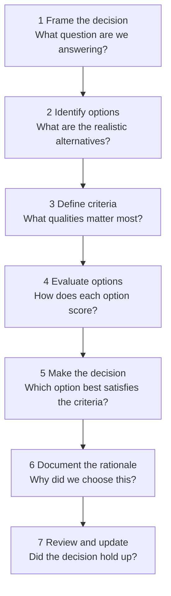

# Architecture Decision Making

> **One-line definition:** A structured process for choosing between architecture options when requirements are incomplete, trade-offs are unavoidable, and the cost of being wrong is high.

## Why This Is a Senior Skill

A mid-level engineer picks an approach and starts coding. A senior engineer **structures the decision process** so that the choice is informed, explicit, and defensible.

Architecture decisions are different from coding decisions because:

- **They are expensive to reverse:** Changing a database choice after 6 months of development is not a refactor; it is a rewrite
- **They affect multiple teams:** Your choice of message broker affects operations, security, and every team that integrates with you
- **They are made under uncertainty:** You never have complete information when you make them
- **They involve trade-offs:** Every choice optimizes for some qualities at the expense of others

## The Decision-Making Process

### Step 1: Frame the decision

Before generating options, clearly define what you are deciding:

| Component | Question | Example |
|---|---|---|
| **Decision question** | What specific question are we answering? | "Which message broker should we use for event-driven communication?" |
| **Context** | What constraints and requirements drive this decision? | "We need pub/sub, message replay, and 99.9% availability" |
| **Stakes** | What happens if we get this wrong? | "High: changing message brokers later would require rewriting all event producers and consumers" |
| **Timeline** | When do we need to decide? | "Within 2 weeks, before the event system design is finalized" |

### Step 2: Identify options

Generate a realistic set of options. A senior engineer avoids two common mistakes:

- **False dichotomy:** Presenting only two options when more exist
- **Straw man options:** Including obviously bad options to make the preferred one look good

A good option set includes:

- **The conservative option:** Proven, well-understood, lower risk
- **The innovative option:** Newer technology with potential advantages but less track record
- **The do-nothing option:** What happens if we defer this decision?
- **The build option:** What if we build this ourselves instead of buying?

### Step 3: Define evaluation criteria

Criteria should be derived from quality attributes and project constraints:

| Criterion | Weight | Rationale |
|---|---|---|
| Performance (latency) | High | Real-time requirements demand < 100ms p99 |
| Operational complexity | High | Small ops team; cannot support complex infrastructure |
| Cost | Medium | Budget-constrained but not the primary driver |
| Community support | Medium | Need long-term viability and hiring pool |
| Learning curve | Low | Team is experienced and can learn new technologies |

### Step 4: Evaluate options

Use a structured evaluation matrix:

| Criterion (weight) | Option A: Kafka | Option B: RabbitMQ | Option C: AWS SQS |
|---|---|---|---|
| Performance (High) | Excellent: high throughput, low latency | Good: lower throughput, acceptable latency | Good: variable latency, depends on AWS |
| Operational complexity (High) | Poor: requires ZooKeeper, complex setup | Good: simpler, well-documented | Excellent: fully managed |
| Cost (Medium) | Medium: infrastructure cost + ops time | Low: lightweight, low resource usage | High: per-message pricing at scale |
| Community support (Medium) | Excellent: large community, many integrations | Good: established, mature ecosystem | Good: AWS ecosystem, vendor lock-in |
| Learning curve (Low) | Moderate: new concepts (topics, partitions) | Low: familiar AMQP protocol | Low: simple API |

### Step 5: Make the decision

After evaluation, the senior engineer makes an explicit choice and states the reasoning:

**Decision:** We will use AWS SQS for message queuing.

**Rationale:** Given our small operations team and the need to ship quickly, the fully managed nature of SQS outweighs the higher per-message cost. Performance is acceptable for our use case (we do not need Kafka-level throughput), and the learning curve is minimal. If our throughput requirements grow beyond SQS limits, we will re-evaluate (see ADR-007).

### Step 6: Document the rationale

Document the decision in an ADR (see [[04_Architecture_Decision_Records]]). The documentation should answer:

- What did we decide?
- Why did we decide it?
- What options did we consider?
- What trade-offs did we accept?
- Under what conditions would we revisit this decision?

### Step 7: Review and update

Architecture decisions are not permanent. A senior engineer schedules periodic reviews:

- **Trigger-based review:** Review when a key assumption changes (e.g., throughput exceeds projections)
- **Time-based review:** Review major decisions annually
- **Incident-based review:** Review decisions implicated in production incidents

## Decision-Making Under Uncertainty

### The uncertainty spectrum

Architecture decisions exist on a spectrum of uncertainty:

| Level | Description | Approach |
|---|---|---|
| **Certain** | Requirements are clear, options are well-understood | Make the decision now; document thoroughly |
| **Uncertain** | Requirements may change, options have trade-offs | Make a decision with explicit assumptions; plan to revisit |
| **Ambiguous** | Requirements are unclear, options are unproven | Defer the decision if possible; use spikes to reduce uncertainty |

### The two-way door principle

A senior engineer distinguishes between:

- **One-way doors:** Decisions that are expensive or impossible to reverse. Spend more time evaluating. Examples: database choice, programming language, core protocol.
- **Two-way doors:** Decisions that are easy to reverse. Make them quickly and move on. Examples: logging library, HTTP client, caching strategy.

### The reversible-irreversible matrix

| | Easy to reverse | Hard to reverse |
|---|---|---|
| **High impact** | Decide quickly, monitor closely | Invest significant evaluation time |
| **Low impact** | Decide quickly, do not overthink | Defer or avoid; not worth the effort |

## Common Decision-Making Anti-Patterns

| Anti-pattern | Description | What to do instead |
|---|---|---|
| **Analysis paralysis** | Endlessly evaluating options without deciding | Time-box evaluation; decide with available information |
| **Resume-driven architecture** | Choosing technology based on what looks good on a resume | Choose based on team skills and project needs |
| **Hype-driven architecture** | Choosing technology because it is trendy | Evaluate against proven alternatives; require evidence of benefits |
| **HiPPO architecture** | Decisions made by the highest-paid person's opinion | Use structured evaluation with data and explicit criteria |
| **Consensus trap** | Waiting for everyone to agree before deciding | Seek input, but someone must own the decision |
| **Decision avoidance** | Not deciding, letting the decision happen by default | Recognize that not deciding is itself a decision; document it |

## Practical Exercise

**For a decision you are currently facing:**

1. **Frame the decision:** Write the decision question, context, stakes, and timeline

2. **Identify 3-4 options:** Include a conservative option, an innovative option, and the do-nothing option

3. **Define 4-5 criteria:** Weight them by importance

4. **Build an evaluation matrix:** Score each option against each criterion

5. **Make the decision:** Write the decision and rationale in one paragraph

6. **Draft an ADR:** Use the template from [[04_Architecture_Decision_Records]]

**Bonus:** Find a decision from the past year that turned out poorly. Was the decision wrong, or did the context change? What would you do differently?

## Knowledge Connections

- [[02_Quality_Attribute_Tradeoffs]] : criteria for evaluating options
- [[03_Architecture_Evaluation]] : ATAM and other evaluation methods
- [[04_Architecture_Decision_Records]] : documenting decisions
- [[software-engineering-note/02_Software_Architecture/09_Evaluation_and_Governance]] : architecture evaluation and governance
- [[software-engineering-note/03_Software_Design/07_Design_Rationale_and_Decisions]] : design rationale and decisions

## Key Takeaways

- Architecture decisions are expensive to reverse and affect multiple teams; structure the decision process
- Follow the seven-step process: frame, identify options, define criteria, evaluate, decide, document, review
- Distinguish one-way doors (invest time) from two-way doors (decide quickly)
- Avoid anti-patterns: analysis paralysis, resume-driven architecture, hype-driven architecture, HiPPO, consensus trap
- Not deciding is itself a decision; document it explicitly
