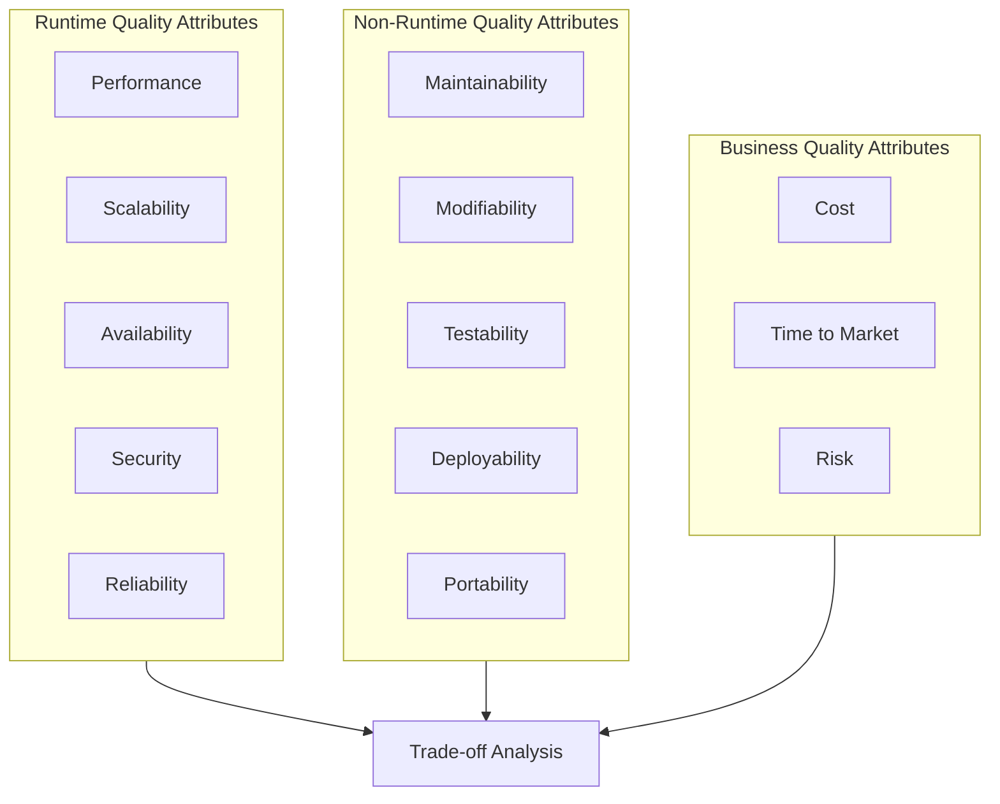

# Quality Attribute Trade-offs

> **One-line definition:** Understanding how architecture choices affect system qualities (performance, scalability, security, maintainability) and making explicit trade-offs when qualities conflict.

## Why This Is a Senior Skill

A mid-level engineer optimizes for one quality attribute (usually performance or features). A senior engineer understands that **every architecture decision is a trade-off** between multiple quality attributes, and makes those trade-offs explicit.

You cannot have everything. A system that is highly performant may sacrifice maintainability. A system that is highly secure may sacrifice usability. A system that is highly scalable may sacrifice consistency. A senior engineer navigates these tensions deliberately.

## The Quality Attribute Landscape



### Runtime quality attributes

These are observable when the system is running:

| Quality attribute | What it means | How to measure |
|---|---|---|
| **Performance** | How fast the system responds | Latency (p50, p95, p99), throughput (requests/second) |
| **Scalability** | How well the system handles increased load | Load at which performance degrades beyond SLA |
| **Availability** | How often the system is operational | Uptime percentage (e.g., 99.9% = 8.76 hours downtime/year) |
| **Security** | How well the system resists unauthorized access | Number of vulnerabilities, time to patch, breach frequency |
| **Reliability** | How often the system produces correct results | Error rate, data corruption frequency |

### Non-runtime quality attributes

These affect the development and maintenance experience:

| Quality attribute | What it means | How to measure |
|---|---|---|
| **Maintainability** | How easy it is to fix bugs and add features | Time to implement a change, defect rate after changes |
| **Modifiability** | How easy it is to change the system's structure | Number of files changed per feature, coupling metrics |
| **Testability** | How easy it is to test the system | Test coverage, time to run tests, flaky test rate |
| **Deployability** | How easy it is to deploy changes | Deployment frequency, deployment failure rate, rollback time |
| **Portability** | How easy it is to move the system to a new environment | Time to deploy to a new cloud provider or region |

### Business quality attributes

These affect the business outcomes:

| Quality attribute | What it means | How to measure |
|---|---|---|
| **Cost** | Total cost of ownership | Infrastructure cost, operations cost, development cost |
| **Time to market** | How quickly features reach users | Lead time from commit to production |
| **Risk** | Probability and impact of failure | Risk exposure (probability × impact) |

## The Trade-off Matrix

Every architecture decision involves trade-offs. A senior engineer makes them explicit:

### Common trade-off patterns

| Decision | Optimizes for | Sacrifices |
|---|---|---|
| Microservices over monolith | Scalability, deployability, team autonomy | Operational complexity, latency (network calls), consistency |
| Eventual consistency over strong consistency | Availability, partition tolerance, performance | Consistency (temporary), complexity (conflict resolution) |
| Caching | Performance, scalability | Consistency (stale data), complexity (invalidation), memory cost |
| Async processing over sync | Throughput, resilience | Latency (user waits for result), complexity (status tracking) |
| Polyglot persistence (multiple databases) | Performance per use case, scalability | Operational complexity, data consistency, team learning curve |
| Serverless over containers | Operational simplicity, cost (at low scale) | Cold start latency, vendor lock-in, limited runtime |
| GraphQL over REST | Flexibility, reduced over-fetching | Complexity, caching difficulty, learning curve |

### The trade-off analysis template

For each architecture decision, document the trade-offs:

```markdown
## Trade-off Analysis: [Decision Name]

### Options Considered
1. Option A: [description]
2. Option B: [description]
3. Option C: [description]

### Quality Attribute Impact

| Quality Attribute | Option A | Option B | Option C | Priority |
|---|---|---|---|---|
| Performance | +2 | +1 | -1 | High |
| Scalability | +2 | +1 | 0 | High |
| Maintainability | -1 | +2 | +1 | Medium |
| Cost | -1 | 0 | +2 | Medium |

(+2 = significant improvement, +1 = improvement, 0 = neutral, -1 = degradation, -2 = significant degradation)

### Trade-offs Accepted
- Choosing Option A improves performance and scalability but degrades maintainability
- Choosing Option B improves maintainability but offers moderate performance gains
- Choosing Option C minimizes cost but offers limited performance improvement

### Decision
[Which option was chosen and why]

### Mitigations for Sacrificed Qualities
[How will we address the degraded qualities?]
```

## Quality Attribute Scenarios

### The scenario format

Quality attributes are abstract until expressed as scenarios. A senior engineer defines quality attribute scenarios using this format:

```
Stimulus: [What happens]
Environment: [Under what conditions]
Artifact: [What part of the system is affected]
Response: [How the system responds]
Measure: [How we measure success]

Example (Performance):
Stimulus: 1000 concurrent users submit search queries
Environment: Normal operating conditions
Artifact: Search service
Response: Return results within 200ms (p95)
Measure: Latency at p95 percentile

Example (Availability):
Stimulus: Primary database fails
Environment: Production environment
Artifact: Database layer
Response: Failover to secondary within 30 seconds; no data loss
Measure: Time to failover, data loss (if any)
```

### The quality attribute workshop

For significant projects, a senior engineer facilitates a quality attribute workshop:

**Participants:** Engineering team, product manager, operations representative

**Agenda (90 minutes):**

1. **Identify quality attributes** (20 min): Which quality attributes matter most for this system?
2. **Define scenarios** (30 min): Write 2-3 scenarios for each priority quality attribute
3. **Prioritize scenarios** (20 min): Rank scenarios by business impact and technical risk
4. **Identify conflicts** (20 min): Which quality attributes conflict? What trade-offs are acceptable?

**Output:** A prioritized list of quality attribute scenarios that guide architecture decisions

## Trade-off Decision Patterns

### When qualities conflict

When two quality attributes conflict, a senior engineer follows this process:

1. **Quantify the conflict:** How much does improving one degrade the other?
2. **Assess business impact:** Which quality attribute has higher business value?
3. **Explore mitigations:** Can we improve the degraded quality without sacrificing the optimized one?
4. **Make an explicit trade-off:** Document what we are giving up and why

### The quality attribute priority matrix

Not all quality attributes are equally important. A senior engineer helps stakeholders prioritize:

| | Critical (must have) | Important (should have) | Nice to have |
|---|---|---|---|
| **Runtime** | Availability (99.9%) | Performance (p95 < 200ms) | Scalability beyond 10x current load |
| **Non-runtime** | Maintainability (team can modify) | Testability (80% coverage) | Portability (multi-cloud) |
| **Business** | Cost within budget | Time to market < 6 months | Risk reduction beyond baseline |

### The quality attribute negotiation

When stakeholders disagree on quality attribute priorities, a senior engineer facilitates negotiation:

- **Product manager:** "We need to ship fast; performance can wait"
- **Operations:** "If it's slow, we'll get paged at 3 AM"
- **Security:** "If it's not secure, we'll get breached"

**Senior engineer role:** Translate quality attributes into business outcomes:

- "If we ship with poor performance, user churn will increase by X%"
- "If we ship with poor security, we risk a breach that costs $Y"
- "If we delay for 2 months to improve quality, we lose $Z in revenue"

## Practical Exercise

**For your current project:**

1. **Identify the top 3 quality attributes** that matter most for your system

2. **Write 2 scenarios** for each quality attribute using the stimulus-environment-artifact-response-measure format

3. **Identify conflicts:** Which quality attributes conflict in your current architecture?

4. **Document a trade-off:** Choose one recent architecture decision and document the trade-offs using the template above

5. **Assess mitigations:** For each sacrificed quality, what mitigation can you apply?

**Bonus:** Find a quality attribute that was sacrificed in a past decision and later caused a problem. What was the trade-off? Was it the right decision at the time? What would you do differently?

## Knowledge Connections

- [[01_Architecture_Decision_Making]] : trade-off analysis feeds into decision-making
- [[03_Architecture_Evaluation]] : ATAM evaluates quality attribute trade-offs
- [[software-engineering-note/02_Software_Architecture/02_Quality_Attributes_Overview]] : quality attribute fundamentals
- [[software-engineering-note/02_Software_Architecture/03_Availability_and_Interoperability]] : availability and interoperability
- [[software-engineering-note/02_Software_Architecture/04_Modifiability_and_Performance]] : modifiability and performance
- [[software-engineering-note/02_Software_Architecture/05_Security_and_Testability]] : security and testability

## Key Takeaways

- Every architecture decision is a trade-off between multiple quality attributes; make them explicit
- Quality attributes exist in three categories: runtime, non-runtime, and business
- Use scenarios to make quality attributes concrete and measurable
- When qualities conflict, quantify the trade-off, assess business impact, explore mitigations, and document the decision
- Facilitate quality attribute prioritization with stakeholders to align on what matters most
