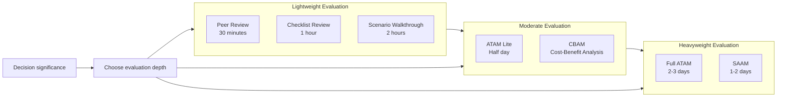
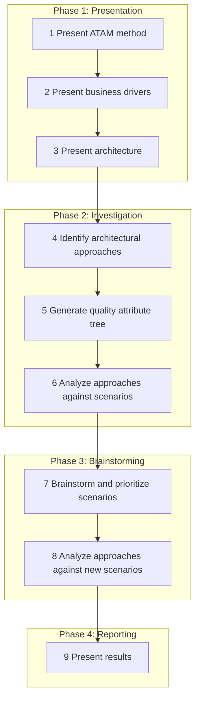
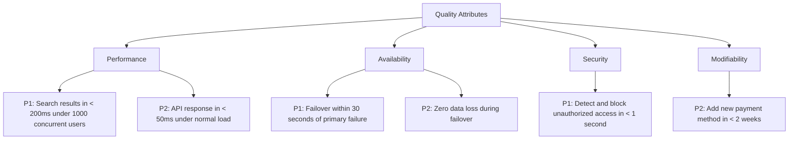

# Architecture Evaluation

> **One-line definition:** Systematically assessing whether an architecture will achieve its quality attribute goals before committing to implementation.

## Why This Is a Senior Skill

A mid-level engineer builds the architecture and hopes it works. A senior engineer **evaluates the architecture before building** to identify risks, validate assumptions, and ensure the design will meet quality attribute goals.

Architecture evaluation is not a luxury. It is a risk mitigation activity. The cost of discovering an architecture problem during implementation is 10-100x higher than discovering it during design. A senior engineer invests time in evaluation to avoid expensive rework.

## The Architecture Evaluation Landscape



## The Architecture Tradeoff Analysis Method (ATAM)

ATAM (Architecture Tradeoff Analysis Method) is the most widely used architecture evaluation method, developed by the Software Engineering Institute at Carnegie Mellon University.

### When to use ATAM

| Situation | Use ATAM? |
|---|---|
| New system with significant quality attribute requirements | Yes |
| Major architecture change to an existing system | Yes |
| Small feature addition to a stable system | No; use lightweight review |
| Technology selection with limited impact | No; use trade-off analysis |
| System with high business or safety criticality | Yes |

### The ATAM process

ATAM is a structured, multi-day evaluation with defined roles and activities:



### ATAM roles

| Role | Responsibility |
|---|---|
| **Evaluation team** | External or internal architects who conduct the evaluation |
| **Project decision-makers** | Architects and leads who made the design decisions |
| **Architecture stakeholders** | Developers, testers, operations, users who are affected |
| **ATAM leader** | Facilitates the evaluation, ensures process is followed |

### The quality attribute tree

A key output of ATAM is the quality attribute tree, which prioritizes quality attribute scenarios:



Each scenario is rated on two dimensions:

- **Importance:** How important is this scenario to business success? (High/Medium/Low)
- **Difficulty:** How difficult is it to achieve with the current architecture? (High/Medium/Low)

High-importance, high-difficulty scenarios are the highest risk and receive the most analysis.

### ATAM outputs

| Output | Description |
|---|---|
| **Risks** | Architectural decisions that may cause problems |
| **Non-risks** | Architectural decisions that are explicitly acceptable |
| **Sensitivity points** | Architectural elements that significantly affect a quality attribute |
| **Trade-off points** | Architectural elements that affect multiple quality attributes (improving one degrades another) |

### Example ATAM findings

| Type | Finding | Implication |
|---|---|---|
| **Risk** | Single database instance with no replication | High availability goal may not be achievable |
| **Non-risk** | Stateless API servers behind load balancer | Supports horizontal scaling |
| **Sensitivity point** | Connection pool size | Significantly affects performance under load |
| **Trade-off point** | Synchronous replication | Improves consistency but degrades performance |

## Lightweight Architecture Evaluation

For smaller decisions or teams without resources for full ATAM, lightweight alternatives exist:

### The architecture review checklist

A quick review using a structured checklist:

```markdown
## Architecture Review Checklist

### Functional Suitability
- [ ] Architecture supports all functional requirements
- [ ] Edge cases and error scenarios are addressed
- [ ] Integration points are defined

### Quality Attributes
- [ ] Performance requirements are defined and achievable
- [ ] Scalability approach is documented
- [ ] Availability targets are defined with failover strategy
- [ ] Security threats are identified with mitigations
- [ ] Maintainability is considered (modularity, coupling)

### Technical Feasibility
- [ ] Technology choices are proven or validated with spikes
- [ ] Team has skills to implement and maintain the architecture
- [ ] External dependencies are identified with fallback plans

### Operational Readiness
- [ ] Deployment strategy is defined
- [ ] Monitoring and alerting are planned
- [ ] Backup and recovery procedures are designed
- [ ] Rollback strategy is defined

### Governance
- [ ] Architecture decisions are documented in ADRs
- [ ] Trade-offs are explicit
- [ ] Review date is scheduled
```

### The scenario walkthrough

A focused evaluation using quality attribute scenarios:

1. **Select 3-5 high-priority scenarios** from the quality attribute tree
2. **Walk through the architecture** for each scenario: "When X happens, what does the system do?"
3. **Identify risks:** "What could go wrong? What assumptions are we making?"
4. **Document findings:** Record risks and mitigations

### The peer review

A quick review by a trusted colleague:

1. **Present the architecture** in 15 minutes (diagram + key decisions)
2. **Ask for feedback:** "What concerns you? What would you do differently?"
3. **Document the feedback:** Record concerns and address them

## When to Evaluate

A senior engineer evaluates architecture at key decision points:

| Trigger | Evaluation depth |
|---|---|
| New project kickoff | Moderate to heavy (ATAM or ATAM Lite) |
| Major architecture change | Moderate (ATAM Lite or scenario walkthrough) |
| Technology selection | Light (checklist or peer review) |
| Pre-production release | Moderate (scenario walkthrough) |
| Post-incident review | Light (checklist focused on the incident area) |
| Annual architecture review | Moderate (scenario walkthrough) |

## Practical Exercise

**For your current project:**

1. **Choose an evaluation method** appropriate to your current decision (ATAM, ATAM Lite, checklist, or peer review)

2. **If using a checklist:** Run through the architecture review checklist and document findings

3. **If using scenario walkthrough:** Select 3 quality attribute scenarios and walk through the architecture for each

4. **Identify risks:** Document the top 3 risks you discovered

5. **Plan mitigations:** For each risk, define a mitigation strategy

**Bonus:** Find an architecture from the past year that had problems in production. Conduct a retrospective evaluation. What risks would an evaluation have identified? Why was it not caught?

## Knowledge Connections

- [[01_Architecture_Decision_Making]] : evaluation informs decisions
- [[02_Quality_Attribute_Tradeoffs]] : evaluation assesses quality attribute satisfaction
- [[04_Architecture_Decision_Records]] : evaluation findings inform ADRs
- [[06_Architecture_Governance]] : evaluation is part of governance
- [[software-engineering-note/02_Software_Architecture/09_Evaluation_and_Governance]] : architecture evaluation and governance
- [[software-engineering-note/12_Software_Quality/Software Quality Overview]] : software quality

## Key Takeaways

- Architecture evaluation is risk mitigation; the cost of discovering problems during design is 10-100x lower than during implementation
- ATAM is the most comprehensive evaluation method; use it for high-stakes decisions
- Lightweight alternatives (checklist, scenario walkthrough, peer review) are appropriate for smaller decisions
- Evaluate at key decision points: project kickoff, major changes, pre-production, post-incident
- ATAM outputs include risks, non-risks, sensitivity points, and trade-off points
