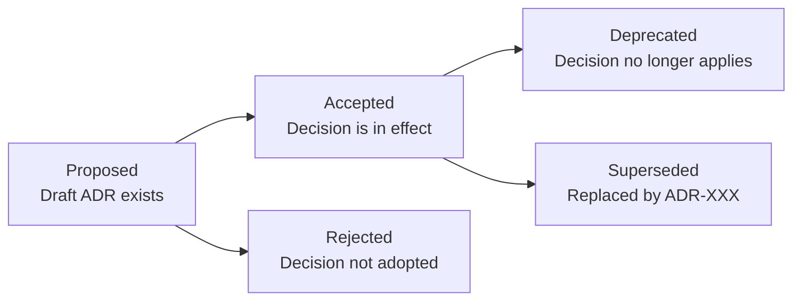

# Architecture Decision Records

> **One-line definition:** Lightweight documents that capture what was decided, why it was decided, what alternatives were considered, and what trade-offs were accepted.

## Why This Is a Senior Skill

A mid-level engineer makes decisions and moves on. A senior engineer **documents decisions** so that future teams (including future versions of themselves) understand the reasoning and can make informed changes when context shifts.

Without ADRs, architecture decisions become archaeology: teams discover code that makes no sense, cannot find anyone who remembers why it was written that way, and are afraid to change it. ADRs prevent this by preserving the context, reasoning, and trade-offs alongside the code.

## The ADR Format

### The Nygard template (recommended)

Michael Nygard's template is the most widely used and strikes the right balance between completeness and brevity:

```markdown
# ADR-001: Use PostgreSQL for primary data store

## Status
Accepted (2026-01-15)

## Context
We are building a new e-commerce platform that needs a primary relational database.
Our requirements:
- ACID transactions for orders and payments
- JSON support for product attributes
- Horizontal read scaling for product catalog
- Team has 5+ years PostgreSQL experience
- Must support 10,000 concurrent users

We evaluated:
1. PostgreSQL
2. MySQL
3. MongoDB
4. Amazon Aurora

## Decision
We will use PostgreSQL 15 as our primary data store.

## Consequences

### Positive
- Team expertise: zero learning curve, faster delivery
- JSONB support: handles product attributes without schema changes
- Read replicas: supports horizontal read scaling
- Proven reliability: 25+ years of production use

### Negative
- Write scaling: limited to single primary; will need sharding at 100K+ writes/sec
- Operational complexity: requires backup, replication, and monitoring setup

### Neutral
- Cost: similar to MySQL; higher than MongoDB for equivalent storage

## Compliance
- [ ] Security review completed
- [ ] Operations team notified
- [ ] Backup strategy documented
```

### Key sections explained

| Section | Purpose | What to include |
|---|---|---|
| **Status** | Current state of the decision | Proposed, Accepted, Deprecated, Superseded (by ADR-XXX) |
| **Context** | Why this decision was needed | Business drivers, technical constraints, requirements, options considered |
| **Decision** | What was decided | Clear, one-sentence statement of the decision |
| **Consequences** | What results from the decision | Positive, negative, and neutral impacts on quality attributes, cost, timeline |

## Writing Effective ADRs

### The ADR quality checklist

A good ADR is:

- [ ] **Specific:** One decision per ADR; not a collection of related decisions
- [ ] **Complete:** Context, decision, and consequences are all documented
- [ ] **Honest:** Negative consequences are acknowledged, not hidden
- [ ] **Traceable:** Links to requirements, evaluations, and related ADRs
- [ ] **Current:** Status reflects the current state; superseded decisions are marked

### Common ADR anti-patterns

| Anti-pattern | Problem | What to do instead |
|---|---|---|
| **Too vague** | "We chose X because it's good" | Explain why X is good for this specific context |
| **Missing alternatives** | No mention of what else was considered | Always document at least 2-3 alternatives |
| **Hiding negatives** | Only positive consequences listed | Acknowledge negative consequences and mitigations |
| **Too long** | 10-page document that no one reads | Keep it to 1-2 pages; link to detailed analysis |
| **Never updated** | ADR says "Accepted" but decision was reversed | Update status to "Deprecated" or "Superseded" |
| **One-time activity** | ADRs written at project start, never again | Write ADRs throughout the project as decisions are made |

### The ADR review process

Before accepting an ADR, review it with:

1. **The decision-maker:** Does this accurately capture the decision and reasoning?
2. **The team:** Do they understand and agree with the decision?
3. **Stakeholders:** Are they aware of the trade-offs?

## ADR Lifecycle



### Status transitions

| From | To | When |
|---|---|---|
| Proposed | Accepted | Decision is made and communicated |
| Accepted | Deprecated | Decision no longer applies (e.g., feature removed) |
| Accepted | Superseded | New ADR replaces this decision |
| Proposed | Rejected | Decision is not adopted |

### Superseding an ADR

When a decision is reversed or updated, create a new ADR and mark the old one as superseded:

```markdown
# ADR-005: Migrate from PostgreSQL to CockroachDB

## Status
Accepted (2026-08-01)

## Context
Our system has grown to require multi-region writes with strong consistency.
PostgreSQL single-primary architecture no longer meets our write-scaling needs.
ADR-001 chose PostgreSQL when our write volume was 10K/sec; we now sustain 150K/sec.

## Decision
We will migrate from PostgreSQL to CockroachDB.

## Consequences

### Positive
- Multi-region writes: eliminates cross-region latency
- Horizontal write scaling: no single-primary bottleneck
- PostgreSQL compatibility: minimal application changes

### Negative
- Operational complexity: new database technology to learn and operate
- Cost: higher infrastructure cost than PostgreSQL
- Migration effort: 2 months of engineering time

## Supersedes
ADR-001: Use PostgreSQL for primary data store (now Deprecated)
```

## ADR Storage and Organization

### Where to store ADRs

| Location | Pros | Cons |
|---|---|---|
| **Code repository (recommended)** | Version-controlled with code; discoverable; reviewed in PRs | Non-technical stakeholders may not access |
| **Wiki or Confluence** | Accessible to all stakeholders | Not version-controlled; can become stale |
| **Shared document folder** | Easy to create and share | No version control; hard to find; can become stale |

### Recommended structure

```
project-root/
├── docs/
│   └── architecture/
│       ├── decisions/
│       │   ├── 0001-use-postgresql.md
│       │   ├── 0002-use-kafka-for-events.md
│       │   └── 0003-adopt-microservices.md
│       └── README.md (index of all ADRs)
├── src/
└── ...
```

### The ADR index

Maintain an index (README.md) that lists all ADRs:

```markdown
# Architecture Decision Records

| ADR | Title | Status | Date |
|---|---|---|---|
| [ADR-001](decisions/0001-use-postgresql.md) | Use PostgreSQL for primary data store | Superseded by ADR-005 | 2026-01-15 |
| [ADR-002](decisions/0002-use-kafka-for-events.md) | Use Kafka for event streaming | Accepted | 2026-01-20 |
| [ADR-003](decisions/0003-adopt-microservices.md) | Adopt microservices architecture | Accepted | 2026-02-01 |
| [ADR-005](decisions/0005-migrate-to-cockroachdb.md) | Migrate from PostgreSQL to CockroachDB | Accepted | 2026-08-01 |
```

## ADR Workflow

### The ADR creation workflow

1. **Identify a decision:** Recognize that a significant architecture decision needs to be made
2. **Draft the ADR:** Write the ADR while the decision is being made, not after
3. **Review with stakeholders:** Share the draft with the team and stakeholders
4. **Finalize and commit:** Update status to "Accepted" and commit to the repository
5. **Communicate:** Announce the decision to all affected parties

### The ADR review workflow

Periodically (e.g., quarterly), review all accepted ADRs:

- Are the decisions still valid, or has context changed?
- Are the consequences still acceptable, or do we need to revisit?
- Should any ADRs be marked as deprecated or superseded?

## Practical Exercise

**For your current project:**

1. **Identify 3 recent architecture decisions** that should have been documented

2. **Write an ADR** for the most significant decision using the Nygard template

3. **Review the ADR** with a colleague: Does it accurately capture the decision and reasoning?

4. **Create an ADR index** in your project documentation

5. **Set a review date:** When will you review this ADR to ensure it's still valid?

**Bonus:** Find a decision from the past year that was reversed. Write a retrospective ADR documenting what changed and why the decision was superseded.

## Knowledge Connections

- [[01_Architecture_Decision_Making]] : ADRs document the output of decision-making
- [[03_Architecture_Evaluation]] : evaluation findings inform ADRs
- [[06_Architecture_Governance]] : ADRs are part of governance
- [[software-engineering-note/02_Software_Architecture/07_Design_and_Documentation]] : architecture documentation
- [[software-engineering-note/03_Software_Design/07_Design_Rationale_and_Decisions]] : design rationale and decisions

## Key Takeaways

- ADRs preserve the context, reasoning, and trade-offs of architecture decisions for future teams
- Use the Nygard template: Status, Context, Decision, Consequences
- Good ADRs are specific, complete, honest, traceable, and current
- Store ADRs in the code repository for version control and discoverability
- Maintain an ADR lifecycle: Proposed → Accepted → Deprecated/Superseded
- Review ADRs periodically to ensure they remain valid
