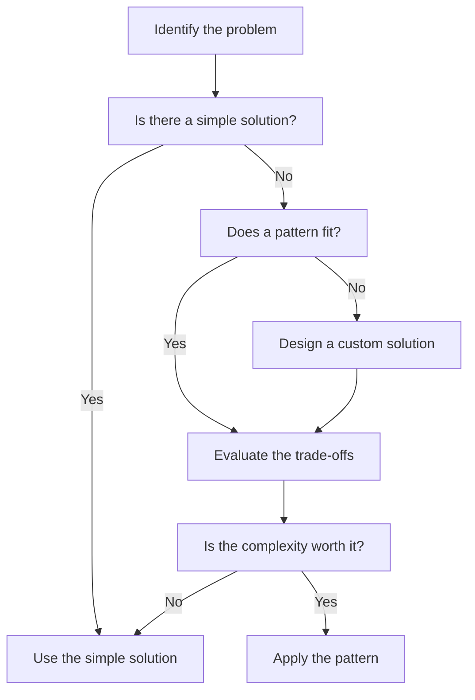

# Design Patterns Judgment

> **One-line definition:** Knowing when to apply design patterns, when to avoid them, and when the complexity they introduce is not worth the abstraction they provide.

## Why This Is a Senior Skill

A mid-level engineer learns design patterns and applies them whenever they recognize a situation. A senior engineer **judges whether a pattern is appropriate** for the specific context, considering team skills, system complexity, and long-term maintainability.

Design patterns are tools, not rules. The Gang of Four book describes 23 patterns, but applying all of them creates a system that is over-engineered, hard to understand, and expensive to maintain. A senior engineer knows that the best pattern is often the simplest solution that meets the requirements.

## The Pattern Judgment Framework

### The pattern decision checklist

Before applying a pattern, ask:

- [ ] **Does this pattern solve my actual problem?** Not a problem I might have in the future
- [ ] **Is there a simpler solution?** Often a direct implementation is clearer
- [ ] **Does my team understand this pattern?** If not, the learning cost may outweigh the benefit
- [ ] **Will this pattern make the code easier or harder to maintain?** Patterns can increase or decrease maintainability
- [ ] **Am I applying this pattern because it's the right tool, or because I want to use it?** Resume-driven development is real

## Common Patterns and When to Use Them

### Creational patterns

| Pattern | When to use | When to avoid |
|---|---|---|
| **Singleton** | Global configuration, logging, connection pools | When you need multiple instances, when testing requires isolation |
| **Factory** | Complex object creation, polymorphic families | When object creation is simple (just use `new`) |
| **Builder** | Objects with many optional parameters, step-by-step construction | When objects have few parameters or all are required |
| **Prototype** | Expensive object creation, cloning is cheaper | When objects are cheap to create or have complex state |

### Structural patterns

| Pattern | When to use | When to avoid |
|---|---|---|
| **Adapter** | Integrating incompatible interfaces, legacy system integration | When you can change the interface directly |
| **Decorator** | Adding behavior dynamically without inheritance | When behavior is static or inheritance is simpler |
| **Facade** | Simplifying a complex subsystem, providing a unified API | When the subsystem is already simple |
| **Proxy** | Lazy loading, access control, remote invocation | When direct access is sufficient and simpler |

### Behavioral patterns

| Pattern | When to use | When to avoid |
|---|---|---|
| **Observer** | Event-driven systems, pub/sub, reactive programming | When there are few subscribers or events are rare |
| **Strategy** | Multiple algorithms for the same task, runtime selection | When there is only one algorithm or selection is compile-time |
| **Command** | Undo/redo, queuing, logging, transactional behavior | When operations are simple and irreversible |
| **State** | Objects with complex state machines, state-dependent behavior | When state transitions are simple or linear |
| **Iterator** | Traversing collections with custom logic | When standard iteration (for loops) is sufficient |

## The Over-Engineering Trap

### Signs of over-engineering

A senior engineer recognizes when patterns are being over-applied:

- **Too many interfaces:** Every class has an interface, even when there's only one implementation
- **Deep inheritance hierarchies:** More than 2-3 levels of inheritance
- **Excessive abstraction:** Simple operations require navigating through multiple layers
- **Pattern for pattern's sake:** Applying a pattern because it's "best practice" without a clear problem
- **Future-proofing:** Adding complexity for requirements that may never materialize

### The YAGNI principle

**You Aren't Gonna Need It.** A senior engineer applies YAGNI to design patterns:

- Do not add a Factory if you only have one implementation
- Do not add a Strategy if you only have one algorithm
- Do not add an Observer if you only have one subscriber
- Do not add a State pattern if you only have two states

### The refactoring approach

Instead of applying patterns upfront, a senior engineer:

1. **Starts simple:** Implement the straightforward solution
2. **Watches for pain:** Notice when the simple solution becomes hard to change
3. **Refactors to patterns:** Apply patterns when the pain justifies the complexity

This approach ensures patterns are applied based on actual needs, not anticipated ones.

## Architecture Patterns

### Monolith vs. microservices

| Aspect | Monolith | Microservices |
|---|---|---|
| **When to use** | Small team, simple domain, fast iteration needed | Large team, complex domain, independent scaling needed |
| **Deployment** | Single deployable unit | Multiple independent services |
| **Scaling** | Scale the entire application | Scale individual services |
| **Complexity** | Lower operational complexity | Higher operational complexity (networking, monitoring, deployment) |
| **Team autonomy** | Shared codebase, coordination required | Independent teams, independent deployment |

**Senior engineer judgment:** Start with a monolith unless you have a clear reason for microservices. The operational complexity of microservices is often underestimated.

### Synchronous vs. asynchronous

| Aspect | Synchronous | Asynchronous |
|---|---|---|
| **When to use** | Real-time response required, simple workflows | High throughput, background processing, resilience |
| **Complexity** | Simpler to reason about | More complex (eventual consistency, retries, dead letters) |
| **Performance** | Lower throughput, higher latency per request | Higher throughput, variable latency |
| **Failure handling** | Failures propagate immediately | Failures can be retried, queued, or ignored |

**Senior engineer judgment:** Use synchronous for user-facing operations that require immediate response. Use asynchronous for background processing, event-driven workflows, and resilience.

### Event sourcing vs. CRUD

| Aspect | Event sourcing | CRUD |
|---|---|---|
| **When to use** | Audit trail required, complex state transitions, temporal queries | Simple state, no audit requirements |
| **Complexity** | Higher (event store, projections, eventual consistency) | Lower (simple database operations) |
| **Flexibility** | Can reconstruct any historical state | Only current state available |
| **Performance** | Write-heavy, requires projections for reads | Balanced read/write |

**Senior engineer judgment:** Use event sourcing when audit trails, temporal queries, or complex state transitions are required. Use CRUD for simple state management.

## Pattern Anti-Patterns

### The golden hammer

**Problem:** Applying the same pattern to every problem because it worked once.

**Example:** Using microservices for a simple internal tool with 2 users.

**Solution:** Evaluate each problem on its own merits. Ask: "Is this the right tool for this specific problem?"

### The premature optimization

**Problem:** Applying patterns for performance or scalability that is not yet needed.

**Example:** Adding a caching layer before measuring actual performance.

**Solution:** Measure first. Apply patterns based on actual bottlenecks, not anticipated ones.

### The cargo cult

**Problem:** Copying patterns from successful companies without understanding their context.

**Example:** Adopting Netflix's microservices architecture for a 5-person startup.

**Solution:** Understand the problem the pattern solves. Ask: "Do I have the same problem?"

### The pattern overload

**Problem:** Applying so many patterns that the code becomes harder to understand than the problem it solves.

**Example:** A simple calculator implemented with Strategy, Factory, Observer, and Command patterns.

**Solution:** Start simple. Add patterns only when the complexity they remove exceeds the complexity they add.

## Practical Exercise

**For your current project:**

1. **Identify 3 design patterns** currently used in your codebase

2. **For each pattern, assess:**
   - What problem does it solve?
   - Is there a simpler solution?
   - Does the team understand it?
   - Is the complexity justified?

3. **Find an over-engineered area:** Identify code that uses patterns unnecessarily. What would a simpler solution look like?

4. **Find an under-engineered area:** Identify code that would benefit from a pattern. What pattern would help, and why?

5. **Write a pattern ADR:** Document a decision to apply (or not apply) a pattern, including the trade-offs

**Bonus:** Find a pattern from the past year that was applied and later removed. Why was it removed? Was it the wrong pattern, or did the context change?

## Knowledge Connections

- [[01_Architecture_Decision_Making]] : pattern selection is a decision
- [[02_Quality_Attribute_Tradeoffs]] : patterns affect quality attributes
- [[04_Architecture_Decision_Records]] : document pattern decisions in ADRs
- [[software-engineering-note/03_Software_Design/01_Design_Fundamentals_and_Principles]] : design fundamentals
- [[software-engineering-note/03_Software_Design/05_Design_Strategies_and_Methods]] : design strategies and methods
- [[software-engineering-note/03_Software_Design/Design Pattern]] : design pattern catalog

## Key Takeaways

- Design patterns are tools, not rules; judge whether they are appropriate for the specific context
- Apply the pattern decision checklist: does it solve the problem, is there a simpler solution, does the team understand it, is the complexity worth it?
- Avoid over-engineering: start simple, watch for pain, refactor to patterns when justified
- Recognize anti-patterns: golden hammer, premature optimization, cargo cult, pattern overload
- Document pattern decisions in ADRs to preserve the reasoning for future teams
