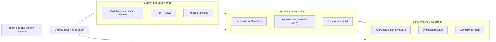
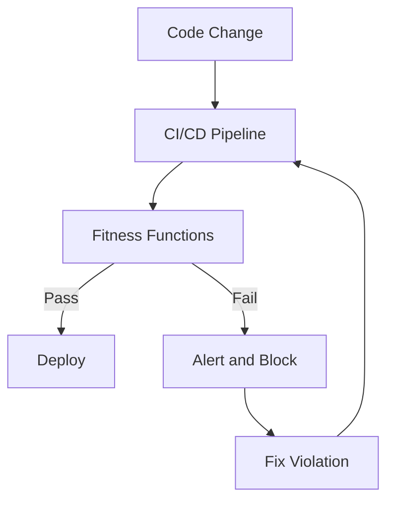
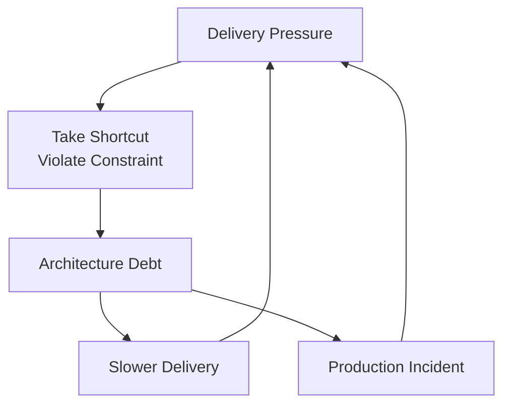

# Architecture Governance

> **One-line definition:** Ensuring the system's architecture remains aligned with its goals over time, without creating bureaucratic bottlenecks that slow delivery.

## Why This Is a Senior Skill

A mid-level engineer follows architecture guidelines. A senior engineer **defines governance practices** that ensure architectural integrity while enabling teams to move quickly.

Architecture governance is not about control. It is about **alignment**: ensuring that the system evolves in a way that continues to meet quality attribute goals, business needs, and technical constraints. Without governance, architecture erodes over time as teams make local optimizations that degrade the whole.

But governance that is too heavy creates bottlenecks, slows delivery, and drives teams to work around the process. A senior engineer finds the balance: lightweight governance that catches problems early without slowing teams down.

## The Governance Spectrum



### When to use each level

| Governance level | When to use |
|---|---|
| **Lightweight** | Small teams (2-5 engineers), low criticality, fast iteration |
| **Moderate** | Medium teams (5-20 engineers), medium criticality, multiple services |
| **Heavyweight** | Large teams (20+ engineers), high criticality (safety, financial, regulatory) |

## Lightweight Governance Practices

### Architecture Decision Records (ADRs)

ADRs (see [[04_Architecture_Decision_Records]]) are the foundation of lightweight governance:

- **What they do:** Document decisions, rationale, and trade-offs
- **When to use:** Every significant architecture decision
- **Who reviews:** Team members and stakeholders
- **Cost:** Low (1-2 hours per ADR)

### Peer reviews

Informal reviews by trusted colleagues:

- **What they do:** Catch problems early, share knowledge, build consensus
- **When to use:** Before major design decisions, during code reviews for architecture-impacting changes
- **Who reviews:** 1-2 colleagues with relevant expertise
- **Cost:** Low (30-60 minutes per review)

### Fitness functions

Automated checks that verify architectural constraints:

- **What they do:** Continuously monitor architecture health
- **When to use:** For constraints that can be measured automatically
- **Examples:**
  - Dependency checks: "No circular dependencies between modules"
  - Performance checks: "API response time (p95) < 200ms"
  - Code quality checks: "Cyclomatic complexity < 10 per method"
  - Security checks: "No hardcoded secrets in code"
- **Cost:** Low (automated, runs in CI/CD pipeline)



## Moderate Governance Practices

### Architecture checklists

Structured checklists for common decisions:

- **What they do:** Ensure common concerns are not overlooked
- **When to use:** Before major releases, when adopting new technologies, when designing new services
- **Example checklist:**
  ```markdown
  ## New Service Checklist
  - [ ] Service boundary is clearly defined
  - [ ] API contract is documented
  - [ ] Authentication and authorization are defined
  - [ ] Monitoring and alerting are configured
  - [ ] Backup and recovery procedures are documented
  - [ ] Performance SLAs are defined
  - [ ] Security review is completed
  - [ ] Operations runbook is created
  ```
- **Cost:** Medium (1-2 hours per checklist)

### Request for Comments (RFC)

Formal proposals for significant changes:

- **What they do:** Solicit feedback from a broad audience before committing
- **When to use:** Major architecture changes, new technology adoption, cross-team impacts
- **Process:**
  1. Author drafts RFC (problem, proposal, alternatives, trade-offs)
  2. RFC is shared with stakeholders for comment (1-2 weeks)
  3. Author addresses feedback and updates RFC
  4. Decision-maker approves or rejects RFC
- **Cost:** Medium (1-2 weeks for the process)

### Architecture guild

Cross-team community of practice:

- **What they do:** Share knowledge, establish standards, review cross-team decisions
- **When to use:** Multiple teams working on related systems
- **Structure:**
  - Monthly meetings to discuss architecture topics
  - Shared Slack channel for questions and discussions
  - Rotating facilitators from different teams
  - Shared documentation of standards and patterns
- **Cost:** Medium (ongoing, 2-4 hours per month per participant)

## Heavyweight Governance Practices

### Architecture Review Board (ARB)

Formal committee that reviews and approves architecture decisions:

- **What they do:** Ensure alignment with enterprise standards, review high-risk decisions
- **When to use:** Large organizations, regulated industries, safety-critical systems
- **Structure:**
  - 5-10 members from different domains (architecture, security, operations, business)
  - Monthly or bi-weekly meetings
  - Formal submission and review process
  - Binding decisions (approval required to proceed)
- **Cost:** High (days to weeks for the process)

### Architecture gate

Formal checkpoint before proceeding to implementation:

- **What they do:** Verify that architecture is ready for implementation
- **When to use:** Before major projects, before production deployment
- **Criteria:**
  - Architecture documentation is complete
  - Risks are identified and mitigated
  - Stakeholders have reviewed and approved
  - Fitness functions are defined
- **Cost:** High (1-2 days for the review)

### Compliance audit

Formal verification of compliance with standards:

- **What they do:** Verify adherence to regulatory, security, or organizational standards
- **When to use:** Regulated industries (finance, healthcare, government), annual reviews
- **Process:**
  - External or internal auditors review architecture and implementation
  - Findings are documented with remediation plans
  - Follow-up audits verify remediation
- **Cost:** High (weeks to months for the audit)

## Implementing Governance

### The governance design process

A senior engineer designs governance practices by:

1. **Assess the context:** Team size, system criticality, regulatory requirements, organizational culture
2. **Choose the level:** Lightweight, moderate, or heavyweight
3. **Select practices:** Choose 2-3 practices that fit the context
4. **Define the process:** Document how each practice works (who, when, how)
5. **Pilot and iterate:** Start with a pilot, gather feedback, adjust

### The governance anti-patterns

| Anti-pattern | Problem | What to do instead |
|---|---|---|
| **Ivory tower** | Architects design in isolation, throw specs over the wall | Involve implementers in design decisions |
| **Bureaucratic bottleneck** | Every decision requires formal approval | Reserve formal approval for high-risk decisions |
| **Governance theater** | Process exists but no one follows it | Ensure governance adds value; remove practices that do not |
| **One-size-fits-all** | Same governance for all projects | Tailor governance to project criticality and team size |
| **Policing** | Governance is about catching violations | Governance is about enabling good decisions |

### The governance communication plan

A senior engineer ensures governance is understood and followed:

- **Document the process:** Write clear guidelines for when and how to use each governance practice
- **Train the team:** Conduct workshops to explain the purpose and process
- **Lead by example:** Follow the governance practices yourself
- **Celebrate successes:** Highlight when governance caught a problem or improved a decision
- **Iterate:** Regularly review governance effectiveness and adjust

## Architecture Erosion

### The erosion problem

Architecture erodes over time as teams make local optimizations that degrade the whole:

- **Symptom:** The system becomes harder to change, slower, and more fragile
- **Cause:** Small decisions that violate architectural constraints, accumulated over time
- **Result:** Technical debt accumulates, velocity decreases, incidents increase

### Preventing erosion

A senior engineer prevents erosion through:

1. **Fitness functions:** Automated checks that catch violations early
2. **Code reviews:** Review architecture-impacting changes with an architecture lens
3. **ADR reviews:** Periodically review ADRs to ensure decisions are still valid
4. **Architecture retrospectives:** Quarterly reviews of architecture health
5. **Refactoring time:** Allocate time to address architectural debt

### The architecture debt cycle



Breaking the cycle requires:

- **Awareness:** Recognize when shortcuts are being taken
- **Documentation:** Record the shortcut and its impact in an ADR
- **Remediation:** Allocate time to address the debt before it compounds

## Practical Exercise

**For your current project:**

1. **Assess your current governance:** What governance practices exist today? Are they lightweight, moderate, or heavyweight?

2. **Identify gaps:** Are there architecture decisions being made without governance? Are there governance practices that are not adding value?

3. **Design governance:** Choose 2-3 governance practices that fit your context. Document when and how to use them.

4. **Implement fitness functions:** Identify 2-3 architectural constraints that can be checked automatically. Add them to your CI/CD pipeline.

5. **Plan a review:** Schedule a quarterly architecture retrospective to review governance effectiveness and architecture health.

**Bonus:** Find an example of architecture erosion in your codebase. What constraint was violated? What was the impact? How can governance prevent it in the future?

## Knowledge Connections

- [[01_Architecture_Decision_Making]] : governance ensures decisions follow the process
- [[03_Architecture_Evaluation]] : evaluation is part of governance
- [[04_Architecture_Decision_Records]] : ADRs are a governance practice
- [[06_Architecture_Governance]] : governance prevents erosion
- [[software-engineering-note/02_Software_Architecture/09_Evaluation_and_Governance]] : architecture evaluation and governance
- [[software-engineering-note/09_Software_Engineering_Management/Software Engineering Management Overview]] : project management and governance

## Key Takeaways

- Architecture governance ensures alignment over time without creating bureaucratic bottlenecks
- Choose governance depth based on team size, system criticality, and regulatory requirements
- Lightweight governance (ADRs, peer reviews, fitness functions) is appropriate for most teams
- Moderate governance (checklists, RFCs, guilds) is appropriate for medium teams and criticality
- Heavyweight governance (ARB, gates, audits) is appropriate for large teams and high criticality
- Prevent architecture erosion through fitness functions, code reviews, ADR reviews, and refactoring time
