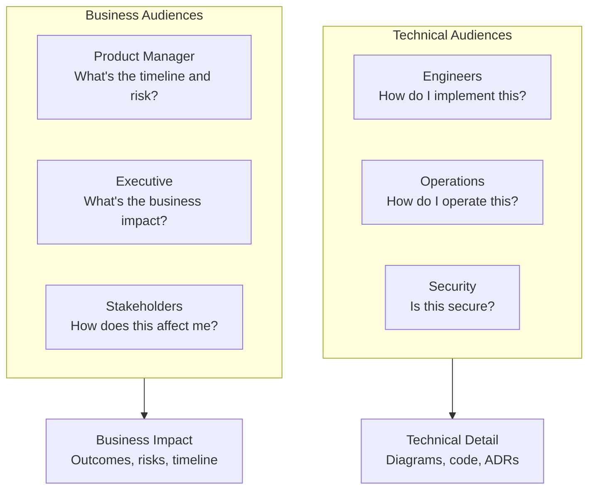
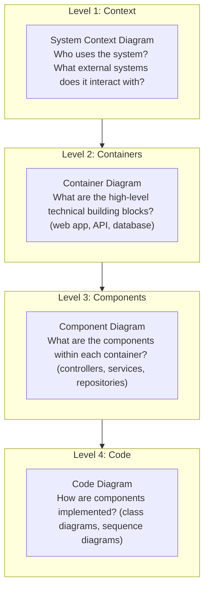

# Architecture Communication

> **One-line definition:** Explaining architecture decisions to technical and non-technical stakeholders in a way that builds understanding, alignment, and buy-in.

## Why This Is a Senior Skill

A mid-level engineer explains architecture to other engineers. A senior engineer **communicates architecture to diverse audiences**: engineers, product managers, executives, operations teams, and external stakeholders.

Architecture decisions are only as good as the understanding and buy-in they generate. A technically sound decision that no one understands or supports will fail in implementation. A senior engineer ensures that decisions are not just made, but communicated effectively.

## The Communication Challenge

Architecture communication is hard because:

- **Different audiences have different needs:** Engineers want technical details; executives want business impact; product managers want timeline and risk
- **Architecture is abstract:** It's about structure, relationships, and constraints, not concrete features
- **Decisions involve trade-offs:** Explaining why we chose X over Y requires explaining the trade-offs
- **Stakes are high:** Misunderstanding can lead to misalignment, rework, or failure

## The Audience-Message Matrix



### Tailoring the message

| Audience | What they need | How to communicate |
|---|---|---|
| **Engineers** | Technical details, implementation guidance, constraints | Architecture diagrams, code examples, ADRs, design docs |
| **Operations** | Deployment procedures, monitoring, incident response | Runbooks, monitoring dashboards, operational readiness reviews |
| **Security** | Threat model, security controls, compliance | Threat model document, security review, penetration test results |
| **Product Manager** | Timeline, risk, impact on features | One-page summary, risk register, timeline with milestones |
| **Executive** | Business impact, cost, strategic alignment | Executive summary (1 page), business case, ROI analysis |
| **Stakeholders** | How it affects them, what they need to do | Stakeholder-specific briefing, FAQ, communication plan |

## Architecture Visualization

### The C4 model

The C4 model (Context, Containers, Components, Code) provides a structured approach to architecture visualization:



### When to use each level

| Level | Audience | Purpose |
|---|---|---|
| **Context** | Non-technical stakeholders, executives | Show the system in its environment |
| **Container** | Product managers, operations, architects | Show high-level technical structure |
| **Component** | Engineers, architects | Show internal structure of containers |
| **Code** | Engineers | Show implementation details |

### The architecture decision diagram

For communicating a specific decision, use a decision diagram:

```mermaid
flowchart LR
    PROBLEM["Problem\nWe need to handle 10K events/sec"] --> OPTION_A["Option A\nKafka"]
    PROBLEM --> OPTION_B["Option B\nRabbitMQ"]
    PROBLEM --> OPTION_C["Option C\nAWS SQS"]
    OPTION_A --> TRADEOFF_A["Trade-offs\n+Throughput\n-Complexity"]
    OPTION_B --> TRADEOFF_B["Trade-offs\n+Simplicity\n-Throughput"]
    OPTION_C --> TRADEOFF_C["Trade-offs\n+Managed\n-Cost"]
    TRADEOFF_A --> DECISION["Decision\nAWS SQS"]
    TRADEOFF_B --> DECISION
    TRADEOFF_C --> DECISION
    DECISION --> RATIONALE["Rationale\nSmall ops team,\nacceptable throughput"]
```



## Communication Techniques

### The one-page architecture summary

For executives and product managers, distill the architecture into one page:

```markdown
# Architecture Summary: E-Commerce Platform

## Business Context
We are building a platform to support 100K daily active users and $10M annual revenue.

## Key Architecture Decisions
1. Microservices architecture to enable team autonomy and independent scaling
2. PostgreSQL for transactional data (orders, payments)
3. Elasticsearch for product search (fast, flexible queries)
4. Kafka for event streaming (high throughput, replay capability)

## Quality Attribute Goals
- Availability: 99.9% uptime (8.76 hours downtime/year)
- Performance: API response time < 200ms (p95)
- Scalability: Support 10x current load without architecture changes

## Risks and Mitigations
| Risk | Probability | Impact | Mitigation |
|---|---|---|---|
| Microservices complexity | High | Medium | Invest in monitoring and automation |
| Database scaling | Medium | High | Plan for read replicas and sharding |

## Timeline
- Phase 1 (Q1): Core services (users, products, orders)
- Phase 2 (Q2): Search and recommendations
- Phase 3 (Q3): Analytics and reporting
```

### The 5-minute architecture pitch

For quick alignment, prepare a 5-minute pitch:

1. **The problem** (1 minute): What are we trying to solve?
2. **The approach** (2 minutes): How does the architecture solve it?
3. **The trade-offs** (1 minute): What are we giving up?
4. **The risk** (1 minute): What could go wrong?

### The architecture decision brief

For stakeholders who need to understand a specific decision:

```markdown
# Decision Brief: Use Microservices Architecture

## Decision
We will adopt a microservices architecture for the new platform.

## Why This Matters
This decision affects team structure, deployment, and long-term scalability.

## What We Considered
1. Monolith: simpler, faster to develop, harder to scale
2. Microservices: more complex, slower to develop, easier to scale

## What We Chose and Why
Microservices, because:
- We have 3 teams that need to work independently
- We expect 10x growth in 2 years
- Different services have different scaling needs

## Trade-offs We Accept
- Higher operational complexity (we'll invest in automation)
- Slower initial development (we'll start with 3 core services)
- Network latency between services (we'll monitor and optimize)

## What Could Go Wrong
- Team coordination overhead (mitigation: clear API contracts)
- Operational complexity (mitigation: invest in DevOps practices)

## What We Need From You
- Support for hiring 2 DevOps engineers
- Approval for infrastructure budget increase (15%)
```

## Communication Anti-Patterns

| Anti-pattern | Problem | What to do instead |
|---|---|---|
| **Technical jargon** | Non-technical stakeholders don't understand | Use plain language; define technical terms |
| **Too much detail** | Audience is overwhelmed | Start with the big picture; add detail on request |
| **Too little detail** | Engineers don't know how to implement | Provide implementation guidance and examples |
| **One-size-fits-all** | Same message for all audiences | Tailor the message to each audience |
| **One-time communication** | Announce once and assume everyone understands | Communicate multiple times through multiple channels |
| **Defensive communication** | Justify the decision rather than explain it | Focus on understanding, not persuasion |

## Building Alignment

### The alignment process

A senior engineer builds alignment through:

1. **Listen first:** Understand stakeholders' concerns, priorities, and constraints
2. **Explain the reasoning:** Share the context, options, trade-offs, and rationale
3. **Address concerns:** Acknowledge and respond to objections
4. **Seek input:** Ask for feedback and incorporate it where appropriate
5. **Confirm understanding:** Verify that stakeholders understand and support the decision

### The disagreement protocol

When stakeholders disagree with a decision:

1. **Acknowledge the disagreement:** "I understand you have concerns"
2. **Understand the concern:** "Can you explain what worries you?"
3. **Address the concern:** "Here's how we've considered that"
4. **Escalate if needed:** "Let's bring this to the executive sponsor for a decision"
5. **Document the disagreement:** Record the concern and the resolution in the ADR

### The communication plan

For major architecture decisions, create a communication plan:

| Audience | Message | Format | Timing | Owner |
|---|---|---|---|---|
| Engineering team | Technical details, implementation guidance | Architecture review meeting, design doc | Week 1 | Tech Lead |
| Operations team | Deployment procedures, monitoring | Runbook, operational readiness review | Week 2 | DevOps Lead |
| Product manager | Timeline, risk, impact | One-page summary, risk register | Week 1 | Architect |
| Executive | Business impact, cost | Executive summary, business case | Week 2 | Architect |
| All stakeholders | Decision announcement, FAQ | Email, Slack announcement | Week 3 | Architect |

## Practical Exercise

**For a recent architecture decision:**

1. **Identify the audiences:** Who needs to understand this decision?

2. **Tailor the message:** For each audience, write a one-paragraph summary that addresses their specific needs

3. **Create a visualization:** Draw a diagram that communicates the decision (context diagram, decision diagram, or C4 diagram)

4. **Prepare a 5-minute pitch:** Practice explaining the decision in 5 minutes (problem, approach, trade-offs, risk)

5. **Build alignment:** Schedule a meeting with a key stakeholder and use the alignment process to build understanding and support

**Bonus:** Find a decision from the past year that failed due to poor communication. What was misunderstood? How could better communication have prevented it?

## Knowledge Connections

- [[01_Architecture_Decision_Making]] : communication follows decision-making
- [[04_Architecture_Decision_Records]] : ADRs are a communication artifact
- [[06_Architecture_Governance]] : communication is part of governance
- [[02_Problem_Framing_and_Requirements/03_Stakeholder_Management]] : stakeholder management informs communication
- [[software-engineering-note/02_Software_Architecture/07_Design_and_Documentation]] : architecture documentation
- [[software-engineering-note/14_Software_Engineering_Professional_Practice/Professionalism of Software Engineering Overview]] : professional communication

## Key Takeaways

- Architecture communication must be tailored to each audience: engineers want details, executives want impact, product managers want risk
- Use the C4 model for structured visualization: Context, Containers, Components, Code
- Prepare different communication artifacts: one-page summary, 5-minute pitch, decision brief
- Build alignment through listening, explaining, addressing concerns, seeking input, and confirming understanding
- Avoid anti-patterns: technical jargon, too much/little detail, one-size-fits-all, one-time communication, defensive communication
