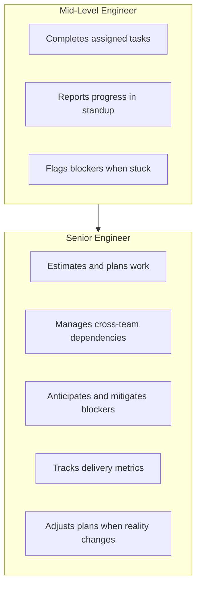
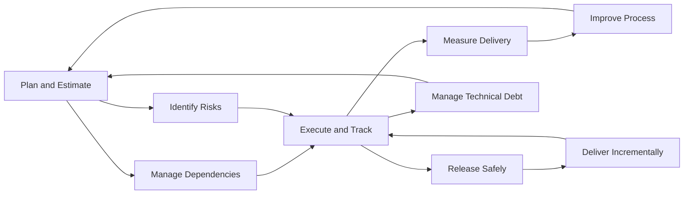

# Delivery and Execution

> **One-line definition:** The ability to plan, estimate, execute, and deliver software reliably : managing dependencies, tracking progress, and shipping value predictably.

## Why This Matters for Senior Engineers

A mid-level engineer completes assigned tasks within a sprint. A senior engineer **owns delivery end-to-end**: they estimate realistically, identify blockers before they block, manage cross-team dependencies, and ensure the team ships value predictably.

Delivery is not just about speed. It is about **reliability** : the ability to make credible commitments and keep them. A senior engineer who ships slowly but predictably is more valuable than one who ships fast but unpredictably.

## The Senior Engineer's Role in Delivery

## Core Topics in This Capability Area

| Topic | What you will learn | Key question answered |
|---|---|---|
| [[01_Estimation_and_Forecasting]] | Techniques for realistic estimation | How do I estimate work that has never been done before? |
| [[02_Dependency_Management]] | Identifying and managing cross-team dependencies | How do I prevent other teams from blocking my delivery? |
| [[03_Delivery_Metrics]] | DORA metrics, flow metrics, and velocity | How do I measure and improve delivery performance? |
| [[04_Technical_Debt_Strategy]] | Strategic debt management and paydown plans | How do I balance feature work with debt reduction? |
| [[05_Release_Management]] | Release planning, feature flags, and rollback strategies | How do I ship safely and recover from failures? |
| [[06_Incremental_Delivery]] | MVPs, iterative development, and progressive delivery | How do I deliver value early and often? |
| [[07_Risk_Management]] | Project risk identification, mitigation, and monitoring | How do I anticipate what could go wrong? |

## Concept Map

## Prerequisites

Before diving into delivery and execution, you should understand:

- [[software-engineering-note/09_Software_Engineering_Management/07_Estimation_and_Planning]]: Estimation and planning fundamentals
- [[software-engineering-note/09_Software_Engineering_Management/08_Risk_Management_and_Control]]: Risk management basics
- [[body-of-knowledge/PMBOK/06_Schedule_Performance_Domain]]: Schedule management
- [[01_Technical_Ownership/02_Lifecycle_Ownership]]: Lifecycle ownership from previous capability

## Progress Tracker

- [x] [[01_Estimation_and_Forecasting]] : Estimation techniques and forecasting delivery
- [x] [[02_Dependency_Management]] : Cross-team dependency coordination
- [x] [[03_Delivery_Metrics]] : DORA metrics, flow metrics, velocity tracking
- [x] [[04_Technical_Debt_Strategy]] : Strategic debt management and paydown
- [x] [[05_Release_Management]] : Release planning, feature flags, rollback
- [x] [[06_Incremental_Delivery]] : MVPs, iterative delivery, progressive rollout
- [x] [[07_Risk_Management]] : Project risk identification and mitigation

## Knowledge Connections

- [[body-of-knowledge/PMBOK/PMBOK v8 - Overview]] : Project management foundation
- [[software-engineering-note/09_Software_Engineering_Management/Software Engineering Management Overview]] : SWEBOK management overview
- [[01_Technical_Ownership/03_Technical_Debt_and_Maintainability]] : Technical debt management at system level
- [[03_Architecture_and_Design_Judgment/01_Architecture_Decision_Making]] : Architecture decisions affect delivery timelines
- [[02_Problem_Framing_and_Requirements/08_Requirements_Risk]] : Requirements risks affect delivery plans

## Key Takeaways

- Delivery is about reliability and predictability, not just speed
- Senior engineers own delivery end-to-end: estimation, dependency management, risk mitigation, and metrics
- Use multiple estimation techniques and calibrate against historical data
- Manage dependencies proactively : identify, communicate, and mitigate before they block
- Track delivery metrics (DORA, flow) to identify bottlenecks and drive improvement
- Balance feature work with technical debt paydown using explicit strategies
- Ship incrementally and safely with feature flags, canary releases, and rollback plans
