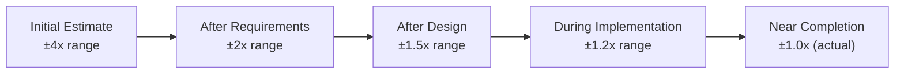

# Estimation and Forecasting

> **One-line definition:** Producing realistic time and effort estimates, calibrating them against historical data, and forecasting delivery dates with appropriate confidence ranges.

## Why This Is a Senior Skill

A mid-level engineer estimates individual tasks, often underestimating complexity. A senior engineer **estimates entire features and projects**, accounts for unknowns, and provides **confidence ranges** rather than single-point estimates.

Bad estimates are one of the leading causes of project failure. They create unrealistic expectations, team burnout, and broken trust with stakeholders. A senior engineer treats estimation as a skill to be developed, not a guess to be made quickly.

## The Estimation Challenge

Software estimation is inherently difficult because:

- **Novelty:** Much of the work has never been done exactly this way before
- **Complexity:** Software systems have emergent behaviors and hidden interactions
- **Uncertainty:** Requirements change, discoveries happen during implementation
- **Cognitive bias:** Optimism bias, anchoring, and planning fallacy distort estimates

A senior engineer acknowledges these challenges and uses structured techniques to counteract them.

## Estimation Techniques

### Technique 1: Analogous Estimation (Top-Down)

Estimate based on similar past projects or features.

**Process:**
1. Identify a similar feature/project completed previously
2. Adjust for differences in scope, complexity, and team experience
3. Use the adjusted estimate as a baseline

**Example:**
- Last login feature took 3 weeks with 2 engineers
- New login feature has SSO integration (30% more complex)
- Estimate: 3 weeks × 1.3 = 3.9 weeks, round to 4 weeks

**When to use:** Early planning phases when details are unclear; quick feasibility assessments

**Pitfalls:** Assumes past projects are truly similar; does not account for unique challenges

### Technique 2: Bottom-Up Estimation (Decomposition)

Break work into small tasks, estimate each, and sum.

**Process:**
1. Decompose the feature into tasks (ideally 1-3 days each)
2. Estimate each task independently
3. Add contingency buffer (typically 20-30%)
4. Sum to get total estimate

**Example:**
```
User registration feature:
- Database schema design: 2 days
- API endpoints: 3 days
- Frontend forms: 4 days
- Email verification: 2 days
- Testing: 3 days
- Documentation: 1 day
Subtotal: 15 days
Contingency (25%): 4 days
Total: 19 days (about 4 weeks)
```

**When to use:** Detailed planning after requirements are clear; sprint planning

**Pitfalls:** Can miss cross-cutting concerns; time-consuming for large features

### Technique 3: Three-Point Estimation (PERT)

Provide three estimates and calculate a weighted average.

**Formula:**
```
Expected = (Optimistic + 4 × Most Likely + Pessimistic) / 6
```

**Example:**
- Optimistic: 2 weeks (everything goes perfectly)
- Most Likely: 4 weeks (normal challenges)
- Pessimistic: 8 weeks (major blockers discovered)
- Expected: (2 + 4×4 + 8) / 6 = 4.3 weeks

**When to use:** When uncertainty is high and you want to capture the range of possibilities

**Pitfalls:** Requires honest assessment of optimistic and pessimistic scenarios

### Technique 4: Planning Poker (Team Estimation)

Team members independently estimate, then discuss and converge.

**Process:**
1. Present the feature/user story
2. Each estimator privately selects a card (Fibonacci sequence: 1, 2, 3, 5, 8, 13, 21...)
3. Reveal estimates simultaneously
4. Discuss outliers (highest and lowest)
5. Re-estimate until convergence

**When to use:** Sprint planning with the team; building shared understanding

**Benefits:** Leverages collective wisdom; surfaces hidden complexity; builds team buy-in

### Technique 5: T-Shirt Sizing

Use relative sizing (XS, S, M, L, XL) instead of absolute time.

**Mapping example:**
| Size | Effort range | Typical duration |
|------|-------------|------------------|
| XS | 1-2 points | Less than 1 day |
| S | 3-5 points | 1-2 days |
| M | 8-13 points | 3-5 days |
| L | 21-34 points | 1-2 weeks |
| XL | 55-89 points | 3-4 weeks |

**When to use:** Early backlog grooming; high-level roadmap planning

**Benefits:** Faster than time-based estimation; reduces false precision

## Forecasting Delivery Dates

### The cone of uncertainty

Estimates become more accurate as the project progresses and more is known:



**Senior engineer behavior:**
- Provide ranges early (e.g., "3-6 months"), not single dates
- Narrow the range as more is learned
- Communicate uncertainty explicitly to stakeholders

### Confidence-based forecasting

Instead of committing to a single date, provide confidence levels:

| Confidence level | Delivery date | Rationale |
|---|---|---|
| 50% (median) | March 15 | If everything goes as planned |
| 75% | April 1 | Accounting for typical delays |
| 90% | April 15 | Accounting for major risks |
| 95% | May 1 | Accounting for worst-case scenarios |

**Which to share:** The 75-90% confidence level for most stakeholder communication. The 50% date sets up disappointment; the 95% date seems padded.

### Velocity-based forecasting (Agile)

If the team tracks velocity (story points per sprint), use it to forecast:

```
Remaining work: 120 story points
Team velocity: 20 points/sprint (average of last 3 sprints)
Forecast: 120 / 20 = 6 sprints = 12 weeks
```

**Adjustments:**
- Account for known upcoming absences (holidays, training)
- Adjust for team changes (new members, departures)
- Consider technical debt paydown (reduces capacity)

## Estimation Anti-Patterns

| Anti-pattern | Problem | What to do instead |
|---|---|---|
| **Gut feel only** | Estimates based on intuition without structure | Use at least one structured technique |
| **Anchoring to deadline** | "We need it by Q2" → estimate becomes Q2 | Estimate first, then negotiate scope or timeline |
| **Optimism bias** | Assuming everything will go smoothly | Use three-point estimation; add contingency |
| **Padding secretly** | Inflating estimate without transparency | Provide honest estimate + explicit contingency |
| **Ignoring non-coding work** | Forgetting meetings, reviews, testing, deployment | Include all activities in the estimate |
| **Single-point estimates** | "It will take 3 weeks" (no range) | Always provide a range or confidence level |

## The Estimation Conversation

### When stakeholders push back

**Stakeholder:** "3 weeks? That seems long. Can't you do it in 2?"

**Senior engineer responses:**
- "Let me walk you through the estimate so you can see what's involved" (transparency)
- "We could deliver a smaller scope in 2 weeks. Here's what we'd need to cut" (scope negotiation)
- "The 3-week estimate includes testing and buffer. If we skip those, we could do 2 weeks, but the risk is..." (risk transparency)
- "Based on similar features we've built, 3 weeks is realistic. I can show you the historical data" (evidence-based)

### When you're unsure

It's okay to say:
- "I need to investigate further before I can give you a reliable estimate"
- "I can give you a rough range now (4-8 weeks), but I'll need 2 days of investigation to narrow it down"
- "Let me break this down further and get back to you tomorrow"

## Practical Exercise

**For a feature you're planning:**

1. **Apply three techniques:** Estimate the same feature using analogous, bottom-up, and three-point estimation

2. **Compare results:** How do the estimates differ? What does each technique reveal?

3. **Calculate confidence ranges:** Provide 50%, 75%, and 90% confidence dates

4. **Identify unknowns:** What information would make your estimate more accurate? Plan time to gather it

5. **Present to stakeholder:** Practice explaining your estimate with confidence ranges and rationale

**Bonus:** Review the last 5 features you estimated. How accurate were your estimates? What patterns do you see (consistently optimistic? consistently pessimistic?)?

## Knowledge Connections

- [[02_Dependency_Management]] : dependencies affect estimates
- [[03_Delivery_Metrics]] : velocity data improves forecasting
- [[07_Risk_Management]] : risks affect estimates and should be factored in
- [[software-engineering-note/09_Software_Engineering_Management/07_Estimation_and_Planning]] : SWEBOK estimation techniques
- [[body-of-knowledge/PMBOK/06_Schedule_Performance_Domain]] : schedule management

## Key Takeaways

- Use multiple estimation techniques (analogous, bottom-up, three-point, planning poker) to cross-validate
- Provide confidence ranges, not single-point estimates
- Account for non-coding work: meetings, reviews, testing, deployment, buffer
- Narrow estimates as uncertainty decreases (cone of uncertainty)
- Forecast using historical velocity when available
- Be transparent about assumptions and risks in your estimates
- Practice saying "I need more information" rather than guessing
