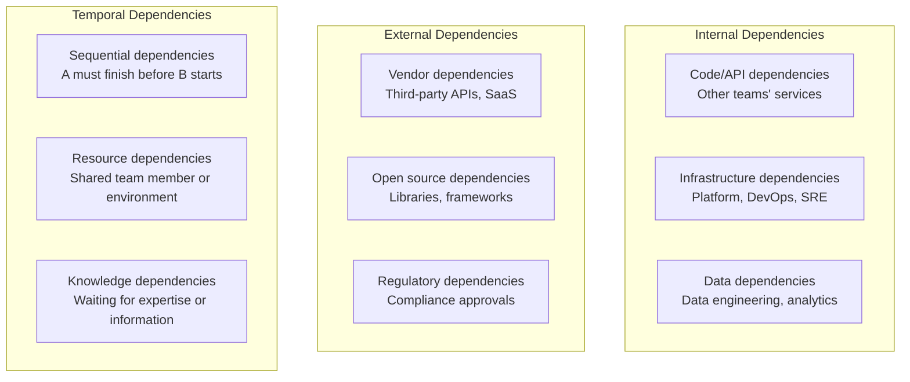
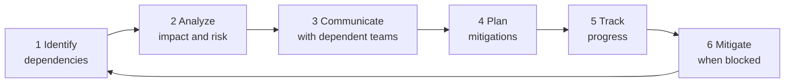

# Dependency Management

> **One-line definition:** Identifying, tracking, and mitigating cross-team and cross-system dependencies so they don't derail your delivery timeline.

## Why This Is a Senior Skill

A mid-level engineer discovers dependencies when they're blocked. A senior engineer **identifies dependencies early**, **negotiates timelines** with dependent teams, and **builds contingency plans** for when dependencies are delayed.

Dependencies are the number one cause of delivery delays in organizations with multiple teams. They create cascading failures: Team A is blocked by Team B, which is blocked by Team C, which is waiting on a vendor. A senior engineer breaks these chains before they form.

## Types of Dependencies



### Dependency categories

| Category | Examples | Risk level |
|---|---|---|
| **Hard dependencies** | Cannot proceed without this; complete blocker | High |
| **Soft dependencies** | Can proceed but with reduced functionality or workaround | Medium |
| **Hidden dependencies** | Not obvious until implementation reveals them | High |
| **Circular dependencies** | A depends on B, B depends on A | Critical |

## The Dependency Management Process



### Step 1: Identify dependencies

**Dependency identification checklist:**

For each feature or project, identify:

- [ ] **Upstream dependencies:** What do we need from other teams/systems before we can start?
- [ ] **Downstream dependencies:** What depends on our delivery?
- [ ] **Infrastructure dependencies:** What platform, tooling, or environment do we need?
- [ ] **Data dependencies:** What data sources, schemas, or pipelines do we need?
- [ ] **Knowledge dependencies:** What information or expertise are we waiting for?
- [ ] **Approval dependencies:** What reviews, sign-offs, or compliance checks are required?

**Techniques for discovery:**
- Review architecture diagrams for integration points
- Talk to engineers who've built similar features
- Check the backlog for related work in other teams
- Review incident history for past dependency failures

### Step 2: Analyze impact and risk

For each dependency, assess:

| Factor | Question | Risk if delayed |
|---|---|---|
| **Criticality** | Can we proceed without this? | Blocked vs. degraded |
| **Lead time** | How long does the dependent team need? | Days vs. weeks vs. months |
| **Reliability** | Has this team/system delivered reliably before? | High vs. low confidence |
| **Workaround** | Is there a temporary alternative? | None vs. partial vs. full |

**Dependency risk matrix:**

| | Low reliability | High reliability |
|---|---|---|
| **Hard dependency** | Critical risk : mitigate immediately | High risk : monitor closely |
| **Soft dependency** | Medium risk : plan workaround | Low risk : track and communicate |

### Step 3: Communicate with dependent teams

**The dependency agreement:**

When you depend on another team, establish:

1. **What:** Clear specification of what you need (API contract, data schema, environment)
2. **When:** Your required delivery date and why
3. **Priority:** How this ranks against their other work
4. **Fallback:** What you'll do if they're delayed
5. **Communication:** How you'll stay in sync (weekly check-in, shared Slack channel)

**Communication template:**
```
Subject: Dependency Request: [Your Feature] needs [Their Deliverable] by [Date]

Hi [Team Lead],

Our team is building [Feature X], which is scheduled to ship on [Date].
We depend on [specific deliverable from their team] to complete this work.

Required by: [Date] (2 weeks before our ship date for integration testing)
Specification: [Link to detailed spec or API contract]
Impact if delayed: [Our feature ships late, affecting Q2 roadmap]

Can we schedule a 15-minute sync to align on timeline and any concerns?

Thanks,
[Your name]
```

### Step 4: Plan mitigations

For high-risk dependencies, plan mitigations before they become blockers:

| Mitigation strategy | When to use | Example |
|---|---|---|
| **Mock/stub** | Dependency is delayed but interface is defined | Mock the payment API until the real one is ready |
| **Parallel work** | Work on independent parts while waiting | Build UI while waiting for backend API |
| **Reduce scope** | Deliver partial functionality without the dependency | Ship without SSO integration; add it later |
| **Alternative provider** | Primary dependency is unreliable | Use AWS SQS instead of waiting for internal message queue |
| **Escalate early** | Dependency is critical and at risk | Escalate to engineering leadership before it's too late |

### Step 5: Track progress

**Dependency tracking board:**

| Dependency | Owner | Required by | Status | Risk | Mitigation |
|---|---|---|---|---|---|
| Auth service v2 API | Team B | March 15 | In progress | Medium | Mock API ready |
| Database migration | DBA team | March 1 | Not started | High | Escalated to VP Eng |
| Third-party SDK update | Vendor | March 20 | Delayed | Low | Using current version |

**Weekly dependency review:**
- Review all active dependencies in standup or planning
- Update status and risk levels
- Identify new dependencies that have emerged
- Escalate at-risk dependencies

### Step 6: Mitigate when blocked

When a dependency becomes a blocker:

1. **Assess impact:** How long can we wait? What's the cost of delay?
2. **Activate mitigation:** Implement the planned workaround
3. **Communicate:** Inform stakeholders of the delay and mitigation plan
4. **Escalate if needed:** If the blocker threatens the project, escalate to leadership
5. **Document:** Record the blocker and resolution for future reference

## Dependency Anti-Patterns

| Anti-pattern | Problem | What to do instead |
|---|---|---|
| **Dependency denial** | "We don't have dependencies" (but you do) | Map dependencies explicitly at project start |
| **Late discovery** | Finding dependencies during implementation | Identify dependencies during planning |
| **Silent waiting** | Waiting for a dependency without communicating | Proactively check in with dependent teams |
| **Over-engineering to avoid dependencies** | Building everything in-house to avoid coordination | Evaluate cost of building vs. cost of coordination |
| **Circular dependencies** | Team A waits for B, B waits for A | Redesign to break the cycle; use async communication |
| **Single point of failure** | One person or team is a bottleneck | Build redundancy; cross-train; document |

## Cross-Team Coordination Patterns

### The dependency sync meeting

For projects with many cross-team dependencies, establish a regular sync:

- **Frequency:** Weekly or bi-weekly
- **Attendees:** Tech leads from each dependent team
- **Agenda:**
  1. Review dependency status (on track, at risk, blocked)
  2. Discuss upcoming dependencies (what's coming in 2-4 weeks)
  3. Resolve conflicts and negotiate priorities
  4. Escalate unresolved issues

### The API contract-first approach

Reduce dependency risk by defining contracts early:

1. **Define the API contract** (schema, endpoints, response format) before implementation
2. **Both teams review and agree** on the contract
3. **Consumer team builds against the contract** (using mocks if needed)
4. **Provider team implements to the contract**
5. **Integration testing** verifies the contract is met

This decouples the teams: the consumer can proceed without waiting for the provider's implementation.

### The feature flag approach

Use feature flags to manage dependencies:

- Ship the feature with the dependency behind a flag (disabled by default)
- When the dependency is ready, enable the flag
- If the dependency is delayed, the feature is already deployed (just disabled)

This reduces deployment coordination and allows independent release schedules.

## Practical Exercise

**For your current project:**

1. **Map all dependencies:** List every team, system, or external service your project depends on

2. **Classify each dependency:**
   - Hard vs. soft
   - Risk level (critical/high/medium/low)
   - Required delivery date

3. **For high-risk dependencies:**
   - Contact the dependent team and establish a dependency agreement
   - Define a mitigation strategy (mock, parallel work, scope reduction)
   - Set up a tracking mechanism (shared document, weekly check-in)

4. **Review weekly:** Add dependency review to your team's standup or planning agenda

**Bonus:** Think of a past project that was delayed by a dependency. What could you have done differently? Would earlier identification, better communication, or a mitigation strategy have helped?

## Knowledge Connections

- [[01_Estimation_and_Forecasting]] : dependencies affect estimates
- [[05_Release_Management]] : dependencies affect release coordination
- [[07_Risk_Management]] : dependencies are a major source of project risk
- [[software-engineering-note/09_Software_Engineering_Management/08_Risk_Management_and_Control]] : risk management includes dependency risk
- [[body-of-knowledge/PMBOK/06_Schedule_Performance_Domain]] : schedule dependencies

## Key Takeaways

- Dependencies are the #1 cause of delivery delays in multi-team organizations
- Identify dependencies early using a structured checklist (upstream, downstream, infrastructure, data, knowledge, approval)
- Analyze each dependency for criticality, lead time, reliability, and workaround availability
- Establish dependency agreements with dependent teams: what, when, priority, fallback, communication
- Plan mitigations before dependencies become blockers: mocks, parallel work, scope reduction, escalation
- Track dependencies weekly and escalate at-risk ones early
- Use coordination patterns: dependency sync meetings, API contract-first, feature flags
