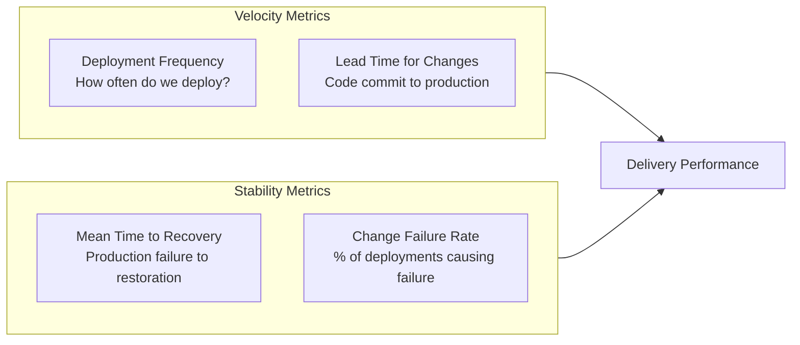

# Delivery Metrics

> **One-line definition:** Measuring and improving software delivery performance using DORA metrics, flow metrics, and team velocity to identify bottlenecks and drive continuous improvement.

## Why This Is a Senior Skill

A mid-level engineer tracks their own task completion. A senior engineer **measures team delivery performance**, **identifies systemic bottlenecks**, and **drives improvement** using data rather than anecdotes.

Without metrics, delivery improvement is guesswork. You might think the team is slow at coding, but the data shows they spend 60% of lead time waiting for code review. Metrics reveal where to invest improvement effort.

## DORA Metrics

The DevOps Research and Assessment (DORA) program identified four key metrics that predict software delivery performance:



### The four key metrics

| Metric | What it measures | Elite | High | Medium | Low |
|---|---|---|---|---|---|
| **Deployment Frequency** | How often code reaches production | On demand (multiple per day) | Weekly to monthly | Monthly to every 6 months | Every 6+ months |
| **Lead Time for Changes** | Commit to production | Less than 1 hour | 1 day to 1 week | 1 week to 1 month | 1 to 6 months |
| **Mean Time to Recovery** | Failure to restoration | Less than 1 hour | Less than 1 day | 1 day to 1 week | 1 week to 1 month |
| **Change Failure Rate** | % deployments causing failure | 0-15% | 16-30% | 16-30% | 46-60% |

**Source:** DORA State of DevOps Report (accelerate.dev)

### How to use DORA metrics

1. **Measure your current state:** Collect baseline data for all four metrics
2. **Identify the weakest metric:** Which one is furthest from elite?
3. **Investigate the root cause:** Why is this metric low? What bottlenecks exist?
4. **Implement targeted improvements:** Focus on the specific bottleneck
5. **Re-measure:** Did the improvement work?

**Important:** Do not optimize all four simultaneously. Pick one, improve it, then move to the next.

### DORA metric improvement strategies

| Weak metric | Common root causes | Improvement strategies |
|---|---|---|
| Low deployment frequency | Manual deployment process; fear of production; large batch sizes | Automate CI/CD; add test coverage; reduce batch size |
| Long lead time | Slow code review; manual testing; environment provisioning delays | Streamline review process; automate testing; self-service environments |
| Long MTTR | No monitoring; no runbooks; no rollback capability | Add observability; create runbooks; implement blue-green deployment |
| High change failure rate | Insufficient testing; no staging environment; poor code review | Improve test coverage; add staging; strengthen review practices |

## Flow Metrics

Flow metrics measure the movement of work through your delivery pipeline:

### Flow efficiency

```
Flow Efficiency = (Active Time / Total Lead Time) × 100%
```

**Active time:** Time work is actively being worked on (coding, reviewing, testing)
**Total lead time:** Time from request to delivery

**Example:**
- A feature takes 30 days from request to production
- Active work time: 5 days (design: 1, code: 2, review: 1, test: 1)
- Flow efficiency: (5/30) × 100% = 16.7%

Most teams have flow efficiency between 5-15%. The remaining 85-95% is **wait time**: waiting for review, waiting for testing, waiting for deployment, waiting for approval.

### Flow time (cycle time)

Time from when work starts to when it's delivered:

```
Flow Time = Delivery Date - Start Date
```

Track flow time by work type:
- Features
- Bugs
- Technical debt
- Infrastructure

### Flow load (WIP)

Number of items in progress at any given time:

```
Flow Load = Count of items in "In Progress" state
```

High WIP causes context switching, longer lead times, and lower quality. Limit WIP to improve flow.

### Flow distribution

Proportion of work by type over a period:

| Work type | % of total | Healthy range |
|---|---|---|
| Features | 40-60% | Primary value delivery |
| Bugs | 10-20% | Unavoidable; too high indicates quality issues |
| Technical debt | 15-25% | Investment in maintainability |
| Infrastructure | 5-15% | Platform and tooling improvements |

**Warning signs:**
- Features below 30%: team is not delivering new value
- Bugs above 30%: quality problems need investment
- Technical debt at 0%: debt is accumulating silently
- Infrastructure at 0%: platform is stagnating

## Team Velocity (Agile)

Velocity measures how much work a team completes per sprint:

```
Velocity = Sum of story points completed in a sprint
```

**How to use velocity:**
- **Forecasting:** Average velocity of last 3 sprints predicts future capacity
- **Planning:** Use velocity to decide how much work to commit to next sprint
- **Trend analysis:** Is velocity stable, improving, or declining?

**Velocity anti-patterns:**
- **Comparing teams:** Velocity is relative to each team's estimation; cross-team comparison is meaningless
- **Velocity as performance metric:** Optimizing for velocity leads to point inflation and quality reduction
- **Ignoring velocity trends:** Declining velocity signals a problem (burnout, debt, team changes)

### Velocity health indicators

| Indicator | What it means | Action |
|---|---|---|
| Stable velocity (±10%) | Predictable team capacity | Use for forecasting |
| Increasing velocity | Team improving or point inflation | Verify with quality metrics |
| Declining velocity | Burnout, debt, or team changes | Investigate root cause |
| Erratic velocity | Unstable scope or team composition | Stabilize before forecasting |

## Building a Delivery Dashboard

A senior engineer builds a delivery dashboard that makes performance visible:

### Essential metrics

| Metric | Source | Refresh frequency |
|---|---|---|
| Deployment frequency | CI/CD pipeline | Daily |
| Lead time for changes | Git + CI/CD | Daily |
| Change failure rate | Incident tracking | Weekly |
| MTTR | Incident tracking | Weekly |
| Flow efficiency | Project management tool | Weekly |
| WIP count | Project management tool | Daily |
| Sprint velocity | Sprint tracking | Per sprint |
| Flow distribution | Project management tool | Monthly |

### Dashboard layout

```text
┌─────────────────────────────────────────────┐
│         DELIVERY PERFORMANCE DASHBOARD      │
├──────────────┬──────────────┬───────────────┤
│ Deploy Freq  │ Lead Time    │ Failure Rate  │
│ 12/week ✓    │ 2.3 days ✓   │ 8% ✓          │
├──────────────┼──────────────┼───────────────┤
│ MTTR         │ Flow Eff.    │ WIP Count     │
│ 45 min ✓     │ 18% ⚠        │ 23 ⚠          │
├──────────────┴──────────────┴───────────────┤
│ VELOCITY TREND (last 6 sprints)             │
│ 18 → 20 → 19 → 22 → 21 → 20 (stable)       │
├─────────────────────────────────────────────┤
│ FLOW DISTRIBUTION (this month)              │
│ Features: 50% | Bugs: 15% | Debt: 25% | Infra: 10% │
└─────────────────────────────────────────────┘
```

## Practical Exercise

**For your current team:**

1. **Collect DORA metrics:** Measure all four DORA metrics for the last 30 days
   - How many deployments to production?
   - Average time from commit to production?
   - How many production incidents? Average recovery time?
   - What percentage of deployments caused incidents?

2. **Calculate flow efficiency:** Pick 5 recently completed features. Calculate active time vs. total lead time for each. What is your average flow efficiency?

3. **Analyze flow distribution:** Count the last 50 work items by type (feature, bug, debt, infra). What is your distribution?

4. **Identify one improvement:** Based on your data, what is the single biggest bottleneck? Propose one concrete improvement.

**Bonus:** Build a simple delivery dashboard using your existing tools (Jira, GitHub, etc.). Share it with the team and discuss what the data reveals.

## Knowledge Connections

- [[01_Estimation_and_Forecasting]] : velocity data improves forecasting accuracy
- [[04_Technical_Debt_Strategy]] : flow distribution reveals debt investment
- [[05_Release_Management]] : deployment frequency and failure rate drive release strategy
- [[01_Technical_Ownership/04_Production_Responsibility]] : MTTR relates to production readiness
- [[software-engineering-note/09_Software_Engineering_Management/07_Measurement_and_Metrics]] : SWEBOK metrics

## Key Takeaways

- DORA metrics (deployment frequency, lead time, MTTR, change failure rate) are the industry standard for delivery performance
- Flow efficiency reveals that most time is spent waiting, not working
- Flow distribution shows whether the team is balancing features, bugs, debt, and infrastructure
- Velocity is useful for forecasting within a team but meaningless for cross-team comparison
- Build a delivery dashboard to make performance visible and drive improvement
- Improve one metric at a time; do not optimize all simultaneously
- Data beats anecdotes: use metrics to identify bottlenecks and validate improvements
