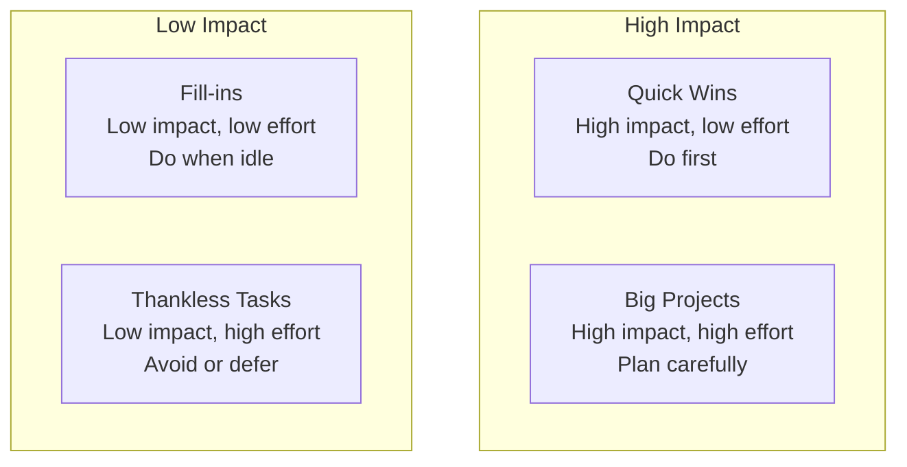

# Technical Debt Strategy

> **One-line definition:** Strategically managing technical debt at the project level : balancing feature delivery with debt reduction, prioritizing paydown by impact, and maintaining a sustainable codebase over time.

## Why This Is a Senior Skill

A mid-level engineer fixes technical debt when assigned. A senior engineer **advocates for debt reduction**, **builds a business case for it**, and **integrates debt paydown into the delivery plan** so it happens consistently without blocking feature work.

Technical debt is the silent killer of delivery velocity. Teams that ignore it ship fast initially but slow to a crawl as the codebase becomes unmaintainable. A senior engineer balances short-term delivery pressure with long-term sustainability.

## The Technical Debt Quadrant

Martin Fowler's quadrant classifies debt by intent and prudence:

| | Reckless | Prudent |
|---|---|---|
| **Deliberate** | "We don't have time for tests" | "We'll ship without caching now; we'll add it in sprint 3" |
| **Inadvertent** | "What's layering?" | "Now we understand how we should have done it" |

**Senior engineer focus:** Prudent deliberate debt (intentional trade-offs with a plan to pay down) and inadvertent debt (discovered during implementation).

**Avoid:** Reckless deliberate debt (cutting corners without a plan).

## Debt Categories and Impact

| Debt category | Examples | Impact on delivery |
|---|---|---|
| **Architecture debt** | Wrong architectural decisions; monolith that should be microservices | Major features take months instead of weeks |
| **Code debt** | Duplicated code; long methods; poor naming; no tests | Every change risks breaking something; slow to implement |
| **Infrastructure debt** | Manual deployments; no staging environment; outdated dependencies | Deployments are risky and slow; environment issues |
| **Documentation debt** | No API docs; undocumented APIs; outdated runbooks | Onboarding takes weeks; production incidents take longer to resolve |
| **Testing debt** | Low test coverage; flaky tests; no integration tests | Regressions are frequent; refactoring is risky |

## The Debt-Feature Balance

### The 20% rule

Reserve approximately 20% of sprint capacity for technical debt and infrastructure work. This is not a hard rule, but a starting point:

| Sprint capacity allocation | Rationale |
|---|---|
| 50-60% features | Primary value delivery |
| 15-25% technical debt | Maintainability investment |
| 10-20% bugs | Quality maintenance |
| 5-10% infrastructure | Tooling and platform improvements |

**When to deviate:**
- **Increase debt allocation (30-40%):** When flow efficiency is below 15% or velocity is declining
- **Decrease debt allocation (10%):** During critical product launches or when debt is under control

### The debt budget approach

Treat technical debt like a financial budget:

1. **Inventory all debt:** Catalog known debt items with estimated effort and impact
2. **Set a quarterly debt budget:** How many story points or engineer-weeks will we invest?
3. **Prioritize by ROI:** Which debt items have the highest impact on delivery velocity?
4. **Track paydown:** Measure debt reduction over time
5. **Re-evaluate quarterly:** Adjust the budget based on results

## Prioritizing Debt Paydown

### Impact-Effort Matrix



### Debt prioritization criteria

Score each debt item on these dimensions:

| Criterion | Question | Weight |
|---|---|---|
| **Velocity impact** | Does this debt slow down feature development? | 30% |
| **Risk** | Could this debt cause a production incident? | 25% |
| **Frequency** | How often do engineers encounter this debt? | 20% |
| **Effort** | How much work to pay down? (inverse: low effort = high score) | 15% |
| **Dependencies** | Will paying this down enable other improvements? | 10% |

### The boy scout rule

"Always leave the code cleaner than you found it."

When working on a feature:
- If you touch a file with debt, fix a small piece of it
- Rename unclear variables
- Extract a duplicated block into a function
- Add a missing test

This approach spreads debt paydown across all work rather than requiring dedicated "debt sprints."

## Building a Business Case for Debt Reduction

### The cost of debt

Quantify the impact of debt on delivery:

| Debt cost | How to measure | Example |
|---|---|---|
| **Slower feature development** | Compare velocity on debt-heavy vs. debt-free areas | "Features in the legacy module take 3x longer than the new module" |
| **Production incidents** | Count incidents caused by debt | "4 of our last 10 incidents were caused by missing tests in the payment module" |
| **Onboarding time** | Time for new engineers to become productive | "New engineers take 6 weeks to contribute because of undocumented APIs" |
| **Engineer frustration** | Retention risk; survey data | "3 engineers cited codebase quality as a reason for considering leaving" |

### The debt paydown proposal

When advocating for debt reduction to leadership:

```text
Proposal: Technical Debt Paydown - Payment Module

Problem:
- Features in the payment module take 3x longer than other modules
- 4 of our last 10 production incidents originated in the payment module
- Engineers avoid working on the payment module due to complexity

Proposed investment:
- 2 engineers for 3 sprints (6 engineer-sprints)
- Focus: refactor payment processing, add test coverage, document APIs

Expected outcomes:
- Feature development speed in payment module: 3x improvement
- Production incidents: 50% reduction
- Engineer satisfaction: improved (based on survey data)

ROI:
- Current cost of debt: ~$15K/sprint in delayed features and incidents
- Investment: ~$30K over 3 sprints
- Payback period: 2 sprints after completion
```

## Debt Tracking and Reporting

### The debt register

| Debt item | Category | Impact (1-5) | Effort (1-5) | Priority | Status | Owner |
|---|---|---|---|---|---|---|
| Payment module: no tests | Testing | 5 | 4 | Critical | In progress | Alice |
| Legacy API: undocumented | Documentation | 4 | 2 | High | Planned | Bob |
| Deployment: manual steps | Infrastructure | 3 | 3 | Medium | Backlog | Charlie |
| User service: duplicated code | Code | 2 | 2 | Low | Backlog | Unassigned |

### Monthly debt report

Track and report debt metrics monthly:

| Metric | This month | Last month | Trend |
|---|---|---|---|
| Debt items in register | 23 | 27 | Improving |
| High-priority debt items | 5 | 6 | Improving |
| Debt paydown story points | 34 | 28 | Improving |
| Estimated debt impact on velocity | 15% | 18% | Improving |
| New debt introduced | 12 points | 8 points | Worsening |

## Debt Paydown Strategies

### Strategy 1: Dedicated debt sprint

Allocate one sprint per quarter entirely to debt reduction.

**Pros:** Focused effort; significant progress; team morale boost
**Cons:** Feature delivery pauses; requires stakeholder buy-in
**When to use:** When debt is severely impacting velocity; after a major product launch

### Strategy 2: Continuous paydown (20% rule)

Reserve 20% of every sprint for debt work.

**Pros:** Consistent progress; no feature delivery pause; sustainable
**Cons:** Slower progress on individual debt items
**When to use:** Default strategy for most teams

### Strategy 3: Strangler fig pattern

Gradually replace a legacy system by building new functionality alongside it.

**Process:**
1. Identify the legacy component to replace
2. Build new functionality that handles a subset of traffic
3. Route a percentage of traffic to the new implementation
4. Gradually increase the percentage
5. Decommission the legacy component

**When to use:** Replacing large legacy systems that cannot be rewritten in one sprint

### Strategy 4: Debt-driven refactoring during features

When implementing a feature that touches debt-heavy code:
1. Allocate extra time for refactoring
2. Improve the code structure as part of the feature work
3. Add tests for the refactored areas

**When to use:** When the debt directly blocks or complicates the feature

## Practical Exercise

**For your current project:**

1. **Create a debt inventory:** List all known technical debt items (aim for 10-20)

2. **Score each item:** Rate impact (1-5) and effort (1-5) for each

3. **Prioritize:** Rank by impact/effort ratio. Identify your top 3 "quick wins"

4. **Build a business case:** For your #1 debt item, write a one-page proposal with:
   - Problem description
   - Quantified impact (velocity, incidents, onboarding)
   - Proposed investment
   - Expected outcomes

5. **Propose a debt budget:** Based on your team's velocity, what would 20% debt allocation look like? How many story points per sprint?

**Bonus:** Review your flow distribution for the last month. What percentage was technical debt? Is it enough to maintain sustainability?

## Knowledge Connections

- [[01_Technical_Ownership/03_Technical_Debt_and_Maintainability]] : system-level debt management
- [[03_Delivery_Metrics]] : flow distribution reveals debt investment
- [[01_Estimation_and_Forecasting]] : debt affects velocity and estimates
- [[03_Architecture_and_Design_Judgment/02_Quality_Attribute_Tradeoffs]] : architecture debt stems from trade-off decisions
- [[software-engineering-note/07_Software_Maintenance/Software Maintenance Overview]] : maintenance includes debt management

## Key Takeaways

- Technical debt is the silent killer of delivery velocity: ignore it and you slow to a crawl
- Use the 20% rule as a starting point: reserve 20% of sprint capacity for debt and infrastructure
- Prioritize debt by impact on delivery velocity, risk, and frequency of encounter
- Build a business case for debt reduction using quantified costs (slower features, incidents, onboarding)
- Track debt in a register and report progress monthly
- Use multiple paydown strategies: continuous (20% rule), dedicated sprints, strangler fig, and boy scout rule
- Balance short-term delivery pressure with long-term sustainability
