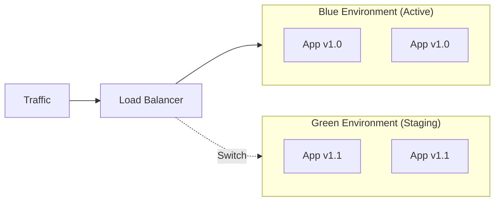
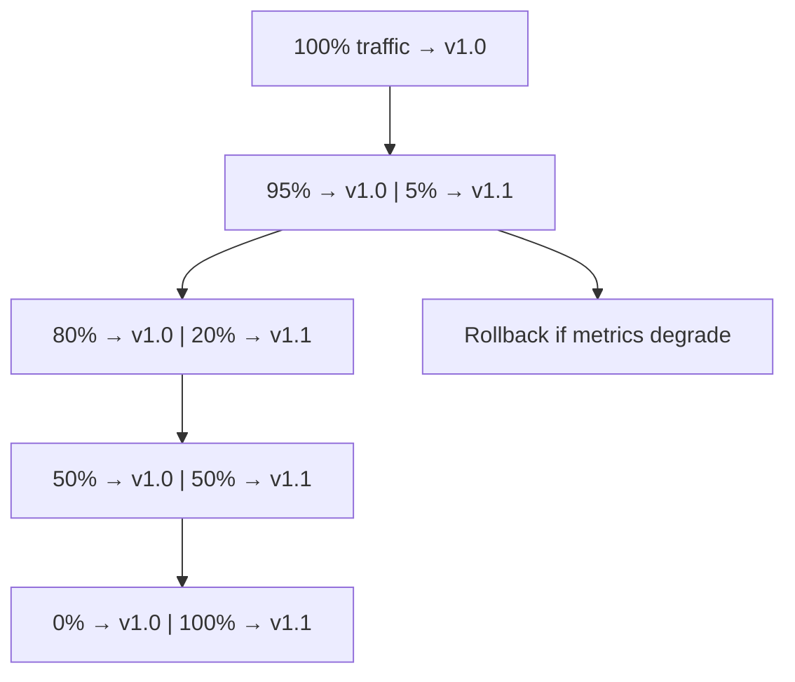
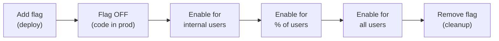
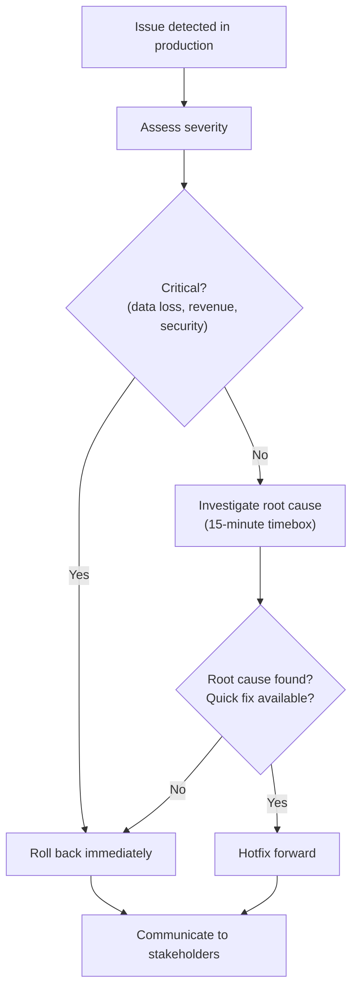

# Release Management

> **One-line definition:** Planning, coordinating, and executing software releases safely : using feature flags, canary deployments, rollback strategies, and release checklists to ship with confidence.

## Why This Is a Senior Skill

A mid-level engineer merges code and lets the pipeline deploy it. A senior engineer **plans releases strategically**, **coordinates cross-team dependencies**, **implements safety mechanisms** (feature flags, canary deployments), and **owns the rollback decision** when things go wrong.

Releases are the moment of maximum risk. A senior engineer treats them as a skill to be mastered, not an afterthought.

## Release Strategies

### Strategy comparison

| Strategy | Risk | Complexity | Rollback speed | When to use |
|---|---|---|---|---|
| **Big bang** | High | Low | Slow (redeploy) | Small, infrequent changes |
| **Blue-green** | Low | Medium | Instant (switch) | Critical systems; zero downtime required |
| **Canary** | Low | High | Fast (route traffic) | Large user base; gradual validation |
| **Feature flags** | Very low | Medium | Instant (toggle flag) | Decoupling deployment from release |
| **Dark launches** | Very low | Medium | Instant (toggle flag) | Testing in production without user visibility |

### Big Bang Deployment

Deploy the entire change set at once.

**Process:**
1. Deploy new version to all servers
2. Old version is replaced entirely
3. If issues occur, roll back by redeploying the old version

**Pros:** Simple; no infrastructure overhead
**Cons:** High risk; downtime during deployment; slow rollback
**When to use:** Small teams; internal tools; infrequent releases

### Blue-Green Deployment

Maintain two identical production environments. Deploy to the "green" environment, then switch traffic from "blue" to "green."

**Process:**
1. Deploy new version to green environment
2. Run smoke tests on green
3. Switch load balancer to route traffic to green
4. Monitor for issues
5. If issues, switch back to blue (instant rollback)

**Pros:** Zero downtime; instant rollback; simple concept
**Cons:** Requires double infrastructure cost; database migrations need special handling

### Canary Deployment

Release to a small percentage of users first, then gradually increase.

**Process:**
1. Deploy new version alongside old version
2. Route 5% of traffic to new version
3. Monitor error rates, latency, and business metrics
4. If metrics are healthy, increase to 20%, then 50%, then 100%
5. If metrics degrade at any point, roll back

**Pros:** Low risk; gradual validation; real production traffic testing
**Cons:** Complex infrastructure; requires traffic routing capability; longer release cycle

### Feature Flags

Decouple deployment from release. Deploy code with the feature disabled, then enable it via a flag.

**Process:**
1. Deploy code with feature flag set to "off"
2. Code is in production but users cannot see the feature
3. Enable the flag for internal users (dogfooding)
4. Enable for a percentage of external users
5. Enable for all users
6. Remove the flag after the feature is stable

**Feature flag lifecycle:**

**Best practices:**
- Use a feature flag service (LaunchDarkly, Unleash, or custom)
- Name flags descriptively: `enable_new_checkout_flow`, not `flag_42`
- Set expiration dates on flags to prevent flag sprawl
- Track flag usage and remove flags after features are stable
- Test both flag-on and flag-off paths

## Release Planning

### The release checklist

Before every release, verify:

**Pre-release:**
- [ ] All tests passing (unit, integration, end-to-end)
- [ ] Code review completed and approved
- [ ] Performance testing completed (load test results reviewed)
- [ ] Security review completed (if applicable)
- [ ] Database migrations reviewed and tested
- [ ] Rollback plan documented
- [ ] Monitoring and alerting configured for new features
- [ ] Feature flags configured (if applicable)
- [ ] Release notes written
- [ ] Stakeholders notified

**During release:**
- [ ] Deployment pipeline executed successfully
- [ ] Smoke tests passed in production
- [ ] Error rates within normal range
- [ ] Latency within normal range
- [ ] Business metrics stable

**Post-release:**
- [ ] Monitor for 30 minutes to 2 hours after release
- [ ] Verify all features working as expected
- [ ] Update status page (if applicable)
- [ ] Communicate release completion to stakeholders
- [ ] Schedule flag cleanup (if applicable)

### Release coordination

For releases involving multiple teams:

1. **Define the release window:** When will the release happen?
2. **Identify dependencies:** What order must teams deploy in?
3. **Coordinate deployments:** Schedule deployments to minimize risk
4. **Establish communication:** Shared Slack channel or war room
5. **Define rollback criteria:** What triggers a rollback?
6. **Assign decision maker:** Who makes the rollback decision?

## Rollback Strategies

### When to roll back

| Signal | Severity | Action |
|---|---|---|
| Error rate increases by more than 5% | High | Roll back immediately |
| Latency increases by more than 50% | High | Roll back if sustained for 5 minutes |
| Business metric drops (conversion, revenue) | Critical | Roll back immediately |
| User complaints spike | Medium | Investigate; roll back if root cause unclear |
| Non-critical bug discovered | Low | Hotfix forward; do not roll back |

### Rollback decision framework

### Rollback techniques

| Technique | Speed | Data impact | When to use |
|---|---|---|---|
| **Traffic switch** (blue-green) | Instant | None | Blue-green deployments |
| **Traffic routing** (canary) | Fast (minutes) | None | Canary deployments |
| **Feature flag toggle** | Instant | None | Feature flag releases |
| **Redeploy previous version** | Slow (minutes) | Possible | Big bang deployments |
| **Database rollback** | Very slow | High risk | When migrations cause issues |

## Database Migration Safety

Database migrations are the riskiest part of releases. Use these strategies:

### Expand-contract pattern

Instead of modifying a column in place:

1. **Expand:** Add the new column alongside the old one
2. **Migrate:** Copy data from old column to new column (background job)
3. **Dual-write:** Application writes to both columns
4. **Switch:** Application reads from the new column
5. **Contract:** Remove the old column

**Benefits:** Zero downtime; rollback is safe (old column still exists)

### Migration safety checklist

- [ ] Migration tested on a copy of production data
- [ ] Migration is backward-compatible (old code can still read)
- [ ] Migration can run while the application is live
- [ ] Rollback migration tested
- [ ] Migration estimated duration (will it lock tables for hours?)
- [ ] DBA reviewed (if applicable)

## Practical Exercise

**For your current project:**

1. **Audit your release process:**
   - How do you deploy to production today?
   - What safety mechanisms are in place?
   - What is your rollback strategy?
   - How long does a rollback take?

2. **Create a release checklist:** Build a checklist specific to your team's release process

3. **Propose one improvement:** Based on your audit, what is the single biggest release risk? Propose one improvement (e.g., add feature flags, implement canary deployment, create a release checklist)

4. **Practice a rollback:** In a staging environment, deploy a change and then roll it back. Measure how long it takes.

**Bonus:** Review your last 3 production incidents. How many were caused by releases? What release safety mechanism could have prevented them?

## Knowledge Connections

- [[03_Delivery_Metrics]] : deployment frequency and change failure rate are DORA metrics
- [[01_Technical_Ownership/04_Production_Responsibility]] : production readiness includes release safety
- [[06_Incremental_Delivery]] : feature flags enable incremental delivery
- [[02_Dependency_Management]] : cross-team releases require dependency coordination
- [[software-engineering-note/06_Software_Engineering_Operations/Software Engineering Operations Overview]] : operations includes release management

## Key Takeaways

- Release strategies range from big bang (high risk) to feature flags (very low risk): choose based on your system's criticality
- Blue-green deployment provides instant rollback with zero downtime
- Canary deployment validates changes with real production traffic gradually
- Feature flags decouple deployment from release: code goes to production disabled, then enabled via flag
- Build a release checklist and use it for every release
- Define rollback criteria before the release: what signals trigger a rollback?
- Database migrations are the riskiest part: use the expand-contract pattern for safety
- A senior engineer owns the rollback decision and communicates it clearly
