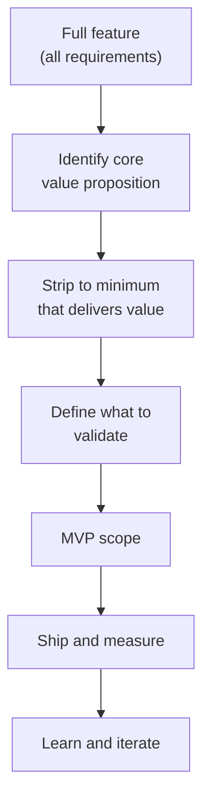
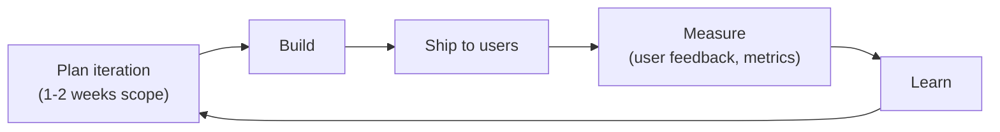
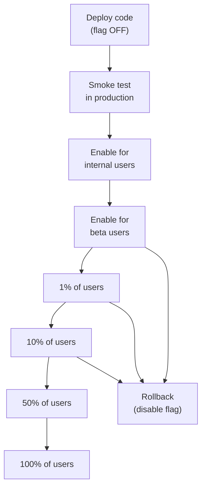

# Incremental Delivery

> **One-line definition:** Delivering value early and often through MVPs, iterative development, and progressive rollout : shipping small, learning fast, and adjusting based on feedback.

## Why This Is a Senior Skill

A mid-level engineer builds the full feature as specified. A senior engineer **questions whether the full feature is needed**, **proposes a smaller first version** that validates assumptions, and **plans an iterative path** from MVP to complete solution.

The biggest risk in software is not technical failure. It is building the wrong thing. Incremental delivery reduces this risk by validating assumptions early with real users.

## The Case for Incremental Delivery

### Big bang vs. incremental

| Dimension | Big bang delivery | Incremental delivery |
|---|---|---|
| Time to first value | Months | Days or weeks |
| Risk of building the wrong thing | High (all-or-nothing bet) | Low (validated at each step) |
| Feedback cycle | End of project | Every iteration |
| Scope creep | Common (months of changing requirements) | Managed (each increment is small) |
| User adoption | Big bang adoption (risky) | Gradual adoption (adjustable) |
| Team morale | Long wait for payoff | Regular wins |

### The cost of delay

Every week you delay shipping is a week of:
- No user feedback
- No business value
- No learning
- Accumulating assumptions (unvalidated)

A senior engineer internalizes that **a smaller, shipped feature is more valuable than a larger, unshipped one**.

## MVP Thinking

### What is an MVP?

A Minimum Viable Product is the smallest version of a feature that:
1. Delivers value to users
2. Validates a core assumption
3. Generates learning for the next iteration

An MVP is NOT:
- A half-built feature
- A feature with poor quality
- A prototype (unless the assumption is technical feasibility)

### MVP identification process

### MVP scoping questions

Ask these questions to find the MVP:

1. **What is the core problem this feature solves?** (Not the nice-to-haves)
2. **What is the smallest thing we can build that solves that problem?**
3. **What assumption are we most uncertain about?** (Build to test that first)
4. **What would users do if this feature didn't exist?** (Their current workaround reveals the minimum)
5. **What can we defer to a second iteration?** (Everything that is not core)

### MVP examples

| Full feature | MVP | What it validates |
|---|---|---|
| AI-powered search with natural language | Keyword search with filters | Users want better search; the AI part is speculative |
| Full user dashboard with 10 widgets | Dashboard with the top 3 most-requested widgets | Users will actually use a dashboard |
| Automated email campaign system | Manual email send with template | Users want email campaigns; automation can come later |
| Real-time collaboration (Google Docs style) | Edit and save with conflict detection | Users want to collaborate; real-time is a nice-to-have |
| Mobile app with push notifications | Mobile-responsive web app | Users want mobile access; native app is not yet validated |

## Iterative Development

### The iteration cycle

### Iteration planning

For each iteration, define:

1. **Goal:** What do we want to learn or achieve in this iteration?
2. **Scope:** What is the minimum work to achieve that goal?
3. **Success criteria:** How will we know if the iteration was successful?
4. **Feedback mechanism:** How will we collect user feedback?
5. **Decision point:** What will we decide at the end of this iteration? (Continue, pivot, stop?)

### Iteration sizing guide

| Iteration size | Duration | Use case |
|---|---|---|
| **Exploration** | 1-3 days | Spike to test technical feasibility |
| **Validation** | 1-2 weeks | MVP to test user demand |
| **Enhancement** | 2-4 weeks | Add functionality based on validated learning |
| **Optimization** | 1-2 weeks | Performance, UX improvements based on usage data |

## Progressive Delivery

### Progressive rollout strategies

| Strategy | Description | When to use |
|---|---|---|
| **Percentage rollout** | Enable for 1%, then 10%, then 50%, then 100% of users | New features with uncertain load or user reaction |
| **Segment rollout** | Enable for internal users first, then beta users, then all | Features that need internal dogfooding |
| **Geographic rollout** | Enable in one region first, then expand | Region-specific features; regulatory requirements |
| **Opt-in rollout** | Users choose to try the new feature | Major UX changes; risky new features |

### Progressive delivery with feature flags

### When to stop rolling out

Halt the progressive rollout if:
- Error rate increases beyond threshold
- Latency increases beyond threshold
- User complaints spike
- Business metrics drop (conversion, engagement)
- Support ticket volume increases significantly

## The Build-Trap and How to Avoid It

### The build-trap

The build-trap is when teams measure success by output (features shipped) rather than outcomes (value delivered). Symptoms:

- Roadmap is a list of features with dates, not problems to solve
- Team ships feature after feature without measuring impact
- No features are ever removed or simplified
- "More features" is the default solution to every problem

### Outcome-based delivery

Instead of:
> "Ship the notification feature by March 15"

Define:
> "Increase user retention by 10% through re-engagement (notification is one possible approach)"

This opens up multiple approaches and focuses on the outcome, not the output.

### The feature audit

Periodically audit shipped features:

| Feature | Usage (% of users) | Impact on outcome | Decision |
|---|---|---|---|
| Feature A | 80% | High (retention +5%) | Invest further |
| Feature B | 15% | Low (no measurable impact) | Deprecate or improve |
| Feature C | 2% | None | Remove |
| Feature D | 45% | Medium (engagement +2%) | Maintain |

## Practical Exercise

**For a feature you're planning:**

1. **Define the MVP:** Strip the feature to its minimum viable version. What is the smallest thing you can build that delivers value and validates an assumption?

2. **Plan 3 iterations:**
   - Iteration 1 (MVP): Core value delivery
   - Iteration 2: Enhancement based on feedback
   - Iteration 3: Polish and optimization

3. **Define success criteria:** For each iteration, what will you measure to know if it's working?

4. **Identify feedback mechanisms:** How will you collect user feedback after each iteration? (Surveys, analytics, interviews, support tickets)

5. **Plan the progressive rollout:** How will you roll this out? (Percentage, segment, geographic, opt-in)

**Bonus:** Look at a feature your team shipped in the last 6 months. What was its actual usage? Did it achieve the intended outcome? What would you have done differently with incremental delivery?

## Knowledge Connections

- [[05_Release_Management]] : feature flags and canary deployments enable progressive delivery
- [[02_Problem_Framing_and_Requirements/05_Acceptance_Conditions]] : define acceptance conditions for each iteration
- [[02_Problem_Framing_and_Requirements/07_Prioritization]] : prioritization determines what goes in the MVP
- [[03_Delivery_Metrics]] : measure iteration outcomes with delivery metrics
- [[04_Technical_Debt_Strategy]] : incremental delivery can introduce debt if shortcuts are not managed

## Key Takeaways

- The biggest risk in software is building the wrong thing, not technical failure
- An MVP is the smallest version that delivers value and validates an assumption
- Ship small, learn fast, and iterate based on real user feedback
- Progressive delivery (percentage, segment, geographic, opt-in) reduces rollout risk
- Outcome-based delivery focuses on value delivered, not features shipped
- Periodically audit shipped features to identify what to invest in, improve, or remove
- A senior engineer proposes smaller first versions and plans the iterative path to the full solution
