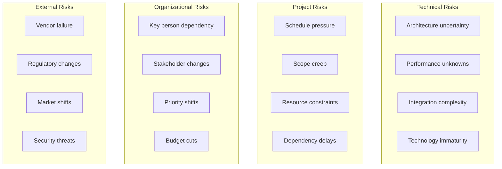
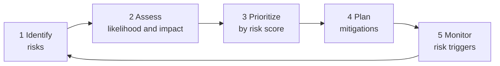

# Risk Management

> **One-line definition:** Proactively identifying, assessing, and mitigating risks that could derail delivery : turning "I hope nothing goes wrong" into "I know what could go wrong and I have a plan."

## Why This Is a Senior Skill

A mid-level engineer reacts to problems when they occur. A senior engineer **anticipates problems before they happen**, **assesses their likelihood and impact**, and **builds mitigation plans** so the team is never surprised.

Risk management is not pessimism. It is realism. Every project has risks. The difference between a team that succeeds and one that fails is whether those risks were identified and managed.

## Risk Categories



### Risk category details

| Category | Common risks | Senior engineer response |
|---|---|---|
| **Technical** | New technology; unproven architecture; performance at scale | Spike early; prototype; load test; have a fallback plan |
| **Project** | Unrealistic deadlines; expanding scope; team changes | Negotiate scope; track scope changes; cross-train team members |
| **Organizational** | Key person leaves; leadership changes; reorg | Document knowledge; build relationships across teams; make work visible |
| **External** | Vendor goes bankrupt; new regulation; competitor launches | Diversify vendors; monitor regulatory landscape; focus on differentiation |

## The Risk Management Process



### Step 1: Identify risks

**Risk identification techniques:**

| Technique | How it works | When to use |
|---|---|---|
| **Pre-mortem** | Imagine the project failed. Brainstorm why. | Project kickoff |
| **Assumption storming** | List all assumptions. Each unvalidated assumption is a risk. | Early planning |
| **Historical review** | Review past similar projects. What went wrong? | Planning phase |
| **Expert judgment** | Ask experienced engineers what could go wrong. | Any time |
| **Checklist review** | Review a standard risk checklist for your project type. | Planning phase |

**Pre-mortem exercise:**

Gather the team and say: "Imagine it's 6 months from now and this project has failed spectacularly. Write down everything that went wrong."

Common pre-mortem results:
- "The third-party API we depend on changed their pricing"
- "Our lead engineer quit and nobody knew how the system worked"
- "Requirements kept changing and we never finished anything"
- "Performance was terrible at scale and we only found out in production"

Each of these is a risk that can be mitigated now.

### Step 2: Assess likelihood and impact

**Risk assessment matrix:**

| | Low impact (1) | Medium impact (2) | High impact (3) | Critical impact (4) |
|---|---|---|---|---|
| **High likelihood (3)** | Medium (3) | High (6) | Critical (9) | Critical (12) |
| **Medium likelihood (2)** | Low (2) | Medium (4) | High (6) | Critical (8) |
| **Low likelihood (1)** | Low (1) | Low (2) | Medium (3) | High (4) |

**Risk score = Likelihood × Impact**

**Likelihood scale:**
- Low (1): Unlikely to happen (less than 20% chance)
- Medium (2): Could happen (20-60% chance)
- High (3): Likely to happen (more than 60% chance)

**Impact scale:**
- Low (1): Minor inconvenience; easily absorbed
- Medium (2): Delivers a sprint or two; manageable
- High (3): Delivers the project significantly; requires major replanning
- Critical (4): Kills the project; unrecoverable

### Step 3: Prioritize by risk score

Focus mitigation effort on high-score risks:

| Risk score | Priority | Action |
|---|---|---|
| 9-12 | Critical | Mitigate immediately; escalate to leadership |
| 6-8 | High | Mitigate in the current sprint; assign an owner |
| 3-5 | Medium | Monitor; have a contingency plan |
| 1-2 | Low | Accept the risk; document it |

### Step 4: Plan mitigations

**Four mitigation strategies:**

| Strategy | Description | Example |
|---|---|---|
| **Avoid** | Eliminate the risk by changing the plan | Use a proven technology instead of an experimental one |
| **Reduce** | Decrease likelihood or impact | Add test coverage to reduce regression risk |
| **Transfer** | Shift the risk to a third party | Use a managed service instead of building in-house |
| **Accept** | Acknowledge the risk and prepare a contingency | Accept that a vendor might raise prices; budget for it |

**Mitigation planning template:**

| Risk | Score | Strategy | Mitigation action | Owner | Trigger | Contingency |
|---|---|---|---|---|---|---|
| Third-party API changes | 8 (High) | Reduce | Abstract API behind interface; monitor changelog | Alice | API version deprecated | Switch to alternative API |
| Lead engineer leaves | 6 (High) | Reduce | Document system; pair program; rotate ownership | Bob | Engineer gives notice | Hire contractor; redistribute work |
| Performance at scale | 9 (Critical) | Reduce | Load test at 10x expected load during sprint 2 | Charlie | Load test fails | Redesign bottleneck component |

### Step 5: Monitor risk triggers

For each risk, define a **trigger**: an observable event that indicates the risk is materializing.

**Examples:**
- Risk: "Third-party API changes pricing"
  - Trigger: "Vendor announces pricing review" or "API usage exceeds free tier"
- Risk: "Key engineer leaves"
  - Trigger: "Engineer mentions job searching" or "Engineer is recruited by another team"
- Risk: "Scope creep"
  - Trigger: "More than 3 scope change requests in a sprint"

When a trigger fires, activate the contingency plan.

## Risk Communication

### Communicating risks to stakeholders

Different stakeholders need different risk communication:

| Audience | What they care about | How to communicate |
|---|---|---|
| **Engineering team** | Technical risks; mitigation actions | Risk board in team room; sprint planning discussion |
| **Engineering manager** | Delivery risks; resource needs | Weekly risk summary; escalation when critical |
| **Product manager** | Scope and timeline risks | Risk section in project status report |
| **Leadership** | Business impact; budget risks | Monthly risk dashboard; escalation for critical risks |

### The risk report

For project status reports, include a risk section:

```text
Risk Summary (Week 12)

Critical risks (action required):
1. Payment API migration delayed by vendor (score: 9)
   - Mitigation: Building adapter layer; can switch vendors if needed
   - Owner: Alice
   - Status: Mitigation in progress

High risks (monitoring):
2. Performance testing reveals bottleneck at 1000 concurrent users (score: 8)
   - Mitigation: Redesigning database queries; caching layer planned
   - Owner: Charlie
   - Status: Fix in progress; expected resolution: next sprint

New risks this week:
3. Regulatory team flagged potential GDPR compliance issue (score: 6)
   - Mitigation: Scheduled review with legal team next week
   - Owner: Bob
```

## Risk Anti-Patterns

| Anti-pattern | Problem | What to do instead |
|---|---|---|
| **Risk denial** | "Nothing will go wrong" | Run a pre-mortem; identify risks explicitly |
| **Risk list without action** | Identifying risks but not mitigating them | Assign owners and mitigation actions to every high-risk item |
| **Stale risk register** | Risk register created at kickoff and never updated | Review risks weekly; add new risks; retire mitigated ones |
| **Over-mitigation** | Spending more on mitigation than the risk is worth | Use the risk score to calibrate mitigation effort |
| **Hiding risks** | Not communicating risks to stakeholders | Communicate risks early and often; bad news does not get better with age |
| **Hero culture** | Relying on one person to save the project | Cross-train; document; build redundancy |

## Practical Exercise

**For your current project:**

1. **Run a pre-mortem:** Gather the team (or do it individually). Imagine the project failed. List 10 reasons why.

2. **Build a risk register:** For each pre-mortem reason:
   - Assess likelihood (1-3) and impact (1-4)
   - Calculate risk score
   - Assign a mitigation strategy (avoid, reduce, transfer, accept)
   - Define a trigger and contingency plan

3. **Prioritize:** Rank risks by score. Identify your top 3 critical/high risks.

4. **Take action:** For your top 3 risks, implement the first mitigation step this week.

5. **Set up monitoring:** Add a 5-minute risk review to your weekly team meeting.

**Bonus:** Think of a past project that had problems. What risks were present but unidentified? Would a pre-mortem have caught them?

## Knowledge Connections

- [[01_Estimation_and_Forecasting]] : risks affect estimates; include risk buffer
- [[02_Dependency_Management]] : dependencies are a major source of project risk
- [[05_Release_Management]] : release risks require mitigation strategies
- [[02_Problem_Framing_and_Requirements/08_Requirements_Risk]] : requirements risks overlap with project risks
- [[software-engineering-note/09_Software_Engineering_Management/08_Risk_Management_and_Control]] : SWEBOK risk management
- [[body-of-knowledge/PMBOK/10_Risk_Performance_Domain]] : PMBOK risk management

## Key Takeaways

- Risk management is not pessimism: it is proactive realism
- Use the pre-mortem technique to identify risks at project kickoff
- Assess risks by likelihood × impact; prioritize by score
- Four mitigation strategies: avoid, reduce, transfer, accept
- Define triggers for each risk: observable events that indicate the risk is materializing
- Communicate risks to stakeholders using audience-appropriate formats
- Review risks weekly; risk registers that are not updated are useless
- Bad news does not get better with age: communicate risks early
