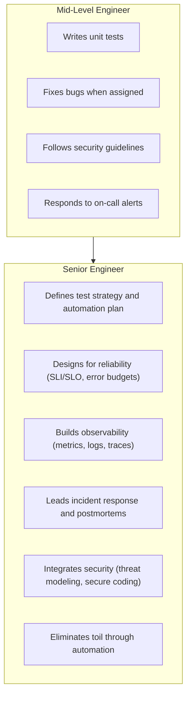
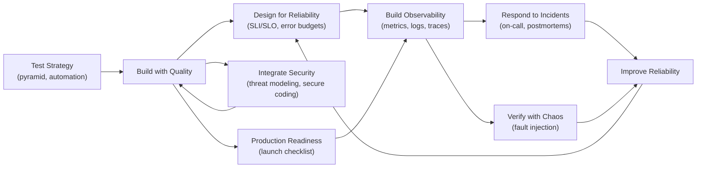

# Quality, Reliability, and Security

> **One-line definition:** Ensuring software systems are correct, dependable, and protected through testing strategies, reliability engineering, observability, incident response, and security practices.

## Why This Matters for Senior Engineers

A mid-level engineer writes tests and fixes bugs. A senior engineer **defines the quality strategy**, **designs for reliability**, **builds observability**, **leads incident response**, and **integrates security** throughout the development lifecycle.

Quality, reliability, and security are not afterthoughts or separate team responsibilities. They are engineering disciplines that senior engineers own and embed into every phase of development.

## The Senior Engineer's Role in Quality, Reliability, and Security

## Core Topics in This Capability Area

| Topic | What you will learn | Key question answered |
|---|---|---|
| [[01_Testing_Strategy]] | Test pyramid, automation strategy, quality engineering | How do I build a sustainable testing strategy for my team? |
| [[02_SRE_Principles]] | SLI/SLO, error budgets, toil reduction | How do I measure and improve system reliability? |
| [[03_Observability]] | Metrics, logs, traces, dashboards, alerting | How do I know what's happening in production? |
| [[04_Incident_Response]] | On-call practices, incident management, postmortems | How do I respond effectively when things break? |
| [[05_Security_Practices]] | Threat modeling, secure coding, DevSecOps | How do I build secure software from the start? |
| [[06_Production_Readiness]] | Launch checklists, load testing, operational readiness | How do I know if my system is ready for production? |
| [[07_Chaos_Engineering]] | Fault injection, resilience testing, game days | How do I verify that my system can handle failures? |

## Concept Map

## Prerequisites

Before diving into quality, reliability, and security, you should understand:

- [[software-engineering-note/12_Software_Quality/01_Quality_Fundamentals]]: Quality fundamentals and verification/validation
- [[software-engineering-note/06_Software_Engineering_Operations/Software Engineering Operations Overview]]: Operations and deployment
- [[body-of-knowledge/CyBOK/01_Security_and_Compliance]]: Security and compliance basics
- [[01_Technical_Ownership/04_Production_Responsibility]]: Production responsibility from Technical Ownership capability

## Progress Tracker

- [x] [[01_Testing_Strategy]] : Test pyramid, automation, quality engineering
- [x] [[02_SRE_Principles]] : SLI/SLO, error budgets, toil reduction
- [x] [[03_Observability]] : Metrics, logs, traces, alerting
- [x] [[04_Incident_Response]] : On-call, incident management, postmortems
- [x] [[05_Security_Practices]] : Threat modeling, secure coding, DevSecOps
- [x] [[06_Production_Readiness]] : Launch readiness, load testing
- [x] [[07_Chaos_Engineering]] : Fault injection, resilience verification

## Knowledge Connections

- [[body-of-knowledge/SWEBOK/Software Engineering Body of Knowledge Overview]] : SWEBOK foundation
- [[software-engineering-note/12_Software_Quality/Software Quality Overview]] : Quality engineering overview
- [[software-engineering-note/06_Software_Engineering_Operations/Software Engineering Operations Overview]] : Operations and SRE
- [[body-of-knowledge/CyBOK/CyBOK - Overview]] : Security body of knowledge
- [[01_Technical_Ownership/04_Production_Responsibility]] : Production responsibility and operational readiness
- [[04_Delivery_and_Execution/05_Release_Management]] : Release strategies and deployment safety

## Key Takeaways

- Quality, reliability, and security are engineering disciplines, not afterthoughts
- Senior engineers define strategy, not just execute tactics
- Testing strategy follows the test pyramid: many unit tests, fewer integration tests, minimal E2E tests
- Reliability is measured with SLIs and SLOs, managed with error budgets
- Observability (metrics, logs, traces) is essential for understanding production behavior
- Incident response is a skill: structured process, clear roles, blameless postmortems
- Security is integrated throughout development: threat modeling, secure coding, automated scanning
- Production readiness is verified before launch: load testing, operational runbooks, monitoring
- Chaos engineering validates resilience by injecting failures in controlled ways
