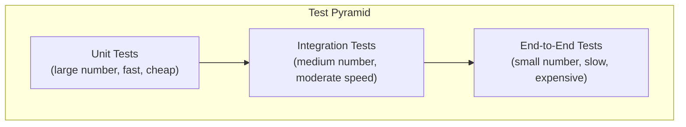

# Testing Strategy

> **One-line definition:** Defining a sustainable testing strategy using the test pyramid, automation, and quality engineering to ensure software correctness without slowing delivery.

## Why This Is a Senior Skill

A mid-level engineer writes tests when asked. A senior engineer **defines the team's testing strategy**, **balances test coverage with delivery speed**, **builds automation infrastructure**, and **coaches others** on quality engineering practices.

Testing is not a checkbox. It is an engineering discipline that requires strategic thinking about what to test, how to test, and how to maintain tests over time.

## The Test Pyramid

The test pyramid is a model for structuring your test suite:



### Pyramid layers

| Layer | What it tests | Speed | Cost | Example |
|---|---|---|---|---|
| **Unit tests** | Individual functions, classes, modules | Fast (ms) | Low | Test a calculation function |
| **Integration tests** | Interactions between components | Moderate (seconds) | Medium | Test API with database |
| **End-to-end tests** | Complete user workflows | Slow (minutes) | High | Test user registration flow |

### Why the pyramid shape?

- **Unit tests** are fast, cheap, and give immediate feedback. You can run thousands in seconds.
- **Integration tests** are slower but catch interface bugs that unit tests miss.
- **E2E tests** are slow, expensive, and brittle, but validate real user workflows.

**The anti-pattern:** The "ice cream cone" : few unit tests, many E2E tests. This leads to slow, unreliable test suites.

### Recommended distribution

| Test type | Percentage of test suite | Execution time |
|---|---|---|
| Unit tests | 60-70% | Seconds |
| Integration tests | 20-30% | Minutes |
| E2E tests | 5-10% | Minutes to hours |

## Building a Testing Strategy

### Step 1: Assess current state

Audit your existing test suite:

| Question | What to measure |
|---|---|
| How many tests do we have? | Count by type (unit, integration, E2E) |
| How long do tests take to run? | Measure CI pipeline time |
| How reliable are tests? | Flaky test rate (tests that fail intermittently) |
| What is test coverage? | Code coverage percentage |
| What bugs escape to production? | Analyze production incidents |

### Step 2: Define testing goals

| Goal | Metric | Target |
|---|---|---|
| Catch regressions early | % of bugs caught in CI | >90% |
| Fast feedback loop | CI pipeline time | <10 minutes |
| Reliable tests | Flaky test rate | <1% |
| Confidence in releases | Production incident rate | Decreasing trend |

### Step 3: Choose what to test

**Test high-value areas:**
- Business-critical logic (payments, authentication, core features)
- Complex algorithms and calculations
- Integration points (APIs, databases, external services)
- User workflows (critical paths)

**Test less (or not at all):**
- Simple getters/setters
- Framework code (test the framework's contract, not the framework)
- UI styling and layout (use visual regression tests if needed)
- Third-party libraries (trust them; test your usage)

### Step 4: Build automation infrastructure

| Infrastructure component | Purpose | Example tools |
|---|---|---|
| Test framework | Write and run tests | Jest, pytest, JUnit |
| CI/CD integration | Run tests on every commit | GitHub Actions, Jenkins, GitLab CI |
| Test data management | Provide consistent test data | Fixtures, factories, test databases |
| Test environment | Isolated environment for tests | Docker, test containers |
| Coverage reporting | Measure code coverage | Codecov, Coveralls, Istanbul |

## Test Automation Best Practices

### Write maintainable tests

| Practice | Why it matters |
|---|---|
| **Arrange-Act-Assert pattern** | Clear test structure: setup, action, verification |
| **Descriptive test names** | Test name explains what is being tested and expected behavior |
| **One assertion per test** | Focused tests; clear failure messages |
| **Test data isolation** | Tests don't depend on each other's data |
| **Avoid test logic** | Tests should be simple; complexity goes in production code |

### Example: Arrange-Act-Assert

```python
def test_calculate_discount_for_premium_user():
    # Arrange
    user = User(membership="premium")
    cart = Cart(items=[Item(price=100)])
    
    # Act
    discount = calculate_discount(user, cart)
    
    # Assert
    assert discount == 10.0  # 10% discount for premium users
```

### Handle test data

| Strategy | When to use | Example |
|---|---|---|
| **Fixtures** | Static test data | JSON files with sample users |
| **Factories** | Dynamic test data | `UserFactory.create(email="test@example.com")` |
| **Test database** | Integration tests | Separate database seeded with test data |
| **Mocks/stubs** | Isolate unit under test | Mock external API calls |

### Deal with flaky tests

Flaky tests (tests that sometimes pass, sometimes fail) destroy trust in the test suite.

**Common causes:**
- Race conditions (timing-dependent tests)
- Shared state between tests
- External dependencies (network, database)
- Non-deterministic behavior (randomness, timestamps)

**Solutions:**
- **Identify:** Track flaky tests in CI (e.g., BuildPulse, Datadog CI Visibility)
- **Quarantine:** Move flaky tests to a separate suite; don't block CI
- **Fix:** Address root cause (add retries, isolate state, mock dependencies)
- **Delete:** If a test is more trouble than it's worth, delete it

## Testing Anti-Patterns

| Anti-pattern | Problem | What to do instead |
|---|---|---|
| **Testing implementation details** | Tests break when refactoring | Test behavior, not implementation |
| **Over-mocking** | Tests pass but code doesn't work | Mock only external dependencies |
| **100% coverage obsession** | Diminishing returns; testing trivial code | Focus on high-value areas |
| **Ignoring flaky tests** | Erodes trust in test suite | Track, quarantine, fix, or delete |
| **Manual testing only** | Slow, error-prone, doesn't scale | Automate repetitive tests |
| **No test strategy** | Ad hoc testing; gaps in coverage | Define a strategy document |

## Quality Engineering Beyond Testing

Testing is one part of quality engineering. A senior engineer also considers:

| Practice | Purpose |
|---|---|
| **Code reviews** | Catch issues before merge |
| **Static analysis** | Automated code quality checks (linters, type checkers) |
| **Contract testing** | Verify API contracts between services |
| **Performance testing** | Ensure system meets performance requirements |
| **Security testing** | Identify vulnerabilities (SAST, DAST) |
| **Exploratory testing** | Manual testing to find edge cases |

## Practical Exercise

**For your current project:**

1. **Audit your test suite:**
   - Count tests by type (unit, integration, E2E)
   - Measure CI pipeline time
   - Identify flaky tests
   - Check code coverage

2. **Analyze your pyramid:** Does your test suite follow the pyramid shape? Or is it an ice cream cone?

3. **Identify gaps:** What high-value areas lack test coverage? (critical business logic, integration points, user workflows)

4. **Propose improvements:** Based on your audit, what are 3 concrete improvements? (e.g., add unit tests for calculation logic, reduce E2E test flakiness, speed up CI pipeline)

5. **Build a testing strategy document:** Write a one-page strategy that includes:
   - Testing goals and metrics
   - What to test (and what not to test)
   - Test pyramid distribution
   - Automation infrastructure
   - Flaky test policy

**Bonus:** Pick one flaky test in your suite. Diagnose the root cause and fix it (or delete it with justification).

## Knowledge Connections

- [[02_SRE_Principles]] : reliability engineering complements testing
- [[03_Observability]] : monitoring catches issues that tests miss
- [[05_Security_Practices]] : security testing is part of quality engineering
- [[software-engineering-note/12_Software_Quality/Software Quality Overview]] : quality engineering overview
- [[04_Delivery_and_Execution/03_Delivery_Metrics]] : delivery metrics include change failure rate

## Key Takeaways

- The test pyramid: many unit tests, fewer integration tests, minimal E2E tests
- Test high-value areas: business-critical logic, integration points, user workflows
- Automate tests in CI/CD for fast, reliable feedback
- Write maintainable tests: Arrange-Act-Assert, descriptive names, test isolation
- Track and fix flaky tests; they destroy trust in the test suite
- Quality engineering goes beyond testing: code reviews, static analysis, contract testing
- A senior engineer defines the testing strategy, not just writes tests
