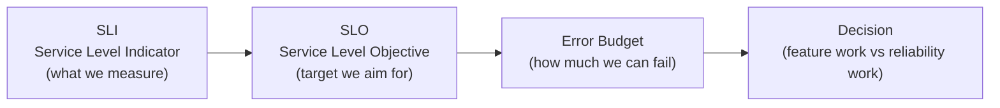

# SRE Principles

> **One-line definition:** Applying software engineering principles to operations : defining reliability with SLIs and SLOs, managing error budgets, and eliminating toil through automation.

## Why This Is a Senior Skill

A mid-level engineer fixes production issues when they occur. A senior engineer **defines what "reliable" means** (SLI/SLO), **manages the error budget**, **automates operations**, and **balances feature velocity with reliability**.

Site Reliability Engineering (SRE) is not a separate team. It is a set of practices that every senior engineer should understand and apply to their systems.

## Core SRE Concepts



### SLI, SLO, SLA

| Term | Definition | Example |
|---|---|---|
| **SLI (Service Level Indicator)** | A quantitative measure of service behavior | "Percentage of successful HTTP requests" |
| **SLO (Service Level Objective)** | A target value for an SLI | "99.9% of requests succeed" |
| **SLA (Service Level Agreement)** | A contract with consequences for missing SLOs | "If availability drops below 99.9%, we refund 10%" |

**Key distinction:**
- SLI is what you measure
- SLO is what you aim for
- SLA is what you promise (with consequences)

### Common SLIs

| SLI | Definition | How to measure |
|---|---|---|
| **Availability** | Percentage of time service is usable | Successful requests / total requests |
| **Latency** | Time to respond to a request | p50, p95, p99 latency |
| **Throughput** | Requests per second | Count of requests / time period |
| **Error rate** | Percentage of failed requests | Failed requests / total requests |
| **Data freshness** | Time since data was updated | Current time - last update time |

## Error Budgets

An error budget is the amount of unreliability you can "spend" before you must focus on reliability work.

### Calculating error budget

```
Error Budget = 1 - SLO

Example:
SLO = 99.9% availability
Error Budget = 1 - 0.999 = 0.001 = 0.1%

In a 30-day month:
Allowed downtime = 30 days × 24 hours × 0.001 = 0.72 hours = 43.2 minutes
```

### Error budget policy

| Error budget status | Action |
|---|---|
| **Budget healthy (>50% remaining)** | Feature work can proceed |
| **Budget low (10-50% remaining)** | Increase reliability work; reduce feature velocity |
| **Budget exhausted (<10% remaining)** | Halt feature work; focus entirely on reliability |

**Example policy:**
- If error budget is >50%, team can ship features at full velocity
- If error budget drops to 20%, team dedicates 50% of sprint to reliability
- If error budget is exhausted, team freezes features and works only on reliability until budget recovers

### Error budget as a decision tool

Error budgets make the feature-vs-reliability trade-off explicit:

**Scenario:** Team wants to launch a new feature, but error budget is at 15%.

**Decision:** Delay the feature launch by one sprint. Use the sprint to improve reliability (add monitoring, fix bugs, improve tests). Once error budget recovers to >50%, launch the feature.

**Why this works:** It removes emotion from the decision. The error budget is a shared, objective metric that both product and engineering can agree on.

## Toil Reduction

Toil is repetitive, manual, operational work that does not add long-term value.

### Toil characteristics

| Characteristic | Example |
|---|---|
| **Manual** | Manually restarting a service |
| **Repetitive** | Doing the same task every day |
| **Automatable** | A script or tool could do it |
| **No enduring value** | Task doesn't improve the system |
| **Scales linearly with service size** | More services = more toil |

### Toil examples

| Toil | Automation solution |
|---|---|
| Manually deploying code | CI/CD pipeline |
| Manually scaling services | Auto-scaling rules |
| Manually rotating certificates | Certificate automation (Cert Manager) |
| Manually responding to alerts | Automated remediation (self-healing) |
| Manually onboarding new services | Service scaffolding tool |

### The 50% rule

SRE teams should spend **at most 50% of time on operations** (toil, incidents, on-call). The other 50% should be engineering work (automation, reliability improvements, tooling).

**If operations exceeds 50%:**
- Identify top sources of toil
- Automate or eliminate them
- Track time spent on operations vs engineering

## SRE Practices

### Service ownership

Every service should have a clear owner who is responsible for:
- Defining SLIs and SLOs
- Monitoring and alerting
- Incident response
- Reliability improvements
- On-call rotation

### On-call practices

| Practice | Purpose |
|---|---|
| **Rotation schedule** | Fair distribution of on-call burden |
| **Compensation** | Acknowledge on-call effort (time off, pay) |
| **Runbooks** | Documented procedures for common issues |
| **Escalation path** | Clear path to escalate to experts |
| **Post-incident review** | Learn from every incident |

### Capacity planning

Ensure the system can handle expected load:

1. **Forecast growth:** Predict traffic growth (e.g., 20% per quarter)
2. **Load test:** Test system at 2x expected peak load
3. **Identify bottlenecks:** Find components that will fail under load
4. **Plan capacity:** Add resources before bottlenecks are hit

## SRE Anti-Patterns

| Anti-pattern | Problem | What to do instead |
|---|---|---|
| **No SLOs** | "Reliable" is undefined; no way to measure | Define SLIs and SLOs for every service |
| **100% reliability goal** | Unrealistic; error budget is zero | Set realistic SLOs (99.9%, 99.95%) |
| **Ignoring error budget** | Feature work continues even when reliability is poor | Use error budget to guide decisions |
| **Manual operations** | Toil consumes engineering time | Automate repetitive tasks |
| **Hero culture** | Relies on individuals, not systems | Build systems and runbooks |
| **Blame in incidents** | People hide mistakes; no learning | Blameless postmortems |

## Practical Exercise

**For a service you own or work on:**

1. **Define SLIs:** What are the 3 most important SLIs for your service? (availability, latency, error rate)

2. **Set SLOs:** What are realistic SLOs for each SLI? (99.9% availability, p99 latency <500ms)

3. **Calculate error budget:** How much downtime is allowed per month with your availability SLO?

4. **Identify toil:** List the top 5 operational tasks you do manually. Which can be automated?

5. **Build an error budget dashboard:** Track your error budget over time. Is it healthy, low, or exhausted?

**Bonus:** Think of a recent production incident. How much error budget did it consume? Would an error budget policy have prevented it?

## Knowledge Connections

- [[03_Observability]] : observability is essential for measuring SLIs
- [[04_Incident_Response]] : incident response is a core SRE practice
- [[06_Production_Readiness]] : production readiness includes SLOs and monitoring
- [[07_Chaos_Engineering]] : chaos engineering validates SLOs under failure
- [[01_Technical_Ownership/04_Production_Responsibility]] : production responsibility includes reliability
- [[software-engineering-note/06_Software_Engineering_Operations/Software Engineering Operations Overview]] : operations and SRE

## Key Takeaways

- SRE applies software engineering principles to operations
- Define reliability with SLIs (what you measure) and SLOs (what you aim for)
- Error budgets make the feature-vs-reliability trade-off explicit
- Toil is repetitive, manual work; automate it to free engineering time
- Spend at most 50% of time on operations; the rest on engineering
- Every service needs a clear owner responsible for reliability
- On-call practices should be fair, compensated, and supported by runbooks
