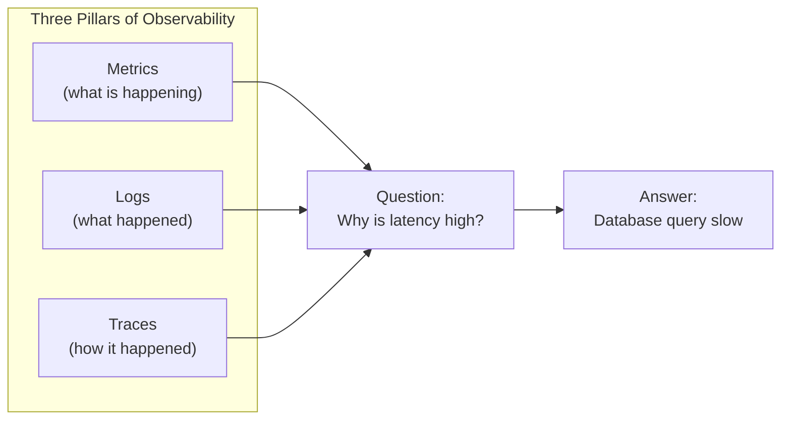
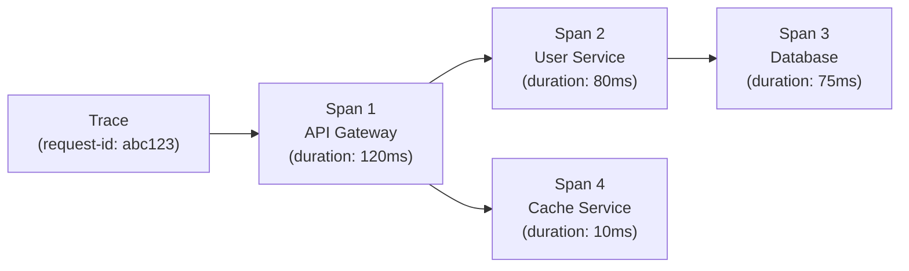

# Observability

> **One-line definition:** Building systems that are observable : using metrics, logs, and traces to understand production behavior, diagnose issues, and make data-driven decisions.

## Why This Is a Senior Skill

A mid-level engineer adds log statements when debugging. A senior engineer **designs systems to be observable from the start**, **builds dashboards and alerts**, and **uses observability data** to make decisions about reliability, performance, and capacity.

Observability is not monitoring. Monitoring tells you the system is broken. Observability tells you **why** it's broken and **how** to fix it.

## The Three Pillars of Observability



### Pillar comparison

| Pillar | What it is | Strengths | Weaknesses | Example tools |
|---|---|---|---|---|
| **Metrics** | Numerical measurements over time | Fast to query; good for alerting; long-term trends | Lose detail; can't answer "why" | Prometheus, Datadog, InfluxDB |
| **Logs** | Discrete events with context | Rich detail; good for debugging | High volume; expensive to store; hard to query | ELK, Loki, Splunk |
| **Traces** | Request flow across services | Shows end-to-end behavior; identifies bottlenecks | Overhead; complex to instrument | Jaeger, Zipkin, Tempo |

## Metrics

Metrics are numerical measurements aggregated over time.

### Metric types

| Type | Definition | Example |
|---|---|---|
| **Counter** | Monotonically increasing value | Total requests served |
| **Gauge** | Value that can go up or down | Current CPU usage |
| **Histogram** | Distribution of values | Request latency distribution |
| **Summary** | Quantiles of a distribution | p50, p95, p99 latency |

### The RED method

A framework for service metrics:

| Metric | Definition | Why it matters |
|---|---|---|
| **Rate** | Requests per second | How much traffic are we handling? |
| Errors | Failed requests per second | How many requests are failing? |
| **Duration** | Time per request (p50, p95, p99) | How fast are we responding? |

**Example dashboard:**
```
Service: user-api
- Rate: 1,200 req/s
- Errors: 12 req/s (1% error rate)
- Duration: p50=45ms, p95=120ms, p99=350ms
```

### The USE method

A framework for infrastructure metrics:

| Metric | Definition | Why it matters |
|---|---|---|
| **Utilization** | % of resource in use | Are we running out of capacity? |
| **Saturation** | Queue length or wait time | Is the resource overloaded? |
| **Errors** | Error count | Is the resource failing? |

**Example:**
```
Database server:
- Utilization: CPU 75%, Memory 60%
- Saturation: CPU run queue = 2, Disk I/O wait = 10ms
- Errors: 0 disk errors, 2 connection timeouts
```

## Logs

Logs are discrete events with contextual information.

### Log levels

| Level | When to use | Example |
|---|---|---|
| **DEBUG** | Detailed information for debugging | "User ID: 123, Query: SELECT * FROM users" |
| **INFO** | Normal operational events | "User logged in", "Order created" |
| **WARN** | Potential issues that don't stop operation | "Slow query detected (>1s)", "Retry attempt 2" |
| **ERROR** | Errors that affect a request but not the system | "Failed to send email", "Database connection timeout" |
| **FATAL** | Critical errors that stop the system | "Out of memory", "Database unreachable" |

### Structured logging

Instead of unstructured text, log structured data (JSON):

**Unstructured:**
```
2026-01-15 10:23:45 INFO User 123 logged in from 192.168.1.10
```

**Structured:**
```json
{
  "timestamp": "2026-01-15T10:23:45Z",
  "level": "INFO",
  "message": "User logged in",
  "user_id": 123,
  "ip_address": "192.168.1.10",
  "service": "auth-service"
}
```

**Benefits:**
- Easy to query (filter by user_id, service, level)
- Easy to aggregate (count errors by service)
- Machine-readable (can be processed by log analysis tools)

### Log management best practices

| Practice | Why it matters |
|---|---|
| **Log at boundaries** | Entry/exit of services, functions, and workflows |
| **Include context** | Request ID, user ID, session ID for correlation |
| **Avoid sensitive data** | Never log passwords, tokens, PII |
| **Set retention policy** | Keep logs for 30-90 days; archive older logs |
| **Use correlation IDs** | Track a request across multiple services |

## Distributed Tracing

Traces show the flow of a request across multiple services.

### Trace structure



### When to use tracing

| Scenario | How tracing helps |
|---|---|
| **High latency** | Identify which service or database query is slow |
| **Error diagnosis** | See which service failed and why |
| **Dependency mapping** | Understand service-to-service communication |
| **Performance optimization** | Find bottlenecks in request flow |

### Instrumentation

To enable tracing, instrument your code:

```python
from opentelemetry import trace

tracer = trace.get_tracer(__name__)

def get_user(user_id):
    with tracer.start_as_current_span("get_user"):
        # Your code here
        user = database.query("SELECT * FROM users WHERE id = ?", user_id)
        return user
```

## Building Dashboards and Alerts

### Dashboard design

**Golden signals dashboard:**

| Signal | Metric | Alert threshold |
|---|---|---|
| **Latency** | p99 latency | >500ms for 5 minutes |
| **Traffic** | Requests per second | >2000 req/s (capacity planning) |
| **Errors** | Error rate | >1% for 5 minutes |
| **Saturation** | CPU, memory, disk | >80% utilization |

### Alerting best practices

| Practice | Why it matters |
|---|---|
| **Alert on symptoms, not causes** | Alert on "error rate >1%", not "CPU >80%" |
| **Make alerts actionable** | Include runbook link or remediation steps |
| **Avoid alert fatigue** | Only alert on issues that require human action |
| **Use severity levels** | Critical (page on-call), Warning (Slack), Info (dashboard) |
| **Test alerts** | Regularly verify alerts fire and reach the right people |

### Alert severity levels

| Severity | Response | Example |
|---|---|---|
| **Critical** | Page on-call immediately; respond within 15 minutes | Service down; error rate >5% |
| **Warning** | Notify on Slack; respond within 1 hour | Error rate >1%; latency >500ms |
| **Info** | Log to dashboard; review in next business day | Disk usage >70%; certificate expiring in 30 days |

## Observability Anti-Patterns

| Anti-pattern | Problem | What to do instead |
|---|---|---|
| **Monitoring only infrastructure** | CPU, memory don't tell you if users are happy | Monitor user-facing metrics (latency, errors) |
| **Alert on everything** | Alert fatigue; critical alerts get lost | Alert only on actionable symptoms |
| **Logs without structure** | Hard to query and analyze | Use structured logging (JSON) |
| **No tracing** | Can't diagnose distributed system issues | Instrument with distributed tracing |
| **Dashboards without context** | Numbers without meaning | Add SLO lines, annotations, and comparisons |

## Practical Exercise

**For a service you own or work on:**

1. **Audit observability:**
   - What metrics are you collecting? (use RED method)
   - What logs are you writing? (are they structured?)
   - Do you have distributed tracing?

2. **Build a golden signals dashboard:**
   - Latency (p50, p95, p99)
   - Traffic (requests per second)
   - Errors (error rate)
   - Saturation (CPU, memory)

3. **Review alerts:**
   - How many alerts fired in the last month?
   - How many were actionable?
   - Which alerts should be removed or adjusted?

4. **Add tracing:** If you don't have tracing, instrument one critical workflow. Use the trace to identify bottlenecks.

**Bonus:** Pick a recent production incident. Could you diagnose it with your current observability? What's missing?

## Knowledge Connections

- [[02_SRE_Principles]] : observability is essential for measuring SLIs
- [[04_Incident_Response]] : observability data is critical for incident diagnosis
- [[05_Security_Practices]] : security monitoring is part of observability
- [[07_Chaos_Engineering]] : observability validates chaos experiments
- [[01_Technical_Ownership/04_Production_Responsibility]] : production responsibility includes observability
- [[software-engineering-note/06_Software_Engineering_Operations/Software Engineering Operations Overview]] : operations and monitoring

## Key Takeaways

- Observability has three pillars: metrics (what), logs (what happened), traces (how)
- Use the RED method for service metrics: Rate, Errors, Duration
- Use the USE method for infrastructure metrics: Utilization, Saturation, Errors
- Log structured data (JSON) for easy querying and analysis
- Distributed tracing shows request flow across services; essential for diagnosing distributed system issues
- Build golden signals dashboards: latency, traffic, errors, saturation
- Alert on symptoms (error rate), not causes (CPU usage); make alerts actionable
- Observability is not optional; it's a prerequisite for operating production systems
