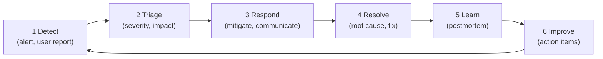

# Incident Response

> **One-line definition:** Responding to production incidents effectively : structured process, clear roles, fast mitigation, and blameless postmortems to learn and improve.

## Why This Is a Senior Skill

A mid-level engineer escalates production issues. A senior engineer **leads incident response**, **coordinates the team**, **makes mitigation decisions**, and **drives postmortems** to prevent recurrence.

Incidents are inevitable. The difference between a team that learns from incidents and one that repeats them is the quality of the response and the postmortem process.

## The Incident Lifecycle



## Incident Severity Levels

| Severity | Definition | Response time | Example |
|---|---|---|---|
| **SEV-1 (Critical)** | Major user impact; service down or degraded | 15 minutes | Payment service down; data breach |
| **SEV-2 (High)** | Significant user impact; workaround exists | 1 hour | Search broken; slow performance |
| **SEV-3 (Medium)** | Minor user impact; isolated issue | 4 hours | Single user can't log in; cosmetic bug |
| **SEV-4 (Low)** | No user impact; internal issue | Next business day | Monitoring gap; documentation error |

## Incident Response Roles

| Role | Responsibility | Who |
|---|---|---|
| **Incident Commander (IC)** | Coordinates response; makes decisions; communicates | Senior engineer or on-call |
| **Technical Lead** | Diagnoses issue; implements fix | Engineer with system knowledge |
| **Communications Lead** | Updates stakeholders; manages status page | Product manager or support lead |
| **Scribe** | Documents timeline; records decisions | Any team member |

**Small team?** One person can play multiple roles, but IC and Technical Lead should be separate when possible.

## Incident Response Process

### Step 1: Detect

**Detection sources:**
- Automated alerts (monitoring, error tracking)
- User reports (support tickets, social media)
- Internal reports (employees using the product)

**Goal:** Detect incidents as early as possible.

### Step 2: Triage

**Triage checklist:**
- [ ] What is the impact? (users affected, features broken)
- [ ] What is the severity? (SEV-1, SEV-2, SEV-3, SEV-4)
- [ ] Who needs to be involved? (on-call, experts, managers)
- [ ] Is this a security incident? (escalate to security team)

**Severity assessment:**

| Question | If yes | Severity |
|---|---|---|
| Is the service completely down? | Yes | SEV-1 |
| Are users unable to complete critical workflows? | Yes | SEV-1 or SEV-2 |
| Is there a workaround? | Yes | Lower severity by one level |
| Is this affecting <5% of users? | Yes | SEV-3 or SEV-4 |

### Step 3: Respond

**Immediate actions:**
1. **Start incident channel:** Create a Slack channel or Zoom call (e.g., `#incident-2026-01-15-payment-down`)
2. **Announce the incident:** Post in the channel with severity, impact, and initial assessment
3. **Assign roles:** IC, Technical Lead, Communications Lead, Scribe
4. **Mitigate:** Focus on restoring service, not root cause (rollback, restart, scale up)
5. **Communicate:** Update stakeholders every 15-30 minutes

**Mitigation strategies:**

| Strategy | When to use |
|---|---|
| **Rollback** | Recent deployment caused the issue |
| **Restart** | Service is in a bad state |
| **Scale up** | Traffic spike or resource exhaustion |
| **Disable feature** | Feature flag causing issues |
| **Failover** | Primary system failed; switch to backup |

**Communication template:**
```
🚨 Incident SEV-1: Payment service down

Impact: Users cannot complete purchases
Started: 10:15 UTC
Status: Investigating

Incident Commander: @alice
Technical Lead: @bob

Next update: 10:30 UTC
```

### Step 4: Resolve

**Resolution steps:**
1. Identify root cause (use observability: metrics, logs, traces)
2. Implement fix (hotfix, configuration change, infrastructure change)
3. Verify fix (test in staging, monitor in production)
4. Deploy fix (use safe deployment strategy: canary, blue-green)
5. Confirm resolution (monitor for 30 minutes)

### Step 5: Learn (Postmortem)

**Postmortem timeline:** Conduct within 48 hours of incident resolution.

**Postmortem template:**

```markdown
# Incident Postmortem: [Incident Title]

## Summary
- **Date:** 2026-01-15
- **Severity:** SEV-1
- **Duration:** 45 minutes (10:15 - 11:00 UTC)
- **Impact:** 5,000 users unable to complete purchases; $50K revenue loss

## Timeline
- 10:15: Alert fired: payment service error rate >10%
- 10:18: On-call acknowledged; started incident channel
- 10:25: Identified recent deployment as cause
- 10:30: Rolled back deployment
- 10:35: Error rate returned to normal
- 11:00: Confirmed resolution; closed incident

## Root Cause
Deployment of payment-service v2.3.1 introduced a bug in payment validation logic.
The bug caused all payments to fail with "invalid card" error.

## Contributing Factors
- Insufficient test coverage for payment validation
- No canary deployment; rolled out to 100% of users
- Monitoring alert threshold was too high (10% instead of 1%)

## Action Items
| Action | Owner | Due | Status |
|---|---|---|---|
| Add integration tests for payment validation | Alice | Jan 20 | Not started |
| Implement canary deployment for payment service | Bob | Jan 25 | Not started |
| Lower alert threshold to 1% error rate | Charlie | Jan 18 | Not started |
| Add payment validation to pre-deployment checklist | Alice | Jan 20 | Not started |

## Lessons Learned
- Canary deployments would have limited impact to 5% of users instead of 100%
- Integration tests would have caught the bug before production
- Lower alert threshold would have detected the issue 5 minutes earlier

## Appendix
- Incident channel transcript: [link]
- Monitoring dashboard: [link]
- Deployment logs: [link]
```

### Step 6: Improve

**Action item tracking:**
- Assign owners and due dates to every action item
- Track completion in sprint planning
- Review action items in monthly reliability meeting

**Verify effectiveness:**
- Did the action items prevent similar incidents?
- Are there recurring patterns? (address systemic issues)

## Blameless Postmortems

### Why blameless?

| Blameful | Blameless |
|---|---|
| "Bob broke production" | "The deployment process allowed a bug to reach production" |
| "Alice didn't test" | "Test coverage was insufficient to catch this bug" |
| People hide mistakes | People share openly; we learn more |
| Focus on individuals | Focus on systems and processes |

### Blameless language

| Blameful | Blameless |
|---|---|
| "Bob pushed bad code" | "The code review process didn't catch the issue" |
| "Alice ignored the alert" | "The alert didn't provide enough context to act on" |
| "They should have known" | "The documentation didn't cover this scenario" |

**Goal:** Understand the system failures that allowed the incident, not who made a mistake.

## On-Call Best Practices

### On-call rotation

| Practice | Why it matters |
|---|---|
| **Fair rotation** | Distribute burden evenly (e.g., 1 week every 8 weeks for 8-person team) |
| **Compensation** | Acknowledge on-call effort (time off, pay, comp days) |
| **Handoff process** | Outgoing on-call briefs incoming on-call |
| **Escalation path** | Clear path to escalate to experts or managers |

### On-call runbooks

Every alert should link to a runbook:

```markdown
# Runbook: Payment Service High Error Rate

## Alert
Payment service error rate >1% for 5 minutes

## Impact
Users cannot complete purchases

## Immediate Actions
1. Check deployment history: was there a recent deployment?
   - If yes: rollback to previous version
2. Check database connectivity:
   - Run: `SELECT 1` on payment database
   - If timeout: check database health; restart if needed
3. Check external payment provider status:
   - Visit: https://status.stripe.com
   - If outage: enable fallback provider

## Escalation
- If unable to mitigate in 15 minutes: page @payment-team-lead
- If security incident: page @security-team

## Communication
- Update status page: https://status.example.com
- Post in #incidents channel

## Post-Incident
- Conduct postmortem within 48 hours
- Add action items to sprint backlog
```

## Incident Response Anti-Patterns

| Anti-pattern | Problem | What to do instead |
|---|---|---|
| **No incident process** | Chaotic response; slow mitigation | Define a structured process with roles |
| **Hero culture** | Relies on individuals; not scalable | Build runbooks; train multiple people |
| **Blameful postmortems** | People hide mistakes; no learning | Blameless postmortems; focus on systems |
| **Ignoring small incidents** | Missed learning opportunities | Postmortem all SEV-2 and SEV-3 incidents |
| **No action item tracking** | Action items forgotten; issues recur | Track in sprint planning; review monthly |
| **Alert fatigue** | Critical alerts ignored | Reduce alerts; make them actionable |

## Practical Exercise

**For your team:**

1. **Audit incident process:**
   - Do you have defined severity levels?
   - Do you have incident roles (IC, Technical Lead)?
   - Do you conduct postmortems?

2. **Review last 3 incidents:**
   - How long to detect?
   - How long to mitigate?
   - Were postmortems conducted?
   - Were action items tracked?

3. **Build a runbook:** Pick your most common alert. Write a runbook with:
   - Alert description and impact
   - Immediate actions (mitigation steps)
   - Escalation path
   - Communication plan

4. **Conduct a postmortem:** Pick a recent incident (even a small one). Write a blameless postmortem with:
   - Timeline
   - Root cause and contributing factors
   - Action items with owners and due dates

**Bonus:** Review action items from past postmortems. Were they completed? Did they prevent similar incidents?

## Knowledge Connections

- [[02_SRE_Principles]] : incident response is a core SRE practice
- [[03_Observability]] : observability data is critical for incident diagnosis
- [[05_Security_Practices]] : security incidents require specialized response
- [[06_Production_Readiness]] : production readiness includes incident response planning
- [[04_Delivery_and_Execution/05_Release_Management]] : release management reduces incident risk
- [[software-engineering-note/06_Software_Engineering_Operations/Software Engineering Operations Overview]] : operations and incident response

## Key Takeaways

- Incidents are inevitable; the goal is fast detection, mitigation, and learning
- Define severity levels (SEV-1 to SEV-4) with response time expectations
- Assign incident roles: Incident Commander, Technical Lead, Communications Lead, Scribe
- Focus on mitigation first, root cause second
- Conduct blameless postmortems within 48 hours; focus on systems, not individuals
- Track action items; review in sprint planning and monthly reliability meetings
- Build runbooks for common alerts; include immediate actions, escalation, and communication
- On-call should be fair, compensated, and supported by runbooks and escalation paths
