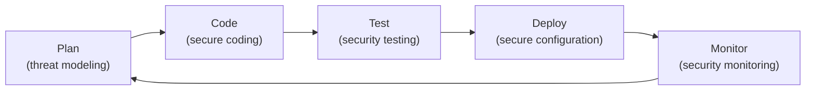
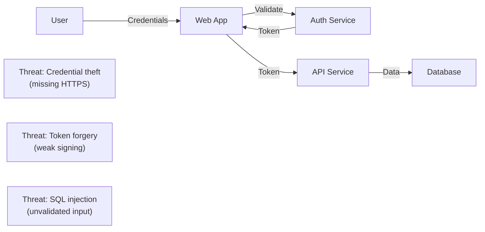
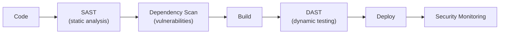

# Security Practices

> **One-line definition:** Integrating security throughout the development lifecycle : threat modeling, secure coding, automated scanning, and security testing to build software that is secure by design.

## Why This Is a Senior Skill

A mid-level engineer follows security guidelines. A senior engineer **identifies security risks**, **designs secure systems**, **integrates security into CI/CD**, and **advocates for security** as a first-class engineering concern.

Security is not a separate team's responsibility. It is an engineering discipline that every senior engineer must understand and apply.

## Security in the Development Lifecycle



## Threat Modeling

Threat modeling is the process of identifying and mitigating security threats before building.

### STRIDE model

A framework for identifying threats:

| Threat | Definition | Example |
|---|---|---|
| **S**poofing | Pretending to be someone else | Forged authentication token |
| **T**ampering | Modifying data or code | SQL injection; modified API request |
| **R**epudiation | Denying actions | User denies making a transaction |
| **I**nformation Disclosure | Exposing data | Data breach; leaked API key |
| **D**enial of Service | Making service unavailable | DDoS attack; resource exhaustion |
| **E**levation of Privilege | Gaining unauthorized access | Exploiting a bug to become admin |

### Threat modeling process

1. **Draw the system:** Architecture diagram with components, data flows, and trust boundaries
2. **Identify threats:** Apply STRIDE to each component and data flow
3. **Assess risk:** Likelihood × impact for each threat
4. **Mitigate:** Design controls to reduce risk

**Example: User authentication flow**



**Mitigations:**
- Use HTTPS for all communication
- Use strong token signing (RS256, not HS256)
- Validate and sanitize all inputs

## Secure Coding Practices

### Input validation

| Practice | Why it matters |
|---|---|
| **Validate all inputs** | Prevent injection attacks (SQL, XSS, command) |
| **Use allowlists** | Accept only known-good inputs |
| **Sanitize outputs** | Prevent XSS by escaping HTML |
| **Limit input size** | Prevent buffer overflows and DoS |

**Example: SQL injection prevention**

```python
# BAD: String concatenation (vulnerable to SQL injection)
query = "SELECT * FROM users WHERE username = '" + username + "'"

# GOOD: Parameterized query
query = "SELECT * FROM users WHERE username = ?"
cursor.execute(query, (username,))
```

### Authentication and authorization

| Practice | Why it matters |
|---|---|
| **Use strong password policies** | Prevent brute-force attacks |
| **Implement multi-factor authentication (MFA)** | Add second layer of security |
| **Use secure session management** | Prevent session hijacking |
| **Enforce least privilege** | Users have only necessary permissions |

**Example: Password hashing**

```python
# BAD: Storing plaintext passwords
password = "user_password"
db.save(password)

# GOOD: Hashing with bcrypt
import bcrypt
password_hash = bcrypt.hashpw("user_password".encode(), bcrypt.gensalt())
db.save(password_hash)
```

### Secrets management

| Practice | Why it matters |
|---|---|
| **Never hardcode secrets** | Code is visible to many people; secrets leak |
| **Use secrets manager** | Centralized, encrypted storage (AWS Secrets Manager, Vault) |
| **Rotate secrets regularly** | Reduce impact of compromised secrets |
| **Audit secret access** | Track who accessed what and when |

**Example: Environment variables**

```python
# BAD: Hardcoded API key
api_key = "sk_live_1234567890"

# GOOD: Environment variable
import os
api_key = os.environ["API_KEY"]
```

### Cryptography

| Practice | Why it matters |
|---|---|
| **Use established libraries** | Don't roll your own crypto |
| **Use strong algorithms** | AES-256, RSA-2048, SHA-256 |
| **Protect keys** | Keys are as sensitive as the data they protect |
| **Use TLS for communication** | Encrypt data in transit |

## Security Testing

### Security testing types

| Type | What it tests | When to use | Example tools |
|---|---|---|---|
| **SAST (Static Application Security Testing)** | Code for vulnerabilities | In CI/CD pipeline | SonarQube, Semgrep, CodeQL |
| **DAST (Dynamic Application Security Testing)** | Running application | In staging/production | OWASP ZAP, Burp Suite |
| **Dependency scanning** | Third-party libraries | In CI/CD pipeline | Snyk, Dependabot, npm audit |
| **Penetration testing** | Simulated attack | Periodically (quarterly/annually) | Manual testing by security team |

### Integrating security into CI/CD



**Example CI/CD security checks:**
- SAST: Scan code for SQL injection, XSS, hardcoded secrets
- Dependency scan: Check for known vulnerabilities in libraries
- Container scan: Scan Docker images for vulnerabilities
- DAST: Run OWASP ZAP against staging environment

## DevSecOps

DevSecOps integrates security into DevOps practices.

### DevSecOps principles

| Principle | Practice |
|---|---|
| **Security as code** | Define security policies in code (infrastructure as code) |
| **Shift left** | Test security early in development, not just before production |
| **Automate security** | Automated scanning in CI/CD; automated compliance checks |
| **Collaborate** | Security team partners with development, not gates them |

### Security automation examples

| Automation | Purpose |
|---|---|
| **Pre-commit hooks** | Prevent committing secrets or vulnerable code |
| **CI/CD security gates** | Block deployment if critical vulnerabilities found |
| **Infrastructure scanning** | Check cloud configuration for security best practices |
| **Automated compliance** | Verify compliance with standards (PCI-DSS, HIPAA) |

## Security Anti-Patterns

| Anti-pattern | Problem | What to do instead |
|---|---|---|
| **Security as afterthought** | Vulnerabilities discovered late; expensive to fix | Integrate security from design phase |
| **Security theater** | Compliance checkboxes without real security | Focus on actual risk reduction |
| **Rolling your own crypto** | Subtle bugs; weak encryption | Use established libraries |
| **Hardcoded secrets** | Secrets leak in code repositories | Use secrets manager |
| **Ignoring dependencies** | Vulnerable libraries in production | Regular dependency scanning |
| **Security vs velocity** | Security seen as slowing down development | Automate security; make it easy |

## Security Incident Response

When a security incident occurs (data breach, vulnerability exploited):

1. **Contain:** Stop the attack (disable compromised accounts, block IP addresses)
2. **Eradicate:** Remove the threat (patch vulnerability, remove malicious code)
3. **Recover:** Restore systems (restore from backup, reset passwords)
4. **Communicate:** Notify affected users and regulators (if required by law)
5. **Learn:** Conduct postmortem; improve security controls

**Legal considerations:**
- Data breach notification laws (GDPR, CCPA) require notifying affected users within 72 hours
- Consult legal team before public communication

## Practical Exercise

**For a feature you're building:**

1. **Threat model:** Draw the architecture and apply STRIDE. Identify the top 3 threats.

2. **Secure coding review:** Review your code for:
   - Input validation (SQL injection, XSS)
   - Authentication and authorization
   - Secrets management
   - Cryptography usage

3. **Security testing:** Add security checks to your CI/CD pipeline:
   - SAST tool (SonarQube, Semgrep)
   - Dependency scanner (Snyk, Dependabot)
   - Container scanner (Trivy)

4. **Security checklist:** Before deploying, verify:
   - [ ] All inputs validated
   - [ ] Secrets in secrets manager (not hardcoded)
   - [ ] HTTPS enforced
   - [ ] Authentication and authorization implemented
   - [ ] Security tests passing

**Bonus:** Run a dependency scan on your project. How many vulnerabilities are found? Prioritize fixing the critical ones.

## Knowledge Connections

- [[body-of-knowledge/CyBOK/CyBOK - Overview]] : security body of knowledge
- [[01_Testing_Strategy]] : security testing is part of quality engineering
- [[04_Incident_Response]] : security incidents require specialized response
- [[05_Security_Practices]] : security monitoring is part of observability
- [[06_Production_Readiness]] : production readiness includes security review
- [[software-engineering-note/14_Software_Engineering_Professional_Practice/Professionalism of Software Engineering Overview]] : professional practice includes security ethics

## Key Takeaways

- Security is an engineering discipline, not a separate team's responsibility
- Threat modeling identifies and mitigates threats before building (STRIDE model)
- Secure coding: validate inputs, use strong authentication, manage secrets, use established crypto libraries
- Integrate security testing into CI/CD: SAST, DAST, dependency scanning
- DevSecOps: security as code, shift left, automate, collaborate
- Security incidents require containment, eradication, recovery, communication, and learning
- Never hardcode secrets; use secrets manager
- Never roll your own cryptography; use established libraries
