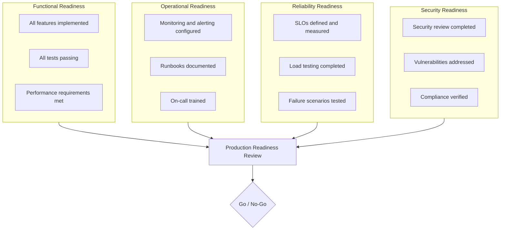

# Production Readiness

> **One-line definition:** Verifying that a system is ready for production launch through operational readiness reviews, load testing, monitoring, and incident response planning.

## Why This Is a Senior Skill

A mid-level engineer deploys code when tests pass. A senior engineer **defines what "ready for production" means**, **conducts readiness reviews**, **validates operational capabilities**, and **makes the go/no-go decision** for launch.

Production readiness is not a checkbox exercise. It is a systematic verification that the system can be operated reliably, securely, and efficiently in production.

## Production Readiness Review (PRR)

A Production Readiness Review is a structured assessment before launching a new system or major feature.

### PRR checklist



### Functional readiness

| Item | Verification |
|---|---|
| All features implemented | Feature list reviewed; all features complete |
| All tests passing | Unit, integration, and E2E tests passing |
| Performance requirements met | Load test results meet latency and throughput targets |
| Code review completed | All code reviewed and approved |
| Documentation complete | User docs, API docs, and runbooks written |

### Operational readiness

| Item | Verification |
|---|---|
| Monitoring configured | Metrics, logs, and traces instrumented |
| Alerting configured | Alerts for critical symptoms (error rate, latency) |
| Dashboards built | Golden signals dashboard available |
| Runbooks written | Runbooks for common alerts and incidents |
| On-call trained | On-call team trained on system and runbooks |
| Escalation path defined | Clear path to escalate to experts |

### Reliability readiness

| Item | Verification |
|---|---|
| SLIs defined | Key indicators identified (availability, latency, error rate) |
| SLOs set | Realistic targets defined (99.9% availability, p99 latency <500ms) |
| Error budget calculated | Allowed downtime per month documented |
| Load testing completed | System tested at 2x expected peak load |
| Failure scenarios tested | Chaos engineering or fault injection completed |
| Backup and recovery tested | Backup restoration tested; RTO and RPO verified |

### Security readiness

| Item | Verification |
|---|---|
| Threat model completed | STRIDE analysis conducted; threats mitigated |
| Security review completed | Security team reviewed architecture and code |
| Vulnerabilities addressed | SAST and DAST scans passing; no critical vulnerabilities |
| Secrets managed | All secrets in secrets manager; no hardcoded secrets |
| Compliance verified | Compliance requirements met (PCI-DSS, HIPAA, GDPR) |
| Penetration testing | Pen test completed (for high-risk systems) |

## Load Testing

Load testing verifies that the system can handle expected traffic.

### Load testing types

| Type | What it tests | When to use |
|---|---|---|
| **Load test** | System under expected load | Before every major release |
| **Stress test** | System under extreme load | Capacity planning |
| **Endurance test** | System under sustained load | Detect memory leaks, resource exhaustion |
| **Spike test** | System under sudden load spike | Validate auto-scaling |

### Load testing process

1. **Define load profile:** Expected traffic patterns (requests per second, concurrent users)
2. **Set performance targets:** Latency (p50, p95, p99), error rate, throughput
3. **Create test scenarios:** Realistic user workflows
4. **Run tests:** Use load testing tools (k6, Locust, JMeter, Gatling)
5. **Analyze results:** Identify bottlenecks; verify targets met
6. **Optimize:** Address bottlenecks; re-test

### Example load test (k6)

```javascript
import http from 'k6/http';
import { check, sleep } from 'k6';

export let options = {
  stages: [
    { duration: '2m', target: 100 },  // Ramp up to 100 users
    { duration: '5m', target: 100 },  // Stay at 100 users
    { duration: '2m', target: 200 },  // Ramp up to 200 users
    { duration: '5m', target: 200 },  // Stay at 200 users
    { duration: '2m', target: 0 },    // Ramp down
  ],
  thresholds: {
    http_req_duration: ['p(95)<500'],  // 95% of requests < 500ms
    http_req_failed: ['rate<0.01'],    // Error rate < 1%
  },
};

export default function () {
  let res = http.get('https://api.example.com/users');
  check(res, {
    'status is 200': (r) => r.status === 200,
    'response time < 500ms': (r) => r.timings.duration < 500,
  });
  sleep(1);
}
```

### Load testing anti-patterns

| Anti-pattern | Problem | What to do instead |
|---|---|---|
| **Testing in production** | Risk of impacting real users | Test in staging with production-like data |
| **Unrealistic load profile** | Test doesn't reflect real traffic | Use historical traffic data to define profile |
| **Ignoring think time** | Unrealistic request rate | Add sleep between requests to simulate user behavior |
| **One-time testing** | Performance degrades over time | Automate load tests in CI/CD |
| **No baseline** | Can't measure improvement | Establish baseline before optimization |

## Launch Strategies

### Launch strategies comparison

| Strategy | Risk | Complexity | When to use |
|---|---|---|---|
| **Big bang** | High | Low | Small internal tools |
| **Canary release** | Low | Medium | User-facing services |
| **Feature flags** | Very low | Medium | Gradual rollout; A/B testing |
| **Blue-green deployment** | Low | Medium | Zero-downtime deployments |

### Launch day checklist

**Pre-launch (1 hour before):**
- [ ] All systems green on monitoring dashboard
- [ ] On-call team briefed and ready
- [ ] Incident channel created (e.g., `#launch-payment-v2`)
- [ ] Rollback plan tested and ready
- [ ] Stakeholders notified

**During launch:**
- [ ] Deploy using canary or blue-green strategy
- [ ] Monitor error rate, latency, and business metrics
- [ ] Verify all features working as expected
- [ ] Gradually increase traffic (if using canary)

**Post-launch (1 hour after):**
- [ ] All metrics stable
- [ ] No critical alerts
- [ ] User feedback positive
- [ ] Announce successful launch to stakeholders
- [ ] Schedule post-launch review (1 week later)

## Operational Runbooks

Runbooks document how to operate the system in production.

### Runbook types

| Type | Purpose | Example |
|---|---|---|
| **Alert runbook** | How to respond to a specific alert | "Payment service error rate >1%" |
| **Procedure runbook** | How to perform a routine task | "How to rotate database credentials" |
| **Troubleshooting runbook** | How to diagnose common issues | "User reports slow performance" |

### Alert runbook template

```markdown
# Runbook: [Alert Name]

## Alert Description
[What the alert means and why it matters]

## Impact
[What users or systems are affected]

## Immediate Actions
1. [First step to mitigate]
2. [Second step]
3. [Third step]

## Diagnosis
[How to identify root cause using metrics, logs, traces]

## Escalation
[Who to page if unable to resolve]

## Communication
[How to update stakeholders]

## Post-Incident
[Postmortem and action items]
```

## Production Readiness Anti-Patterns

| Anti-pattern | Problem | What to do instead |
|---|---|---|
| **No PRR** | System launches without operational readiness | Conduct PRR for every new system or major feature |
| **Checkbox mentality** | PRR is a formality, not a real assessment | Make PRR a gate; no-go if critical items missing |
| **Skipping load testing** | System fails under real traffic | Load test at 2x expected peak load |
| **No runbooks** | On-call team doesn't know how to operate system | Write runbooks before launch |
| **Big bang launch** | High risk; no rollback plan | Use canary or blue-green deployment |
| **Ignoring post-launch review** | Missed learning opportunities | Review launch 1 week later; document lessons |

## Practical Exercise

**For a system you're preparing for production:**

1. **Conduct a PRR:** Use the checklist above. Score each category (functional, operational, reliability, security) as:
   - ✅ Ready
   - ⚠️ Partially ready (with gaps)
   - ❌ Not ready

2. **Run a load test:** Test the system at 2x expected peak load. Verify:
   - p99 latency < target
   - Error rate < 1%
   - No resource exhaustion

3. **Write 3 runbooks:**
   - Alert runbook for your most critical alert
   - Procedure runbook for a routine task (e.g., deploy, backup)
   - Troubleshooting runbook for a common issue

4. **Plan the launch:**
   - Choose a launch strategy (canary, blue-green, feature flag)
   - Create a launch day checklist
   - Define rollback criteria

**Bonus:** Review a past launch. What went well? What would you do differently with a PRR?

## Knowledge Connections

- [[02_SRE_Principles]] : PRR verifies SLIs, SLOs, and error budgets
- [[03_Observability]] : PRR verifies monitoring and alerting
- [[04_Incident_Response]] : PRR verifies incident response readiness
- [[05_Security_Practices]] : PRR verifies security review and compliance
- [[07_Chaos_Engineering]] : chaos engineering validates reliability readiness
- [[04_Delivery_and_Execution/05_Release_Management]] : release strategies for safe launches

## Key Takeaways

- Production readiness is a systematic verification, not a checkbox exercise
- Conduct a Production Readiness Review (PRR) for every new system or major feature
- PRR covers functional, operational, reliability, and security readiness
- Load test at 2x expected peak load; verify latency, error rate, and throughput targets
- Use safe launch strategies: canary, blue-green, feature flags
- Write runbooks before launch: alert runbooks, procedure runbooks, troubleshooting runbooks
- Conduct post-launch review to learn and improve
- A senior engineer makes the go/no-go decision based on readiness evidence
