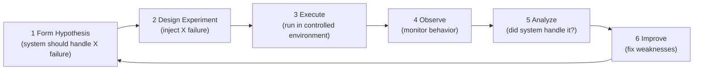

# Chaos Engineering

> **One-line definition:** Verifying system resilience by injecting failures in controlled ways : discovering weaknesses before they cause outages.

## Why This Is a Senior Skill

A mid-level engineer hopes the system handles failures. A senior engineer **proactively tests failure scenarios**, **validates resilience mechanisms**, and **builds confidence** that the system can withstand real-world failures.

Chaos engineering is not about breaking things randomly. It is a disciplined approach to verifying that your system behaves correctly when things go wrong.

## Chaos Engineering Principles



### Core principles

| Principle | Description |
|---|---|
| **Build a hypothesis** | Predict how the system should behave under failure |
| **Vary real-world events** | Inject failures that could actually happen (server crash, network partition, disk full) |
| **Run experiments in production** | Test in production (carefully) to catch issues that staging misses |
| **Automate experiments** | Run chaos experiments continuously, not just once |
| **Minimize blast radius** | Start small; limit impact to a small percentage of traffic |

## Types of Chaos Experiments

### Infrastructure failures

| Failure | What it tests | How to inject |
|---|---|---|
| **Server crash** | Auto-restart; failover | Kill process; terminate VM |
| **Network partition** | Network resilience; circuit breakers | Block network traffic between services |
| **Disk full** | Error handling; alerting | Fill disk to 95% capacity |
| **High CPU/memory** | Resource limits; auto-scaling | Stress CPU or memory |
| **Clock skew** | Time-dependent logic | Change system clock |

### Application failures

| Failure | What it tests | How to inject |
|---|---|---|
| **Slow dependencies** | Timeouts; fallbacks | Add latency to API calls |
| **Failed dependencies** | Circuit breakers; graceful degradation | Return errors from dependencies |
| **Database failure** | Retry logic; read replicas | Stop database; introduce latency |
| **Cache failure** | Fallback to database | Stop cache service |

### Human failures

| Failure | What it tests | How to inject |
|---|---|---|
| **Misconfiguration** | Configuration validation; alerting | Deploy bad configuration |
| **Bad deployment** | Rollback procedures; canary detection | Deploy buggy version |
| **Certificate expiry** | Certificate monitoring; auto-renewal | Use expired certificate |

## Chaos Engineering Tools

| Tool | Platform | Use case |
|---|---|---|
| **Chaos Monkey** | AWS | Randomly terminate instances |
| **Litmus** | Kubernetes | Pod, node, and network failures |
| **Chaos Mesh** | Kubernetes | Comprehensive Kubernetes chaos |
| **Gremlin** | Multi-platform | Infrastructure, network, application failures |
| **AWS Fault Injection Simulator** | AWS | Managed chaos engineering service |
| **Toxiproxy** | Network | Network conditions (latency, timeout, bandwidth) |

### Example: Chaos Mesh (Kubernetes)

```yaml
apiVersion: chaos-mesh.org/v1alpha1
kind: PodChaos
metadata:
  name: kill-payment-pod
  namespace: default
spec:
  action: pod-kill
  mode: one
  selector:
    namespaces:
      - default
    labelSelectors:
      app: payment-service
  duration: '30s'
  scheduler:
    cron: '0 10 * * *'  # Run daily at 10 AM
```

## Running a Chaos Experiment

### Step 1: Form hypothesis

**Example hypothesis:**
> "If we kill one payment-service pod, the remaining pods will handle traffic with no user impact (error rate <0.1%, latency <500ms)."

### Step 2: Design experiment

| Parameter | Value |
|---|---|
| **Failure type** | Kill one payment-service pod |
| **Blast radius** | 1 of 3 pods (33% capacity reduction) |
| **Duration** | 5 minutes |
| **Environment** | Production (during low-traffic period) |
| **Monitoring** | Error rate, latency, pod restart count |

### Step 3: Execute

1. Notify on-call team
2. Start monitoring dashboard
3. Inject failure (kill pod)
4. Monitor for 5 minutes

### Step 4: Observe

| Metric | Before | During | After |
|---|---|---|---|
| Error rate | 0.01% | 0.05% | 0.01% |
| p99 latency | 120ms | 180ms | 120ms |
| Pod count | 3 | 2 → 3 (auto-restart) | 3 |

### Step 5: Analyze

**Result:** Hypothesis confirmed. System handled pod failure gracefully.

**Observations:**
- Error rate increased slightly (0.01% → 0.05%) but remained below threshold
- Latency increased (120ms → 180ms) but remained acceptable
- Kubernetes auto-restarted the pod within 30 seconds

### Step 6: Improve

**If hypothesis failed:**
- Identify root cause (e.g., no load balancing, no health checks)
- Implement fix (add load balancer, configure health checks)
- Re-run experiment to verify fix

## Game Days

A game day is a planned event where the team runs chaos experiments together.

### Game day structure

| Phase | Duration | Activity |
|---|---|---|
| **Preparation** | 1 week | Define experiments; set up monitoring; brief team |
| **Execution** | 2-4 hours | Run experiments; observe system behavior |
| **Debrief** | 1 hour | Review results; identify improvements |
| **Follow-up** | 1-2 weeks | Implement fixes; re-test |

### Game day checklist

**Preparation:**
- [ ] Define 3-5 chaos experiments
- [ ] Set up monitoring dashboards
- [ ] Brief on-call team and stakeholders
- [ ] Prepare rollback plan
- [ ] Schedule during low-traffic period

**Execution:**
- [ ] Start recording (screen share or notes)
- [ ] Run experiments one at a time
- [ ] Monitor metrics and logs
- [ ] Stop if user impact exceeds threshold
- [ ] Document observations

**Debrief:**
- [ ] Review each experiment
- [ ] Identify weaknesses discovered
- [ ] Prioritize fixes
- [ ] Assign owners and due dates

## Chaos Engineering Maturity

| Level | Practice | Example |
|---|---|---|
| **Level 1: Manual** | Run experiments manually in staging | Kill a pod; observe behavior |
| **Level 2: Automated** | Automate experiments; run in production | Scheduled chaos experiments |
| **Level 3: Continuous** | Chaos as part of CI/CD; self-healing | Chaos experiments on every deployment |
| **Level 4: Chaos-first** | Design for failure from the start | Assume everything will fail |

## Chaos Engineering Anti-Patterns

| Anti-pattern | Problem | What to do instead |
|---|---|---|
| **Random breaking** | No hypothesis; no learning | Form hypothesis; measure results |
| **Testing only in staging** | Miss production-specific issues | Test in production (carefully) |
| **Large blast radius** | High risk of user impact | Start small; limit impact |
| **One-time experiments** | System changes; resilience degrades | Run experiments continuously |
| **Ignoring results** | No improvement; wasted effort | Analyze results; implement fixes |
| **No monitoring** | Can't observe system behavior | Instrument with metrics, logs, traces |

## Practical Exercise

**For a service you own:**

1. **Identify failure scenarios:** List 5 failures that could happen to your service (server crash, network partition, database failure, etc.)

2. **Form hypotheses:** For each failure, predict how the system should behave:
   - "If X fails, the system should Y"
   - Define success criteria (error rate <0.1%, latency <500ms)

3. **Run one experiment:**
   - Choose the lowest-risk failure
   - Inject the failure in staging (or production during low traffic)
   - Monitor metrics and observe behavior
   - Document results

4. **Analyze and improve:**
   - Did the system behave as expected?
   - If not, what's the root cause?
   - Implement a fix and re-test

**Bonus:** Plan a game day with your team. Define 3 experiments, run them, and debrief. Document lessons learned.

## Knowledge Connections

- [[02_SRE_Principles]] : chaos engineering validates SLIs and SLOs
- [[03_Observability]] : observability is essential for observing chaos experiments
- [[04_Incident_Response]] : chaos experiments test incident response procedures
- [[06_Production_Readiness]] : chaos engineering is part of production readiness
- [[01_Technical_Ownership/04_Production_Responsibility]] : production responsibility includes resilience testing
- [[software-engineering-note/06_Software_Engineering_Operations/Software Engineering Operations Overview]] : operations and resilience

## Key Takeaways

- Chaos engineering verifies resilience by injecting failures in controlled ways
- Form a hypothesis before each experiment: predict how the system should behave
- Start small (low blast radius); test in production carefully
- Automate chaos experiments; run them continuously, not just once
- Game days are planned events where the team runs chaos experiments together
- Chaos engineering maturity: manual → automated → continuous → chaos-first
- A senior engineer proactively tests failure scenarios, not just hopes the system handles them
