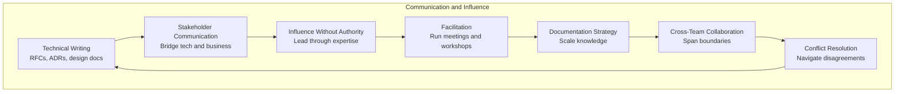
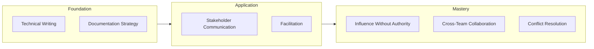

# Communication and Influence

> **Core competency:** Senior engineers lead through technical excellence and clear communication, not formal authority. They write documents that shape decisions, facilitate discussions that build alignment, and translate complex technical concepts for diverse audiences.

## Why This Matters

A senior engineer's impact extends far beyond their own code. They influence architecture decisions across teams, mentor engineers they don't manage, and drive technical initiatives that require cross-organizational buy-in. This requires:

- **Technical writing** that makes complex ideas accessible and actionable
- **Stakeholder communication** that bridges the gap between engineering and business
- **Influence without authority** to guide decisions and shape outcomes
- **Facilitation skills** to run effective meetings and workshops
- **Documentation strategy** that scales knowledge across the organization
- **Cross-team collaboration** to deliver initiatives that span organizational boundaries
- **Conflict resolution** to navigate disagreements constructively

## Capability Breakdown

## Topics

1. [[01_Technical_Writing|Technical Writing]]: RFCs, ADRs, design documents, and technical specifications
2. [[02_Stakeholder_Communication|Stakeholder Communication]]: Translating technical concepts for business audiences
3. [[03_Influence_Without_Authority|Influence Without Authority]]: Leading through expertise and trust
4. [[04_Facilitation|Facilitation]]: Running effective meetings, workshops, and decision processes
5. [[05_Documentation_Strategy|Documentation Strategy]]: What to document, when, and how to maintain it
6. [[06_Cross_Team_Collaboration|Cross-Team Collaboration]]: Working across organizational boundaries
7. [[07_Conflict_Resolution|Conflict Resolution]]: Navigating technical disagreements constructively

## Learning Path

**Recommended sequence:**
- Start with **Technical Writing** and **Documentation Strategy** (foundation)
- Progress to **Stakeholder Communication** and **Facilitation** (application)
- Master **Influence Without Authority**, **Cross-Team Collaboration**, and **Conflict Resolution** (mastery)

## Key Principles

### 1. Writing is a force multiplier
A well-written RFC or design document can influence hundreds of engineers and shape decisions for years. Writing scales your impact far beyond what you can achieve through meetings alone.

### 2. Influence is built on trust
Senior engineers influence through expertise, consistency, and reliability. They build credibility by delivering high-quality work, then leverage that trust to guide decisions.

### 3. Facilitation is not dictation
Effective facilitators guide discussions to better outcomes without imposing their own solutions. They ask the right questions, ensure all voices are heard, and help the group reach alignment.

### 4. Documentation is for future readers
Write for the person who will read this in 6 months (often your future self). Assume they have no context and need to understand the why, not just the what.

### 5. Conflict is an opportunity
Technical disagreements, when handled well, lead to better decisions. The goal is not to avoid conflict but to navigate it constructively.

## Practical Applications

- **Writing RFCs** for major technical changes
- **Creating ADRs** to document architectural decisions
- **Presenting to executives** and non-technical stakeholders
- **Facilitating design reviews** and architecture discussions
- **Leading cross-team initiatives** that span organizational boundaries
- **Resolving technical disagreements** between teams or engineers
- **Building consensus** on controversial technical decisions

## Success Indicators

A senior engineer demonstrates Communication and Influence when they:

- ✅ Write clear, actionable RFCs that drive technical decisions
- ✅ Create ADRs that explain the rationale behind architectural choices
- ✅ Translate complex technical concepts for business audiences
- ✅ Influence technical direction without formal authority
- ✅ Facilitate effective meetings that reach alignment
- ✅ Maintain documentation that scales knowledge across teams
- ✅ Lead cross-team initiatives successfully
- ✅ Navigate technical disagreements constructively
- ✅ Build consensus on controversial decisions

## Common Challenges

| Challenge | Description |
|-----------|-------------|
| **Writing for the wrong audience** | Using technical jargon with business stakeholders |
| **Influence without credibility** | Trying to lead without first establishing trust |
| **Poor facilitation** | Letting meetings devolve into unstructured debates |
| **Documentation debt** | Writing docs that quickly become outdated |
| **Avoiding conflict** | Suppressing disagreements instead of resolving them |
| **Working in isolation** | Failing to collaborate across team boundaries |

## Related Capabilities

- [[00_Senior_Software_Engineer_Overview#Leadership and Influence|Leadership and Influence]] (Senior Engineer Overview)
- [[01_Technical_Ownership#Accountability|Technical Ownership - Accountability]]
- [[02_Problem_Framing_and_Requirements#Stakeholder Management|Problem Framing - Stakeholder Management]]
- [[07_Mentoring_and_Team_Leadership|07_Mentoring_and_Team_Leadership]] (next capability)

## Summary

Communication and Influence is the capability that enables senior engineers to lead through technical excellence rather than formal authority. It encompasses technical writing, stakeholder communication, influence without authority, facilitation, documentation strategy, cross-team collaboration, and conflict resolution.

A senior engineer with strong Communication and Influence can write documents that shape decisions, facilitate discussions that build alignment, translate technical concepts for diverse audiences, maintain documentation that scales knowledge, lead cross-team initiatives, and navigate disagreements constructively. This capability multiplies their impact far beyond their own code.

**Key insight:** Senior engineers lead through expertise and trust, not title and authority. Their influence comes from consistently delivering high-quality work and using that credibility to guide decisions and shape outcomes.