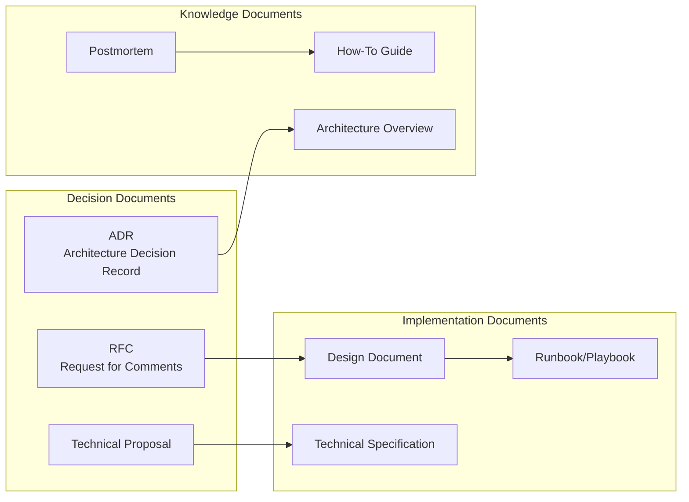
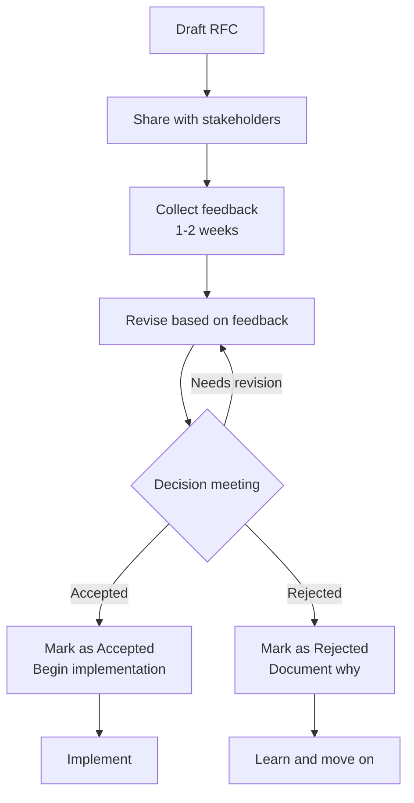
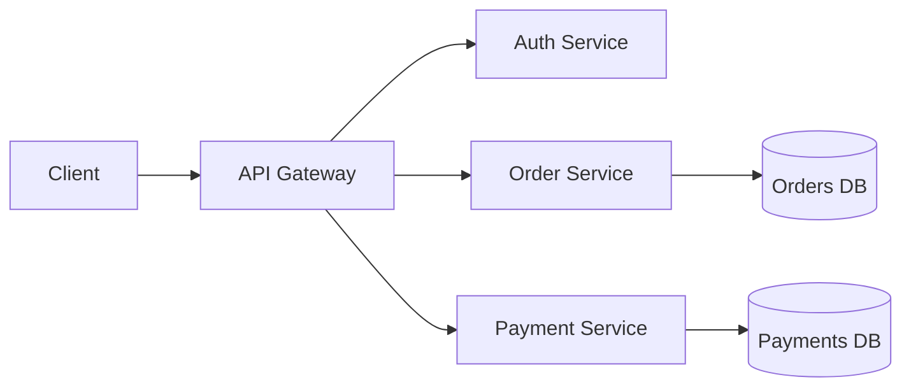
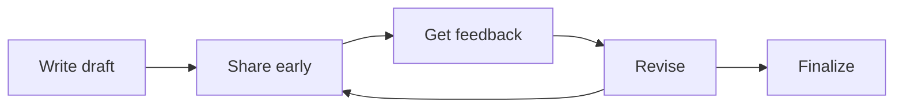

# Technical Writing

> **Core skill:** Senior engineers write documents that shape technical decisions, align teams, and scale knowledge across the organization.

## Why This Matters

Technical writing is a force multiplier. A well-written RFC can influence hundreds of engineers. A clear ADR prevents the same decision from being re-litigated months later. A good design document enables teams to build without constant clarification.

Senior engineers don't just write code. They write the documents that guide the code others write.

## Document Types



## RFC (Request for Comments)

### Purpose
Propose a significant technical change and gather feedback from stakeholders before implementation.

### When to write an RFC
- Changing a core architectural pattern
- Adopting a new technology or framework
- Modifying cross-team APIs or contracts
- Changing development processes or standards
- Any decision that affects multiple teams

### RFC Template

```markdown
# RFC: [Title]

**Author:** [Name]
**Status:** Draft | In Review | Accepted | Rejected | Superseded
**Created:** [Date]
**Last Updated:** [Date]

## Summary
[One paragraph summary of the proposal]

## Motivation
[Why is this change needed? What problem does it solve?]

## Proposed Solution
[Detailed description of the proposed approach]

### Design
[Architecture diagrams, data models, API contracts]

### Implementation Plan
[High-level implementation steps and timeline]

### Migration Strategy
[How to transition from current state to new state]

## Alternatives Considered
[Other approaches you evaluated and why you didn't choose them]

### Alternative 1: [Name]
[Description and why it was rejected]

### Alternative 2: [Name]
[Description and why it was rejected]

## Trade-offs
[Known downsides, risks, or costs of the proposed solution]

## Open Questions
[Unresolved questions that need discussion]

## References
[Links to related documents, research, or prior art]
```

### RFC Writing Best Practices

| Practice | Why it matters |
|----------|----------------|
| **Start with the problem** | Don't jump to solutions; explain why the change is needed |
| **Be specific** | Vague proposals get vague feedback |
| **Include diagrams** | Visual representations clarify complex ideas |
| **Address alternatives** | Shows you've thought deeply about the problem |
| **Acknowledge trade-offs** | Builds credibility; shows you're not ignoring downsides |
| **Keep it focused** | One RFC = one decision; don't bundle unrelated changes |

### RFC Review Process



## ADR (Architecture Decision Record)

### Purpose
Document a specific architectural decision, including the context, options considered, and rationale.

### When to write an ADR
- Choosing a technology or framework
- Deciding on an architectural pattern
- Making a trade-off between competing concerns
- Any decision that will affect future development

### ADR Template

```markdown
# ADR-[Number]: [Title]

**Date:** [Date]
**Status:** Proposed | Accepted | Deprecated | Superseded by ADR-[X]

## Context
[What is the issue or situation that motivates this decision?]

## Decision
[What is the change that we're proposing and/or doing?]

## Consequences
[What becomes easier or more difficult to do because of this change?]

## Options Considered

### Option 1: [Name]
**Pros:**
- [Benefit]

**Cons:**
- [Drawback]

### Option 2: [Name]
**Pros:**
- [Benefit]

**Cons:**
- [Drawback]

### Option 3: [Name] (Chosen)
**Pros:**
- [Benefit]

**Cons:**
- [Drawback]

**Why chosen:**
[Rationale for selecting this option]
```

### ADR Best Practices

| Practice | Why it matters |
|----------|----------------|
| **One decision per ADR** | Easier to find and reference |
| **Number sequentially** | ADR-001, ADR-002, etc. |
| **Keep it short** | 1-2 pages max; focus on the decision |
| **Write for future readers** | Assume they have no context |
| **Update status** | Mark as deprecated or superseded when relevant |
| **Store in version control** | ADRs should evolve with the codebase |

### ADR Example

```markdown
# ADR-007: Use PostgreSQL for Order Service

**Date:** 2026-08-05
**Status:** Accepted

## Context
The Order Service needs a database that supports:
- Complex queries (joins, aggregations)
- ACID transactions (financial data)
- High write throughput (1000 orders/minute at peak)
- Strong consistency guarantees

## Decision
We will use PostgreSQL 15 as the primary database for the Order Service.

## Consequences
**Easier:**
- Complex reporting queries are straightforward
- Transaction support is built-in and reliable
- Strong ecosystem of tools and expertise

**More difficult:**
- Horizontal scaling requires additional complexity (read replicas, sharding)
- Operational overhead compared to managed NoSQL solutions

## Options Considered

### Option 1: MongoDB
**Pros:**
- Flexible schema
- Easy horizontal scaling

**Cons:**
- No native joins (requires application-level logic)
- Weaker consistency guarantees
- Complex transactions require workarounds

### Option 2: PostgreSQL (Chosen)
**Pros:**
- Full ACID compliance
- Powerful query language (SQL)
- Strong consistency
- Mature ecosystem

**Cons:**
- Vertical scaling limits
- Requires read replicas for horizontal read scaling

**Why chosen:**
The Order Service's requirements for complex queries and strong consistency outweigh the scaling challenges. PostgreSQL's ACID guarantees are essential for financial data. We will address scaling with read replicas and careful indexing.
```

## Design Documents

### Purpose
Provide detailed technical specifications for a feature or system before implementation begins.

### Design Document Template

```markdown
# Design Document: [Feature Name]

**Author:** [Name]
**Status:** Draft | In Review | Approved
**Created:** [Date]

## Overview
[High-level description of what we're building]

## Goals
- [Goal 1]
- [Goal 2]

## Non-Goals
- [What we're explicitly NOT doing]

## Background
[Context, related work, prior attempts]

## Design

### Architecture
[System architecture diagram and explanation]

### Data Model
[Database schema, data structures]

### API Design
[API endpoints, request/response formats]

### User Interface
[UI mockups, user flows]

## Implementation Details

### Component 1: [Name]
[Detailed design for this component]

### Component 2: [Name]
[Detailed design for this component]

## Performance Considerations
[Expected load, performance targets, optimization strategies]

## Security Considerations
[Authentication, authorization, data protection]

## Testing Strategy
[How we'll verify correctness and performance]

## Rollout Plan
[How we'll deploy this to production]

## Open Questions
[Unresolved issues that need discussion]
```

## Technical Writing Best Practices

### 1. Write for your audience

| Audience | Focus on | Avoid |
|----------|----------|-------|
| **Engineers** | Technical details, trade-offs, implementation | High-level fluff |
| **Managers** | Business impact, timeline, risks | Code snippets, jargon |
| **Executives** | Strategic value, ROI, competitive advantage | Technical minutiae |
| **Future self** | Context, rationale, assumptions | Assuming you'll remember |

### 2. Structure for skimmability

- Use clear headings and subheadings
- Start sections with a summary sentence
- Use bullet points for lists
- Include diagrams for complex ideas
- Bold key terms and concepts

### 3. Be precise and concrete

**Vague:**
> "The system should be fast."

**Precise:**
> "The API must respond within 200ms at the 95th percentile under a load of 1000 requests per second."

### 4. Show, don't just tell

**Abstract:**
> "We'll use a microservices architecture."

**Concrete:**


### 5. Iterate based on feedback



## Common Mistakes

| Mistake | Problem | Solution |
|---------|---------|----------|
| **Writing too late** | Building before designing | Write design doc before coding |
| **Writing too much** | Readers don't finish | Keep it concise; use appendices |
| **Writing for yourself** | Others can't follow | Write for future readers |
| **Ignoring feedback** | Missing important concerns | Treat feedback as a gift |
| **Not updating docs** | Docs become stale | Review and update regularly |
| **Skipping alternatives** | Decision seems arbitrary | Always document alternatives |

## Practical Applications

### Writing an RFC

**Scenario:** Your team wants to migrate from a monolith to microservices.

**RFC outline:**
```markdown
# RFC: Migrate Order Service to Microservices

## Summary
Split the Order Service monolith into three microservices: Order Management, Inventory, and Shipping.

## Motivation
The current monolith is slowing development:
- Deployment takes 45 minutes
- Teams block each other on releases
- Scaling requires scaling the entire application

## Proposed Solution
[Detailed architecture, service boundaries, data ownership]

## Alternatives Considered
1. Stay with monolith (rejected: doesn't solve scaling issues)
2. Modular monolith (rejected: still requires coordinated deployments)

## Trade-offs
- Increased operational complexity (more services to monitor)
- Network latency between services
- Distributed transaction challenges
```

### Writing an ADR

**Scenario:** Your team chose React over Vue for a new frontend.

**ADR:**
```markdown
# ADR-012: Use React for Admin Dashboard

**Status:** Accepted

## Context
Building a new admin dashboard with complex interactive requirements.

## Decision
Use React 18 with TypeScript.

## Consequences
Easier: Large talent pool, mature ecosystem, strong TypeScript support.
More difficult: Larger bundle size than Vue, more boilerplate.

## Options Considered
### Vue 3
Pros: Smaller bundle, simpler API
Cons: Smaller talent pool, fewer enterprise examples

### React 18 (Chosen)
Pros: Large ecosystem, strong TypeScript support, many senior engineers
Cons: Larger bundle, more complex state management

Why chosen: Team expertise and hiring pool outweigh bundle size concerns.
```

## Success Indicators

- ✅ RFCs lead to clear decisions and aligned implementation
- ✅ ADRs are referenced when similar decisions arise
- ✅ Design documents enable parallel work across teams
- ✅ Documentation is updated as systems evolve
- ✅ Engineers ask for your input on their technical documents
- ✅ Your documents are shared as examples of good practice

## Related Topics

- [[02_Stakeholder_Communication|Stakeholder Communication]]: Adapting technical writing for non-technical audiences
- [[05_Documentation_Strategy|Documentation Strategy]]: What to document and when
- [[03_Architecture_and_Design_Judgment/04_Architecture_Decision_Records|Architecture Decision Records]]: ADRs in the context of architecture

## Summary

Technical writing is a core capability for senior engineers. RFCs propose changes and gather feedback. ADRs document decisions and their rationale. Design documents specify implementation details. Good technical writing is precise, concrete, structured for skimmability, and written for future readers. It scales your influence far beyond what you can achieve through code alone.