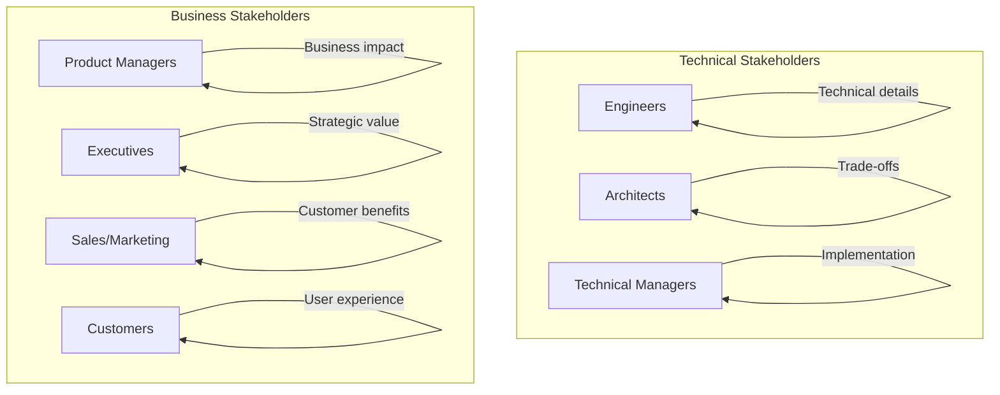
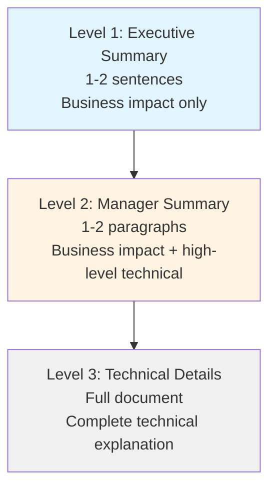

# Stakeholder Communication

> **Core skill:** Senior engineers translate complex technical concepts for business audiences and bridge the gap between engineering and stakeholders.

## Why This Matters

Engineering decisions have business impact. Technical debt affects feature velocity. Architecture choices determine scalability. Security vulnerabilities create business risk. Senior engineers must communicate these connections clearly to stakeholders who don't have technical backgrounds.

If you can't explain why a technical decision matters to the business, you can't get the resources needed to implement it.

## Stakeholder Types



## Communication Framework

### The Translation Matrix

| Technical Concept | Business Translation | Example |
|-------------------|---------------------|---------|
| **Technical debt** | "Slows down feature development" | "We're spending 30% of our time fixing bugs instead of building features" |
| **Refactoring** | "Making future changes faster and safer" | "This work will reduce bug rate by 40% and cut development time in half" |
| **Scalability** | "Handling more users without slowing down" | "This lets us support 10x more customers without performance issues" |
| **Security vulnerability** | "Risk of data breach and financial loss" | "This could expose customer data and result in $2M in fines" |
| **Microservices** | "Enables faster, independent releases" | "Teams can release features without coordinating with other teams" |
| **CI/CD pipeline** | "Faster, safer releases" | "We can release features daily instead of monthly, with lower risk" |

### The Three-Level Communication Model



**Example: Database migration**

**Level 1 (Executive):**
> "We're upgrading our database to support 10x more users and reduce costs by $50K/year. Migration will take 6 weeks with zero downtime."

**Level 2 (Manager):**
> "We're migrating from MySQL to PostgreSQL to improve query performance and reduce licensing costs. The migration will take 6 weeks, during which we'll maintain full system availability. This enables our Q4 growth targets and saves $50K annually."

**Level 3 (Technical):**
> "We're migrating from MySQL 8.0 to PostgreSQL 15 to leverage advanced indexing, JSON support, and better query optimization. The migration plan includes dual-write phase, data validation, and gradual cutover with rollback capability. Expected benefits: 3x query performance, $50K/year licensing savings, and support for complex analytical queries."

## Communication Strategies by Audience

### Product Managers

**Focus on:**
- Feature velocity and development timeline
- User impact and experience
- Risk and trade-offs
- Dependencies and blockers

**Example:**
> "The authentication refactor will take 3 weeks. During this time, we can't work on the new login features. However, this work will reduce authentication bugs by 80% and make future login features 2x faster to build. I recommend we do this now before we add more complexity."

### Executives

**Focus on:**
- Business value and ROI
- Strategic alignment
- Risk and mitigation
- Timeline and resources

**Example:**
> "Investing $200K in platform modernization will enable us to launch in 3 new markets next year, generating $2M in additional revenue. Without this investment, we'll be limited to our current market and face increasing maintenance costs of $100K/year."

### Sales and Marketing

**Focus on:**
- Customer benefits
- Competitive advantages
- Release timelines
- Technical capabilities for demos

**Example:**
> "The new real-time analytics feature will be ready for demo in 4 weeks. It processes data 10x faster than competitors and supports custom dashboards. This is a strong differentiator for enterprise customers."

### Customers

**Focus on:**
- User benefits
- Ease of use
- Reliability and performance
- What's new or improved

**Example:**
> "We've improved search speed by 5x. You'll now see results instantly as you type, and the new filters help you find exactly what you need faster."

## Communication Techniques

### 1. Use analogies

**Technical concept:** Load balancing
**Analogy:** "Like having multiple checkout lanes at a grocery store. Customers go to the shortest line, so everyone gets served faster."

**Technical concept:** Caching
**Analogy:** "Like keeping frequently used items on your desk instead of walking to the filing cabinet every time."

**Technical concept:** Microservices
**Analogy:** "Like having specialized restaurants (pizza place, sushi bar) instead of one restaurant that tries to serve everything."

### 2. Lead with impact

**Weak:**
> "We need to upgrade our Node.js version from 14 to 18."

**Strong:**
> "To avoid a security breach that could cost us $2M in fines, we need to upgrade Node.js. This also enables 20% faster performance."

### 3. Quantify when possible

**Vague:**
> "The system is slow."

**Quantified:**
> "The checkout page takes 8 seconds to load, which is 4x slower than industry standard. This causes 15% of users to abandon their cart, costing us $50K/month in lost revenue."

### 4. Use the "So What?" test

For every technical detail, ask: "So what? Why does this matter to the business?"

**Technical:** "We're implementing connection pooling."
**So what?** "This reduces database load by 60%."
**So what?** "This means we can handle 3x more users without buying more servers."
**So what?** "This saves us $100K in infrastructure costs this year."

**Final communication:** "We're implementing connection pooling, which will save us $100K in infrastructure costs this year by allowing us to handle 3x more users without additional servers."

### 5. Anticipate questions

**Before presenting, prepare answers to:**
- How much will this cost?
- How long will it take?
- What are the risks?
- What happens if we don't do this?
- What are the alternatives?
- How will we measure success?

## Common Scenarios

### Scenario 1: Explaining technical debt to executives

**Situation:** You need to convince executives to allocate 20% of engineering time to technical debt.

**Weak approach:**
> "We have a lot of technical debt that's making development slow. We need time to refactor."

**Strong approach:**
> "Currently, 40% of our development time is spent fixing bugs and working around legacy code. This is slowing feature delivery and increasing our bug rate. By dedicating 20% of engineering time to technical debt reduction, we'll reduce bug-fixing time to 15%, effectively increasing our feature velocity by 25%. This means we can deliver the Q4 roadmap on time instead of cutting features. The ROI is 3x: for every week we invest, we save 3 weeks of future development time."

### Scenario 2: Explaining a security vulnerability to product managers

**Situation:** A critical security vulnerability requires immediate patching, which will delay the feature release.

**Weak approach:**
> "We found a security bug in the authentication library. We need to patch it before we release."

**Strong approach:**
> "We discovered a critical security vulnerability that could allow attackers to access user accounts. If exploited, this could result in a data breach affecting 50,000 users, regulatory fines of $2M, and severe reputational damage. We need to delay the feature release by 3 days to patch this vulnerability. I recommend we announce the delay as 'additional security testing' to maintain customer trust. The alternative: releasing with the vulnerability and risking a breach that would cost us 100x more than a 3-day delay."

### Scenario 3: Explaining architecture choices to non-technical stakeholders

**Situation:** You chose a more expensive architecture because it's more scalable.

**Weak approach:**
> "We're using microservices instead of a monolith because it's a better architecture."

**Strong approach:**
> "We're building the system as separate services instead of one large application. This costs 20% more upfront but enables us to:
> - Launch features 3x faster (teams work independently)
> - Handle 10x more users without rebuilding
> - Fix problems in one area without affecting the entire system
> 
> The alternative (monolith) would be cheaper now but would require a complete rebuild in 18 months when we hit 100K users. This approach saves us $500K in rebuild costs and 6 months of development time."

## Communication Channels

| Channel | Best for | Tips |
|---------|----------|------|
| **Email** | Formal decisions, documentation, async communication | Use clear subject lines, bullet points, TL;DR at top |
| **Slack/Teams** | Quick questions, informal updates, team coordination | Keep it short, use threads for discussions |
| **Meetings** | Complex discussions, alignment, decision-making | Send agenda in advance, end with action items |
| **Presentations** | Executives, large audiences, formal proposals | Use visuals, limit text, focus on key messages |
| **Documents** | Detailed specifications, RFCs, design docs | Structure for skimmability, use headings and bullets |
| **One-on-ones** | Sensitive topics, feedback, relationship building | Listen more than you speak, ask open questions |

## Building Credibility

### 1. Deliver consistently
Stakeholders trust engineers who reliably deliver what they promise. Build a track record of accurate estimates and successful deployments.

### 2. Be honest about uncertainty
**Weak:** "This will take 2 weeks." (when you're not sure)
**Strong:** "My best estimate is 2-3 weeks, but there's uncertainty around the database migration. I'll have a more accurate estimate after the first week."

### 3. Admit mistakes quickly
**Weak:** Hiding a bug for 3 days while trying to fix it
**Strong:** "We discovered a bug in production. Here's what happened, what we're doing to fix it, and how we'll prevent it in the future."

### 4. Explain trade-offs, not just decisions
**Weak:** "We're using AWS."
**Strong:** "We chose AWS over Azure and GCP because it has the best support for our use case, even though it's 10% more expensive."

### 5. Follow up on commitments
After a meeting, send a summary with action items and owners. Follow up on deadlines. This builds trust that you're reliable.

## Practical Applications

### Stakeholder Communication Checklist

Before communicating with stakeholders, verify:

- [ ] I've identified the audience and their priorities
- [ ] I've translated technical concepts to business impact
- [ ] I've quantified the value or risk
- [ ] I've prepared for likely questions
- [ ] I've chosen the right communication channel
- [ ] I've included a clear call to action
- [ ] I've followed up on previous commitments

### Communication Planning Template

```markdown
## Communication Plan: [Project/Decision]

### Stakeholders
| Stakeholder | Priority | Concerns | Preferred Channel |
|-------------|----------|----------|-------------------|
| VP Engineering | High | Timeline, resources | Weekly meeting |
| Product Manager | High | Feature impact | Daily Slack |
| Customers | Medium | User experience | Email update |

### Key Messages
1. [Message 1 - what they need to know]
2. [Message 2 - why it matters to them]
3. [Message 3 - what action is needed]

### Communication Schedule
| When | What | Who | Channel |
|------|------|-----|---------|
| Week 1 | Project kickoff | All stakeholders | Meeting |
| Week 2 | Progress update | PM, VP | Email |
| Week 4 | Launch announcement | All | Email + Slack |
```

## Success Indicators

- ✅ Stakeholders understand the business impact of technical decisions
- ✅ You're invited to strategic planning meetings
- ✅ Product managers ask for your input on roadmap decisions
- ✅ Executives trust your estimates and timelines
- ✅ Non-technical stakeholders can explain your work to others
- ✅ You successfully secure resources for technical initiatives

## Common Mistakes

| Mistake | Problem | Solution |
|---------|---------|----------|
| **Using jargon** | Stakeholders don't understand | Translate to business terms |
| **Focusing on implementation** | Stakeholders don't care how | Focus on outcomes and impact |
| **Underestimating time** | Loses credibility when late | Add buffer, communicate uncertainty |
| **Not following up** | Stakeholders feel ignored | Send updates, close the loop |
| **Hiding bad news** | Problems get worse | Communicate early, propose solutions |
| **One-size-fits-all** | Different stakeholders need different info | Tailor message to audience |

## Related Topics

- [[01_Technical_Writing|Technical Writing]]: Creating documents for technical audiences
- [[03_Influence_Without_Authority|Influence Without Authority]]: Using communication to drive decisions
- [[04_Facilitation|Facilitation]]: Running meetings with stakeholders
- [[07_Conflict_Resolution|Conflict Resolution]]: Handling disagreements with stakeholders

## Summary

Stakeholder communication is the ability to translate technical concepts into business impact. Senior engineers use the three-level model (executive summary, manager summary, technical details), lead with impact, quantify value, and tailor their message to the audience. They build credibility through consistent delivery, honest communication about uncertainty, and reliable follow-up. Effective stakeholder communication enables engineers to secure resources, align teams, and drive technical initiatives that create business value.