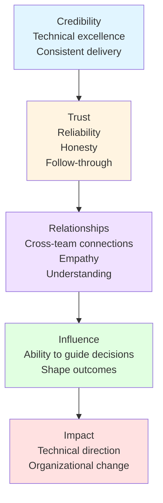

# Influence Without Authority

> **Core skill:** Senior engineers lead through expertise and trust, not title and authority. They guide decisions and shape outcomes by building credibility and leveraging relationships.

## Why This Matters

Senior engineers rarely have formal authority over the people they need to influence. They don't manage the engineers on other teams. They don't control the product roadmap. They don't set company strategy. Yet they must influence all of these to drive technical excellence.

Influence without authority is the defining capability of senior engineers. It's what separates engineers who write good code from engineers who shape the direction of entire organizations.

## The Influence Model



## Building Credibility

### 1. Deliver consistently

**What it means:**
- Meet commitments and deadlines
- Write high-quality code that others want to use
- Follow through on promises

**Why it matters:**
People listen to engineers who reliably deliver. If you say something will work, and it does, people trust your judgment on the next decision.

**How to build it:**
- Under-promise and over-deliver
- Be honest about uncertainty and risks
- Communicate early when things go off track
- Document your decisions and their outcomes

### 2. Demonstrate technical depth

**What it means:**
- Understand systems at multiple levels (code, architecture, infrastructure)
- Stay current with relevant technologies
- Solve complex problems others can't

**Why it matters:**
Technical expertise gives your opinions weight. When you say "this architecture won't scale," people listen because you've demonstrated you understand scaling.

**How to build it:**
- Go deep on your domain; become the go-to expert
- Read code outside your team; understand the broader system
- Contribute to technical discussions across teams
- Write technical documents (RFCs, ADRs) that demonstrate your thinking

### 3. Show business understanding

**What it means:**
- Understand how your work creates business value
- Speak the language of business (ROI, risk, velocity)
- Align technical decisions with business goals

**Why it matters:**
Engineers who understand business impact can influence product and strategy decisions. They're seen as partners, not just implementers.

**How to build it:**
- Ask product managers about business goals and metrics
- Quantify the business impact of your technical work
- Participate in business planning and roadmap discussions
- Translate technical decisions into business outcomes

## Building Trust

### 1. Be honest about uncertainty

**Weak:**
> "This will definitely take 2 weeks." (when you're not sure)

**Strong:**
> "My best estimate is 2-3 weeks. There's uncertainty around the database migration that could add a week. I'll have a more accurate estimate after the first week."

**Why it matters:**
Honesty about uncertainty builds trust. People know you won't hide bad news or make unrealistic promises.

### 2. Admit mistakes quickly

**Weak:**
Hiding a bug for days while trying to fix it

**Strong:**
> "I introduced a bug in yesterday's deploy. Here's what happened, what I'm doing to fix it, and how I'll prevent it in the future."

**Why it matters:**
Admitting mistakes shows integrity. People trust engineers who are transparent about failures and focused on learning.

### 3. Give credit generously

**Weak:**
Taking credit for team success

**Strong:**
> "The team did excellent work on this. Alice's optimization reduced latency by 40%, and Bob's testing caught critical bugs."

**Why it matters:**
Generosity with credit builds loyalty and trust. People want to work with engineers who celebrate others' contributions.

### 4. Follow through on commitments

**Weak:**
Promising to review a design doc and never doing it

**Strong:**
Reviewing the doc within the promised timeframe, or communicating early if you're delayed

**Why it matters:**
Reliability builds trust. People know they can count on you.

## Building Relationships

### 1. Understand others' goals and constraints

**Ask questions:**
- "What are your team's priorities this quarter?"
- "What constraints are you working under?"
- "What would make this project successful for you?"

**Why it matters:**
You can't influence people if you don't understand what they care about. Alignment requires understanding their goals, not just yours.

### 2. Help others succeed

**Examples:**
- Review a junior engineer's design doc and provide thoughtful feedback
- Share a tool or technique that helped your team with another team
- Offer to pair program on a difficult problem

**Why it matters:**
Helping others builds goodwill and reciprocity. When you need their support later, they're more likely to help.

### 3. Build cross-team connections

**Strategies:**
- Attend other teams' demos and ask questions
- Participate in cross-team working groups
- Volunteer for company-wide initiatives
- Have coffee/lunch with engineers on other teams

**Why it matters:**
Influence requires relationships across the organization. You need people who know you, trust you, and are willing to listen to your ideas.

## Influence Techniques

### 1. Lead with data

**Weak:**
> "I think we should use microservices."

**Strong:**
> "Based on our analysis, microservices would reduce deployment time by 70% and enable teams to release independently. Here's the data from our proof of concept."

**Why it works:**
Data is harder to argue with than opinions. It shifts the conversation from "what I think" to "what the evidence shows."

### 2. Use the "Yes, and..." technique

**Situation:** Someone proposes an idea you disagree with.

**Weak:**
> "That won't work because..."

**Strong:**
> "I see the value in that approach, and I'm concerned about scalability. What if we also considered..."

**Why it works:**
"Yes, and..." acknowledges their idea while introducing your concern. It's collaborative rather than confrontational.

### 3. Ask questions instead of making statements

**Weak:**
> "This architecture is too complex."

**Strong:**
> "How will we handle debugging across all these services? What's our strategy for monitoring distributed transactions?"

**Why it works:**
Questions guide people to discover problems themselves. They're more persuasive than statements because people convince themselves.

### 4. Find allies before the meeting

**Strategy:**
Before a big decision meeting, have one-on-one conversations with key stakeholders. Understand their concerns, address objections, and build support.

**Why it works:**
Decisions are often made before the meeting. If you've already addressed concerns and built alignment, the meeting is just confirmation.

### 5. Frame decisions around shared goals

**Weak:**
> "My team needs this infrastructure upgrade."

**Strong:**
> "This infrastructure upgrade will enable both our teams to hit our Q4 reliability targets. Here's how it helps your team..."

**Why it works:**
People are more likely to support decisions that help them achieve their goals. Frame your proposal in terms of shared success.

### 6. Use social proof

**Weak:**
> "I think we should adopt this practice."

**Strong:**
> "Netflix, Google, and Amazon all use this approach for similar problems. Here's a case study from Netflix showing 40% improvement."

**Why it works:**
People are influenced by what others (especially respected companies) are doing. Social proof reduces perceived risk.

### 7. Start small and build momentum

**Strategy:**
Instead of proposing a big change, start with a small proof of concept. Demonstrate success, then expand.

**Example:**
> "Let's try this approach on one service first. If it works, we can roll it out to other services."

**Why it works:**
Small experiments are low-risk and easier to approve. Success builds momentum for larger changes.

## Common Scenarios

### Scenario 1: Influencing architecture decisions

**Situation:** You believe the team should adopt event-driven architecture, but others prefer request-response.

**Influence strategy:**
1. **Build credibility:** Research event-driven architecture, understand trade-offs, identify use cases
2. **Write an RFC:** Document the proposal with data, alternatives, and trade-offs
3. **Find allies:** Talk to engineers who've experienced the pain of the current architecture
4. **Start small:** Propose a proof of concept for one service
5. **Demonstrate success:** Share results, get testimonials from the team
6. **Expand gradually:** Roll out to more services based on success

### Scenario 2: Influencing product decisions

**Situation:** Product wants to add a feature that will create significant technical debt.

**Influence strategy:**
1. **Understand their goals:** Why do they want this feature? What business problem does it solve?
2. **Quantify the cost:** How much technical debt will this create? What's the long-term impact?
3. **Propose alternatives:** Can we achieve the business goal with less technical debt?
4. **Frame around shared goals:** "We both want to deliver features quickly. This approach will slow us down in 6 months."
5. **Negotiate:** "If we must do this, can we allocate 20% of next sprint to pay down the debt?"

### Scenario 3: Influencing process changes

**Situation:** You want to implement code reviews, but the team is resistant.

**Influence strategy:**
1. **Understand resistance:** Why are they resistant? (Time pressure? Fear of criticism?)
2. **Address concerns:** "Code reviews take 30 minutes but catch bugs that would take 4 hours to fix in production"
3. **Start small:** "Let's try code reviews for critical paths only"
4. **Make it easy:** Provide a code review checklist, set expectations (focus on bugs, not style)
5. **Show results:** Track bugs caught in review vs. production, share the data
6. **Expand gradually:** Once the team sees value, expand to all code

## Influence Anti-Patterns

| Anti-Pattern | Problem | Better Approach |
|--------------|---------|-----------------|
| **Mandating** | "We're doing this because I said so" | Explain rationale, build consensus |
| **Manipulating** | Withholding information to get your way | Be transparent, build trust |
| **Escalating** | Going over someone's head | Work through the person first |
| **Complaining** | Venting without proposing solutions | Identify problems, propose solutions |
| **Isolating** | Working alone, then surprising others | Involve others early, build alignment |
| **Forcing** | Using authority you don't have | Build influence through expertise and trust |

## Measuring Your Influence

### Signs you have influence:
- ✅ People ask for your opinion before making decisions
- ✅ Your RFCs and proposals are accepted
- ✅ Other teams adopt practices you've introduced
- ✅ You're invited to strategic planning meetings
- ✅ Engineers come to you for advice
- ✅ Your code reviews are sought after
- ✅ You can get things done without formal authority

### Signs you need to build more influence:
- ❌ Your proposals are frequently rejected
- ❌ People don't ask for your input
- ❌ You're not invited to important meetings
- ❌ Your code reviews are ignored
- ❌ You need to escalate to get things done
- ❌ Other teams don't adopt your suggestions

## Practical Applications

### Influence Building Plan

```markdown
## Influence Building Plan: [Goal]

### Current State
- Who needs to be influenced? [Stakeholders]
- What's my current level of influence? [Low/Medium/High]
- What's blocking influence? [Lack of credibility, trust, relationships]

### Action Plan

#### Build Credibility
- [ ] Deliver [specific project] successfully
- [ ] Write RFC for [technical decision]
- [ ] Present at [team/company meeting]

#### Build Trust
- [ ] Follow through on [specific commitment]
- [ ] Be transparent about [uncertainty/risk]
- [ ] Give credit to [specific people]

#### Build Relationships
- [ ] Have coffee with [stakeholder 1]
- [ ] Help [stakeholder 2] with [their problem]
- [ ] Attend [other team's meeting]

#### Influence Activities
- [ ] Write RFC/proposal for [decision]
- [ ] Have one-on-ones with [key stakeholders]
- [ ] Present data at [meeting]
- [ ] Start proof of concept for [initiative]

### Success Metrics
- [ ] Proposal accepted
- [ ] Stakeholders ask for my input
- [ ] Other teams adopt the practice
```

## Related Topics

- [[01_Technical_Writing|Technical Writing]]: Using documents to influence decisions
- [[02_Stakeholder_Communication|Stakeholder Communication]]: Communicating to build alignment
- [[04_Facilitation|Facilitation]]: Running meetings that build consensus
- [[07_Conflict_Resolution|Conflict Resolution]]: Handling disagreements constructively

## Summary

Influence without authority is the ability to guide decisions and shape outcomes through expertise and trust, not title and power. Senior engineers build credibility through consistent delivery and technical depth, build trust through honesty and reliability, and build relationships through empathy and helpfulness. They influence by leading with data, asking questions, finding allies, and framing decisions around shared goals. This capability enables them to drive technical excellence across teams and organizations they don't manage.