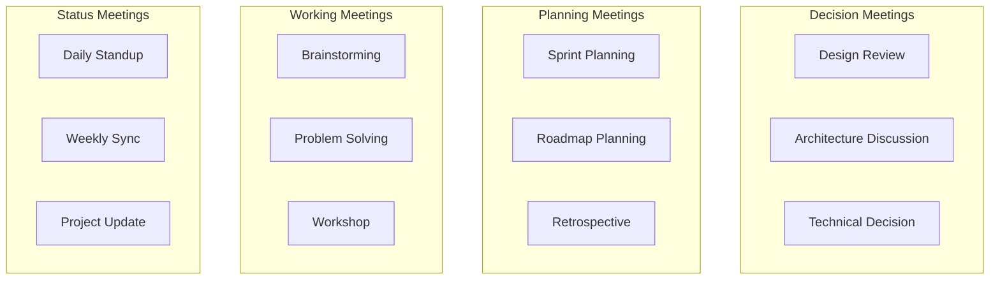

# Facilitation

> **Core skill:** Senior engineers run effective meetings and workshops that build alignment, make decisions, and drive action.

## Why This Matters

Meetings are where decisions happen. Poorly facilitated meetings waste time, create confusion, and fail to reach alignment. Well-facilitated meetings build consensus, make clear decisions, and drive action.

Senior engineers don't just participate in meetings. They facilitate them to better outcomes.

## Meeting Types



## Facilitation Framework

### Before the Meeting

#### 1. Define the purpose

**Ask:** What decision or outcome do we need from this meeting?

**Examples:**
- ❌ Vague: "Discuss the architecture"
- ✅ Clear: "Decide whether to use microservices or monolith for the new service"

#### 2. Create an agenda

**Template:**
```markdown
## Meeting: [Title]

**Date:** [Date/Time]
**Duration:** [30/60/90 minutes]
**Facilitator:** [Name]
**Attendees:** [Names or roles]

### Purpose
[One sentence describing the desired outcome]

### Pre-work
[What attendees should read/prepare before the meeting]

### Agenda
1. [5 min] Context and background - [Presenter]
2. [15 min] Present options - [Presenter]
3. [20 min] Discussion and questions - [All]
4. [15 min] Decision - [All]
5. [5 min] Next steps and action items - [Facilitator]

### Decision Criteria
[How we'll evaluate the options]

### Parking Lot
[Place to capture off-topic items for later discussion]
```

#### 3. Send the agenda in advance

**When:**
- Simple decisions: 24 hours before
- Complex decisions: 3-5 days before
- Strategic decisions: 1 week before

**Why:** Gives people time to prepare, think, and gather input.

#### 4. Invite the right people

**Decision meetings:**
- Decision maker (who has authority to decide)
- Subject matter experts (who understand the options)
- Stakeholders (who are affected by the decision)
- Implementers (who will execute the decision)

**Avoid:**
- Too many people (>8 becomes unwieldy)
- Missing key stakeholders (leads to re-litigation later)
- Optional attendees (they either commit or don't attend)

### During the Meeting

#### 1. Start on time and set expectations

**Opening script:**
> "Thanks for joining. The purpose of this meeting is to [purpose]. We have [X] minutes. Here's the agenda. Let's start with [first item]."

**Ground rules (for longer meetings):**
- One conversation at a time
- Respect time limits
- Focus on the decision, not implementation details
- Capture off-topic items in the parking lot

#### 2. Manage the discussion

**Techniques:**

**Timeboxing:**
> "We have 15 minutes for this discussion. Let's start."

**Parking off-topic items:**
> "That's a good point, but it's outside our scope today. Let's add it to the parking lot and revisit later."

**Drawing out quiet participants:**
> "Sarah, you've worked on similar systems. What's your perspective?"

**Managing dominant participants:**
> "Thanks for that input. Let's hear from others who haven't spoken yet."

**Refocusing:**
> "We're getting into implementation details. Let's step back and focus on the decision: which approach should we take?"

#### 3. Ensure all voices are heard

**Round-robin:**
> "Let's go around the table. Each person share one concern or question."

**Silent brainstorming:**
> "Take 5 minutes to write down your thoughts, then we'll share."

**Polling:**
> "Let's do a quick poll. How many prefer option A? Option B?"

#### 4. Guide toward a decision

**Check for alignment:**
> "It sounds like we're converging on option A. Does anyone have strong objections?"

**Test the decision:**
> "If we go with option A, can everyone support it and commit to making it work?"

**Handle disagreement:**
> "We have two perspectives. Let's list the pros and cons of each, then decide."

**Make the decision:**
> "Based on our discussion, we're going with option A. The rationale is [reasons]. Does anyone disagree?"

#### 5. Capture decisions and action items

**Decision record:**
```markdown
## Decision
[What we decided]

## Rationale
[Why we made this decision]

## Alternatives Considered
[Other options and why we didn't choose them]

## Action Items
| Action | Owner | Due Date |
|--------|-------|----------|
| [Action 1] | [Name] | [Date] |
| [Action 2] | [Name] | [Date] |
```

### After the Meeting

#### 1. Send meeting notes

**Within 24 hours, send:**
- Decision made (if any)
- Rationale for the decision
- Action items with owners and due dates
- Parking lot items for future discussion

**Template:**
```markdown
## Meeting Notes: [Title]

**Date:** [Date]
**Attendees:** [Names]

### Decision
We decided to [decision].

### Rationale
- [Reason 1]
- [Reason 2]

### Alternatives Considered
- [Alternative 1]: Rejected because [reason]
- [Alternative 2]: Rejected because [reason]

### Action Items
| Action | Owner | Due Date | Status |
|--------|-------|----------|--------|
| [Action 1] | [Name] | [Date] | Not started |
| [Action 2] | [Name] | [Date] | Not started |

### Parking Lot
- [Item 1] - To be discussed in [future meeting]
- [Item 2] - Assigned to [Name] to research

### Next Meeting
[Date/Time] - [Purpose]
```

#### 2. Follow up on action items

**Strategies:**
- Check in with owners before due dates
- Review action items at the start of the next meeting
- Escalate if action items are blocked or delayed

## Meeting Facilitation Techniques

### 1. The 5-Why Technique

**Purpose:** Get to the root cause of a problem.

**How:**
Ask "Why?" five times to drill down to the underlying issue.

**Example:**
- Problem: "The deployment failed"
- Why? "The database migration had an error"
- Why? "The migration script wasn't tested"
- Why? "We don't have automated tests for migrations"
- Why? "We prioritized feature development over testing infrastructure"
- Why? "We don't have a process for allocating time to technical debt"

**Root cause:** Lack of process for technical debt allocation

### 2. Dot Voting

**Purpose:** Prioritize options or ideas.

**How:**
1. List all options on a whiteboard or document
2. Give each participant 3-5 dots (votes)
3. Participants place dots next to their preferred options
4. Count dots to identify top choices

**When to use:**
- Prioritizing features or initiatives
- Choosing between multiple solutions
- Selecting topics for discussion

### 3. Fist-to-Five

**Purpose:** Quickly gauge consensus.

**How:**
Ask participants to show their level of agreement:
- ✊ Fist: Strongly disagree, will block
- 1 finger: Disagree, but won't block
- 2 fingers: Reservations, but can support
- 3 fingers: Neutral
- 4 fingers: Agree
- 5 fingers: Strongly agree

**Interpretation:**
- All 4s and 5s: Strong consensus, proceed
- Mix of 3s, 4s, 5s: Consensus with reservations, proceed
- Any fists or 1s: Discuss concerns before proceeding

### 4. Plus/Delta

**Purpose:** Retrospective feedback on a meeting or process.

**How:**
Create two columns:
- **Plus (+):** What worked well
- **Delta (Δ):** What could be improved

**Example:**
```
Plus (+)                    | Delta (Δ)
---------------------------|---------------------------
Clear agenda               | Meeting ran over time
Good discussion            | Not all voices heard
Decision made              | Action items unclear
```

### 5. Six Thinking Hats

**Purpose:** Examine a decision from multiple perspectives.

**How:**
Assign different "hats" (perspectives) to participants:
- **White Hat:** Facts and data
- **Red Hat:** Emotions and intuition
- **Black Hat:** Risks and problems
- **Yellow Hat:** Benefits and opportunities
- **Green Hat:** Creativity and alternatives
- **Blue Hat:** Process and facilitation

**Example:**
> "Let's spend 5 minutes with the Black Hat. What could go wrong with this approach?"

## Common Meeting Problems

### Problem 1: No clear decision

**Symptoms:**
- Meeting ends without a decision
- "Let's continue this discussion offline"
- Same topic discussed in multiple meetings

**Solutions:**
- Define decision criteria before the meeting
- Set a time limit for discussion
- Use a decision-making framework (pros/cons, scoring)
- If no consensus, the decision maker decides
- Document the decision and rationale

### Problem 2: Going off-topic

**Symptoms:**
- Discussion drifts to unrelated topics
- Meeting runs over time
- Original purpose not achieved

**Solutions:**
- Use a parking lot for off-topic items
- Gently redirect: "Let's return to the agenda"
- Assign off-topic items to specific people for follow-up
- Schedule separate meetings for different topics

### Problem 3: Dominant participants

**Symptoms:**
- One or two people dominate the conversation
- Others don't contribute
- Groupthink emerges

**Solutions:**
- Use round-robin to ensure everyone speaks
- Ask quiet participants for their perspective
- Set a "step up, step back" norm
- Use silent brainstorming before discussion

### Problem 4: Unclear action items

**Symptoms:**
- Action items have no owner or due date
- No follow-up after the meeting
- Same issues discussed repeatedly

**Solutions:**
- Capture action items during the meeting
- Assign a specific owner and due date for each
- Review action items at the start of the next meeting
- Follow up with owners before due dates

### Problem 5: Too many people

**Symptoms:**
- Meeting is unwieldy (>8 people)
- Difficult to reach consensus
- Many people are passive

**Solutions:**
- Limit attendees to essential people
- Use "required" vs "optional" attendees
- Send notes to those who don't need to attend
- Break into smaller working groups

## Facilitation Best Practices

| Practice | Why it matters |
|----------|----------------|
| **Start and end on time** | Respects people's time; builds discipline |
| **Send agenda in advance** | Allows preparation; improves discussion quality |
| **Assign a note-taker** | Frees facilitator to focus on discussion |
| **Use visual aids** | Diagrams, whiteboards, shared docs improve understanding |
| **Summarize frequently** | Ensures alignment; clarifies decisions |
| **End with action items** | Ensures follow-through; drives progress |
| **Send notes within 24 hours** | Captures decisions while fresh; enables follow-up |

## Practical Applications

### Facilitation Checklist

Before facilitating a meeting, verify:

- [ ] I've defined a clear purpose and desired outcome
- [ ] I've created an agenda with time allocations
- [ ] I've sent the agenda and pre-work in advance
- [ ] I've invited the right people (not too many, not too few)
- [ ] I've prepared facilitation techniques for the discussion
- [ ] I have a way to capture decisions and action items
- [ ] I've planned how to follow up after the meeting

### Decision Meeting Template

```markdown
## Meeting: [Decision Title]

### Purpose
Decide [specific decision to be made].

### Pre-work
- Read [document 1]
- Review [document 2]
- Prepare questions or concerns

### Agenda
1. [5 min] Context and background
2. [15 min] Present options
3. [25 min] Discussion
4. [10 min] Decision
5. [5 min] Action items

### Options

#### Option A: [Name]
**Pros:**
- [Benefit 1]
- [Benefit 2]

**Cons:**
- [Drawback 1]
- [Drawback 2]

**Estimated effort:** [Time/cost]

#### Option B: [Name]
**Pros:**
- [Benefit 1]
- [Benefit 2]

**Cons:**
- [Drawback 1]
- [Drawback 2]

**Estimated effort:** [Time/cost]

### Decision Criteria
- [Criterion 1]
- [Criterion 2]
- [Criterion 3]

### Decision
[To be filled during meeting]

### Action Items
| Action | Owner | Due Date |
|--------|-------|----------|
| [Action 1] | [Name] | [Date] |
| [Action 2] | [Name] | [Date] |
```

## Success Indicators

- ✅ Meetings start and end on time
- ✅ Decisions are made and documented
- ✅ Action items have owners and due dates
- ✅ All voices are heard during discussion
- ✅ Participants understand the decision and rationale
- ✅ Action items are completed and followed up on
- ✅ People say your meetings are effective and productive

## Related Topics

- [[01_Technical_Writing|Technical Writing]]: Documenting decisions in ADRs
- [[02_Stakeholder_Communication|Stakeholder Communication]]: Communicating decisions to stakeholders
- [[03_Influence_Without_Authority|Influence Without Authority]]: Building alignment before the meeting
- [[07_Conflict_Resolution|Conflict Resolution]]: Handling disagreements during meetings

## Summary

Facilitation is the ability to run meetings that build alignment, make decisions, and drive action. Senior engineers define clear purposes, create agendas, manage discussions, ensure all voices are heard, and capture decisions and action items. They use techniques like timeboxing, parking lots, round-robin, and dot voting to guide meetings to better outcomes. Effective facilitation turns meetings from time-wasters into decision-making engines.