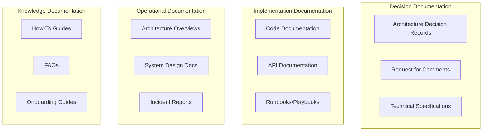
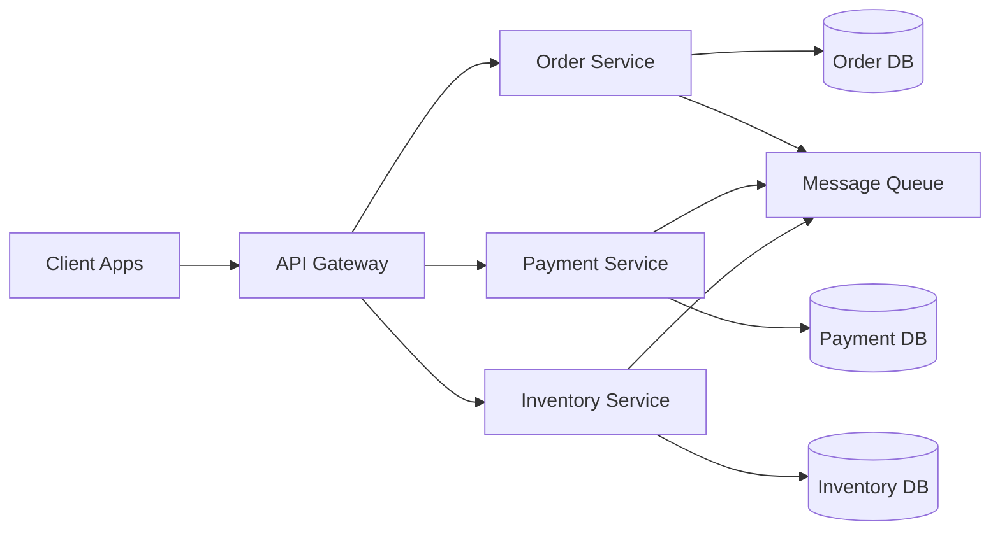
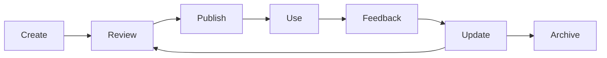

# Documentation Strategy

> **Core skill:** Senior engineers decide what to document, when to document it, and how to maintain documentation that scales knowledge across the organization.

## Why This Matters

Documentation is how knowledge scales. Without it, every new engineer must learn through osmosis. Every decision must be re-explained. Every incident must be re-investigated.

But documentation has a cost. Writing takes time. Maintenance takes effort. Outdated docs are worse than no docs.

Senior engineers make strategic decisions about documentation: what's worth documenting, when to write it, and how to keep it current.

## Documentation Types



## Documentation Strategy Framework

### 1. What to Document

**High-value documentation (always document):**

| Type | Why it matters | Example |
|------|----------------|---------|
| **Architecture decisions** | Prevents re-litigation; explains rationale | ADR: Why we chose PostgreSQL over MongoDB |
| **API contracts** | Enables parallel development; reduces integration issues | OpenAPI spec for user service |
| **Operational runbooks** | Enables on-call engineers to respond quickly | Runbook: How to restart the payment service |
| **Incident reports** | Prevents recurrence; builds institutional knowledge | Postmortem: Database outage on 2026-01-15 |
| **Onboarding guides** | Reduces time-to-productivity for new engineers | Guide: Setting up local development environment |

**Medium-value documentation (document when needed):**

| Type | When to document | Example |
|------|------------------|---------|
| **How-to guides** | When multiple people need to do the same task | How to deploy to staging |
| **System design docs** | For complex systems with multiple components | Overview of recommendation engine |
| **Troubleshooting guides** | When issues recur and are hard to diagnose | Troubleshooting: High latency in checkout service |

**Low-value documentation (avoid or minimize):**

| Type | Why to avoid | Better alternative |
|------|--------------|-------------------|
| **Code comments explaining what** | Code should be self-documenting | Write clear code; use descriptive names |
| **Meeting notes without decisions** | No lasting value | Document decisions in ADRs |
| **Outdated specs** | Misleading; worse than no docs | Delete or update; don't keep stale docs |
| **Implementation details that change often** | High maintenance cost | Document in code; use tests as specs |

### 2. When to Document

**Before implementation:**
- Architecture decisions (ADRs)
- Technical specifications
- API contracts
- Design documents

**During implementation:**
- Code documentation (for complex logic)
- Inline comments (for non-obvious decisions)

**After implementation:**
- Operational runbooks
- How-to guides
- Architecture overviews

**After incidents:**
- Incident reports (postmortems)
- Updated runbooks
- Lessons learned

### 3. How to Document

**Principles:**

| Principle | Why it matters |
|-----------|----------------|
| **Write for future readers** | Assume they have no context |
| **Keep it concise** | Long docs don't get read |
| **Use examples** | Concrete examples clarify abstract concepts |
| **Include diagrams** | Visual representations aid understanding |
| **Make it searchable** | Use clear titles, headings, and tags |
| **Keep it current** | Outdated docs are worse than no docs |

**Documentation as Code:**
- Store docs in version control (Git)
- Review docs like code (pull requests)
- Test docs like code (verify instructions work)
- Update docs with code changes

## Documentation Patterns

### Pattern 1: Decision Documentation (ADRs)

**When:** Making architectural or technical decisions

**Template:**
```markdown
# ADR-[Number]: [Title]

**Status:** Proposed | Accepted | Deprecated | Superseded
**Date:** [Date]

## Context
[What is the situation? What problem are we solving?]

## Decision
[What did we decide?]

## Consequences
[What are the trade-offs? What becomes easier/harder?]
```

**Example:**
```markdown
# ADR-015: Use Event Sourcing for Order History

**Status:** Accepted
**Date:** 2026-08-05

## Context
We need to track all changes to orders for audit and debugging purposes. Current approach (storing current state) loses history.

## Decision
Implement event sourcing for order history. Store all order events (created, updated, shipped, delivered) in an event log.

## Consequences
**Easier:**
- Complete audit trail
- Easy to debug issues (replay events)
- Enables time-travel queries (order state at any point in time)

**More difficult:**
- More complex to implement
- Storage costs increase over time
- Requires event replay for current state
```

### Pattern 2: Operational Runbooks

**When:** Creating procedures for operational tasks

**Template:**
```markdown
# Runbook: [Task Name]

## Purpose
[What this runbook helps you do]

## Prerequisites
[What you need before starting]

## Steps
1. [Step 1]
2. [Step 2]
3. [Step 3]

## Troubleshooting
[Common issues and solutions]

## Escalation
[When and how to escalate]
```

**Example:**
```markdown
# Runbook: Restart Payment Service

## Purpose
Restart the payment service when it's unresponsive or experiencing issues.

## Prerequisites
- SSH access to payment servers
- kubectl configured for production cluster

## Steps
1. Check service health:
   ```bash
   kubectl get pods -n payment | grep payment-service
   ```

2. If pods are in CrashLoopBackOff, check logs:
   ```bash
   kubectl logs -n payment <pod-name> --tail=100
   ```

3. Restart the deployment:
   ```bash
   kubectl rollout restart deployment/payment-service -n payment
   ```

4. Verify restart:
   ```bash
   kubectl rollout status deployment/payment-service -n payment
   ```

## Troubleshooting
- If restart fails, check resource limits (CPU/memory)
- If pods keep crashing, check for database connectivity issues
- Review recent deployments for breaking changes

## Escalation
If service doesn't recover after restart:
- Page on-call engineer: `@oncall-payment`
- Create incident: `#incident-payment-service`
```

### Pattern 3: How-To Guides

**When:** Documenting procedures that multiple people need to follow

**Template:**
```markdown
# How to [Task]

## Overview
[What this guide helps you do]

## Prerequisites
[What you need before starting]

## Steps
1. [Step 1 with explanation]
2. [Step 2 with explanation]
3. [Step 3 with explanation]

## Verification
[How to verify you did it correctly]

## Common Issues
[Problems and solutions]
```

**Example:**
```markdown
# How to Set Up Local Development Environment

## Overview
This guide helps you set up your local environment to run and test the application.

## Prerequisites
- macOS, Linux, or Windows with WSL2
- Git installed
- Docker installed

## Steps

### 1. Clone the repository
```bash
git clone git@github.com:company/project.git
cd project
```

### 2. Install dependencies
```bash
npm install
```
This installs all Node.js packages required by the application.

### 3. Set up environment variables
```bash
cp .env.example .env
```
Edit `.env` and add your API keys (see Confluence for shared keys).

### 4. Start the database
```bash
docker-compose up -d postgres
```
This starts a PostgreSQL database in a Docker container.

### 5. Run database migrations
```bash
npm run migrate
```
This creates the database schema and seeds test data.

### 6. Start the application
```bash
npm run dev
```
The application will be available at http://localhost:3000

## Verification
- Visit http://localhost:3000 in your browser
- You should see the login page
- Log in with test credentials: `test@example.com` / `password`

## Common Issues

**Issue:** Port 3000 already in use
**Solution:** Stop the other process or change the port in `.env`

**Issue:** Database connection failed
**Solution:** Ensure Docker is running and the postgres container is up
```

### Pattern 4: Architecture Overviews

**When:** Documenting the high-level architecture of a system

**Template:**
```markdown
# [System Name] Architecture

## Overview
[High-level description of the system]

## Components
[Diagram and description of major components]

## Data Flow
[How data flows through the system]

## Key Design Decisions
[Important architectural decisions and rationale]

## Deployment
[How the system is deployed]

## Monitoring
[How the system is monitored]
```

**Example:**
```markdown
# Order Service Architecture

## Overview
The Order Service handles order creation, payment processing, and order fulfillment. It's a microservice architecture with separate services for orders, payments, and inventory.

## Components



**Order Service:** Manages order lifecycle (created → paid → shipped → delivered)
**Payment Service:** Processes payments and handles refunds
**Inventory Service:** Tracks product availability and reserves inventory

## Data Flow
1. Client creates order via API Gateway
2. Order Service creates order and publishes `OrderCreated` event
3. Inventory Service reserves inventory
4. Payment Service processes payment
5. On success, Order Service updates status to `Paid`

## Key Design Decisions
- **Event-driven architecture:** Services communicate via events for loose coupling
- **Separate databases:** Each service owns its data; no shared database
- **Saga pattern:** Distributed transactions handled via sagas for eventual consistency

## Deployment
- Deployed on Kubernetes in AWS EKS
- Each service has its own deployment and scales independently
- Blue-green deployments for zero-downtime releases

## Monitoring
- Prometheus for metrics (request rate, latency, errors)
- Grafana dashboards for visualization
- PagerDuty for alerting
- Distributed tracing with Jaeger
```

## Documentation Maintenance

### The Documentation Lifecycle



### Keeping Documentation Current

**Strategies:**

| Strategy | How it works |
|----------|--------------|
| **Docs in version control** | Update docs with code changes in the same PR |
| **Doc reviews** | Review docs like code; require approval |
| **Expiration dates** | Mark docs with "last reviewed" date; review quarterly |
| **Automated checks** | Test code examples in CI; flag broken examples |
| **Feedback mechanisms** | Allow readers to flag outdated content |
| **Doc sprints** | Dedicated time to update and improve docs |

### Documentation Anti-Patterns

| Anti-Pattern | Problem | Solution |
|--------------|---------|----------|
| **Write once, never update** | Docs become outdated | Build maintenance into process |
| **Document everything** | Too much noise; hard to find important info | Focus on high-value documentation |
| **Docs separate from code** | Docs and code drift apart | Docs as code; same repo, same PR |
| **No ownership** | No one maintains docs | Assign doc owners; review in standups |
| **Outdated docs not deleted** | Misleading; worse than no docs | Archive or delete stale docs |
| **No examples** | Abstract; hard to apply | Include concrete examples |

## Documentation Tools

### Writing Tools

| Tool | Best for | Features |
|------|----------|----------|
| **Markdown** | Technical documentation | Simple, version-control friendly |
| **Confluence** | Team documentation | Collaboration, search, permissions |
| **Notion** | Knowledge bases | Databases, templates, collaboration |
| **Google Docs** | Collaborative writing | Real-time collaboration, comments |
| **AsciiDoc** | Complex documentation | Advanced formatting, includes |

### Diagramming Tools

| Tool | Best for | Features |
|------|----------|----------|
| **Mermaid** | Code-based diagrams | Version control, text-based |
| **Draw.io** | General diagrams | Free, integrates with Confluence |
| **Lucidchart** | Professional diagrams | Collaboration, templates |
| **Excalidraw** | Hand-drawn style | Simple, fast, collaborative |
| **PlantUML** | UML diagrams | Code-based, version control |

### Documentation Platforms

| Platform | Best for | Features |
|----------|----------|----------|
| **GitBook** | Public documentation | Beautiful, versioned, search |
| **Read the Docs** | Open source projects | Auto-builds from GitHub, versioning |
| **Docusaurus** | React-based docs | Customizable, versioned, search |
| **MkDocs** | Simple static sites | Fast, Markdown-based, themes |

## Practical Applications

### Documentation Audit Checklist

Review your team's documentation:

- [ ] **Architecture decisions:** Are major decisions documented in ADRs?
- [ ] **API documentation:** Are all APIs documented with examples?
- [ ] **Operational runbooks:** Do we have runbooks for common operational tasks?
- [ ] **Onboarding guide:** Can new engineers get started without constant help?
- [ ] **Incident reports:** Are incidents documented with lessons learned?
- [ ] **System overviews:** Do we have high-level architecture diagrams?
- [ ] **How-to guides:** Are common procedures documented?
- [ ] **Maintenance:** Are docs reviewed and updated regularly?
- [ ] **Searchability:** Can people find what they need?
- [ ] **Examples:** Do docs include concrete examples?

### Documentation Strategy Template

```markdown
## Documentation Strategy: [Team/Project]

### Documentation Goals
- [Goal 1: e.g., Reduce onboarding time to 1 week]
- [Goal 2: e.g., Enable on-call engineers to respond in <15 minutes]
- [Goal 3: e.g., Prevent re-litigation of architectural decisions]

### Documentation Types
| Type | Owner | Frequency | Storage |
|------|-------|-----------|---------|
| ADRs | Tech Lead | As needed | Git repo |
| API docs | Engineers | With each API change | OpenAPI spec |
| Runbooks | SRE team | Quarterly review | Confluence |
| Onboarding | Team lead | Update monthly | Notion |

### Documentation Standards
- Use Markdown for all technical docs
- Include examples for all procedures
- Review docs like code (PR required)
- Update docs with code changes

### Documentation Maintenance
- Assign doc owners for each doc type
- Review docs quarterly; update or archive
- Test code examples in CI
- Collect feedback from readers

### Success Metrics
- Onboarding time: [Current] → [Target]
- Time to find information: [Current] → [Target]
- Doc freshness: [% updated in last 6 months]
- User satisfaction: [Survey score]
```

## Success Indicators

- ✅ New engineers can onboard without constant help
- ✅ On-call engineers can respond quickly using runbooks
- ✅ Architectural decisions are documented and not re-litigated
- ✅ Engineers can find the information they need
- ✅ Documentation is updated regularly, not stale
- ✅ People ask for your advice on documentation strategy
- ✅ Your team's documentation is cited as an example for others

## Related Topics

- [[01_Technical_Writing|Technical Writing]]: Writing effective documentation
- [[03_Influence_Without_Authority|Influence Without Authority]]: Using documentation to influence decisions
- [[02_Stakeholder_Communication|Stakeholder Communication]]: Adapting documentation for different audiences

## Summary

Documentation strategy is deciding what to document, when to document it, and how to maintain it. Senior engineers focus on high-value documentation (decisions, APIs, runbooks, incidents) and avoid low-value documentation (implementation details that change often). They write for future readers, keep docs concise and current, and treat documentation as code (version control, reviews, tests). Good documentation strategy scales knowledge across the organization without creating unsustainable maintenance burden.