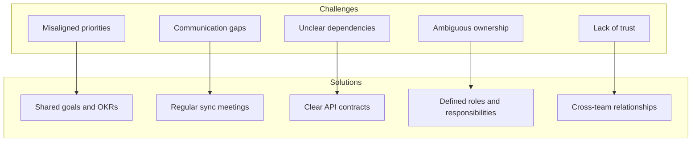

# Cross-Team Collaboration

> **Core skill:** Senior engineers work effectively across organizational boundaries to deliver initiatives that span multiple teams.

## Why This Matters

Most important technical initiatives can't be delivered by a single team. Platform changes affect multiple services. Migrations require coordination across the organization. Performance improvements span frontend, backend, and infrastructure.

Senior engineers don't just work within their team. They collaborate across teams to deliver outcomes that require coordination, alignment, and shared ownership.

## Collaboration Challenges



## Collaboration Framework

### 1. Establish Shared Goals

**Problem:** Teams have different priorities and OKRs.

**Solution:** Align on shared goals that benefit all teams.

**Example:**
- ❌ Team A wants to reduce latency; Team B wants to add features
- ✅ Both teams want to improve user experience; latency reduction enables new features

**How to establish shared goals:**
1. Understand each team's priorities and constraints
2. Find common ground (user experience, reliability, velocity)
3. Frame the initiative in terms of shared benefits
4. Get buy-in from all team leads

### 2. Define Clear Roles and Responsibilities

**Problem:** Ambiguous ownership leads to confusion and dropped balls.

**Solution:** Use a RACI matrix to clarify roles.

**RACI Matrix:**
- **R**esponsible: Does the work
- **A**ccountable: Owns the outcome (only one per task)
- **C**onsulted: Provides input before decisions
- **I**nformed: Notified after decisions

**Example:**
```markdown
## RACI Matrix: API Migration

| Task | Team A | Team B | Platform | SRE |
|------|--------|--------|----------|-----|
| Design new API | R | C | C | I |
| Implement new API | R | I | C | I |
| Migrate clients | I | R | C | I |
| Update monitoring | I | I | R | C |
| Deploy to production | I | I | C | R |
```

### 3. Create Clear Interfaces and Contracts

**Problem:** Unclear dependencies cause integration issues and delays.

**Solution:** Define clear contracts and interfaces between teams.

**Types of contracts:**

| Contract Type | Purpose | Example |
|---------------|---------|---------|
| **API contracts** | Define service interfaces | OpenAPI spec, GraphQL schema |
| **Data contracts** | Define data formats | JSON schema, protobuf definitions |
| **SLA contracts** | Define performance expectations | 99.9% uptime, <200ms latency |
| **Delivery contracts** | Define timelines and milestones | API ready by Q2, migration by Q3 |

**Example API Contract:**
```yaml
openapi: 3.0.0
info:
  title: User Service API
  version: 2.0.0
paths:
  /users/{id}:
    get:
      summary: Get user by ID
      parameters:
        - name: id
          in: path
          required: true
          schema:
            type: string
      responses:
        200:
          description: User found
          content:
            application/json:
              schema:
                $ref: '#/components/schemas/User'
        404:
          description: User not found
components:
  schemas:
    User:
      type: object
      properties:
        id:
          type: string
        email:
          type: string
          format: email
        name:
          type: string
      required:
        - id
        - email
```

### 4. Establish Regular Communication

**Problem:** Communication gaps lead to misalignment and surprises.

**Solution:** Regular sync meetings and updates.

**Communication cadence:**

| Frequency | Format | Purpose |
|-----------|--------|---------|
| **Daily** | Slack/Teams | Quick updates, blockers, questions |
| **Weekly** | Sync meeting | Progress, risks, dependencies |
| **Bi-weekly** | Demo | Show progress, get feedback |
| **Monthly** | Retrospective | What worked, what didn't, improvements |

**Weekly sync meeting agenda:**
```markdown
## Cross-Team Sync: [Initiative Name]

**Date:** [Date]
**Attendees:** [Team leads and key contributors]

### Progress
- Team A: [Progress update]
- Team B: [Progress update]
- Platform: [Progress update]

### Blockers and Risks
- [Blocker 1] - Owner: [Name], ETA: [Date]
- [Risk 1] - Mitigation: [Plan]

### Dependencies
- Team A needs [X] from Team B by [Date]
- Team B needs [Y] from Platform by [Date]

### Next Steps
- [Action item 1] - Owner: [Name], Due: [Date]
- [Action item 2] - Owner: [Name], Due: [Date]
```

### 5. Build Cross-Team Relationships

**Problem:** Lack of trust and relationships makes collaboration difficult.

**Solution:** Invest in building relationships across teams.

**Strategies:**

| Strategy | How it works |
|----------|--------------|
| **Cross-team pairing** | Pair program with engineers from other teams |
| **Lunch/coffee** | Informal conversations build trust |
| **Attend other teams' demos** | Show interest in their work |
| **Help with their problems** | Offer expertise when they're stuck |
| **Celebrate wins together** | Acknowledge cross-team contributions |

## Collaboration Patterns

### Pattern 1: Platform Initiative

**Scenario:** Platform team is introducing a new deployment system that all teams must adopt.

**Collaboration approach:**

1. **Early engagement:**
   - Meet with team leads to understand their deployment pain points
   - Gather requirements and constraints from each team
   - Incorporate feedback into the design

2. **Pilot program:**
   - Start with 1-2 volunteer teams
   - Work closely with pilot teams to identify issues
   - Iterate based on feedback

3. **Gradual rollout:**
   - Create migration guides and training materials
   - Offer office hours for questions
   - Provide hands-on support for early adopters

4. **Continuous improvement:**
   - Collect feedback from all teams
   - Prioritize improvements based on impact
   - Communicate roadmap and progress

### Pattern 2: Cross-Team Migration

**Scenario:** Migrating from monolith to microservices requires coordination across multiple teams.

**Collaboration approach:**

1. **Define the migration plan:**
   - Identify service boundaries and ownership
   - Create a phased migration plan
   - Define success criteria for each phase

2. **Establish working group:**
   - Form a cross-team working group with representatives
   - Meet weekly to coordinate and resolve issues
   - Share progress and learnings across teams

3. **Provide support and tooling:**
   - Create migration tooling and templates
   - Offer technical guidance and code reviews
   - Help teams overcome blockers

4. **Celebrate milestones:**
   - Acknowledge teams that complete their migration
   - Share success stories and best practices
   - Build momentum for remaining teams

### Pattern 3: Incident Response

**Scenario:** Production incident affects multiple services owned by different teams.

**Collaboration approach:**

1. **Immediate response:**
   - Create incident channel and invite all affected teams
   - Assign incident commander to coordinate response
   - Establish clear communication channels

2. **Investigation:**
   - Each team investigates their service
   - Share findings in real-time
   - Collaborate to identify root cause

3. **Resolution:**
   - Coordinate fix across teams
   - Test fix in staging environment
   - Deploy fix with coordination

4. **Postmortem:**
   - Conduct joint postmortem with all teams
   - Identify systemic issues and improvements
   - Assign action items to appropriate teams

## Collaboration Anti-Patterns

| Anti-Pattern | Problem | Better Approach |
|--------------|---------|-----------------|
| **Siloed working** | Teams work in isolation; integration fails | Regular sync, shared goals, clear contracts |
| **Blame game** | Teams blame each other for problems | Focus on solutions, not blame; joint postmortems |
| **Unclear ownership** | Tasks fall through cracks; no accountability | RACI matrix; clear owners for each task |
| **Over-communication** | Too many meetings; no time for work | Right cadence; async when possible |
| **Under-communication** | Surprises; misalignment | Regular updates; proactive communication |
| **Forcing adoption** | Teams resist; poor implementation | Pilot program; demonstrate value; gradual rollout |

## Collaboration Tools

### Communication Tools

| Tool | Best for | Features |
|------|----------|----------|
| **Slack/Teams** | Daily communication | Channels, threads, integrations |
| **Zoom/Meet** | Meetings and demos | Video, screen sharing, recording |
| **Email** | Formal communication | Documentation, external communication |

### Project Management Tools

| Tool | Best for | Features |
|------|----------|----------|
| **Jira** | Complex projects | Epics, stories, sprints, reporting |
| **Asana** | Task management | Tasks, projects, timelines, dependencies |
| **Trello** | Simple projects | Boards, cards, lists, labels |
| **Linear** | Engineering projects | Issues, cycles, roadmaps |

### Documentation Tools

| Tool | Best for | Features |
|------|----------|----------|
| **Confluence** | Team documentation | Pages, spaces, permissions, search |
| **Notion** | Knowledge bases | Databases, templates, collaboration |
| **Google Docs** | Collaborative writing | Real-time editing, comments, suggestions |

### Diagramming Tools

| Tool | Best for | Features |
|------|----------|----------|
| **Miro** | Collaborative whiteboarding | Infinite canvas, sticky notes, templates |
| **Lucidchart** | Professional diagrams | Collaboration, templates, integrations |
| **Excalidraw** | Quick diagrams | Simple, fast, hand-drawn style |

## Practical Applications

### Cross-Team Collaboration Checklist

Before starting a cross-team initiative, verify:

- [ ] I've identified all teams involved and their stakeholders
- [ ] I've established shared goals that benefit all teams
- [ ] I've defined clear roles and responsibilities (RACI)
- [ ] I've created contracts for interfaces between teams
- [ ] I've established a communication cadence and channels
- [ ] I've built relationships with key people on other teams
- [ ] I've identified potential blockers and mitigation strategies
- [ ] I've created a project plan with milestones and dependencies
- [ ] I've scheduled regular sync meetings with all teams
- [ ] I've defined success criteria and how we'll measure progress

### Cross-Team Project Plan Template

```markdown
## Cross-Team Project: [Initiative Name]

### Overview
[High-level description of the initiative]

### Goals
[Shared goals that benefit all teams]

### Teams Involved
| Team | Role | Key Contact |
|------|------|-------------|
| Team A | [Role] | [Name] |
| Team B | [Role] | [Name] |
| Platform | [Role] | [Name] |

### RACI Matrix
| Task | Team A | Team B | Platform |
|------|--------|--------|----------|
| [Task 1] | R | C | I |
| [Task 2] | I | R | C |

### Contracts
- API contract: [Link to spec]
- Data contract: [Link to schema]
- SLA: [Performance expectations]

### Timeline
| Milestone | Owner | Due Date | Dependencies |
|-----------|-------|----------|--------------|
| [Milestone 1] | Team A | [Date] | None |
| [Milestone 2] | Team B | [Date] | Milestone 1 |

### Communication Plan
| Frequency | Format | Attendees | Purpose |
|-----------|--------|-----------|---------|
| Daily | Slack | All teams | Quick updates |
| Weekly | Meeting | Team leads | Sync and blockers |
| Bi-weekly | Demo | All teams | Show progress |

### Risks and Mitigations
| Risk | Impact | Probability | Mitigation |
|------|--------|-------------|------------|
| [Risk 1] | High | Medium | [Mitigation] |

### Success Criteria
- [Criterion 1]
- [Criterion 2]
- [Criterion 3]
```

## Success Indicators

- ✅ Cross-team initiatives are delivered on time and meet goals
- ✅ Teams work together effectively without constant escalation
- ✅ Clear contracts prevent integration issues
- ✅ Regular communication keeps all teams aligned
- ✅ Problems are solved collaboratively, not through blame
- ✅ Teams ask you to lead cross-team initiatives
- ✅ Your cross-team projects are cited as examples of good collaboration

## Related Topics

- [[03_Influence_Without_Authority|Influence Without Authority]]: Building influence across teams
- [[04_Facilitation|Facilitation]]: Running effective cross-team meetings
- [[02_Stakeholder_Communication|Stakeholder Communication]]: Communicating with different teams
- [[07_Conflict_Resolution|Conflict Resolution]]: Resolving disagreements between teams

## Summary

Cross-team collaboration is working effectively across organizational boundaries to deliver initiatives that span multiple teams. Senior engineers establish shared goals, define clear roles (RACI), create contracts for interfaces, establish regular communication, and build relationships across teams. They use patterns like pilot programs, working groups, and joint postmortems to drive successful collaboration. Effective cross-team collaboration enables engineers to deliver outcomes that no single team could achieve alone.