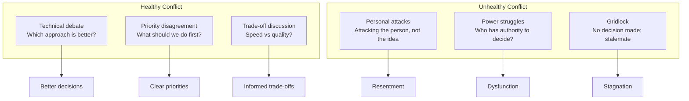

# Conflict Resolution

> **Core skill:** Senior engineers navigate technical disagreements constructively to reach better decisions and maintain healthy working relationships.

## Why This Matters

Technical disagreements are inevitable. Architects disagree on approaches. Teams disagree on priorities. Engineers disagree on implementation details.

The difference between healthy and unhealthy conflict is how it's handled. Healthy conflict leads to better decisions through rigorous debate. Unhealthy conflict leads to resentment, gridlock, and poor decisions.

Senior engineers don't avoid conflict. They navigate it constructively.

## Types of Conflict



## Conflict Resolution Framework

### 1. Understand the Conflict

**Ask:**
- What is the disagreement about?
- What are the underlying interests (not just positions)?
- What constraints is each side working under?
- What would success look like for each side?

**Example:**
- **Position:** "We should use microservices" vs "We should use a monolith"
- **Interests:** 
  - Side A: Wants faster deployments, team autonomy, scalability
  - Side B: Wants simplicity, easier debugging, lower operational overhead

### 2. Focus on Interests, Not Positions

**Problem:** People get attached to specific solutions (positions) rather than the underlying goals (interests).

**Solution:** Explore the interests behind the positions to find common ground or alternative solutions.

**Example:**
```
Position A: "Use microservices"
Interest A: "Enable team autonomy and faster deployments"

Position B: "Use monolith"
Interest B: "Simplify operations and debugging"

Alternative solution: "Use a modular monolith with clear boundaries.
This enables team autonomy (each team owns modules) while keeping
operations simple (single deployment). As we grow, we can extract
modules into services if needed."
```

### 3. Generate Options

**Techniques:**

**Brainstorming:**
> "Let's spend 10 minutes generating all possible solutions, without judging them yet."

**Expanding the pie:**
> "What if we had more resources? What would we do differently?"

**Trading priorities:**
> "What if we do X first, then Y? Or Y first, then X?"

**Hybrid solutions:**
> "What if we combined elements of both approaches?"

**Pilot/experiment:**
> "What if we tried both approaches on a small scale and compared results?"

### 4. Evaluate Options Objectively

**Criteria:**
- Which option best meets the interests of all sides?
- What are the trade-offs of each option?
- What are the risks and uncertainties?
- What's the cost (time, money, effort) of each option?
- Which option is most reversible if it doesn't work?

**Decision matrix:**
```markdown
| Criterion | Weight | Option A | Option B | Option C |
|-----------|--------|----------|----------|----------|
| Meets interest 1 | 30% | 8/10 | 6/10 | 9/10 |
| Meets interest 2 | 25% | 7/10 | 8/10 | 8/10 |
| Low risk | 20% | 6/10 | 9/10 | 7/10 |
| Low cost | 15% | 5/10 | 8/10 | 6/10 |
| Reversible | 10% | 4/10 | 9/10 | 7/10 |
| **Weighted score** | **100%** | **6.4** | **7.7** | **7.9** |
```

### 5. Reach Agreement

**Techniques:**

**Consensus:**
> "Can everyone support this decision and commit to making it work?"

**Majority vote:**
> "Let's vote. Majority wins, but everyone commits to the decision."

**Decision maker decides:**
> "We've discussed the options. [Person with authority] will make the final decision."

**Disagree and commit:**
> "I understand you disagree, but can you commit to supporting this decision?"

## Conflict Resolution Techniques

### 1. Active Listening

**Goal:** Understand the other person's perspective before responding.

**Techniques:**

**Paraphrase:**
> "So what I'm hearing is that you're concerned about scalability. Is that right?"

**Ask clarifying questions:**
> "Can you help me understand why you prefer approach A over approach B?"

**Acknowledge emotions:**
> "I can see this is frustrating. Let's work through it together."

**Avoid interrupting:**
Let the person finish their thought before responding.

### 2. Separate People from Problems

**Problem:** Disagreements become personal ("You always...").

**Solution:** Focus on the problem, not the person.

**Weak:**
> "You're being too conservative and blocking progress."

**Strong:**
> "I understand your concern about risk. Let's explore how we can mitigate the risks while still moving forward."

### 3. Use Data and Evidence

**Problem:** Opinions clash; no way to resolve.

**Solution:** Gather data to inform the decision.

**Example:**
> "We're debating whether to use caching. Let's measure the current performance and estimate the improvement with caching. Then we can decide based on data."

**Types of evidence:**
- Performance metrics and benchmarks
- User research and feedback
- Industry best practices and case studies
- Cost-benefit analysis
- Proof of concepts and experiments

### 4. Find Common Ground

**Problem:** Sides seem completely opposed.

**Solution:** Identify shared interests or goals.

**Example:**
```
Side A: "We need to ship features faster"
Side B: "We need to ensure quality and reliability"

Common ground: "We both want to deliver value to users sustainably"

Solution: "Let's implement CI/CD to ship faster while maintaining
quality through automated testing and gradual rollouts."
```

### 5. Agree to Disagree (Temporarily)

**Problem:** Can't reach agreement; need to move forward.

**Solution:** Make a decision with commitment to revisit.

**Example:**
> "We have different opinions on the best approach. Let's go with option A for now, and revisit in 3 months. If it's not working, we'll switch to option B. Does everyone commit to this?"

### 6. Escalate When Necessary

**When to escalate:**
- Disagreement is blocking progress
- Teams can't reach agreement after multiple attempts
- Decision requires authority beyond the group
- Conflict is becoming personal or toxic

**How to escalate:**
> "We've discussed this extensively and can't reach agreement. Let's escalate to [manager/director] with a summary of the options and our recommendations."

**Escalation document:**
```markdown
## Escalation: [Decision Title]

### Background
[Brief description of the decision to be made]

### Options
1. [Option A] - Supported by [Team/Person]
2. [Option B] - Supported by [Team/Person]

### Arguments for Option A
- [Argument 1]
- [Argument 2]

### Arguments for Option B
- [Argument 1]
- [Argument 2]

### Our Recommendation
[If the group has a recommendation, state it with rationale]

### Decision Needed
[What decision do you need from the escalatee?]
```

## Common Conflict Scenarios

### Scenario 1: Technical Approach Disagreement

**Situation:** Two engineers disagree on the best technical approach.

**Resolution process:**
1. **Understand both perspectives:** Each person explains their approach and rationale
2. **Identify evaluation criteria:** What matters most? (performance, maintainability, time-to-market)
3. **Evaluate objectively:** Compare approaches against the criteria
4. **Look for hybrid solutions:** Can we combine the best of both?
5. **Prototype if needed:** Build quick prototypes to test assumptions
6. **Decide and commit:** Choose an approach and commit to making it work

**Example:**
```
Engineer A: "Use React for the frontend"
Engineer B: "Use Vue for the frontend"

Evaluation criteria:
- Team expertise (30%)
- Ecosystem and libraries (25%)
- Performance (20%)
- Learning curve (15%)
- Long-term maintainability (10%)

Decision: React (higher team expertise, larger ecosystem)
Commitment: Both engineers commit to learning React best practices
```

### Scenario 2: Priority Conflict

**Situation:** Product wants new features; Engineering wants to pay down technical debt.

**Resolution process:**
1. **Quantify the impact:** How much does technical debt slow development? How much revenue will new features generate?
2. **Find common ground:** Both want to deliver value to users sustainably
3. **Negotiate allocation:** "Let's allocate 70% to features, 30% to technical debt"
4. **Set success metrics:** "If we reduce bug rate by 30%, we'll increase technical debt allocation"
5. **Review regularly:** "Let's review this allocation monthly and adjust as needed"

**Example:**
```
Product: "We need to ship 5 features this quarter"
Engineering: "We need to reduce technical debt or we'll slow down"

Quantification:
- Technical debt causes 40% of development time to be spent on bugs
- Each feature generates $50K in revenue

Negotiated solution:
- Allocate 20% of sprint capacity to technical debt
- Ship 4 features instead of 5 (still $200K revenue)
- Expected outcome: Reduce bug time to 20%, enabling faster feature development next quarter

Success metrics:
- Bug rate reduction: 40% → 20%
- Feature velocity: Maintain or increase
- Review: End of quarter
```

### Scenario 3: Interpersonal Conflict

**Situation:** Two engineers have a personal conflict that affects their work.

**Resolution process:**
1. **Address privately:** Have a one-on-one conversation, not in public
2. **Focus on behavior, not personality:** "When you interrupt me in meetings..." not "You're rude"
3. **Use I statements:** "I feel frustrated when..." not "You make me frustrated"
4. **Listen to their perspective:** Understand their experience
5. **Agree on behavior changes:** "Going forward, let's..."
6. **Follow up:** Check in after a week to see how it's going

**Example:**
```
Engineer A: "You keep interrupting me in code reviews and dismissing my suggestions"
Engineer B: "I'm just trying to be efficient and focus on important issues"

Resolution:
- Engineer B: "I'll let you finish your thoughts before responding"
- Engineer A: "I'll prioritize the most important feedback"
- Both: "We'll have a brief sync after reviews to discuss any disagreements"
```

## Conflict Resolution Anti-Patterns

| Anti-Pattern | Problem | Better Approach |
|--------------|---------|-----------------|
| **Avoiding conflict** | Issues fester; decisions not made | Address conflict early and constructively |
| **Winning at all costs** | Damages relationships; poor decisions | Focus on best outcome, not winning |
| **Personal attacks** | Destroys trust; escalates conflict | Focus on problems, not people |
| **Escalating too early** | Undermines team autonomy | Try to resolve at the team level first |
| **Ignoring emotions** | Emotions drive behavior; can't be ignored | Acknowledge emotions; address underlying concerns |
| **False consensus** | People agree publicly but disagree privately | Ensure genuine agreement; use "disagree and commit" |

## Building a Culture of Healthy Conflict

### 1. Normalize disagreement

**Message:** "Disagreement is normal and healthy. It leads to better decisions."

**Actions:**
- Model respectful disagreement in your own behavior
- Acknowledge when someone raises a good counterpoint
- Thank people for challenging your ideas

### 2. Establish ground rules

**Ground rules for discussions:**
- Focus on ideas, not people
- Assume positive intent
- Listen to understand before responding
- Use data and evidence when possible
- Disagree and commit once a decision is made

### 3. Create psychological safety

**Psychological safety:** People feel safe to express dissenting opinions without fear of punishment.

**How to build it:**
- Don't punish people for disagreeing
- Acknowledge your own mistakes and uncertainties
- Ask for feedback and act on it
- Celebrate learning from failures

### 4. Train conflict resolution skills

**Skills to develop:**
- Active listening
- Giving and receiving feedback
- Negotiation
- Facilitation
- Emotional intelligence

## Practical Applications

### Conflict Resolution Checklist

When facing a conflict, verify:

- [ ] I understand the underlying interests (not just positions)
- [ ] I've listened to the other person's perspective
- [ ] I've separated the people from the problem
- [ ] I've generated multiple options for resolution
- [ ] I've evaluated options objectively using criteria
- [ ] I've focused on common ground
- [ ] I've reached agreement (or agreed to escalate)
- [ ] I've documented the decision and rationale
- [ ] I've followed up to ensure the agreement is working

### Difficult Conversation Framework

```markdown
## Difficult Conversation: [Topic]

### Preparation
- What is the issue? [Specific behavior or situation]
- What is the impact? [How it affects you, the team, or the project]
- What do I want to achieve? [Desired outcome]
- What might their perspective be? [Their possible concerns or constraints]

### Conversation Structure
1. **State the purpose:** "I'd like to discuss [topic] because [reason]"
2. **Describe the situation:** "I've noticed [specific behavior/situation]"
3. **Explain the impact:** "This affects [impact on you, team, project]"
4. **Ask for their perspective:** "What's your take on this?"
5. **Listen actively:** [Paraphrase, ask clarifying questions]
6. **Explore solutions:** "What ideas do you have for addressing this?"
7. **Agree on action:** "Let's agree to [specific action] and check in on [date]"

### Follow-up
- [ ] Check in on [date] to see how it's going
- [ ] Acknowledge improvements
- [ ] Adjust approach if needed
```

## Success Indicators

- ✅ Technical disagreements are resolved constructively
- ✅ People feel safe to express dissenting opinions
- ✅ Conflicts lead to better decisions, not resentment
- ✅ Disagreements are focused on ideas, not people
- ✅ Decisions are made and committed to, even with disagreement
- ✅ People come to you to help resolve conflicts
- ✅ Your team has a culture of healthy debate

## Related Topics

- [[03_Influence_Without_Authority|Influence Without Authority]]: Building trust to navigate disagreements
- [[04_Facilitation|Facilitation]]: Running meetings that handle conflict well
- [[06_Cross_Team_Collaboration|Cross-Team Collaboration]]: Resolving conflicts between teams
- [[02_Stakeholder_Communication|Stakeholder Communication]]: Communicating during disagreements

## Summary

Conflict resolution is navigating technical disagreements constructively to reach better decisions and maintain healthy relationships. Senior engineers understand the underlying interests, focus on problems not people, generate multiple options, evaluate objectively, and reach agreement. They use techniques like active listening, data-driven decisions, and finding common ground. Healthy conflict leads to better decisions; unhealthy conflict leads to resentment and gridlock. Senior engineers build a culture where disagreement is normalized, respected, and handled constructively.