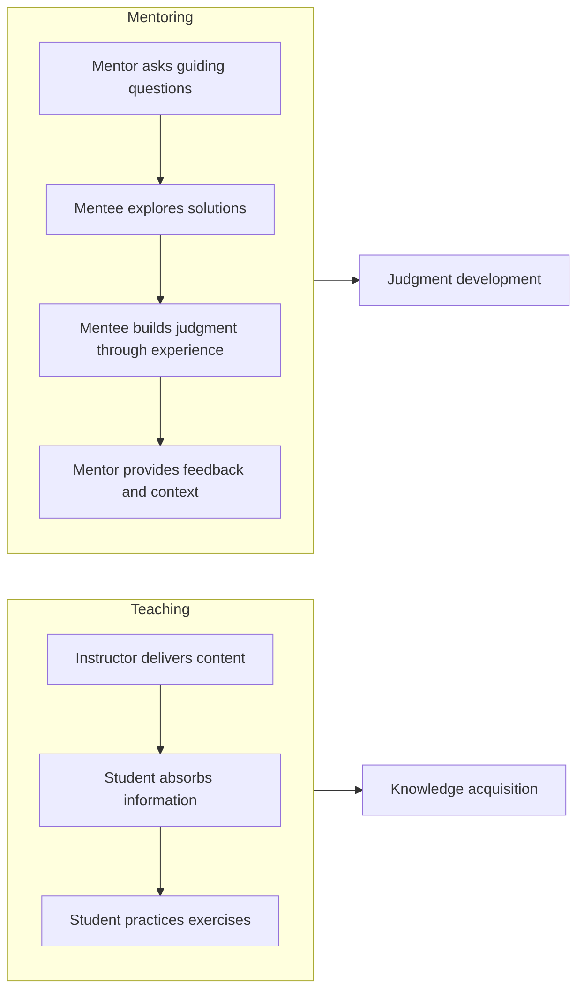

# Technical Mentoring

> **Core skill:** Senior engineers transfer technical knowledge and judgment to others through structured guidance, not just ad-hoc answers.

## Why This Matters

Every team has knowledge gaps. When only one person understands a system, that person becomes a bottleneck. When knowledge is distributed, the team becomes resilient.

Technical mentoring is how senior engineers distribute their knowledge systematically. It is not about answering every question; it is about teaching people how to find answers, think through problems, and develop their own technical judgment.

## Mentoring vs Teaching



**Teaching** transfers knowledge (what to do). **Mentoring** develops judgment (when and why to do it).

## Mentoring Framework

### 1. Assess Current Level

**Before mentoring, understand:**
- What does the mentee already know?
- What are their strengths and gaps?
- What is their learning style? (reading, doing, watching, discussing)
- What are their goals? (technical depth, breadth, leadership)

**Assessment techniques:**

| Technique | How it works |
|-----------|-------------|
| **Code review analysis** | Review their recent PRs for patterns and gaps |
| **Technical conversation** | Discuss a recent problem they solved; ask about their approach |
| **Self-assessment** | Ask them to rate their confidence in different areas |
| **Observation** | Watch them debug, design, or present; note strengths and gaps |

### 2. Set Development Goals

**SMART goals for technical mentoring:**

| Goal Type | Example |
|-----------|---------|
| **Skill acquisition** | "Learn to write effective integration tests by end of Q3" |
| **System understanding** | "Understand the payment service architecture deeply enough to own it" |
| **Design judgment** | "Be able to evaluate trade-offs between SQL and NoSQL for a given use case" |
| **Debugging** | "Independently diagnose production incidents within 30 minutes" |
| **Communication** | "Write design documents that get approved on first review" |

**Goal-setting conversation:**
```markdown
## Mentoring Goals: [Mentee Name]

### Current Strengths
- [Strength 1]
- [Strength 2]

### Development Areas
- [Area 1] - Target: [Specific goal]
- [Area 2] - Target: [Specific goal]

### Learning Style
[How the mentee learns best: reading, doing, watching, discussing]

### Timeline
[When to achieve each goal]

### How We Will Work Together
- Meeting cadence: [Weekly/Bi-weekly]
- Format: [Pairing, code reviews, discussions, shadowing]
- Progress tracking: [How we will measure progress]
```

### 3. Choose Mentoring Techniques

#### Technique 1: Guided Discovery

**Instead of giving answers, ask questions that lead to discovery.**

**Example:**
```
Mentee: "Should I use a HashMap or a TreeMap here?"

Weak mentor: "Use a HashMap because you need O(1) lookups."

Strong mentor: "What operations do you need to perform most frequently?
How does that affect your choice of data structure?"
```

**Guiding questions:**
- "What are the trade-offs of each approach?"
- "What would happen if the input size doubled?"
- "How would you test this?"
- "What would make this easier to debug?"
- "What would you do differently if you had to maintain this for 5 years?"

#### Technique 2: Think-Aloud Problem Solving

**Model your thought process when solving problems.**

**Example:**
> "I see a performance issue. First, I check the slow query log. Then I look at the execution plan. I notice a full table scan, so I check if there is an index on the filtered column. There is not, so I add one and verify the improvement."

**Why it works:** Shows the reasoning process, not just the solution. Mentees learn how to approach problems, not just what the answer is.

#### Technique 3: Scaffolding

**Provide structure that reduces complexity while the mentee builds capability.**

**Levels of scaffolding:**

| Level | What the mentor does | What the mentee does |
|-------|---------------------|---------------------|
| **High support** | Designs the solution; mentee implements | Implements with guidance |
| **Medium support** | Reviews the design; provides feedback | Designs and implements |
| **Low support** | Reviews the implementation; provides feedback | Designs, implements, and tests |
| **Independent** | Available for questions | Owns the entire feature |

**Progression:**


#### Technique 4: Stretch Assignments

**Give work that is slightly beyond the mentee current capability.**

**The Zone of Proximal Development:**
- **Too easy:** No learning; boredom
- **Zone of Proximal Development:** Challenging but achievable with support
- **Too hard:** Frustration; loss of confidence

**Example:**
```
Current level: Can implement well-defined features
Stretch assignment: Design and implement a new API endpoint from requirements
Support provided: Design review before implementation; code review during development
```

#### Technique 5: Shadowing and Reverse Shadowing

**Shadowing:** Mentee watches the mentor work.
**Reverse shadowing:** Mentor watches the mentee work.

**When to use shadowing:**
- Complex debugging sessions
- Architecture discussions
- Incident response
- Code reviews

**When to use reverse shadowing:**
- When the mentee is building a new skill
- To identify gaps in approach
- To provide real-time feedback

### 4. Provide Ongoing Feedback

**Feedback types:**

| Type | When | Example |
|------|------|---------|
| **Positive reinforcement** | When they do something well | "Your test coverage was excellent. The edge case tests caught a real bug." |
| **Constructive feedback** | When they can improve | "The function works, but it is doing three things. Consider splitting it." |
| **Coaching questions** | When they need to think deeper | "What happens if the external service is down? How does your code handle that?" |
| **Context sharing** | When they lack background | "We chose this pattern because of a production incident in 2024. Here is what happened." |

### 5. Track Progress and Adjust

**Progress indicators:**

| Indicator | What it shows |
|-----------|--------------|
| **Increasing independence** | Mentee needs less guidance over time |
| **Better questions** | Questions shift from "how" to "why" and "what if" |
| **Broader ownership** | Mentee takes on larger, more complex features |
| **Teaching others** | Mentee starts helping newer team members |
| **Improved code quality** | Reviews require fewer corrections |

**Adjustment triggers:**
- Mentee is bored: increase challenge
- Mentee is frustrated: increase support
- Mentee has achieved a goal: set a new one
- Mentee interests have changed: adjust focus

## Mentoring Patterns

### Pattern 1: Onboarding Mentoring

**Scenario:** New engineer joins the team.

**Approach:**
1. **Week 1:** Pair on setup and first task; explain team conventions
2. **Week 2-3:** Guided discovery on small features; daily check-ins
3. **Month 1:** Stretch assignments with design reviews; weekly 1:1s
4. **Month 2-3:** Independent work with code reviews; bi-weekly 1:1s
5. **Month 3+:** Full ownership; monthly development discussions

**Key practices:**
- Create an onboarding checklist
- Assign a buddy for day-to-day questions
- Schedule regular check-ins (not just when problems arise)
- Share team context and history (why we do things this way)

### Pattern 2: Skill Gap Mentoring

**Scenario:** Engineer needs to develop a specific skill (e.g., testing, debugging, system design).

**Approach:**
1. **Identify the gap:** Through code reviews, incidents, or self-assessment
2. **Set a specific goal:** "Write integration tests for the payment service"
3. **Provide learning resources:** Articles, courses, examples
4. **Practice together:** Pair on the first example
5. **Independent practice:** Mentee works on their own with reviews
6. **Teach others:** Mentee presents what they learned to the team

### Pattern 3: Career Development Mentoring

**Scenario:** Engineer wants to grow to the next level (junior to mid, mid to senior).

**Approach:**
1. **Understand the level expectations:** Review the career ladder or competency matrix
2. **Identify gaps:** Compare current performance to next-level expectations
3. **Create a development plan:** Specific actions to close each gap
4. **Provide opportunities:** Assign work that demonstrates next-level skills
5. **Advocate:** Help the mentee get visibility for their work
6. **Prepare for promotion:** Help write the promotion case; practice presentations

## Mentoring Anti-Patterns

| Anti-Pattern | Problem | Better Approach |
|--------------|---------|-----------------|
| **Answering every question** | Creates dependency; does not build judgment | Ask guiding questions; let them discover |
| **Mentoring only juniors** | Mid-level engineers need mentoring too | Mentor at all levels; peer mentoring works |
| **One-time advice** | No follow-through; no accountability | Regular meetings; track progress |
| **Technical-only focus** | Ignores communication, collaboration, leadership | Develop the whole engineer |
| **Cloning yourself** | Trying to make the mentee work exactly like you | Respect different styles; teach principles |
| **Gatekeeping** | Withholding knowledge to maintain importance | Share everything; make yourself unnecessary |
| **Ignoring learning styles** | One approach does not work for everyone | Adapt to how the mentee learns best |

## Practical Applications

### Mentoring Session Template

```markdown
## Mentoring Session: [Date]

### Check-in (5 min)
- How are things going?
- Any blockers or frustrations?

### Progress Review (10 min)
- What did you work on since last session?
- What went well? What was challenging?

### Learning Focus (30 min)
- [Topic or skill to develop]
- [Approach: pairing, discussion, code review, shadowing]

### Action Items (5 min)
- [What the mentee will do before next session]
- [What the mentor will provide or arrange]

### Feedback (5 min)
- [Specific positive reinforcement]
- [Specific constructive feedback]
```

### Mentoring Relationship Health Check

Review monthly:

- [ ] Are we meeting regularly?
- [ ] Is the mentee making progress toward their goals?
- [ ] Is the challenge level appropriate (not too easy, not too hard)?
- [ ] Is the mentee asking good questions (showing growth in judgment)?
- [ ] Am I providing specific, actionable feedback?
- [ ] Is the mentee becoming more independent?
- [ ] Do we need to adjust our goals or approach?

## Success Indicators

- Mentees can solve problems independently that previously required your help
- Mentees ask "why" and "what if" questions, not just "how"
- Mentees start mentoring others
- Mentees are promoted or take on more responsibility
- Team knowledge is distributed; no single points of failure
- People seek you out for mentoring

## Related Topics

- [[02_Code_Reviews_as_Teaching|Code Reviews as Teaching]]: Code reviews are a primary mentoring vehicle
- [[03_Pair_Programming|Pair Programming]]: Intensive mentoring through collaborative development
- [[04_Effective_Feedback|Effective Feedback]]: Feedback is essential for mentoring
- [[05_Coaching_and_Development|Coaching and Development]]: Mentoring supports career development

## Summary

Technical mentoring is developing others through guided discovery, not just answering questions. Senior engineers assess current levels, set development goals, choose appropriate techniques (guided discovery, think-aloud, scaffolding, stretch assignments), provide ongoing feedback, and track progress. The goal is not to create clones, but to develop independent engineers with strong technical judgment. Effective mentoring multiplies the senior engineer impact across the entire team.
