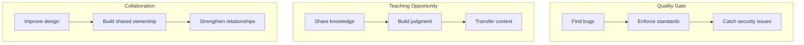

# Code Reviews as Teaching

> **Core skill:** Senior engineers use code reviews as a primary vehicle for mentoring, transferring knowledge, and building a culture of code quality.

## Why This Matters

Code reviews are the most frequent interaction between engineers. Every pull request is an opportunity to teach, learn, and improve. But most code reviews focus on finding bugs or enforcing style, missing the deeper value.

Senior engineers treat code reviews as teaching moments. They explain the "why" behind their suggestions, share context and reasoning, and help authors develop better technical judgment.

## Code Review Purposes



**Quality gate** is necessary but insufficient. **Teaching** is what makes code reviews transformative.

## Review Mindset

### From Gatekeeper to Teacher

| Gatekeeper Mindset | Teacher Mindset |
|--------------------|-----------------|
| "This is wrong" | "Here is why this might cause problems" |
| "Fix this" | "Consider this alternative approach" |
| "We do not do it this way" | "Here is why we chose this pattern" |
| "This will not scale" | "What happens when we have 10x the traffic?" |
| "You missed a test" | "What edge cases should we test here?" |

### The Review Hierarchy

**Priority order for review comments:**

1. **Correctness:** Does the code do what it should? Are there bugs?
2. **Security:** Are there vulnerabilities? (injection, auth, data exposure)
3. **Reliability:** What happens on failure? Error handling? Retries?
4. **Performance:** Are there obvious bottlenecks? N+1 queries? Memory leaks?
5. **Maintainability:** Can someone understand and modify this in 6 months?
6. **Testing:** Are there sufficient tests? Do they test the right things?
7. **Style:** Does it follow team conventions? (lowest priority; automate this)

## Effective Review Comments

### Comment Types

#### 1. Questions (Best for Teaching)

**Purpose:** Guide the author to discover the issue themselves.

**Examples:**
```
"What happens if the external service returns a 500 error here?"

"How would this behave if two requests come in simultaneously?"

"What is the time complexity of this approach? Is it acceptable for our data size?"
```

**Why it works:** Questions build judgment. The author thinks through the problem and internalizes the lesson.

#### 2. Explanations (Best for Context Transfer)

**Purpose:** Share knowledge the author does not have.

**Examples:**
```
"We use optimistic locking here because we had a race condition in production
that caused duplicate charges. Here is the incident report: [link]"

"This pattern (repository + unit of work) was chosen because we need to
support multiple database backends. The abstraction allows us to swap
implementations."
```

**Why it works:** Context prevents repeated mistakes and helps authors understand the "why" behind conventions.

#### 3. Suggestions (Best for Improvement)

**Purpose:** Offer a better approach without being prescriptive.

**Examples:**
```
"Consider extracting this into a separate function. It would make the
main flow easier to read and the logic easier to test."

"You might want to use a circuit breaker here to prevent cascading
failures when the payment service is down."
```

**Why it works:** Suggestions respect the author autonomy while pointing toward better solutions.

#### 4. Nitpicks (Use Sparingly)

**Purpose:** Minor style or preference issues.

**Examples:**
```
"Nit: Consider renaming `data` to `userProfile` for clarity."

"Nit: This comment could be more specific about what 'this' refers to."
```

**Why use sparingly:** Too many nitpicks overwhelm the author and obscure important feedback. Automate style checks instead.

### Comment Tone

**Principles:**

| Principle | Example |
|-----------|---------|
| **Assume good intent** | "I think you might have missed..." not "You forgot to..." |
| **Focus on the code, not the person** | "This function is doing three things" not "You wrote a bad function" |
| **Be specific** | "This loop has O(n^2) complexity" not "This is slow" |
| **Explain the why** | "This could cause a deadlock because..." not just "This is wrong" |
| **Acknowledge good work** | "Nice use of the strategy pattern here" |

**Weak comments:**
```
"This is wrong."
"Why did you do it this way?"
"We do not do this."
```

**Strong comments:**
```
"This approach works for small datasets, but with our current growth rate,
we will hit performance issues within 6 months. Consider using pagination
or a cursor-based approach."

"I see you are using a try-catch here. What is the recovery strategy if
the database write fails? Should we retry, or is this a case where we
should fail fast and alert?"
```

## Review Strategies

### Strategy 1: The Two-Pass Review

**Pass 1: Understand the change**
- Read the PR description and linked issues
- Understand the goal and context
- Look at the overall design before diving into details

**Pass 2: Review the implementation**
- Check correctness, security, reliability
- Look for teaching opportunities
- Leave comments that build judgment

**Why two passes:** Prevents getting lost in details before understanding the big picture.

### Strategy 2: The Question-First Review

**Start with questions, not statements.**

**Process:**
1. Read the PR and note questions that arise
2. Ask the questions as comments
3. Only after asking, provide suggestions or explanations

**Example:**
```
Instead of: "You should add error handling here."

Ask: "What happens if this API call fails? Should we retry, return a
partial result, or fail the entire request?"
```

**Why it works:** Questions engage the author in thinking, not just following instructions.

### Strategy 3: The Learning-Focused Review

**Identify one key learning opportunity per review.**

**Process:**
1. Review the PR for correctness and quality
2. Identify the most impactful teaching opportunity
3. Write a detailed comment explaining the concept
4. Link to resources for further learning

**Example:**
```
"I notice you are catching all exceptions here. This is a good instinct
for reliability, but it can hide bugs. Here is the principle I follow:

1. Catch specific exceptions you know how to handle
2. Let unexpected exceptions propagate (they indicate bugs)
3. Use a global error handler for logging and alerting

This way, bugs surface quickly instead of being silently swallowed.

Here is an article on exception handling best practices: [link]"
```

### Strategy 4: The Pairing Follow-Up

**For complex changes, review in person (or video).**

**Process:**
1. Review the PR asynchronously
2. If the change is complex or the author is new, schedule a 15-minute pairing session
3. Walk through the code together
4. Discuss design decisions and trade-offs

**When to use:**
- First PR from a new team member
- Complex architectural changes
- When async comments are leading to confusion
- When the author asks for help

## Building a Review Culture

### Establish Team Norms

**Document and agree on:**

| Norm | Example |
|------|---------|
| **Response time** | Reviews within 24 hours (or 4 hours for urgent changes) |
| **Review depth** | Every PR gets at least one thorough review |
| **Comment style** | Questions over statements; explain the why |
| **Approval criteria** | What must be true before approving? |
| **Nitpick policy** | Mark minor comments as "nit" or "optional" |

### Automate What You Can

**Automate style and formatting:**
- Linters for code style
- Formatters (Prettier, Black, gofmt)
- Pre-commit hooks
- CI checks for common issues

**Why:** Frees reviewers to focus on design, correctness, and teaching instead of style nitpicks.

### Recognize Good Reviews

**Publicly acknowledge:**
- "Thanks to [Name] for the thorough review on my PR. The suggestion to use a circuit breaker saved us from a production incident."
- Share examples of excellent review comments in team meetings
- Include review quality in performance discussions

## Review Metrics

### Quantitative Metrics

| Metric | Target | Why it matters |
|--------|--------|----------------|
| **Review turnaround time** | <24 hours | Fast feedback keeps momentum |
| **Comments per PR** | 3-7 meaningful comments | Too few: not thorough; too many: overwhelming |
| **Question-to-statement ratio** | >50% questions | Questions build judgment better than statements |
| **Rework rate** | <20% of PRs need major rework | High rework suggests unclear requirements or insufficient design |

### Qualitative Metrics

| Metric | How to measure |
|--------|----------------|
| **Learning value** | Ask authors: "Did you learn something from this review?" |
| **Comment quality** | Are comments specific, actionable, and explained? |
| **Tone** | Are comments respectful and constructive? |
| **Knowledge transfer** | Are reviewers sharing context and reasoning? |

## Practical Applications

### Code Review Checklist

Before submitting a review, verify:

- [ ] I understand the purpose and context of this change
- [ ] I have reviewed the overall design, not just the details
- [ ] I have checked for correctness, security, and reliability issues
- [ ] My comments are specific, actionable, and explain the "why"
- [ ] I have used questions to guide the author, not just statements
- [ ] I have acknowledged good work, not just problems
- [ ] I have marked minor comments as "nit" or "optional"
- [ ] I have identified at least one teaching opportunity

### Review Comment Template

```markdown
## Review Comment Structure

### Observation
[What you noticed in the code]

### Concern or Question
[Why this might be a problem, or a question to guide thinking]

### Suggestion (optional)
[An alternative approach, if applicable]

### Context (optional)
[Why we do it this way, or a link to relevant documentation]
```

**Example:**
```markdown
**Observation:** This function fetches user data, validates it, and writes
to the database in a single function.

**Concern:** If the database write fails after validation, we have done
work that is lost. Also, this function is doing three things, which makes
it harder to test and modify.

**Suggestion:** Consider splitting into three functions:
1. `fetchUserData()` - retrieves data from the API
2. `validateUserData()` - checks required fields and formats
3. `saveUserData()` - writes to the database

This makes each step independently testable and allows retry logic at
each stage.

**Context:** We adopted this pattern after a production incident where
partial failures caused data inconsistency. See incident report: [link]
```

## Common Pitfalls

| Pitfall | Problem | Better Approach |
|---------|---------|-----------------|
| **Rubber-stamping** | No learning; quality suffers | Take time to review thoroughly |
| **Nitpick overload** | Overwhelms author; obscures important feedback | Automate style; focus on substance |
| **Drive-by reviews** | No context; unhelpful comments | Understand the PR before commenting |
| **Ego-driven reviews** | Showing off knowledge; not helping the author | Focus on author growth, not your expertise |
| **Inconsistent standards** | Confusing; unfair | Document team norms; apply consistently |
| **Only finding problems** | Demoralizing; misses teaching opportunities | Acknowledge good work; explain the why |

## Success Indicators

- Authors say they learned something from your reviews
- Code quality improves over time (fewer bugs, better design)
- Review comments decrease for recurring issues (people learn)
- Authors start reviewing each other with the same teaching approach
- New team members onboard quickly through review feedback
- Reviews are collaborative discussions, not adversarial gatekeeping

## Related Topics

- [[01_Technical_Mentoring|Technical Mentoring]]: Code reviews are a primary mentoring vehicle
- [[03_Pair_Programming|Pair Programming]]: Intensive collaborative development
- [[04_Effective_Feedback|Effective Feedback]]: Review comments are a form of feedback
- [[06_Psychological_Safety|Psychological Safety]]: Reviews require a safe environment for learning

## Summary

Code reviews are the most frequent teaching opportunity for senior engineers. Effective reviewers use questions to guide discovery, explain the "why" behind suggestions, share context and reasoning, and focus on building judgment rather than just finding bugs. They establish team norms, automate what they can, and recognize good reviews. The goal is not just to catch problems, but to develop authors who write better code independently.
