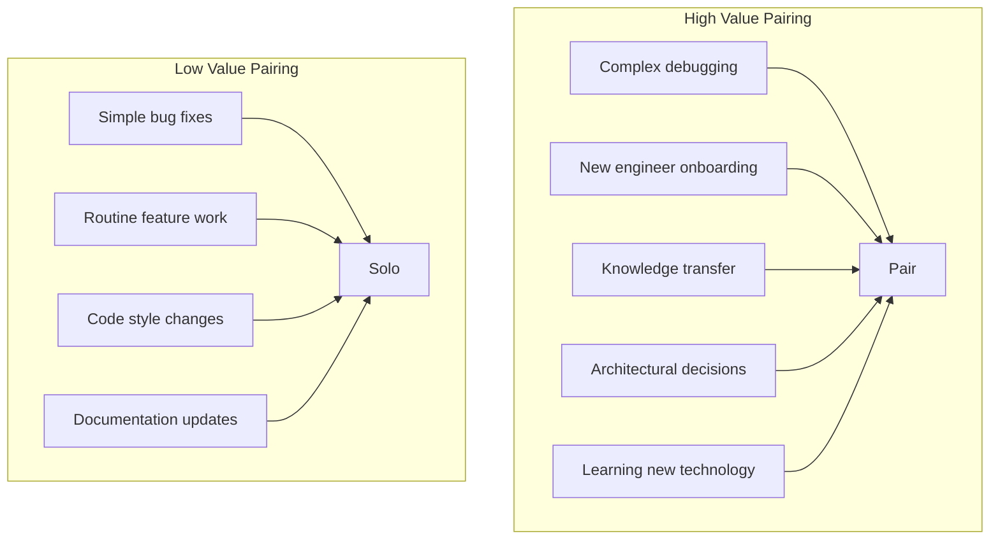

# Pair Programming

> **Core skill:** Senior engineers use pair programming as an intensive mentoring tool for knowledge transfer, complex problem-solving, and onboarding.

## Why This Matters

Pair programming is two engineers working together at one workstation (physical or virtual). It is the most intensive form of technical mentoring and collaboration.

When done well, pair programming:
- **Transfers knowledge** faster than any other method
- **Catches bugs** before they reach code review
- **Builds shared ownership** of code and systems
- **Onboards new engineers** quickly
- **Solves complex problems** through collaborative thinking

When done poorly, it is exhausting, unproductive, and frustrating.

## When to Pair



**Pair when:**
- The problem is complex or ambiguous
- Knowledge needs to be transferred
- A new engineer is learning the codebase
- The design decision affects multiple systems
- Two different skill sets are needed (e.g., frontend + backend)

**Do not pair when:**
- The task is straightforward and well-defined
- Both engineers already know the code well
- The work is repetitive (refactoring, style fixes)
- Either engineer needs focused, uninterrupted time

## Pairing Styles

### Style 1: Driver-Navigator

**Driver:** Types the code; focuses on implementation details.
**Navigator:** Reviews each line; thinks about the big picture; catches errors.

**Roles:**
| Role | Focus | Responsibilities |
|------|-------|-----------------|
| **Driver** | Implementation | Type code, explain what you are doing, ask questions |
| **Navigator** | Strategy | Review code, suggest improvements, think ahead, catch bugs |

**Rotation:** Switch roles every 20-30 minutes to keep both engaged.

**Best for:** Knowledge transfer, onboarding, complex problems.

### Style 2: Ping-Pong

**Process:**
1. Engineer A writes a failing test
2. Engineer B makes the test pass
3. Engineer B writes the next failing test
4. Engineer A makes it pass
5. Repeat

**Benefits:**
- Enforces test-driven development
- Both engineers stay engaged
- Clear handoff points

**Best for:** Test-driven development, building features with clear acceptance criteria.

### Style 3: Strong-Style Pairing

**Navigator:** Directs the implementation at a high level.
**Driver:** Types exactly what the navigator says, without questioning.

**Rules:**
- The driver trusts the navigator completely
- The driver types what they are told, even if they disagree
- Discussion happens after the implementation, not during

**Benefits:**
- Forces the navigator to think clearly and communicate precisely
- Prevents the driver from going off on tangents
- Builds trust and communication

**Best for:** Experienced pairs, complex refactoring, when one person has a clear vision.

### Style 4: Remote Pairing

**Tools:**
- Screen sharing (Zoom, Google Meet, Tuple)
- Shared IDE (VS Code Live Share, JetBrains Code With Me)
- Voice communication (always-on audio)

**Challenges:**
- Latency and connection issues
- Harder to read body language
- Easier to get distracted

**Best practices:**
- Use a high-quality microphone and camera
- Share your screen, not just the IDE
- Take breaks every 45-60 minutes
- Use a collaborative tool (Live Share) instead of just screen sharing

## Pairing as Mentoring

### Senior + Junior Pairing

**Goals:**
- Transfer knowledge about the codebase and practices
- Build the junior engineer confidence and judgment
- Model problem-solving approaches

**Approach:**
1. **Start with the junior as driver:** Let them type; you navigate
2. **Ask guiding questions:** "What do you think happens if...?"
3. **Explain your thinking:** "I am checking this because..."
4. **Share context:** "We chose this pattern because..."
5. **Gradually increase complexity:** Start with simple tasks, move to harder ones

**Avoid:**
- Taking over the keyboard (let them drive)
- Solving the problem for them (guide, do not tell)
- Moving too fast (match their pace)
- Criticizing mistakes (treat them as learning opportunities)

### Senior + Senior Pairing

**Goals:**
- Solve complex problems through collaborative thinking
- Challenge each other assumptions
- Combine different expertise

**Approach:**
1. **Discuss the problem first:** Align on the goal and constraints
2. **Take turns driving:** Each person brings their perspective
3. **Challenge assumptions:** "What if we tried...?" "Why not...?"
4. **Debate design decisions:** Use the pairing session to work through trade-offs

**Benefits:**
- Two experienced perspectives catch more issues
- Faster problem-solving for complex issues
- Cross-pollination of ideas and techniques

## Pairing Session Structure

### Before the Session

1. **Define the goal:** What are we trying to accomplish?
2. **Set a time limit:** 90 minutes is a good maximum (with breaks)
3. **Prepare the environment:** Ensure both people have access to the code, tools, and documentation
4. **Agree on the approach:** Driver-navigator? Ping-pong? Strong-style?

### During the Session

1. **Start with context:** Brief discussion of the problem and approach
2. **Work in focused intervals:** 25-45 minutes of pairing, then a 5-minute break
3. **Rotate roles:** Switch driver/navigator every 20-30 minutes
4. **Communicate constantly:** The driver explains what they are doing; the navigator provides feedback
5. **Take breaks:** Stand up, stretch, get water

### After the Session

1. **Review what was accomplished:** Does it meet the goal?
2. **Discuss what was learned:** What did each person take away?
3. **Plan next steps:** What remains to be done?
4. **Provide feedback:** What worked well? What could be improved?

## Pairing Etiquette

### For the Driver

| Do | Do Not |
|----|--------|
| Explain what you are typing | Type in silence |
| Ask for input when stuck | Struggle alone |
| Accept suggestions gracefully | Get defensive about your code |
| Take breaks when tired | Push through fatigue |
| Trust the navigator suggestions | Second-guess every suggestion |

### For the Navigator

| Do | Do Not |
|----|--------|
| Review each line as it is typed | Wait until the end to review |
| Ask questions to guide thinking | Dictate every keystroke |
| Point out potential issues | Criticize every mistake |
| Think ahead about edge cases | Get distracted by your phone |
| Offer to switch roles when the driver is stuck | Take over the keyboard |

## Measuring Pairing Effectiveness

### Quantitative Indicators

| Metric | What it shows |
|--------|--------------|
| **Defect rate** | Paired code should have fewer bugs |
| **Code review comments** | Paired code should need fewer review comments |
| **Onboarding time** | New engineers who pair should onboard faster |
| **Knowledge distribution** | More people should understand the system after pairing |

### Qualitative Indicators

| Indicator | What it shows |
|-----------|--------------|
| **Participant feedback** | "I learned a lot" vs "This was a waste of time" |
| **Engagement level** | Both people actively participating vs one person disengaged |
| **Knowledge transfer** | Can the junior engineer explain what they learned? |
| **Relationship building** | Do people seek out pairing with each other? |

## Pairing Anti-Patterns

| Anti-Pattern | Problem | Better Approach |
|--------------|---------|-----------------|
| **Backseat navigating** | Navigator constantly criticizes; driver feels micromanaged | Ask questions; offer suggestions respectfully |
| **Keyboard hogging** | One person never gives up the keyboard | Rotate roles regularly; use a timer |
| **Silent pairing** | No communication; two people working alone | Explain your thinking; ask questions |
| **Marathon sessions** | Pairing for 4+ hours without breaks | Limit to 90 minutes; take breaks every 45 minutes |
| **Pairing on everything** | Exhausting; reduces individual productivity | Pair selectively on high-value activities |
| **Mismatched pace** | Senior moves too fast for junior to follow | Match the junior pace; explain more |

## Practical Applications

### Pairing Session Checklist

Before starting a pairing session, verify:

- [ ] We have a clear goal for this session
- [ ] We have agreed on the pairing style (driver-navigator, ping-pong, etc.)
- [ ] Both people have access to the code and tools
- [ ] We have set a time limit (90 minutes maximum)
- [ ] We have planned breaks every 45 minutes
- [ ] We have a quiet, distraction-free environment
- [ ] We have agreed to rotate roles regularly

### Pairing Request Template

```markdown
## Pairing Request

**Goal:** [What we want to accomplish]

**Context:** [Background on the problem or feature]

**Estimated time:** [90 minutes / 2 hours]

**Pairing style:** [Driver-navigator / Ping-pong / Strong-style]

**Who should drive first:** [Name]

**Prerequisites:**
- [ ] Access to [system/codebase]
- [ ] Familiarity with [technology/pattern]
- [ ] Reviewed [documentation/design doc]

**Success criteria:**
- [ ] [Specific outcome 1]
- [ ] [Specific outcome 2]
```

## Success Indicators

- Both participants report learning something valuable
- Paired code has fewer bugs and review comments
- New engineers onboard faster through pairing
- Knowledge is distributed across the team
- People seek out pairing for complex problems
- Pairing sessions are energizing, not exhausting
- Junior engineers become confident and independent

## Related Topics

- [[01_Technical_Mentoring|Technical Mentoring]]: Pairing is intensive mentoring
- [[02_Code_Reviews_as_Teaching|Code Reviews as Teaching]]: Reviews and pairing complement each other
- [[06_Psychological_Safety|Psychological Safety]]: Pairing requires trust and safety
- [[04_Effective_Feedback|Effective Feedback]]: Pairing involves continuous real-time feedback

## Summary

Pair programming is the most intensive form of technical mentoring. Senior engineers use it selectively for complex problems, knowledge transfer, and onboarding. They choose the right pairing style (driver-navigator, ping-pong, strong-style), communicate constantly, rotate roles, and take breaks. Effective pairing transfers knowledge faster than any other method, catches bugs early, and builds shared ownership. The key is to pair selectively on high-value activities, not on everything.
