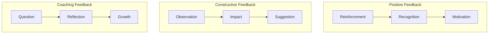

# Effective Feedback

> **Core skill:** Senior engineers give feedback that is specific, actionable, and delivered in a way that promotes growth rather than defensiveness.

## Why This Matters

Feedback is how people learn. Without it, engineers repeat mistakes, miss opportunities for improvement, and stagnate in their careers. But poorly delivered feedback damages relationships, creates defensiveness, and shuts down learning.

Senior engineers give feedback that people actually act on. They are specific, timely, and focused on behavior rather than personality.

## Feedback Types



**Positive feedback** reinforces good behavior. **Constructive feedback** identifies areas for improvement. **Coaching feedback** guides self-discovery.

## Feedback Framework

### The SBI Model (Situation-Behavior-Impact)

**Structure:**
1. **Situation:** When and where did this happen?
2. **Behavior:** What specific behavior did you observe?
3. **Impact:** What was the effect of that behavior?

**Example:**
```
Situation: "In yesterday's design review..."
Behavior: "...you presented three options with clear trade-offs..."
Impact: "...which helped the team make an informed decision quickly."
```

**Why it works:** Focuses on observable behavior, not personality. Makes feedback specific and actionable.

### The Feedforward Model

**Focus:** Future behavior, not past mistakes.

**Structure:**
1. **What worked:** Acknowledge what they did well
2. **What to try next time:** Suggest a specific improvement
3. **Why it matters:** Explain the benefit

**Example:**
```
What worked: "Your code review comments were thorough and caught several edge cases."
What to try next time: "Next time, consider starting with a question to guide the author's thinking."
Why it matters: "Questions help authors develop their own judgment, not just follow your suggestions."
```

**Why it works:** Forward-looking; less likely to trigger defensiveness.

## Giving Positive Feedback

### Why Positive Feedback Matters

Most engineers receive far more corrective feedback than positive feedback. This creates a negativity bias where people feel they are always doing something wrong.

**Positive feedback:**
- Reinforces good behavior (people do more of what is recognized)
- Builds confidence and motivation
- Strengthens relationships
- Creates a culture of appreciation

### Effective Positive Feedback

**Principles:**

| Principle | Weak Example | Strong Example |
|-----------|-------------|----------------|
| **Be specific** | "Good job" | "Your error handling in the payment service caught a race condition that would have caused duplicate charges" |
| **Explain the impact** | "Nice code" | "Your clear function names and comments made it easy for me to understand the logic and review quickly" |
| **Be timely** | (Feedback 3 months later) | (Feedback within 24 hours) |
| **Be genuine** | (Generic praise) | (Specific observation about something you genuinely appreciated) |

**Examples:**
```
"In the incident response yesterday, your calm approach and systematic
debugging helped the team stay focused. We resolved the issue in 20
minutes instead of the usual hour."

"Your design document for the user service was excellent. The clear
problem statement, three options with trade-offs, and recommendation
with rationale made the decision easy. This is the standard I want
to see."

"I noticed you took time to explain the caching strategy to the new
engineer during the code review. That kind of mentoring is exactly
what builds a strong team."
```

## Giving Constructive Feedback

### Principles

| Principle | Why it matters |
|-----------|----------------|
| **Be specific** | Vague feedback is not actionable |
| **Focus on behavior, not personality** | People can change behavior; personality is fixed |
| **Be timely** | Feedback loses impact over time |
| **Be private** | Public criticism damages trust and creates defensiveness |
| **Be actionable** | Suggest what to do differently, not just what was wrong |
| **Be balanced** | Mix constructive with positive feedback |

### Constructive Feedback Examples

**Weak:**
```
"Your code is messy."
"You are not a good communicator."
"You need to be more careful."
```

**Strong:**
```
Situation: "In the pull request for the checkout feature..."
Behavior: "...the main function is 150 lines long and does five different things..."
Impact: "...which makes it hard to test and increases the risk of bugs when modifying it."
Suggestion: "Consider splitting it into smaller functions, each with a single responsibility."

Situation: "In yesterday's standup..."
Behavior: "...you gave a technical update that included database schema details and API response formats..."
Impact: "...which made it hard for the product manager to understand the status and blockers."
Suggestion: "Try structuring updates as: what you accomplished, what you are working on, and any blockers. Save technical details for the engineering channel."
```

### The Feedback Conversation

**Structure:**

1. **Set the context:** "I have some feedback on [situation]. Do you have a few minutes?"
2. **Describe the behavior:** Use SBI model (Situation-Behavior-Impact)
3. **Ask for their perspective:** "What was your thinking?" or "How did you see it?"
4. **Discuss the impact:** Help them understand the effect of their behavior
5. **Agree on next steps:** "What would you do differently next time?"
6. **Offer support:** "How can I help you with this?"

**Example conversation:**
```
You: "I have some feedback on the incident response yesterday. Do you have a few minutes?"

Them: "Sure."

You: "When the database went down, you jumped straight into debugging without
communicating to the team what was happening. The impact was that three other
engineers were also investigating, duplicating effort, and the incident took
longer to resolve."

Them: "I was trying to fix it quickly before it affected more users."

You: "I understand the urgency. What if next time you posted a quick message
in the incident channel: 'Database issue detected. I am investigating. Will
update in 5 minutes.' That way, others know someone is on it and can focus
on other work."

Them: "That makes sense. I will try that next time."

You: "Great. Want me to share our incident response playbook so you can see
the communication steps?"
```

## Receiving Feedback

### Principles

| Principle | Why it matters |
|-----------|----------------|
| **Assume positive intent** | The person is trying to help you improve |
| **Listen without interrupting** | Understand their perspective fully |
| **Ask clarifying questions** | "Can you give me a specific example?" |
| **Thank them** | Feedback is a gift; acknowledge the effort |
| **Reflect before responding** | Do not react defensively in the moment |
| **Act on it** | Show that you take feedback seriously |

### Receiving Feedback Script

```
"Thank you for the feedback. Let me make sure I understand:

You are saying that [paraphrase the feedback].

Is that right?

Can you give me a specific example so I can understand better?

What would you suggest I do differently?

I appreciate you taking the time to share this. I will think about it
and work on it."
```

### Handling Defensive Reactions

**If you feel defensive:**
1. **Pause:** Take a breath before responding
2. **Acknowledge the feeling:** "I am feeling defensive right now. Let me take a moment."
3. **Reframe:** "This person is trying to help me improve, not attack me."
4. **Ask questions:** Shift from defending to understanding

**If the other person becomes defensive:**
1. **Acknowledge their perspective:** "I can see this is surprising. Let me explain why I am sharing this."
2. **Reaffirm your intent:** "My goal is to help you succeed, not criticize you."
3. **Focus on the future:** "What can we do differently next time?"

## Feedback in Different Contexts

### Code Reviews

**Principles:**
- Focus on the code, not the person
- Use questions to guide thinking
- Explain the "why" behind suggestions
- Acknowledge good work

**Example:**
```
Instead of: "This function is too long."

Try: "This function is doing three things: fetching data, validating it,
and writing to the database. Consider splitting it into three functions.
This would make each step independently testable and easier to understand.
Here is an example of how you might structure it: [code snippet]"
```

### 1:1 Meetings

**Principles:**
- Make feedback a regular part of 1:1s, not a surprise
- Mix positive and constructive feedback
- Focus on growth and development
- Ask for feedback in return

**Example:**
```
"I want to share some feedback from the last sprint.

Positive: Your design document for the search feature was excellent.
The clear problem statement and trade-off analysis helped the team
make a quick decision.

Constructive: I noticed you have been working late to finish tasks.
I am concerned about sustainability. What can we do to make the
workload more manageable? Should we break tasks into smaller pieces
or push back on deadlines?"
```

### Performance Reviews

**Principles:**
- No surprises: feedback should be ongoing, not saved for reviews
- Use specific examples from the review period
- Focus on behaviors and outcomes, not personality
- Collaborate on development goals

**Example:**
```
"Over the past six months, you have made significant contributions:

Strengths:
- Your refactoring of the payment service reduced bugs by 40%
- You mentored two junior engineers, both of whom were promoted
- Your design documents are consistently clear and well-reasoned

Development areas:
- Your presentations to non-technical stakeholders could be more
  accessible. Consider using analogies and avoiding jargon.
- You tend to take on too much yourself. Work on delegating more
  to the team.

Goals for next period:
- Lead one cross-team initiative to build your influence
- Present at two company-wide meetings to improve communication skills
- Delegate 30% of your current tasks to mid-level engineers"
```

## Feedback Anti-Patterns

| Anti-Pattern | Problem | Better Approach |
|--------------|---------|-----------------|
| **Feedback sandwich** | Positive-negative-positive dilutes the message | Be direct; mix feedback types across conversations |
| **Vague feedback** | Not actionable | Use SBI model; be specific |
| **Delayed feedback** | Loses impact; feels like a surprise attack | Give feedback within 24-48 hours |
| **Public criticism** | Damages trust; creates defensiveness | Give constructive feedback privately |
| **Personality feedback** | Not actionable; feels like an attack | Focus on observable behavior |
| **Only negative feedback** | Demoralizing; creates negativity bias | Balance with positive feedback |
| **Not asking for their perspective** | Misses context; feels one-sided | Ask "What was your thinking?" |

## Practical Applications

### Feedback Checklist

Before giving feedback, verify:

- [ ] I have a specific example (situation, behavior, impact)
- [ ] I am focusing on behavior, not personality
- [ ] I am giving feedback in a timely manner (within 48 hours)
- [ ] I am giving constructive feedback privately
- [ ] I have a suggestion for what to do differently
- [ ] I am prepared to ask for their perspective
- [ ] I am ready to offer support and help

### Feedback Conversation Template

```markdown
## Feedback Conversation

### Context
[When and where to have the conversation]

### Opening
"I have some feedback on [situation]. Do you have a few minutes?"

### Observation (SBI Model)
**Situation:** [When and where]
**Behavior:** [What you observed]
**Impact:** [What was the effect]

### Their Perspective
"What was your thinking?" or "How did you see it?"

### Discussion
[Explore the issue together; understand their perspective]

### Next Steps
"What would you do differently next time?"
"How can I help you with this?"

### Closing
"Thank you for the conversation. I appreciate your openness to feedback."
```

## Success Indicators

- People seek your feedback because they find it valuable
- Feedback leads to observable behavior changes
- Team members give each other feedback regularly
- Feedback conversations are collaborative, not adversarial
- People thank you for feedback, even when it is constructive
- The team has a culture of continuous improvement

## Related Topics

- [[01_Technical_Mentoring|Technical Mentoring]]: Feedback is essential for mentoring
- [[02_Code_Reviews_as_Teaching|Code Reviews as Teaching]]: Code reviews are a primary feedback channel
- [[05_Coaching_and_Development|Coaching and Development]]: Feedback supports career development
- [[06_Psychological_Safety|Psychological Safety]]: Feedback requires a safe environment

## Summary

Effective feedback is specific, timely, and focused on behavior rather than personality. Senior engineers use the SBI model (Situation-Behavior-Impact) to give feedback that people actually act on. They balance positive and constructive feedback, give feedback privately, and ask for the other person's perspective. They also receive feedback gracefully, assuming positive intent and acting on it. Feedback is the primary mechanism for helping engineers grow, and senior engineers make it a regular, valued part of team culture.
