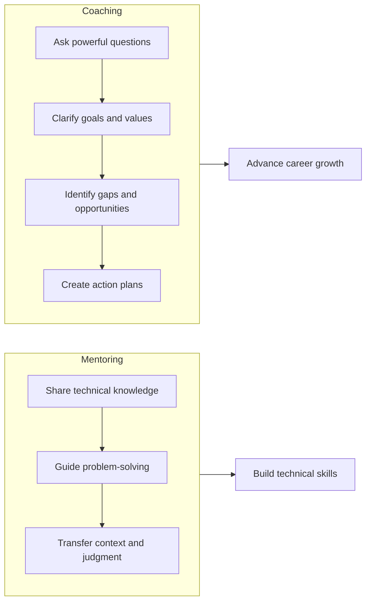

# Coaching and Development

> **Core skill:** Senior engineers help others grow their careers through structured coaching, development planning, and advocacy.

## Why This Matters

Mentoring focuses on technical skills. Coaching focuses on career growth. Senior engineers who coach others help them navigate career decisions, develop leadership skills, and achieve promotion readiness.

Coaching is not about telling people what to do. It is about asking questions that help them clarify their goals, identify gaps, and create action plans.

## Coaching vs Mentoring



**Mentoring:** "Here is how to solve this problem."
**Coaching:** "What problem do you want to solve, and what is holding you back?"

## The GROW Model

**Structure for coaching conversations:**

1. **Goal:** What do you want to achieve?
2. **Reality:** Where are you now?
3. **Options:** What could you do?
4. **Will:** What will you do?

### Example Coaching Conversation

**Goal:**
```
Coach: "What would you like to work on in the next six months?"
Engineer: "I want to be promoted to senior engineer."
Coach: "What does being a senior engineer mean to you?"
Engineer: "Owning larger features, mentoring others, and influencing technical decisions."
```

**Reality:**
```
Coach: "Where are you now in terms of those three areas?"
Engineer: "I own small features well, but I have not led anything large.
I have helped onboard one new engineer, but not formally mentored.
I contribute to discussions, but rarely drive decisions."
Coach: "What feedback have you received about your readiness?"
Engineer: "My manager says I need more cross-team impact."
```

**Options:**
```
Coach: "What could you do to build those capabilities?"
Engineer: "I could volunteer to lead the API migration project.
I could ask to mentor the next new hire. I could propose a technical
initiative in the next planning session."
Coach: "What else? What would stretch you?"
Engineer: "I could present at the next engineering all-hands about
the refactoring I did last quarter."
```

**Will:**
```
Coach: "Which of these will you commit to?"
Engineer: "I will ask my manager about leading the API migration.
I will volunteer to mentor the next new hire. And I will submit a
talk proposal for the all-hands."
Coach: "By when?"
Engineer: "By the end of this week."
Coach: "How can I help?"
Engineer: "Can you review my talk proposal before I submit it?"
```

## Development Planning

### Individual Development Plan (IDP)

**Template:**
```markdown
## Individual Development Plan: [Engineer Name]

### Current Level
[Current role and level]

### Target Level
[Desired role and level within 12-18 months]

### Strengths
- [Strength 1]
- [Strength 2]
- [Strength 3]

### Development Areas
| Area | Current Level | Target Level | Actions | Timeline |
|------|---------------|--------------|---------|----------|
| [Area 1] | [Current] | [Target] | [Specific actions] | [When] |
| [Area 2] | [Current] | [Target] | [Specific actions] | [When] |

### Learning Resources
- [Course, book, or mentor for each area]

### Success Metrics
- [How we will measure progress]

### Review Cadence
- [Monthly/quarterly check-ins]
```

### Development Areas for Engineers

**Junior to Mid-Level:**

| Area | Development Actions |
|------|-------------------|
| **Technical depth** | Own a feature end-to-end; learn testing best practices |
| **Code quality** | Write clean, maintainable code; pass code reviews with minimal comments |
| **Debugging** | Independently diagnose production issues |
| **Communication** | Write clear PR descriptions and technical documentation |
| **Collaboration** | Participate actively in code reviews and design discussions |

**Mid-Level to Senior:**

| Area | Development Actions |
|------|-------------------|
| **Technical ownership** | Own a system or service; make architectural decisions |
| **Mentoring** | Mentor at least one junior engineer |
| **Influence** | Drive technical decisions across teams |
| **Communication** | Present at engineering all-hands; write design documents |
| **Delivery** | Lead a cross-team initiative; manage dependencies |
| **Strategic thinking** | Propose technical initiatives that align with business goals |

**Senior to Staff/Principal:**

| Area | Development Actions |
|------|-------------------|
| **Technical vision** | Define technical direction for a domain or the organization |
| **Cross-org impact** | Lead initiatives that span multiple teams or the entire company |
| **Thought leadership** | Write blog posts, speak at conferences, contribute to open source |
| **Organizational influence** | Shape engineering culture, practices, and hiring |
| **Business alignment** | Connect technical decisions to business outcomes |

## Coaching Techniques

### 1. Powerful Questions

**Questions that prompt reflection and action:**

| Category | Questions |
|----------|-----------|
| **Clarifying goals** | "What does success look like for you?" "What would make this role fulfilling?" |
| **Exploring reality** | "What is working well? What is not?" "What feedback have you received?" |
| **Generating options** | "What could you do differently?" "What would you try if you knew you could not fail?" |
| **Identifying obstacles** | "What is holding you back?" "What would need to change?" |
| **Committing to action** | "What will you do by when?" "How will you know you have succeeded?" |

### 2. Active Listening

**Techniques:**
- **Paraphrase:** "So what I am hearing is..."
- **Reflect feelings:** "It sounds like you are frustrated because..."
- **Ask for examples:** "Can you give me a specific example?"
- **Notice what is not said:** "You have not mentioned X. Is that a concern?"

### 3. Accountability

**Strategies:**
- Set specific, measurable goals with deadlines
- Check in regularly on progress
- Celebrate wins and acknowledge effort
- Explore obstacles when progress stalls
- Adjust plans when circumstances change

### 4. Advocacy

**How senior engineers advocate for others:**
- **Visibility:** Recommend them for high-visibility projects
- **Sponsorship:** Mention their work to leadership
- **Opportunities:** Nominate them for conferences, talks, or awards
- **Feedback:** Provide specific examples of their impact for promotion cases
- **Connections:** Introduce them to people who can help their career

## Coaching Conversations

### Career Planning Conversation

**When:** Annually or when the engineer is considering a career move.

**Questions to explore:**
- "What kind of work energizes you? What drains you?"
- "Where do you see yourself in 2-3 years? What role, what impact?"
- "What skills do you want to develop? What experiences do you want to have?"
- "What does success mean to you? Is it technical depth, leadership, impact, work-life balance?"
- "What would need to be true for you to stay at this company long-term?"

### Performance Improvement Conversation

**When:** An engineer is not meeting expectations.

**Approach:**
1. **Clarify expectations:** "What are the expectations for your role?"
2. **Identify gaps:** "Where are you meeting expectations? Where are you falling short?"
3. **Explore root causes:** "What is making this difficult? Is it skills, resources, motivation, or something else?"
4. **Create a plan:** "What specific actions will help you close the gap?"
5. **Provide support:** "What do you need from me or the team?"
6. **Set check-ins:** "Let us meet in two weeks to review progress."

### Promotion Readiness Conversation

**When:** An engineer is close to promotion and wants to know what is missing.

**Questions to explore:**
- "What are the expectations for the next level?"
- "Where are you already demonstrating next-level behaviors?"
- "What gaps remain? What evidence do you need to build?"
- "Who can provide the opportunities you need?"
- "What would make your promotion case compelling?"

## Coaching Anti-Patterns

| Anti-Pattern | Problem | Better Approach |
|--------------|---------|-----------------|
| **Telling instead of asking** | Creates dependency; does not build self-awareness | Ask powerful questions; let them discover |
| **Vague goals** | Not actionable; hard to measure | Use SMART goals (Specific, Measurable, Achievable, Relevant, Time-bound) |
| **No follow-up** | Goals are forgotten; no accountability | Schedule regular check-ins |
| **Ignoring obstacles** | Plans fail when obstacles are not addressed | Explore obstacles; adjust plans |
| **One-size-fits-all** | Different people need different coaching | Adapt to their goals, style, and situation |
| **Confusing coaching with managing** | Coaching is development; managing is evaluation | Focus on growth, not performance rating |

## Practical Applications

### Coaching Session Template

```markdown
## Coaching Session: [Date]

### Check-in (5 min)
- How are things going?
- What is on your mind?

### Progress Review (10 min)
- What progress have you made on your goals?
- What worked well? What was challenging?

### Coaching Focus (30 min)
- [Topic or question to explore]
- [Use GROW model or powerful questions]

### Action Plan (10 min)
- What will you do before our next session?
- By when?
- What support do you need?

### Closing (5 min)
- What was most valuable about this conversation?
- Anything else you want to discuss?
```

### Development Plan Review Checklist

Review quarterly:

- [ ] Are the goals still relevant and motivating?
- [ ] Is the engineer making progress?
- [ ] Are there new obstacles to address?
- [ ] Do we need to adjust the plan?
- [ ] Are there new opportunities to pursue?
- [ ] Is the engineer getting the support they need?

## Success Indicators

- Engineers you coach are promoted or take on new challenges
- Engineers articulate clear career goals and action plans
- Engineers seek your coaching advice regularly
- Engineers develop self-awareness and take ownership of their growth
- The team has a culture of continuous development
- Engineers stay at the company because they see a path for growth

## Related Topics

- [[01_Technical_Mentoring|Technical Mentoring]]: Mentoring builds technical skills; coaching builds career skills
- [[04_Effective_Feedback|Effective Feedback]]: Feedback is essential for coaching
- [[07_Leading_Without_Authority|Leading Without Authority]]: Coaching is a form of leadership without formal authority
- [[06_Psychological_Safety|Psychological Safety]]: Coaching requires trust and safety

## Summary

Coaching and development is helping engineers grow their careers through powerful questions, development planning, and advocacy. Senior engineers use the GROW model (Goal-Reality-Options-Will) to guide coaching conversations. They help engineers identify development areas, create action plans, and provide opportunities and visibility. Coaching is not about telling people what to do; it is about helping them clarify their goals and take ownership of their growth.
