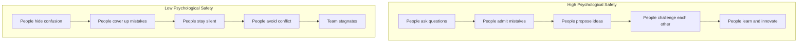

# Psychological Safety

> **Core skill:** Senior engineers create environments where people feel safe to take risks, ask questions, admit mistakes, and share ideas without fear of embarrassment or punishment.

## Why This Matters

Google's Project Aristotle found that psychological safety was the #1 predictor of team effectiveness. Teams with high psychological safety:
- **Learn faster** because people ask questions and share mistakes
- **Innovate more** because people propose ideas without fear of ridicule
- **Catch bugs earlier** because people speak up about concerns
- **Collaborate better** because people trust each other

Psychological safety is not about being nice or avoiding conflict. It is about creating a culture where people can be vulnerable, take risks, and learn from failures.

## What Psychological Safety Looks Like



## Building Psychological Safety

### 1. Model Vulnerability

**What senior engineers do:**
- **Admit mistakes:** "I broke production last week. Here is what I learned."
- **Ask for help:** "I do not understand this. Can someone explain?"
- **Share uncertainties:** "I am not sure this is the right approach. What do you think?"
- **Acknowledge gaps:** "I have not worked with this technology before. Can you walk me through it?"

**Why it works:** When senior engineers show vulnerability, it signals that it is safe for everyone else to do the same.

### 2. Respond to Mistakes with Curiosity, Not Blame

**Weak response:**
```
"Who broke the build?"
"Why did you not test this?"
"This is unacceptable."
```

**Strong response:**
```
"What happened? Let us understand the system, not the person."
"What can we learn from this?"
"How can we prevent this in the future?"
```

**Blameless postmortems:**
- Focus on the system and process, not the person
- Ask "what" and "how" questions, not "who" and "why"
- Identify contributing factors, not a single root cause
- Share learnings with the entire organization

### 3. Invite Participation

**Techniques:**
- **Round-robin:** "Let us go around the table. What is your perspective?"
- **Silent brainstorming:** "Take 5 minutes to write down your ideas, then we will share."
- **Explicit invitation:** "Sarah, you have worked on similar systems. What do you think?"
- **Amplify quiet voices:** "I want to make sure we hear from everyone. Does anyone have a different perspective?"

**Why it works:** Ensures all voices are heard, not just the loudest or most confident.

### 4. Celebrate Learning, Not Just Success

**What to celebrate:**
- **Experiments:** "We tried a new approach. It did not work, but we learned X."
- **Questions:** "Great question. I had not thought of that."
- **Mistakes with learnings:** "The deployment failed, but we caught it quickly and learned to add a pre-deploy check."
- **Vulnerability:** "Thank you for sharing that. It helps us all learn."

**Why it works:** Signals that learning and growth are valued more than appearing perfect.

### 5. Establish Clear Norms

**Team norms that build safety:**

| Norm | Example |
|------|---------|
| **Assume positive intent** | "I believe you are trying to help, even if I disagree." |
| **Focus on the problem, not the person** | "This code has a bug" not "You wrote buggy code." |
| **Disagree respectfully** | "I see it differently because..." not "You are wrong." |
| **Ask questions before judging** | "Can you help me understand your thinking?" |
| **Share credit and blame** | "We succeeded together" and "We failed together." |

## Psychological Safety in Different Contexts

### Code Reviews

**Build safety by:**
- Framing comments as questions or suggestions, not commands
- Acknowledging good work, not just problems
- Explaining the "why" behind feedback
- Using "we" language ("We could improve this by...")
- Avoiding absolute language ("This is wrong" vs "This might cause issues")

**Example:**
```
Weak: "This is wrong. Fix it."

Strong: "I see a potential issue here. What happens if the external
service times out? Should we add a timeout and retry logic? Here is
an example of how we handle this in other services: [link]"
```

### Incident Response

**Build safety by:**
- Conducting blameless postmortems
- Focusing on system failures, not human errors
- Sharing incident reports openly
- Celebrating people who speak up about issues
- Implementing systemic fixes, not just retraining individuals

**Example postmortem:**
```markdown
## Incident: Database Outage

### What happened
The primary database became unresponsive for 15 minutes, causing
checkout failures.

### Contributing factors
1. Connection pool exhausted due to slow queries
2. No alerting on connection pool usage
3. Runbook for database issues was outdated

### What went well
- On-call engineer responded within 2 minutes
- Team communicated clearly in the incident channel
- Service recovered automatically after connection pool reset

### What we learned
- We need alerting on connection pool metrics
- Slow queries should be automatically killed after 30 seconds
- Runbooks need to be tested quarterly

### Action items
- [ ] Add connection pool alerting - Owner: [Name]
- [ ] Implement slow query killer - Owner: [Name]
- [ ] Schedule quarterly runbook testing - Owner: [Name]
```

### Retrospectives

**Build safety by:**
- Using anonymous feedback tools for sensitive topics
- Starting with positive observations before discussing problems
- Focusing on systems and processes, not individuals
- Following up on action items (shows feedback is valued)
- Rotating facilitators (prevents one person from dominating)

**Retrospective format:**
```
1. What went well? (5 min)
2. What could be improved? (10 min)
3. What did we learn? (5 min)
4. What will we do differently? (10 min)
```

### 1:1 Meetings

**Build safety by:**
- Asking open-ended questions ("How are you feeling about your work?")
- Listening more than talking
- Acknowledging emotions ("It sounds like you are frustrated")
- Following up on concerns ("Last time you mentioned X. How is that going?")
- Being transparent about your own challenges

## Measuring Psychological Safety

### Team Survey Questions

Ask team members to rate (1-5 scale):

1. "I feel safe taking risks on this team."
2. "I can ask questions without feeling embarrassed."
3. "People on this team accept me for who I am."
4. "I can admit mistakes without fear of punishment."
5. "My ideas are heard and considered."
6. "I feel comfortable disagreeing with others."
7. "We learn from failures, not blame people."

### Behavioral Indicators

| High Safety | Low Safety |
|-------------|------------|
| People ask questions in meetings | People stay silent when confused |
| Mistakes are reported quickly | Mistakes are hidden or covered up |
| People propose new ideas | People only suggest "safe" ideas |
| Disagreements are respectful | Conflict is avoided or becomes personal |
| Feedback is given and received | Feedback is rare or defensive |
| People collaborate across teams | People work in silos |

## Psychological Safety Anti-Patterns

| Anti-Pattern | Problem | Better Approach |
|--------------|---------|-----------------|
| **Blame culture** | People hide mistakes; do not learn | Blameless postmortems; focus on systems |
| **Punishing messengers** | People do not report problems | Thank people for raising issues |
| **Ridiculing ideas** | People stop proposing ideas | Acknowledge all ideas; discuss respectfully |
| **Favoring loud voices** | Quiet people disengage | Actively invite participation |
| **Ignoring emotions** | People feel unheard | Acknowledge feelings; show empathy |
| **Inconsistent standards** | Unfair; creates resentment | Apply norms consistently to everyone |
| **Performative safety** | Saying it is safe but punishing vulnerability | Model vulnerability; respond with curiosity |

## Practical Applications

### Psychological Safety Checklist

Assess your team's psychological safety:

- [ ] Do people ask questions when they are confused?
- [ ] Do people admit mistakes quickly?
- [ ] Do people propose new ideas?
- [ ] Do people disagree respectfully?
- [ ] Do we conduct blameless postmortems?
- [ ] Do we celebrate learning, not just success?
- [ ] Do we invite participation from everyone?
- [ ] Do we follow up on feedback and concerns?

### Building Safety Action Plan

```markdown
## Psychological Safety Action Plan

### Current State
[Assessment of team's psychological safety based on survey and observations]

### Goals
- [Goal 1: e.g., Increase incident reporting by 50%]
- [Goal 2: e.g., Ensure all voices are heard in meetings]
- [Goal 3: e.g., Conduct blameless postmortems for all incidents]

### Actions
| Action | Owner | Timeline | Success Metric |
|--------|-------|----------|----------------|
| Model vulnerability in team meetings | [Name] | Ongoing | People share mistakes openly |
| Implement blameless postmortems | [Name] | [Date] | All incidents have postmortems |
| Use round-robin in meetings | [Name] | Immediate | All voices heard |
| Celebrate learning in retrospectives | [Name] | Ongoing | Learning is acknowledged |

### Review
[When to review progress and adjust]
```

## Success Indicators

- People ask questions without hesitation
- Mistakes are reported quickly and openly
- People propose ideas, even if they might fail
- Disagreements are respectful and productive
- Team learns from failures, not just successes
- People say they feel safe and supported
- Retention and engagement are high

## Related Topics

- [[04_Effective_Feedback|Effective Feedback]]: Feedback requires psychological safety
- [[01_Technical_Mentoring|Technical Mentoring]]: Mentoring requires a safe environment for learning
- [[02_Code_Reviews_as_Teaching|Code Reviews as Teaching]]: Reviews require safety for honest feedback
- [[07_Leading_Without_Authority|Leading Without Authority]]: Building safety is a form of leadership

## Summary

Psychological safety is the foundation of high-performing teams. Senior engineers build safety by modeling vulnerability, responding to mistakes with curiosity instead of blame, inviting participation from everyone, celebrating learning, and establishing clear norms. Safety is not about being nice; it is about creating an environment where people can take risks, ask questions, admit mistakes, and share ideas. Teams with high psychological safety learn faster, innovate more, and deliver better outcomes.
