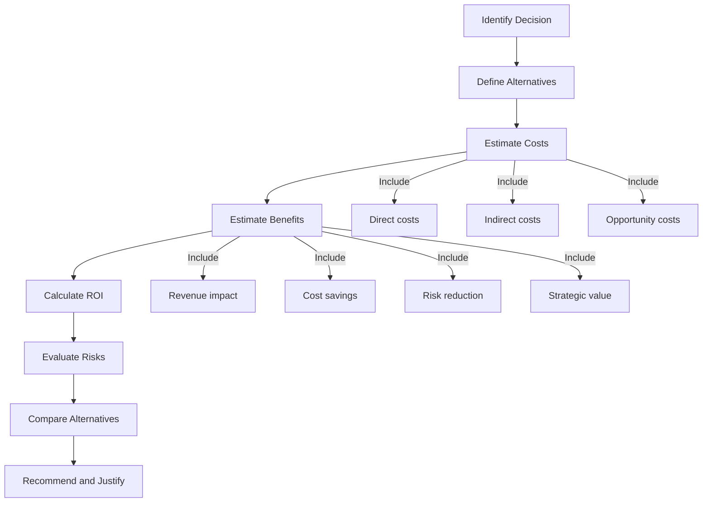

# Engineering Economics and Trade-Offs

> **Core skill:** Senior engineers make technical decisions with economic awareness, evaluating costs, benefits, risks, and trade-offs to maximize business value.

## Why This Matters

Every technical decision has economic implications. Senior engineers must:
- **Evaluate investments:** Compare the cost of building vs buying, refactoring vs maintaining, or adopting new technology
- **Quantify trade-offs:** Understand the financial impact of choosing speed over quality, or flexibility over simplicity
- **Build business cases:** Justify technical investments to non-technical stakeholders using ROI and cost-benefit analysis
- **Manage technical debt:** Treat debt as financial debt with interest payments and principal reduction strategies

Economic literacy separates engineers who make technically elegant decisions from those who make technically sound decisions that also serve the business.

## Key Concepts

```mermaid
flowchart TD
    subgraph Economic Literacy
        A[Cost-Benefit Analysis] --> B[Build vs Buy Decisions]
        B --> C[Technical Debt as Financial Debt]
        C --> D[Total Cost of Ownership]
        D --> E[Business Case Development]
        E --> F[Trade-Off Evaluation]
    end

    subgraph Application
        G[Technology Selection] --> H[Architecture Decisions]
        H --> I[Infrastructure Investment]
        I --> J[Process Improvement]
    end

    Economic Literacy --> Application
```

**Core topics:**

1. **Cost-Benefit Analysis:** Systematic evaluation of costs and benefits to compare alternatives
2. **Build vs Buy Decisions:** Framework for choosing between custom development and third-party solutions
3. **Technical Debt as Financial Debt:** Quantifying debt impact and planning paydown strategies
4. **Total Cost of Ownership:** Understanding all costs over the lifecycle of a system
5. **Business Case Development:** Building compelling arguments for technical investments
6. **Trade-Off Evaluation:** Structured approach to comparing alternatives with multiple criteria

## Senior-Level Economic Skills

| Skill | Mid-Level | Senior-Level |
|-------|-----------|--------------|
| **Cost estimation** | Estimates effort for tasks | Estimates total cost of ownership including hidden costs |
| **ROI calculation** | Understands basic ROI | Builds complex ROI models with risk adjustment |
| **Trade-off analysis** | Lists pros and cons | Uses weighted decision matrices and multi-criteria analysis |
| **Business justification** | Describes technical benefits | Translates technical value into business metrics (revenue, cost savings, risk reduction) |
| **Debt management** | Identifies technical debt | Quantifies debt interest and creates paydown plans with ROI |
| **Vendor evaluation** | Compares features | Evaluates TCO, vendor risk, and strategic alignment |

## Economic Decision Framework



**Process:**

1. **Identify the decision:** What are we trying to decide?
2. **Define alternatives:** What are the realistic options?
3. **Estimate costs:** Direct, indirect, and opportunity costs for each option
4. **Estimate benefits:** Revenue impact, cost savings, risk reduction, strategic value
5. **Calculate ROI:** Net present value, payback period, internal rate of return
6. **Evaluate risks:** What could go wrong? What is the probability and impact?
7. **Compare alternatives:** Use weighted decision matrices or multi-criteria analysis
8. **Recommend and justify:** Present the recommendation with clear business rationale

## Practical Applications

### When to Use Economic Analysis

| Decision Type | Economic Analysis Needed |
|---------------|-------------------------|
| **Technology adoption** | Compare build vs buy, evaluate TCO, assess vendor risk |
| **Architecture changes** | Estimate refactoring cost vs maintenance cost, calculate technical debt ROI |
| **Infrastructure investment** | Model capacity costs, compare cloud vs on-prem, evaluate scalability |
| **Process improvement** | Quantify productivity gains, calculate automation ROI |
| **Team expansion** | Model hiring costs, onboarding time, productivity ramp-up |
| **Tool adoption** | Compare licensing costs, integration effort, productivity impact |

### Economic Decision Checklist

Before making a significant technical decision:

- [ ] Have I identified all realistic alternatives?
- [ ] Have I estimated all costs (direct, indirect, opportunity)?
- [ ] Have I quantified benefits in business terms (revenue, cost savings, risk)?
- [ ] Have I calculated ROI, payback period, or NPV?
- [ ] Have I evaluated risks and their financial impact?
- [ ] Have I considered the time value of money?
- [ ] Have I compared alternatives using consistent criteria?
- [ ] Have I documented assumptions and uncertainties?
- [ ] Have I prepared a clear business case for stakeholders?

## Common Economic Pitfalls

| Pitfall | Problem | Better Approach |
|---------|---------|-----------------|
| **Ignoring opportunity costs** | Underestimates true cost of decisions | Include what you give up by choosing an option |
| **Sunk cost fallacy** | Continues investment because of past spending | Base decisions on future costs and benefits, not past spending |
| **Optimism bias** | Underestimates costs, overestimates benefits | Use reference class forecasting; add contingency buffers |
| **Ignoring hidden costs** | Underestimates TCO | Include maintenance, training, integration, and operational costs |
| **Short-term thinking** | Chooses cheap now, expensive later | Use multi-year TCO and NPV analysis |
| **Analysis paralysis** | Over-analyzes to avoid decisions | Use time-boxed analysis; accept uncertainty |

## Integration with Other Capabilities

- **[[04_Delivery_and_Execution/04_Technical_Debt_Strategy|Technical Debt Strategy]]:** Economic analysis justifies debt paydown
- **[[03_Architecture_and_Design_Judgment/00_overview|Architecture and Design Judgment]]:** Economic trade-offs inform architectural decisions
- **[[01_Technical_Ownership/00_overview|Technical Ownership]]:** Owners understand the economic impact of their systems
- **[[06_Communication_and_Influence/02_Stakeholder_Communication|Stakeholder Communication]]:** Business cases require clear communication to non-technical audiences

## Success Indicators

- Technical decisions include economic analysis and ROI justification
- Stakeholders understand the business value of technical investments
- Build vs buy decisions are made systematically, not emotionally
- Technical debt is quantified and managed like financial debt
- Cost estimates include TCO, not just initial implementation
- Trade-offs are evaluated using structured frameworks, not gut feel

## Summary

Engineering economics and trade-offs is making technical decisions with economic awareness. Senior engineers use cost-benefit analysis, ROI calculations, and structured trade-off frameworks to evaluate alternatives. They understand that every technical decision has financial implications and can build compelling business cases for technical investments. They treat technical debt as financial debt with interest and principal, and they make build vs buy decisions systematically using TCO analysis. Economic literacy is what separates technically sound decisions from technically sound decisions that also serve the business.
