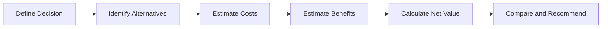

# Cost-Benefit Analysis

> **Core skill:** Senior engineers systematically evaluate the costs and benefits of technical alternatives to make economically sound decisions.

## Why This Matters

Cost-benefit analysis (CBA) is the foundation of economic decision-making. It forces you to:
- **Quantify impacts:** Move from "this is better" to "this saves $X per year"
- **Compare alternatives:** Use consistent criteria to evaluate options
- **Justify investments:** Build business cases that resonate with stakeholders
- **Avoid biases:** Reduce emotional or political decision-making

Without CBA, decisions are based on gut feel, trends, or the loudest voice in the room.

## Cost-Benefit Analysis Framework



### Step 1: Define the Decision

**Questions to answer:**
- What decision are we trying to make?
- What is the context and constraints?
- Who are the stakeholders?
- What is the timeline for the decision?

**Example:**
```
Decision: Should we migrate our monolithic application to microservices?
Context: Application has 500K lines of code, 8 developers, 2M users
Constraints: Must maintain 99.9% uptime during migration
Stakeholders: Engineering team, product team, executives
Timeline: Decision needed within 2 weeks for Q3 planning
```

### Step 2: Identify Alternatives

**Common alternatives:**
- **Status quo:** Do nothing; maintain current state
- **Option A:** First alternative approach
- **Option B:** Second alternative approach
- **Option C:** Third alternative approach (if applicable)

**Example:**
```
Alternative 1: Maintain monolith; refactor incrementally
Alternative 2: Migrate to microservices over 12 months
Alternative 3: Rewrite as a new monolith with modern architecture
```

### Step 3: Estimate Costs

**Cost categories:**

| Category | Examples |
|----------|----------|
| **Direct costs** | Development effort, licensing fees, infrastructure costs, training |
| **Indirect costs** | Productivity loss during transition, onboarding time, documentation |
| **Opportunity costs** | What you give up by choosing this option (e.g., features not built) |
| **Risk costs** | Expected cost of failures, delays, or technical debt |

**Example:**
```markdown
## Cost Estimate: Microservices Migration

### Direct Costs
- Development effort: 4 engineers × 12 months × $150K/year = $600K
- Infrastructure (Kubernetes, service mesh): $50K/year
- Monitoring and observability tools: $30K/year
- Training: $20K

### Indirect Costs
- Productivity loss during migration: 20% × 8 engineers × 12 months = $180K
- Onboarding new engineers to microservices: 2 months × 4 engineers = $50K

### Opportunity Costs
- Features not built during migration: Estimated $200K in revenue

### Risk Costs
- Migration delays (30% probability): 3 months × $150K = $45K
- Production incidents during migration: $50K expected cost

**Total Cost: $1,225K**
```

### Step 4: Estimate Benefits

**Benefit categories:**

| Category | Examples |
|----------|----------|
| **Revenue impact** | Faster feature delivery, new capabilities, improved user experience |
| **Cost savings** | Reduced infrastructure costs, lower maintenance, automation |
| **Risk reduction** | Improved reliability, security, compliance, scalability |
| **Strategic value** | Competitive advantage, technical flexibility, team satisfaction |

**Example:**
```markdown
## Benefit Estimate: Microservices Migration

### Revenue Impact
- Faster feature delivery: 30% faster × $2M annual feature value = $600K/year
- Improved user experience: 5% increase in retention × $5M ARR = $250K/year

### Cost Savings
- Reduced infrastructure costs: 20% × $250K/year = $50K/year
- Lower maintenance overhead: 2 hours/week × 8 engineers × $75/hour = $62K/year

### Risk Reduction
- Improved reliability: 50% fewer incidents × $100K/incident cost = $50K/year
- Better scalability: Avoid $200K emergency scaling project

### Strategic Value
- Technical flexibility: Enables 2 new product lines worth $500K/year
- Team satisfaction: 20% reduction in turnover × $50K/hire = $100K/year

**Total Annual Benefit: $1,812K/year**
```

### Step 5: Calculate Net Value

**Metrics:**

1. **Net Present Value (NPV):**
   ```
   NPV = Σ (Benefits - Costs) / (1 + discount_rate)^year
   
   Example: $1,812K/year - $1,225K initial cost
   NPV over 3 years (10% discount rate):
   Year 0: -$1,225K
   Year 1: $1,812K / 1.1 = $1,647K
   Year 2: $1,812K / 1.21 = $1,498K
   Year 3: $1,812K / 1.331 = $1,361K
   NPV = $3,281K
   ```

2. **Payback Period:**
   ```
   Payback = Initial Cost / Annual Benefit
   Payback = $1,225K / $1,812K = 0.68 years (8 months)
   ```

3. **Return on Investment (ROI):**
   ```
   ROI = (Total Benefits - Total Costs) / Total Costs × 100%
   ROI over 3 years = ($5,436K - $1,225K) / $1,225K = 344%
   ```

### Step 6: Compare and Recommend

**Comparison table:**

| Alternative | Total Cost | Annual Benefit | NPV (3yr) | Payback | ROI |
|-------------|------------|----------------|-----------|---------|-----|
| **Maintain monolith** | $300K | $0 | -$300K | N/A | N/A |
| **Migrate to microservices** | $1,225K | $1,812K | $3,281K | 8 months | 344% |
| **Rewrite as new monolith** | $800K | $900K | $1,381K | 11 months | 238% |

**Recommendation:**
```
Recommendation: Migrate to microservices

Rationale:
- Highest NPV ($3,281K vs $1,381K for rewrite)
- Fastest payback (8 months vs 11 months)
- Highest ROI (344% vs 238%)
- Provides strategic flexibility for future product lines
- Addresses scalability concerns that will become critical in 2 years

Risks:
- Migration complexity requires experienced team
- 30% probability of 3-month delay
- Requires investment in observability and DevOps practices

Mitigation:
- Start with pilot service to validate approach
- Hire or train 2 engineers with microservices experience
- Implement feature flags for gradual migration
```

## Cost-Benefit Analysis Templates

### Simple CBA Template

```markdown
## Cost-Benefit Analysis: [Decision]

### Decision
[What are we deciding?]

### Alternatives
1. [Alternative 1]
2. [Alternative 2]
3. [Alternative 3]

### Costs

#### Alternative 1: [Name]
| Cost Category | Amount | Notes |
|---------------|--------|-------|
| Direct costs | $X | [Details] |
| Indirect costs | $X | [Details] |
| Opportunity costs | $X | [Details] |
| Risk costs | $X | [Details] |
| **Total** | **$X** | |

#### Alternative 2: [Name]
[Same structure]

### Benefits

#### Alternative 1: [Name]
| Benefit Category | Annual Value | Notes |
|------------------|--------------|-------|
| Revenue impact | $X | [Details] |
| Cost savings | $X | [Details] |
| Risk reduction | $X | [Details] |
| Strategic value | $X | [Details] |
| **Total** | **$X/year** | |

#### Alternative 2: [Name]
[Same structure]

### Comparison

| Alternative | Total Cost | Annual Benefit | NPV (3yr) | Payback | ROI |
|-------------|------------|----------------|-----------|---------|-----|
| [Alt 1] | $X | $X | $X | X months | X% |
| [Alt 2] | $X | $X | $X | X months | X% |

### Recommendation
[Which alternative and why?]

### Risks and Mitigation
[Key risks and how to address them]
```

## Cost Estimation Techniques

### 1. Bottom-Up Estimation

**Process:**
1. Break work into small tasks
2. Estimate each task
3. Sum the estimates
4. Add contingency (15-30%)

**When to use:** Detailed planning phase; high accuracy needed

### 2. Analogous Estimation

**Process:**
1. Find similar past projects
2. Adjust for differences (size, complexity, team)
3. Use as baseline estimate

**When to use:** Early planning; limited information available

### 3. Parametric Estimation

**Process:**
1. Identify cost drivers (lines of code, number of services, users)
2. Use historical data to establish cost per unit
3. Multiply units by cost per unit

**Example:**
```
Historical data: $50 per line of code for migration
Project size: 500K lines of code
Estimate: 500K × $50 = $25M
```

**When to use:** Repeatable work with historical data

### 4. Three-Point Estimation

**Process:**
1. Estimate optimistic (O), pessimistic (P), and most likely (M)
2. Calculate expected value: (O + 4M + P) / 6

**Example:**
```
Optimistic: $800K
Most likely: $1,200K
Pessimistic: $2,000K
Expected: ($800K + 4×$1,200K + $2,000K) / 6 = $1,267K
```

**When to use:** High uncertainty; need to account for risk

## Benefit Estimation Techniques

### 1. Revenue Impact

**Methods:**
- **Feature velocity:** Faster delivery × value per feature
- **User retention:** Improved experience × retention rate × customer lifetime value
- **Conversion rate:** Better performance × conversion improvement × revenue per conversion

### 2. Cost Savings

**Methods:**
- **Infrastructure:** Compare current vs projected costs
- **Maintenance:** Hours saved × hourly rate
- **Automation:** Manual effort eliminated × frequency × cost per effort

### 3. Risk Reduction

**Methods:**
- **Expected value:** Probability of incident × cost of incident
- **Insurance analogy:** What would you pay to insure against this risk?
- **Compliance:** Cost of non-compliance (fines, legal, reputation)

### 4. Strategic Value

**Methods:**
- **Option value:** What future opportunities does this enable?
- **Competitive advantage:** Market share gain × revenue
- **Team satisfaction:** Reduced turnover × cost per hire

## Practical Applications

### CBA for Technology Adoption

```markdown
## CBA: Adopt GraphQL vs REST

### Decision
Should we adopt GraphQL for our new API, or continue with REST?

### Costs: GraphQL
- Learning curve: 2 months × 4 engineers × $75/hr = $96K
- Tooling and libraries: $20K
- Migration effort: 3 months × 2 engineers = $90K
- Documentation and training: $30K
- **Total: $236K**

### Benefits: GraphQL
- Reduced over-fetching: 30% less data transfer × $50K infrastructure = $15K/year
- Faster frontend development: 20% faster × 6 frontend engineers × $150K = $180K/year
- Better developer experience: 10% productivity gain × 10 engineers × $150K = $150K/year
- **Total: $345K/year**

### ROI
- Payback: $236K / $345K = 8 months
- 3-year NPV: $799K
- ROI: 338%

### Recommendation
Adopt GraphQL. High ROI, fast payback, and improves developer experience.
```

### CBA for Process Improvement

```markdown
## CBA: Implement CI/CD Pipeline

### Decision
Should we invest in a comprehensive CI/CD pipeline?

### Costs
- Setup and configuration: 2 months × 2 engineers = $60K
- Infrastructure (build servers, tools): $40K/year
- Training: $10K
- **Total: $110K**

### Benefits
- Faster deployments: 10 hours/week saved × $75/hr × 52 weeks = $39K/year
- Fewer production incidents: 50% reduction × $100K incident cost = $50K/year
- Faster feedback: 20% productivity gain × 8 engineers × $150K = $240K/year
- **Total: $329K/year**

### ROI
- Payback: $110K / $329K = 4 months
- 3-year NPV: $877K
- ROI: 797%

### Recommendation
Implement CI/CD. Extremely high ROI and foundational for other improvements.
```

## Success Indicators

- Technical decisions include documented cost-benefit analysis
- Stakeholders understand the economic rationale for decisions
- Cost estimates include all categories (direct, indirect, opportunity, risk)
- Benefits are quantified in business terms, not just technical terms
- Alternatives are compared using consistent metrics (NPV, ROI, payback)
- Decisions are based on data, not opinions or trends

## Related Topics

- [[02_Build_vs_Buy_Decisions|Build vs Buy Decisions]]: Specific application of CBA
- [[05_Business_Case_Development|Business Case Development]]: Presenting CBA to stakeholders
- [[06_Trade_Off_Evaluation|Trade-Off Evaluation]]: Comparing alternatives with multiple criteria
- [[04_Delivery_and_Execution/04_Technical_Debt_Strategy|Technical Debt Strategy]]: CBA for debt paydown

## Summary

Cost-benefit analysis is systematically evaluating the costs and benefits of technical alternatives to make economically sound decisions. The process includes defining the decision, identifying alternatives, estimating all costs (direct, indirect, opportunity, risk), quantifying benefits (revenue, savings, risk reduction, strategic value), calculating net value (NPV, ROI, payback), and comparing alternatives. Senior engineers use CBA to build compelling business cases, avoid biases, and make decisions that serve both technical and business goals.
