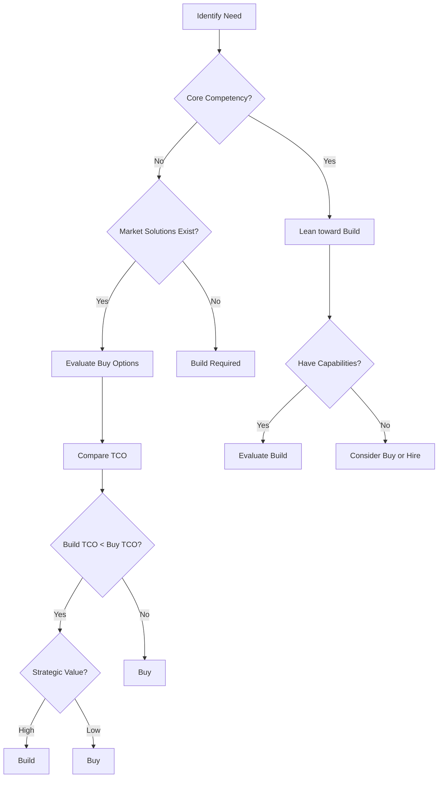

# Build vs Buy Decisions

> **Core skill:** Senior engineers systematically evaluate whether to build custom solutions or buy third-party products, considering TCO, strategic fit, and long-term implications.

## Why This Matters

Build vs buy decisions have long-lasting consequences:
- **Build wrong:** Years of maintenance burden, opportunity cost, technical debt
- **Buy wrong:** Vendor lock-in, limited customization, ongoing licensing costs, integration challenges

The decision is rarely purely technical. It involves strategic alignment, organizational capabilities, risk tolerance, and economic analysis.

## Build vs Buy Decision Framework



### Decision Criteria

| Criterion | Lean Build | Lean Buy |
|-----------|------------|----------|
| **Core competency** | Yes, differentiates business | No, commodity function |
| **Customization needs** | High, unique requirements | Low, standard requirements |
| **Time to market** | Not critical | Critical, need fast delivery |
| **Internal expertise** | Strong team available | Limited or no expertise |
| **Strategic value** | High, enables future capabilities | Low, utility function |
| **Integration complexity** | Low, fits existing architecture | High, requires major changes |
| **Regulatory requirements** | Strict, need full control | Standard, vendor compliance sufficient |
| **Total cost of ownership** | Lower over 5+ years | Lower over 5+ years |

## Build Analysis

### When to Build

**Strong indicators:**
- **Core competency:** The capability differentiates your business
- **Unique requirements:** No market solution fits your needs
- **Strategic value:** Building creates competitive advantage or future opportunities
- **Integration control:** Deep integration with existing systems required
- **Data sensitivity:** Regulatory or security requirements demand full control

**Example:**
```
Decision: Build custom recommendation engine

Rationale:
- Core competency: Recommendations drive 40% of revenue
- Unique requirements: Need to incorporate proprietary user behavior data
- Strategic value: Enables personalization across all product lines
- Integration: Must integrate with 5 internal systems
- Data: Contains PII, strict GDPR compliance required
```

### Build Costs

**Direct costs:**
- Development effort (engineers × time × rate)
- Infrastructure (servers, databases, tools)
- Testing and QA
- Documentation and training

**Indirect costs:**
- Opportunity cost (features not built while building this)
- Maintenance and operations (ongoing)
- Technical debt accumulation
- Knowledge silos (if only a few people understand it)

**Risk costs:**
- Project delays or failures
- Scope creep
- Key person dependency
- Technology obsolescence

**Build cost template:**
```markdown
## Build Cost Estimate: [Capability]

### Initial Development
| Item | Effort | Cost |
|------|--------|------|
| Design and architecture | X months | $X |
| Implementation | X months | $X |
| Testing and QA | X months | $X |
| Documentation | X weeks | $X |
| **Subtotal** | | **$X** |

### Annual Operating Costs
| Item | Cost |
|------|------|
| Infrastructure | $X/year |
| Maintenance (20% of dev cost) | $X/year |
| Support and operations | $X/year |
| **Subtotal** | **$X/year** |

### Risk Adjustment
- Delay risk (30% probability, 3 months): $X
- Scope creep (20% probability): $X
- **Contingency (15%)**: $X

### Total 5-Year Cost
Initial: $X
Operating (4 years): $X
Risk: $X
**Total: $X**
```

## Buy Analysis

### When to Buy

**Strong indicators:**
- **Commodity function:** Standard capability available from multiple vendors
- **Time pressure:** Need solution quickly, cannot wait for build
- **Limited expertise:** Lack internal skills or capacity
- **Proven solutions:** Mature products with strong track records
- **Lower TCO:** Buy is cheaper over 5-year horizon

**Example:**
```
Decision: Buy customer support platform (Zendesk)

Rationale:
- Commodity: Customer support is standard function
- Time pressure: Need solution in 2 months
- Limited expertise: No support platform experience
- Proven: Zendesk used by 100K+ companies
- Lower TCO: $150K/year vs $500K to build
```

### Buy Costs

**Direct costs:**
- Licensing fees (per user, per transaction, or flat fee)
- Implementation and configuration
- Integration with existing systems
- Training and onboarding

**Indirect costs:**
- Vendor management overhead
- Customization limitations (workarounds)
- Data migration
- Change management

**Risk costs:**
- Vendor lock-in
- Vendor stability (bankruptcy, acquisition)
- Price increases
- Feature deprecation

**Buy cost template:**
```markdown
## Buy Cost Estimate: [Product]

### Initial Costs
| Item | Cost |
|------|------|
| Licensing (year 1) | $X |
| Implementation | $X |
| Integration | $X |
| Training | $X |
| Data migration | $X |
| **Subtotal** | **$X** |

### Annual Operating Costs
| Item | Cost |
|------|------|
| Licensing renewal | $X/year |
| Support and maintenance | $X/year |
| Integration maintenance | $X/year |
| Vendor management | $X/year |
| **Subtotal** | **$X/year** |

### Risk Adjustment
- Price increase (5% annually): $X over 5 years
- Vendor lock-in (migration cost if switching): $X
- Integration complexity: $X
- **Contingency (10%)**: $X

### Total 5-Year Cost
Initial: $X
Operating (4 years): $X
Risk: $X
**Total: $X**
```

## Vendor Evaluation

### Evaluation Criteria

**Functional requirements:**
- Feature completeness (% of requirements met)
- Customization capabilities
- Integration options (APIs, webhooks, connectors)
- Scalability and performance

**Technical requirements:**
- Architecture (cloud, on-prem, hybrid)
- Security and compliance (SOC 2, GDPR, HIPAA)
- Reliability (uptime SLA, disaster recovery)
- Support quality (response time, expertise)

**Business requirements:**
- Pricing model and TCO
- Contract flexibility (term, exit clauses)
- Vendor stability (financials, market position)
- Roadmap alignment (future features)

### Vendor Scorecard

```markdown
## Vendor Evaluation: [Capability]

| Criterion | Weight | Vendor A | Vendor B | Vendor C |
|-----------|--------|----------|----------|----------|
| **Functional** | | | | |
| Feature completeness | 20% | 8 (1.6) | 9 (1.8) | 7 (1.4) |
| Customization | 15% | 7 (1.05) | 8 (1.2) | 6 (0.9) |
| Integration | 15% | 9 (1.35) | 7 (1.05) | 8 (1.2) |
| **Technical** | | | | |
| Security/compliance | 15% | 9 (1.35) | 8 (1.2) | 9 (1.35) |
| Reliability | 10% | 8 (0.8) | 9 (0.9) | 8 (0.8) |
| Support quality | 10% | 7 (0.7) | 8 (0.8) | 9 (0.9) |
| **Business** | | | | |
| TCO (5-year) | 10% | 8 (0.8) | 6 (0.6) | 7 (0.7) |
| Contract flexibility | 5% | 7 (0.35) | 8 (0.4) | 9 (0.45) |
| **Total Score** | 100% | | **8.0** | **7.95** | **7.7** |

**Recommendation:** Vendor B (highest score, best feature completeness)
```

### Vendor Due Diligence

**Questions to ask:**
1. **Financial stability:** How long in business? Funding? Profitability?
2. **Customer references:** Similar companies, similar use cases?
3. **Security practices:** SOC 2, penetration testing, incident response?
4. **Data ownership:** Who owns the data? Export capabilities?
5. **Pricing model:** How does it scale? Hidden fees?
6. **Contract terms:** Length, exit clauses, price protection?
7. **Support model:** SLAs, escalation process, dedicated support?
8. **Roadmap:** Future features, deprecation policy?

## Total Cost of Ownership Comparison

### 5-Year TCO Template

```markdown
## TCO Comparison: Build vs Buy

### Build Option
| Year | Initial Dev | Infrastructure | Maintenance | Operations | Total |
|------|-------------|----------------|-------------|------------|-------|
| 1 | $500K | $50K | $0 | $100K | $650K |
| 2 | $0 | $50K | $100K | $100K | $250K |
| 3 | $0 | $50K | $100K | $100K | $250K |
| 4 | $0 | $50K | $100K | $100K | $250K |
| 5 | $0 | $50K | $100K | $100K | $250K |
| **5-Year Total** | | | | | **$1,650K** |

### Buy Option
| Year | Licensing | Implementation | Integration | Operations | Total |
|------|-----------|----------------|-------------|------------|-------|
| 1 | $200K | $100K | $50K | $50K | $400K |
| 2 | $210K | $0 | $20K | $50K | $280K |
| 3 | $220K | $0 | $20K | $50K | $290K |
| 4 | $231K | $0 | $20K | $50K | $301K |
| 5 | $243K | $0 | $20K | $50K | $313K |
| **5-Year Total** | | | | | **$1,584K** |

### Comparison
- **Build TCO:** $1,650K
- **Buy TCO:** $1,584K
- **Difference:** $66K (Buy is 4% cheaper)

### Non-Financial Factors
- Build provides strategic differentiation
- Buy has faster time to market (3 months vs 9 months)
- Build requires hiring 2 specialized engineers
- Buy has vendor lock-in risk

### Recommendation
Buy for now (faster, slightly cheaper). Re-evaluate build in 2 years if:
- Capability becomes core differentiator
- Vendor pricing increases >10% annually
- Customization needs exceed vendor capabilities
```

## Decision Documentation

### Build vs Buy Decision Record

```markdown
## Decision: Build vs Buy [Capability]

**Date:** [Date]
**Decision makers:** [Names]
**Status:** [Decided/Under evaluation]

### Context
[Business need and constraints]

### Options Considered
1. **Build:** [Brief description]
2. **Buy:** [Product name and brief description]
3. **Hybrid:** [Build core, buy commodity components]

### Analysis Summary

| Factor | Build | Buy |
|--------|-------|-----|
| 5-year TCO | $X | $X |
| Time to market | X months | X months |
| Customization | High | Medium |
| Strategic value | High | Low |
| Risk | Medium | Low |

### Decision
[Build/Buy/Hybrid]

### Rationale
[Why this option was chosen, including quantitative and qualitative factors]

### Risks and Mitigations
| Risk | Probability | Impact | Mitigation |
|------|-------------|--------|------------|
| [Risk] | [H/M/L] | [H/M/L] | [Action] |

### Success Metrics
- [Metric 1]: [Target]
- [Metric 2]: [Target]

### Review Date
[When to re-evaluate the decision]
```

## Practical Applications

### Build vs Buy Checklist

Before making a build vs buy decision:

- [ ] Identified whether this is a core competency
- [ ] Evaluated market solutions and their maturity
- [ ] Estimated 5-year TCO for build and buy options
- [ ] Assessed internal capabilities and capacity
- [ ] Considered time to market requirements
- [ ] Evaluated strategic value and differentiation
- [ ] Identified integration requirements and complexity
- [ ] Assessed regulatory and compliance requirements
- [ ] Conducted vendor due diligence (if buying)
- [ ] Documented decision and rationale

### Common Build vs Buy Scenarios

| Scenario | Typical Decision | Rationale |
|----------|-----------------|-----------|
| **Authentication** | Buy (Auth0, Okta) | Security-critical, mature solutions, high complexity |
| **Payment processing** | Buy (Stripe, PayPal) | Compliance burden, fraud risk, global requirements |
| **Analytics** | Hybrid (Mixpanel + custom) | Commodity tracking + custom business logic |
| **Recommendation engine** | Build | Core differentiator, proprietary data |
| **CRM** | Buy (Salesforce, HubSpot) | Commodity function, proven solutions |
| **Search** | Buy (Elasticsearch, Algolia) | Complex technology, mature solutions |
| **Monitoring** | Buy (Datadog, New Relic) | Commodity function, rapid innovation |
| **Workflow engine** | Depends | Build if unique; buy if standard (Zapier, n8n) |

## Success Indicators

- Build vs buy decisions are made systematically, not emotionally
- TCO analysis includes all costs over 5+ years
- Vendor evaluations use structured scorecards and due diligence
- Decisions are documented with clear rationale
- Strategic value is weighed alongside financial analysis
- Decisions are reviewed periodically and adjusted if needed

## Related Topics

- [[01_Cost_Benefit_Analysis|Cost-Benefit Analysis]]: Foundation for build vs buy evaluation
- [[04_Total_Cost_of_Ownership|Total Cost of Ownership]]: Detailed TCO calculation
- [[05_Business_Case_Development|Business Case Development]]: Presenting the decision to stakeholders
- [[06_Trade_Off_Evaluation|Trade-Off Evaluation]]: Multi-criteria decision making

## Summary

Build vs buy decisions require systematic evaluation of total cost of ownership, strategic fit, and long-term implications. Senior engineers use decision frameworks that consider core competency, customization needs, time to market, internal expertise, and strategic value. They estimate 5-year TCO for both options, conduct vendor due diligence when buying, and document decisions with clear rationale. The goal is to make economically sound decisions that align with business strategy and minimize long-term risk.
