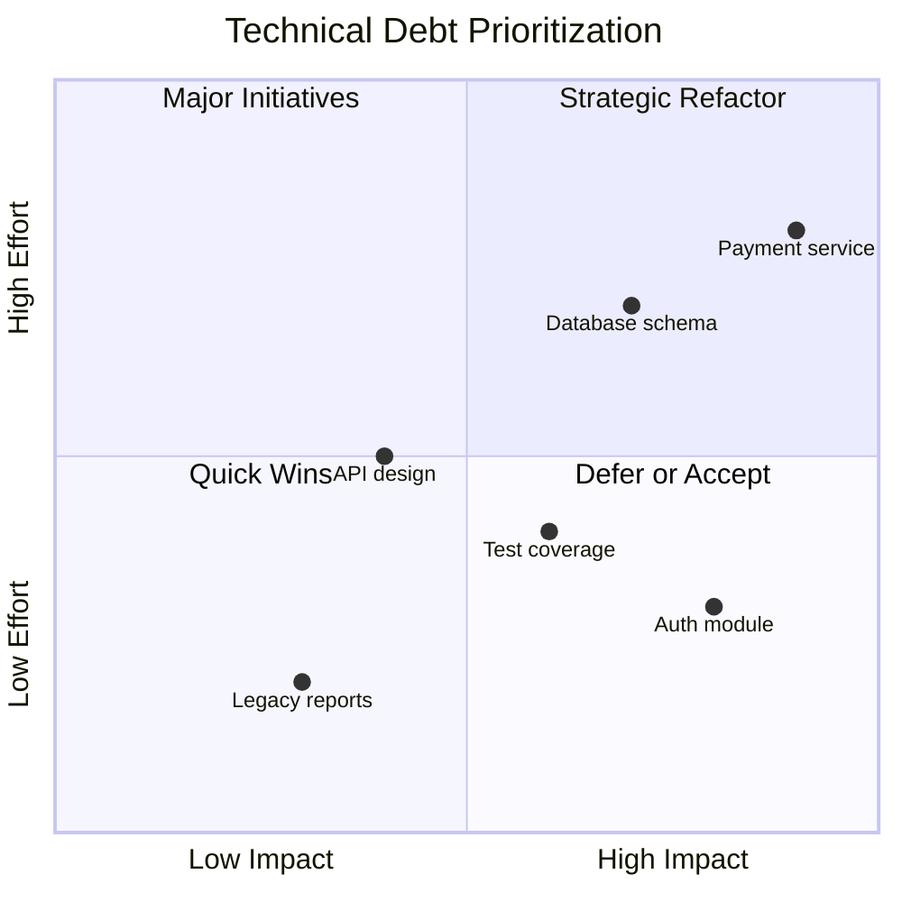

# Technical Debt ROI

> **Core skill:** Senior engineers quantify technical debt impact and calculate ROI for debt reduction initiatives, building compelling business cases for refactoring.

## Why This Matters

Technical debt is often invisible to non-technical stakeholders. Without quantification:
- **Debt accumulates:** Teams prioritize features over maintenance
- **Velocity declines:** Development slows as debt compounds
- **Incidents increase:** Fragile systems break more often
- **Morale suffers:** Engineers frustrated by legacy code

Quantifying debt ROI transforms it from a vague concern into a measurable business impact that executives understand.

## Technical Debt as Financial Debt

```mermaid
flowchart LR
    subgraph Financial Debt
        A[Principal] --> B[Interest Payments]
        B --> C[Total Cost]
        C --> D[Paydown Strategy]
    end

    subgraph Technical Debt
        E[Initial Shortcut] --> F[Maintenance Overhead]
        F --> G[Slowed Development]
        G --> H[Refactoring Plan]
    end

    Financial Debt -.->|Analogy| Technical Debt
```

**Debt components:**

| Financial Debt | Technical Debt |
|----------------|----------------|
| **Principal** | Initial shortcut or workaround |
| **Interest** | Ongoing maintenance overhead, slower development, bugs |
| **Credit score** | Code quality metrics (complexity, test coverage) |
| **Default** | System becomes unmaintainable, requires rewrite |
| **Paydown** | Refactoring, rewriting, improving tests |

## Quantifying Technical Debt

### Debt Impact Categories

**1. Development Velocity Impact**
- **Measurement:** Compare velocity in high-debt vs low-debt areas
- **Calculation:** Hours lost per feature × number of features × hourly rate

**Example:**
```
High-debt module: 40 hours per feature
Low-debt module: 20 hours per feature
Features per year: 20
Velocity impact: (40 - 20) × 20 × $75/hour = $30K/year
```

**2. Incident and Bug Costs**
- **Measurement:** Incident frequency and resolution time in debt-heavy areas
- **Calculation:** Incidents per year × average resolution time × cost per hour

**Example:**
```
Debt-heavy service: 12 incidents/year × 8 hours × $150/hour = $14.4K/year
Clean service: 3 incidents/year × 4 hours × $150/hour = $1.8K/year
Incident cost difference: $12.6K/year
```

**3. Onboarding Time**
- **Measurement:** Time for new engineers to become productive
- **Calculation:** Additional onboarding time × engineer cost

**Example:**
```
Clean codebase: 2 weeks to productivity
Debt-heavy codebase: 6 weeks to productivity
Additional cost: 4 weeks × $3K/week = $12K per new hire
Annual impact (5 new hires): $60K/year
```

**4. Opportunity Cost**
- **Measurement:** Features delayed or not built due to debt
- **Calculation:** Delayed features × revenue per feature

**Example:**
```
Debt slows development by 30%
Features per year: 20
Delayed features: 6
Average feature value: $50K
Opportunity cost: 6 × $50K = $300K/year
```

### Debt Interest Calculation

**Total annual interest:**
```
Velocity impact: $30K
Incident costs: $12.6K
Onboarding: $60K
Opportunity cost: $300K
Total annual interest: $402.6K
```

**Debt principal (cost to fix):**
```
Refactoring effort: 3 engineers × 4 months = $180K
Testing and validation: $40K
Documentation: $20K
Total principal: $240K
```

## ROI Calculation

### Simple ROI Model

```
Annual interest savings: $402.6K
Refactoring cost (principal): $240K
Payback period: $240K / $402.6K = 0.6 years (7 months)
3-year ROI: ($402.6K × 3 - $240K) / $240K = 403%
```

### NPV Model (More Accurate)

```
Discount rate: 10%
Year 0: -$240K (refactoring cost)
Year 1: $402.6K / 1.1 = $366K
Year 2: $402.6K / 1.21 = $333K
Year 3: $402.6K / 1.331 = $302K

NPV = $366K + $333K + $302K - $240K = $761K
```

### Risk-Adjusted ROI

**Adjust for risks:**
- **Refactoring delays:** 20% probability, 2-month delay = $40K
- **Incomplete debt removal:** 10% probability, only 70% interest reduction
- **Regression bugs:** 15% probability, $30K in fixes

**Expected risk cost:**
```
Delay risk: 20% × $40K = $8K
Incomplete risk: 10% × ($402.6K × 30%) = $12K
Regression risk: 15% × $30K = $4.5K
Total risk adjustment: $24.5K
```

**Risk-adjusted ROI:**
```
Adjusted cost: $240K + $24.5K = $264.5K
Adjusted annual benefit: $402.6K × 90% = $362K
Payback: $264.5K / $362K = 0.73 years (9 months)
3-year ROI: ($362K × 3 - $264.5K) / $264.5K = 310%
```

## Debt Prioritization Framework

### Debt Quadrant



**Quadrant 1 (High Impact, Low Effort):** Quick wins: do immediately
**Quadrant 2 (High Impact, High Effort):** Strategic initiatives: plan and resource
**Quadrant 3 (Low Impact, Low Effort):** Fill-in work: do when capacity available
**Quadrant 4 (Low Impact, High Effort):** Defer or accept: not worth the investment

### Prioritization Criteria

| Criterion | Weight | Description |
|-----------|--------|-------------|
| **Velocity impact** | 30% | How much does this slow development? |
| **Incident frequency** | 25% | How often does this cause bugs or outages? |
| **Strategic importance** | 20% | Is this in a critical path or growth area? |
| **Effort to fix** | 15% | How much work to refactor? (inverse: lower effort = higher priority) |
| **Risk of change** | 10% | How risky is the refactoring? (inverse: lower risk = higher priority) |

**Scoring example:**
```markdown
## Debt Item: Authentication Module

| Criterion | Score (1-10) | Weight | Weighted |
|-----------|--------------|--------|----------|
| Velocity impact | 8 | 30% | 2.4 |
| Incident frequency | 7 | 25% | 1.75 |
| Strategic importance | 9 | 20% | 1.8 |
| Effort to fix (inverse) | 7 | 15% | 1.05 |
| Risk of change (inverse) | 6 | 10% | 0.6 |
| **Total Score** | | | **7.6** |

**Priority:** High (score > 7)
**Recommendation:** Refactor in Q2
```

## Building the Business Case

### Executive Summary Template

```markdown
## Business Case: Technical Debt Reduction Initiative

### Executive Summary
Our engineering team spends 30% of development time addressing technical debt,
costing the company $1.2M annually in lost productivity and incidents. We propose
a $400K investment in targeted refactoring that will:
- Reduce development time by 25%, accelerating feature delivery by 3 months/year
- Decrease production incidents by 60%, improving customer satisfaction
- Improve engineer retention by reducing frustration with legacy code
- Deliver 280% ROI over 3 years with a 9-month payback period

### Problem Statement
Technical debt has accumulated over 3 years of rapid growth. Key impacts:
- **Velocity:** Features take 40% longer in debt-heavy modules
- **Incidents:** 70% of production issues originate from 3 legacy services
- **Onboarding:** New engineers take 6 weeks vs 2 weeks to become productive
- **Morale:** 40% of engineers cite legacy code as a frustration in surveys

### Proposed Solution
Refactor 3 high-impact services over 6 months:
1. Authentication service (highest incident rate)
2. Payment processing (strategic importance)
3. Data pipeline (velocity bottleneck)

### Investment Required
| Item | Cost |
|------|------|
| Engineering effort (3 engineers × 6 months) | $360K |
| Testing and validation | $30K |
| Documentation and training | $10K |
| **Total Investment** | **$400K** |

### Expected Benefits
| Benefit | Annual Value |
|---------|--------------|
| Velocity improvement (25% × 8 engineers × $150K) | $300K |
| Incident reduction (60% × $200K incident costs) | $120K |
| Onboarding time reduction (4 weeks × 5 hires × $3K/week) | $60K |
| Engineer retention (2 fewer departures × $50K) | $100K |
| **Total Annual Benefit** | **$580K** |

### ROI Analysis
- **Payback period:** 8 months
- **3-year NPV:** $1.34M (10% discount rate)
- **3-year ROI:** 335%

### Risks and Mitigations
| Risk | Probability | Impact | Mitigation |
|------|-------------|--------|------------|
| Refactoring delays | 20% | Medium | Buffer timeline by 20% |
| Regression bugs | 15% | High | Comprehensive testing, feature flags |
| Scope creep | 25% | Medium | Strict scope, executive sponsor |

### Recommendation
Approve $400K investment for Q2-Q3. Expected to deliver $580K in annual
benefits starting Q4, with full payback by Q1 next year.
```

## Debt Paydown Strategies

### Strategy 1: Dedicated Sprints

**Approach:** Allocate entire sprints to debt reduction
**When to use:** High-priority debt, need focused effort
**Pros:** Fast progress, team focus
**Cons:** Feature delivery pauses, stakeholder resistance

**Example:**
```
Plan: 2 debt sprints per quarter (4 weeks total)
Focus: Authentication service refactoring
Expected outcome: 80% debt reduction in 2 quarters
```

### Strategy 2: 20% Allocation

**Approach:** Dedicate 20% of each sprint to debt
**When to use:** Ongoing debt management, balanced with features
**Pros:** Continuous progress, minimal feature impact
**Cons:** Slower paydown, context switching

**Example:**
```
Plan: 1 day per week per engineer for debt work
Focus: Incremental improvements across codebase
Expected outcome: 30% debt reduction annually
```

### Strategy 3: Boy Scout Rule

**Approach:** Leave code cleaner than you found it
**When to use:** Low-priority debt, cultural change
**Pros:** No dedicated time needed, builds good habits
**Cons:** Slow progress, inconsistent application

**Example:**
```
Plan: Improve any code you touch
Focus: Small refactorings during feature work
Expected outcome: Gradual quality improvement
```

### Strategy 4: Strategic Initiatives

**Approach:** Large-scale refactoring projects
**When to use:** Critical debt blocking growth
**Pros:** Transformative impact, addresses root causes
**Cons:** High cost, high risk, long timeline

**Example:**
```
Plan: 12-month monolith-to-microservices migration
Focus: Break apart legacy system
Expected outcome: 10x scalability, 50% faster development
```

## Measuring Debt Reduction

### Metrics to Track

**Leading indicators:**
- **Code complexity:** Cyclomatic complexity trends
- **Test coverage:** Percentage of code covered by tests
- **Code smells:** Static analysis warnings
- **Dependency freshness:** Age of dependencies

**Lagging indicators:**
- **Development velocity:** Story points per sprint
- **Incident frequency:** Production issues per month
- **Time to market:** Lead time from commit to deploy
- **Engineer satisfaction:** Survey scores on code quality

### Debt Dashboard

```markdown
## Technical Debt Dashboard

### Velocity Impact
- Current: 40 hours/feature in debt-heavy modules
- Target: 25 hours/feature
- Progress: 32 hours/feature (20% improvement)

### Incident Rate
- Current: 15 incidents/month from legacy services
- Target: 5 incidents/month
- Progress: 10 incidents/month (33% reduction)

### Code Quality
- Current: 1,200 code smells
- Target: 400 code smells
- Progress: 800 code smells (33% reduction)

### Test Coverage
- Current: 45%
- Target: 80%
- Progress: 62% (17 point increase)

### ROI Tracking
- Investment to date: $240K
- Benefits realized: $180K (annualized)
- Payback progress: 75% (on track for 9-month payback)
```

## Practical Applications

### Debt ROI Calculator

```markdown
## Debt ROI Calculator

### Debt Item: [Name]

#### Impact Assessment
| Impact Category | Current Cost | Expected After Refactor | Annual Savings |
|-----------------|--------------|-------------------------|----------------|
| Velocity impact | $X | $X | $X |
| Incident costs | $X | $X | $X |
| Onboarding time | $X | $X | $X |
| Opportunity cost | $X | $X | $X |
| **Total** | **$X** | **$X** | **$X** |

#### Refactoring Cost
| Item | Cost |
|------|------|
| Engineering effort | $X |
| Testing and validation | $X |
| Documentation | $X |
| Risk adjustment (15%) | $X |
| **Total Cost** | **$X** |

#### ROI Calculation
- **Annual savings:** $X
- **Refactoring cost:** $X
- **Payback period:** X months
- **3-year ROI:** X%
- **3-year NPV:** $X (10% discount rate)

#### Recommendation
[Refactor/Defer/Accept] with rationale
```

### Debt Paydown Plan Template

```markdown
## Technical Debt Paydown Plan: [Initiative]

### Goals
- Reduce debt in [area] by X%
- Improve velocity by X%
- Reduce incidents by X%

### Scope
**In scope:**
- [Service/module 1]
- [Service/module 2]

**Out of scope:**
- [Service/module 3] (address in phase 2)

### Timeline
| Phase | Duration | Focus | Milestone |
|-------|----------|-------|-----------|
| 1 | 2 months | [Area 1] | [Deliverable] |
| 2 | 2 months | [Area 2] | [Deliverable] |
| 3 | 1 month | Testing and validation | [Deliverable] |

### Resources
- 3 engineers (100% allocation)
- 1 QA engineer (50% allocation)
- $X budget for tools and infrastructure

### Success Metrics
- [ ] Velocity improvement: X%
- [ ] Incident reduction: X%
- [ ] Code quality: X% improvement
- [ ] Test coverage: X%

### Risks and Mitigations
| Risk | Mitigation |
|------|------------|
| [Risk] | [Action] |

### Stakeholders
- **Executive sponsor:** [Name]
- **Engineering lead:** [Name]
- **Product manager:** [Name]
```

## Success Indicators

- Technical debt is quantified in business terms (dollars, not story points)
- Debt reduction initiatives have documented ROI and business cases
- Debt is prioritized using structured frameworks, not gut feel
- Executives understand and support debt paydown investments
- Debt metrics are tracked and reported regularly
- Debt paydown delivers measurable improvements in velocity and quality

## Related Topics

- [[01_Cost_Benefit_Analysis|Cost-Benefit Analysis]]: Foundation for debt ROI calculation
- [[04_Delivery_and_Execution/04_Technical_Debt_Strategy|Technical Debt Strategy]]: Broader debt management approach
- [[05_Business_Case_Development|Business Case Development]]: Presenting debt initiatives to stakeholders
- [[06_Trade_Off_Evaluation|Trade-Off Evaluation]]: Balancing debt paydown vs feature development

## Summary

Technical debt ROI is quantifying debt impact and calculating return on refactoring investments. Senior engineers treat debt as financial debt with principal (initial shortcut), interest (ongoing overhead), and paydown (refactoring). They measure debt impact on velocity, incidents, onboarding, and opportunity cost, then calculate ROI using payback period, NPV, and risk-adjusted models. They prioritize debt using structured frameworks and build compelling business cases that translate technical debt into business impact. The goal is to make debt visible, quantifiable, and actionable.
