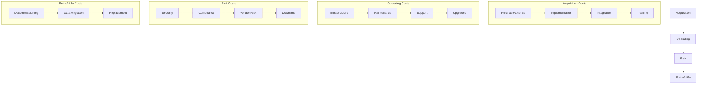

# Total Cost of Ownership

> **Core skill:** Senior engineers calculate the complete cost of systems over their entire lifecycle, including hidden costs that are often overlooked in initial estimates.

## Why This Matters

Initial cost estimates are often 2-5x lower than actual TCO because they ignore:
- **Operating costs:** Infrastructure, monitoring, maintenance, support
- **Hidden costs:** Integration, training, migration, technical debt
- **Risk costs:** Vendor lock-in, security incidents, compliance failures
- **End-of-life costs:** Decommissioning, data migration, replacement

Understanding TCO prevents decisions that look cheap initially but become expensive over time.

## TCO Components



### Cost Categories

**1. Acquisition Costs (Year 0)**
- **Purchase/license:** Initial software or service cost
- **Implementation:** Configuration, customization, setup
- **Integration:** Connecting to existing systems
- **Training:** User and administrator training
- **Data migration:** Moving data from previous systems

**2. Operating Costs (Annual)**
- **Infrastructure:** Servers, storage, network, cloud services
- **Maintenance:** Bug fixes, patches, updates
- **Support:** Help desk, incident response, user assistance
- **Upgrades:** Major version upgrades, feature additions
- **Monitoring:** Tools and staff for system monitoring
- **Compliance:** Audits, certifications, regulatory requirements

**3. Risk Costs (Expected Value)**
- **Security incidents:** Breach costs, remediation, legal
- **Compliance failures:** Fines, penalties, remediation
- **Vendor risk:** Price increases, vendor failure, lock-in
- **Downtime:** Lost revenue, productivity, reputation
- **Technical debt:** Accumulated shortcuts, refactoring needs

**4. End-of-Life Costs (Final Year)**
- **Decommissioning:** Shutting down systems, archiving data
- **Data migration:** Moving to replacement system
- **Replacement:** Cost of next system (partial attribution)
- **Knowledge transfer:** Documenting for future teams

## TCO Calculation Framework

### 5-Year TCO Template

```markdown
## TCO Analysis: [System/Capability]

### Acquisition Costs (Year 0)
| Item | Cost | Notes |
|------|------|-------|
| License/purchase | $X | [Details] |
| Implementation | $X | [Effort × rate] |
| Integration | $X | [Systems to integrate] |
| Training | $X | [Users × hours × rate] |
| Data migration | $X | [Volume × complexity] |
| **Subtotal** | **$X** | |

### Annual Operating Costs
| Item | Year 1 | Year 2 | Year 3 | Year 4 | Year 5 |
|------|--------|--------|--------|--------|--------|
| Infrastructure | $X | $X | $X | $X | $X |
| Maintenance | $X | $X | $X | $X | $X |
| Support | $X | $X | $X | $X | $X |
| Upgrades | $X | $X | $X | $X | $X |
| Monitoring | $X | $X | $X | $X | $X |
| Compliance | $X | $X | $X | $X | $X |
| **Subtotal** | **$X** | **$X** | **$X** | **$X** | **$X** |

### Risk Costs (Expected Value)
| Risk | Probability | Impact | Expected Cost |
|------|-------------|--------|---------------|
| Security incident | 10% | $500K | $50K |
| Vendor price increase | 80% | $50K | $40K |
| Downtime (major) | 20% | $200K | $40K |
| Compliance failure | 5% | $1M | $50K |
| **Subtotal** | | | **$180K** |

### End-of-Life Costs (Year 5)
| Item | Cost |
|------|------|
| Decommissioning | $X |
| Data migration | $X |
| Knowledge transfer | $X |
| **Subtotal** | **$X** |

### Total 5-Year TCO
| Category | Cost |
|----------|------|
| Acquisition | $X |
| Operating (5 years) | $X |
| Risk (expected) | $X |
| End-of-life | $X |
| **Total TCO** | **$X** |

### Cost Per User/Transaction
- Users: X
- TCO per user: $X
- Transactions per year: X
- TCO per transaction: $X
```

### TCO Comparison Template

```markdown
## TCO Comparison: [Option A] vs [Option B]

### Option A: [Name]
| Year | Acquisition | Operating | Risk | Total |
|------|-------------|-----------|------|-------|
| 1 | $X | $X | $X | $X |
| 2 | $0 | $X | $X | $X |
| 3 | $0 | $X | $X | $X |
| 4 | $0 | $X | $X | $X |
| 5 | $0 | $X | $X | $X |
| **5-Year Total** | **$X** | **$X** | **$X** | **$X** |

### Option B: [Name]
| Year | Acquisition | Operating | Risk | Total |
|------|-------------|-----------|------|-------|
| 1 | $X | $X | $X | $X |
| 2 | $0 | $X | $X | $X |
| 3 | $0 | $X | $X | $X |
| 4 | $0 | $X | $X | $X |
| 5 | $0 | $X | $X | $X |
| **5-Year Total** | **$X** | **$X** | **$X** | **$X** |

### Comparison Summary
| Metric | Option A | Option B | Difference |
|--------|----------|----------|------------|
| 5-year TCO | $X | $X | $X (X%) |
| Year 1 cost | $X | $X | $X |
| Annual operating | $X | $X | $X |
| Risk exposure | $X | $X | $X |

### Recommendation
[Which option and why, considering both financial and non-financial factors]
```

## Hidden Costs

### Common Overlooked Costs

**Integration costs:**
- API development and maintenance
- Data transformation and mapping
- Error handling and retry logic
- Testing integration scenarios
- Monitoring integration health

**Change management costs:**
- User resistance and adoption challenges
- Process redesign
- Documentation updates
- Training refreshers
- Support during transition

**Scaling costs:**
- Infrastructure scaling (non-linear)
- Performance optimization
- Database sharding or replication
- Load balancing and CDN
- Architectural changes

**Compliance costs:**
- Initial certification (SOC 2, ISO 27001)
- Annual audits and renewals
- Compliance staff or consultants
- Tooling for compliance monitoring
- Remediation of findings

**Knowledge transfer costs:**
- Documentation creation and maintenance
- Training new team members
- Knowledge silos and bus factor
- Turnover and replacement

### Hidden Cost Checklist

When estimating TCO, verify you have included:

- [ ] Integration with existing systems
- [ ] Data migration and transformation
- [ ] User and administrator training
- [ ] Documentation and knowledge transfer
- [ ] Monitoring and alerting setup
- [ ] Backup and disaster recovery
- [ ] Security hardening and compliance
- [ ] Performance testing and optimization
- [ ] Scaling for growth (2-3x current load)
- [ ] Major version upgrades (every 2-3 years)
- [ ] Support and incident response
- [ ] Vendor management overhead
- [ ] End-of-life decommissioning

## Cloud vs On-Premises TCO

### Cloud Cost Model

**Variable costs:**
- Compute (per hour or per second)
- Storage (per GB per month)
- Network (per GB transferred)
- Managed services (per use)

**Fixed costs:**
- Reserved instances or commitments
- Support plans
- Monitoring and management tools

**Cloud TCO considerations:**
- **Pros:** No upfront hardware, elastic scaling, managed services
- **Cons:** Ongoing operational costs, egress fees, vendor lock-in
- **Break-even:** Typically 3-5 years vs on-premises for stable workloads

### On-Premises Cost Model

**Fixed costs:**
- Hardware purchase and depreciation
- Data center space and power
- Network infrastructure
- IT staff

**Variable costs:**
- Hardware replacement (every 3-5 years)
- Software licenses
- Maintenance contracts
- Power and cooling

**On-premises TCO considerations:**
- **Pros:** Predictable costs, no egress fees, full control
- **Cons:** Upfront capital, over-provisioning, maintenance burden
- **Break-even:** Higher initial cost, lower ongoing for stable workloads

### Hybrid Approach

**When to use hybrid:**
- Predictable baseline workload on-premises
- Variable or burst workload in cloud
- Disaster recovery in cloud
- New services in cloud, legacy on-premises

## Practical Applications

### TCO for Technology Selection

```markdown
## TCO Analysis: Database Selection

### Option A: PostgreSQL (Self-Hosted)

#### Acquisition (Year 0)
- Setup and configuration: $20K
- Migration from current DB: $40K
- Training: $10K
- **Subtotal: $70K**

#### Annual Operating
- Infrastructure (3 servers): $30K/year
- DBA time (0.5 FTE): $75K/year
- Monitoring and backup: $15K/year
- **Subtotal: $120K/year**

#### 5-Year TCO
- Year 1: $70K + $120K = $190K
- Years 2-5: $120K × 4 = $480K
- **Total: $670K**

### Option B: Amazon RDS PostgreSQL

#### Acquisition (Year 0)
- Setup and configuration: $10K
- Migration: $30K
- Training: $5K
- **Subtotal: $45K**

#### Annual Operating
- RDS instance (db.r5.2xlarge): $48K/year
- Storage and IOPS: $12K/year
- Backup and monitoring: $5K/year
- **Subtotal: $65K/year**

#### 5-Year TCO
- Year 1: $45K + $65K = $110K
- Years 2-5: $65K × 4 = $260K
- **Total: $370K**

### Comparison
- Self-hosted: $670K over 5 years
- RDS: $370K over 5 years
- Difference: $300K (RDS is 45% cheaper)

### Recommendation
Use RDS. Lower TCO, reduced operational burden, automatic backups and patching.
Self-hosted only makes sense if we need custom configurations or have existing DBA capacity.
```

### TCO for Build vs Buy

```markdown
## TCO Comparison: Build vs Buy Analytics Platform

### Build (Custom Analytics)

#### Acquisition
- Development (6 months × 3 engineers): $360K
- Infrastructure setup: $30K
- Testing and QA: $40K
- **Subtotal: $430K**

#### Annual Operating
- Infrastructure: $60K/year
- Maintenance (1 engineer): $150K/year
- Feature development: $100K/year
- **Subtotal: $310K/year**

#### 5-Year TCO
- Year 1: $430K + $310K = $740K
- Years 2-5: $310K × 4 = $1,240K
- **Total: $1,980K**

### Buy (Mixpanel Enterprise)

#### Acquisition
- Implementation: $50K
- Integration: $30K
- Training: $20K
- **Subtotal: $100K**

#### Annual Operating
- License (1M events/month): $180K/year
- Integration maintenance: $20K/year
- User support: $30K/year
- **Subtotal: $230K/year**

#### 5-Year TCO
- Year 1: $100K + $230K = $330K
- Years 2-5: $230K × 4 = $920K
- **Total: $1,250K**

### Comparison
- Build: $1,980K over 5 years
- Buy: $1,250K over 5 years
- Difference: $730K (Buy is 37% cheaper)

### Non-Financial Factors
- Build provides custom metrics and deeper integration
- Buy has faster time to market (2 months vs 8 months)
- Build requires hiring analytics engineer
- Buy has vendor lock-in and data export limitations

### Recommendation
Buy for now. Faster delivery, lower TCO. Re-evaluate build in 2 years if:
- Custom analytics become core differentiator
- Event volume exceeds 5M/month (license cost doubles)
- Integration limitations block product features
```

## TCO Best Practices

### 1. Use Realistic Time Horizons

**Guidelines:**
- **Infrastructure:** 5-7 years (hardware lifecycle)
- **Software:** 5-10 years (major version lifecycle)
- **Cloud services:** 3-5 years (contract and pricing changes)

**Why:** Shorter horizons favor cheap initial costs; longer horizons reveal true operating costs.

### 2. Include Inflation and Growth

**Adjustments:**
- **Inflation:** 2-3% annually for labor and services
- **Growth:** Scale costs with user/transaction growth
- **Price changes:** Vendor price increases (5-10% annually)

**Example:**
```
Year 1: $100K
Year 2: $100K × 1.03 (inflation) × 1.2 (growth) = $124K
Year 3: $124K × 1.03 × 1.2 = $153K
```

### 3. Discount Future Costs

**Net Present Value (NPV):**
```
NPV = Cost / (1 + discount_rate)^year

Discount rate: 10% (typical for technology investments)
Year 1: $100K / 1.1 = $91K
Year 2: $100K / 1.21 = $83K
Year 3: $100K / 1.331 = $75K
```

**Why:** Money today is worth more than money in the future (opportunity cost).

### 4. Sensitivity Analysis

**Test assumptions:**
- What if growth is 2x faster?
- What if vendor raises prices 20%?
- What if we need to migrate in 3 years instead of 5?

**Example:**
```markdown
## Sensitivity Analysis

| Scenario | 5-Year TCO | Change from Base |
|----------|------------|------------------|
| Base case | $1,250K | - |
| 2x growth | $1,680K | +34% |
| 20% price increase | $1,430K | +14% |
| Early migration (year 3) | $1,380K | +10% |
| All risks | $1,890K | +51% |
```

## Success Indicators

- TCO calculations include all cost categories over 5+ years
- Hidden costs (integration, training, risk) are explicitly estimated
- Multiple options are compared using consistent TCO methodology
- Sensitivity analysis tests key assumptions
- TCO informs build vs buy and technology selection decisions
- Actual costs are tracked and compared to TCO estimates

## Related Topics

- [[01_Cost_Benefit_Analysis|Cost-Benefit Analysis]]: TCO is a key input to CBA
- [[02_Build_vs_Buy_Decisions|Build vs Buy Decisions]]: TCO comparison is central to the decision
- [[03_Technical_Debt_ROI|Technical Debt ROI]]: Debt increases operating costs over time
- [[05_Business_Case_Development|Business Case Development]]: TCO supports investment justification

## Summary

Total Cost of Ownership is calculating the complete cost of systems over their lifecycle, including acquisition, operating, risk, and end-of-life costs. Senior engineers understand that initial costs are often 20-30% of TCO, and they explicitly estimate hidden costs like integration, training, maintenance, and compliance. They use TCO to compare alternatives, justify investments, and avoid decisions that look cheap initially but become expensive over time. TCO analysis typically spans 5 years and includes sensitivity analysis to test assumptions.
