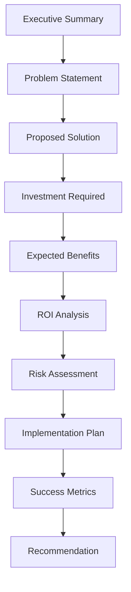

# Business Case Development

> **Core skill:** Senior engineers build compelling business cases that translate technical initiatives into business value, securing executive approval and funding.

## Why This Matters

Great technical ideas fail without business justification. Senior engineers must:
- **Translate technical value:** Convert "refactor the codebase" into "reduce development time by 30%, saving $400K annually"
- **Address stakeholder concerns:** Anticipate questions about cost, risk, timeline, and ROI
- **Build consensus:** Align engineering, product, finance, and executive stakeholders
- **Secure resources:** Get budget, headcount, and time approved

A well-crafted business case is the bridge between technical opportunity and business investment.

## Business Case Structure



### 1. Executive Summary

**Purpose:** Capture attention and summarize the case in 1-2 paragraphs.

**Include:**
- The problem or opportunity
- The proposed solution
- Investment required
- Expected benefits and ROI
- Recommendation

**Example:**
```markdown
## Executive Summary

Our customer support team spends 40% of their time on repetitive tasks that
could be automated, costing the company $600K annually in labor and contributing
to 35% annual turnover. We propose implementing an AI-powered support automation
platform requiring a $250K investment over 6 months.

The platform will automate 60% of routine inquiries, reducing support costs by
$360K annually and improving response time from 4 hours to 15 minutes. The
initiative delivers 144% ROI over 3 years with a 9-month payback period.

We recommend approval for Q3 start, with expected benefits beginning Q1 next year.
```

### 2. Problem Statement

**Purpose:** Establish urgency and quantify the pain.

**Include:**
- Current state and its limitations
- Business impact (cost, revenue, risk, customer satisfaction)
- Consequences of inaction
- Supporting data and metrics

**Example:**
```markdown
## Problem Statement

### Current State
Our support team of 20 agents handles 50,000 tickets monthly. 60% are routine
inquiries (password resets, order status, FAQ) that follow predictable patterns.

### Business Impact
- **Cost:** Agents spend 40% of time on routine tasks = $600K annually in labor
- **Customer satisfaction:** Average response time is 4 hours (target: 1 hour)
- **Agent turnover:** 35% annual turnover due to repetitive work (industry avg: 20%)
- **Turnover cost:** $50K per departure × 7 departures = $350K annually

### Consequences of Inaction
- Support costs will grow 20% annually with customer base
- Customer satisfaction will decline as volume increases
- Agent turnover will worsen, increasing recruitment costs
- Competitors with automation will capture market share with faster support

### Supporting Data
- Support ticket volume: 50,000/month, growing 15% annually
- Routine vs complex tickets: 60% routine, 40% complex
- Average handle time: 8 minutes (routine), 25 minutes (complex)
- Customer satisfaction score: 3.2/5 (target: 4.5/5)
```

### 3. Proposed Solution

**Purpose:** Describe what you want to do and why it is the right approach.

**Include:**
- Solution overview (high-level, non-technical)
- Key capabilities and features
- Why this approach (alternatives considered)
- Strategic alignment

**Example:**
```markdown
## Proposed Solution

### Solution Overview
Implement an AI-powered support automation platform that handles routine inquiries
automatically, escalating complex issues to human agents with full context.

### Key Capabilities
- **Automated responses:** Handle password resets, order status, FAQ (60% of volume)
- **Intelligent routing:** Direct complex issues to appropriate agents
- **Agent assist:** Provide suggested responses and customer history to agents
- **Analytics:** Track automation rate, customer satisfaction, agent productivity

### Why This Approach
We evaluated three options:
1. **Hire more agents:** High ongoing cost, does not address turnover
2. **Build custom automation:** 18-month timeline, requires ML expertise we lack
3. **Buy AI platform:** Proven technology, 6-month implementation, lower TCO

The AI platform balances speed, cost, and capability.

### Strategic Alignment
- **Company goal:** Improve customer satisfaction to 4.5/5 by next year
- **Engineering goal:** Reduce operational overhead by 30%
- **Product goal:** Scale support without linear cost growth
```

### 4. Investment Required

**Purpose:** Clearly state what resources you need.

**Include:**
- One-time costs (development, implementation, training)
- Ongoing costs (licensing, maintenance, support)
- Resource requirements (headcount, time allocation)
- Timeline and phasing

**Example:**
```markdown
## Investment Required

### One-Time Costs
| Item | Cost | Notes |
|------|------|-------|
| Platform license (year 1) | $120K | Enterprise tier, 50K tickets/month |
| Implementation | $80K | 4 months × 2 engineers |
| Integration with CRM | $30K | Connect to Salesforce |
| Training | $20K | Agents and administrators |
| **Subtotal** | **$250K** | |

### Ongoing Annual Costs
| Item | Year 2 | Year 3 | Year 4 |
|------|--------|--------|--------|
| Platform license | $126K | $132K | $139K |
| Maintenance | $40K | $40K | $40K |
| Support | $20K | $20K | $20K |
| **Subtotal** | **$186K** | **$192K** | **$199K** |

### Resource Requirements
- 2 engineers (100% for 4 months, then 20% ongoing)
- 1 project manager (50% for 6 months)
- Support team participation in testing and training

### Timeline
- **Months 1-2:** Platform setup and CRM integration
- **Months 3-4:** Testing and agent training
- **Month 5:** Pilot with 20% of volume
- **Month 6:** Full rollout
```

### 5. Expected Benefits

**Purpose:** Quantify the value in business terms.

**Include:**
- Cost savings (labor, infrastructure, incidents)
- Revenue impact (faster delivery, better retention, new capabilities)
- Risk reduction (security, compliance, reliability)
- Strategic value (competitive advantage, flexibility, scalability)

**Example:**
```markdown
## Expected Benefits

### Cost Savings
| Benefit | Calculation | Annual Value |
|---------|-------------|--------------|
| Reduced agent time on routine tasks | 60% automation × $600K labor | $360K |
| Lower agent turnover | 50% reduction × 3.5 fewer departures × $50K | $175K |
| Reduced training costs | Fewer new hires × $10K training | $35K |
| **Subtotal** | | **$570K/year** |

### Revenue Impact
| Benefit | Calculation | Annual Value |
|---------|-------------|--------------|
| Improved customer retention | 5% improvement × $20M ARR | $1M |
| Faster response time | 15 min vs 4 hours (qualitative) | Included above |
| **Subtotal** | | **$1M/year** |

### Risk Reduction
| Benefit | Calculation | Annual Value |
|---------|-------------|--------------|
| Scalability without linear cost | Avoid hiring 5 agents as volume grows | $375K |
| Consistent quality | Reduce errors and escalations | $50K |
| **Subtotal** | | **$425K/year** |

### Total Annual Benefit: $1,995K

### Benefit Realization Timeline
- **Month 6:** 20% of benefits (pilot phase)
- **Month 9:** 60% of benefits (ramp-up)
- **Month 12:** 100% of benefits (full realization)
```

### 6. ROI Analysis

**Purpose:** Show the financial return on investment.

**Include:**
- Payback period
- Net Present Value (NPV)
- Return on Investment (ROI)
- Break-even analysis

**Example:**
```markdown
## ROI Analysis

### Cash Flow
| Year | Investment | Benefits | Net Cash Flow |
|------|------------|----------|---------------|
| 0 (Year 1) | -$250K | $500K (partial year) | $250K |
| 1 (Year 2) | -$186K | $1,995K | $1,809K |
| 2 (Year 3) | -$192K | $1,995K | $1,803K |
| 3 (Year 4) | -$199K | $1,995K | $1,796K |

### Financial Metrics
- **Payback period:** 9 months
- **3-year NPV (10% discount):** $4,873K
- **3-year ROI:** 689%
- **Break-even:** Month 9

### Sensitivity Analysis
| Scenario | 3-Year NPV | Change |
|----------|------------|--------|
| Base case | $4,873K | - |
| 20% lower benefits | $3,680K | -24% |
| 20% higher costs | $4,611K | -5% |
| 6-month delay | $4,386K | -10% |
| All risks | $3,193K | -34% |

Even in the worst case, the initiative delivers positive NPV and strong ROI.
```

### 7. Risk Assessment

**Purpose:** Show you have thought about what could go wrong and how to mitigate it.

**Include:**
- Key risks (technical, operational, business)
- Probability and impact
- Mitigation strategies
- Contingency plans

**Example:**
```markdown
## Risk Assessment

| Risk | Probability | Impact | Mitigation |
|------|-------------|--------|------------|
| **Implementation delays** | Medium (30%) | High | Buffer timeline by 20%; dedicated project manager |
| **Lower automation rate** | Medium (25%) | High | Start with conservative 40% target; iterate to 60% |
| **Agent resistance** | High (50%) | Medium | Involve agents in design; position as enhancement not replacement |
| **Integration issues** | Low (15%) | High | Proof of concept in month 1; vendor support contract |
| **Vendor stability** | Low (10%) | High | Escrow agreement; data export capabilities; 2-year contract |

### Contingency Plans
- **If automation rate <40%:** Extend pilot, refine training data, consider hybrid approach
- **If agent resistance is high:** Increase change management budget, slow rollout
- **If vendor fails:** Migrate to alternative platform (estimated 3 months, $100K)
```

### 8. Implementation Plan

**Purpose:** Show you have a clear path to execution.

**Include:**
- Phased approach with milestones
- Resource allocation
- Dependencies and prerequisites
- Governance and decision-making

**Example:**
```markdown
## Implementation Plan

### Phase 1: Setup (Months 1-2)
- Platform provisioning and configuration
- CRM integration development
- Initial training data preparation
- **Milestone:** Platform operational in staging environment

### Phase 2: Testing (Months 3-4)
- Automated testing with historical tickets
- Agent training and feedback
- Refinement based on test results
- **Milestone:** 80% accuracy on test set; agents trained

### Phase 3: Pilot (Month 5)
- Roll out to 20% of ticket volume
- Monitor automation rate and customer satisfaction
- Address issues and optimize
- **Milestone:** 50% automation rate; 4.0/5 satisfaction

### Phase 4: Full Rollout (Month 6)
- Expand to 100% of volume
- Ongoing monitoring and optimization
- **Milestone:** 60% automation rate; 4.5/5 satisfaction

### Governance
- **Executive sponsor:** VP of Customer Success
- **Project manager:** [Name]
- **Technical lead:** [Name]
- **Weekly status meetings:** Core team
- **Monthly steering committee:** Executives and stakeholders
```

### 9. Success Metrics

**Purpose:** Define how you will measure success and when.

**Include:**
- Quantitative metrics with targets
- Measurement frequency and owners
- Review and adjustment process

**Example:**
```markdown
## Success Metrics

### Primary Metrics
| Metric | Current | Target (Month 12) | Measurement |
|--------|---------|-------------------|-------------|
| Automation rate | 0% | 60% | Platform dashboard |
| Average response time | 4 hours | 15 minutes | Support system |
| Customer satisfaction | 3.2/5 | 4.5/5 | Post-ticket survey |
| Agent turnover | 35% | 20% | HR data |

### Secondary Metrics
| Metric | Current | Target | Measurement |
|--------|---------|--------|-------------|
| Cost per ticket | $12 | $7 | Finance calculation |
| Agent productivity | 50 tickets/day | 80 tickets/day | Support system |
| Escalation rate | 40% | 25% | Platform analytics |

### Review Process
- **Weekly:** Track automation rate and response time
- **Monthly:** Review all metrics with steering committee
- **Quarterly:** Assess ROI and adjust targets if needed
- **Annually:** Comprehensive review and plan for next year
```

### 10. Recommendation

**Purpose:** Make a clear recommendation and call to action.

**Include:**
- Clear recommendation (approve/reject/modify)
- Summary of rationale
- Next steps if approved
- Request for decision

**Example:**
```markdown
## Recommendation

### Recommendation
Approve the AI-powered support automation initiative with a $250K investment
for Q3 start.

### Rationale
- **Strong ROI:** 689% over 3 years with 9-month payback
- **Strategic alignment:** Addresses customer satisfaction and operational efficiency goals
- **Manageable risk:** Proven technology with clear mitigation strategies
- **Competitive necessity:** Competitors are automating; we risk falling behind

### Next Steps (If Approved)
1. Execute vendor contract (Week 1)
2. Allocate engineering resources (Week 2)
3. Kick off implementation (Week 3)
4. Begin agent communication and change management (Week 3)

### Request for Decision
We request approval by [Date] to maintain Q3 start timeline. Delaying to Q4
reduces Year 1 benefits by $200K and extends payback to 12 months.

**Decision:** ☐ Approve ☐ Approve with modifications ☐ Defer ☐ Reject

**Comments:** _______________________________
```

## Stakeholder Communication

### Tailoring the Message

**Executives:**
- Focus on ROI, strategic alignment, and competitive advantage
- Use executive summary and financial metrics
- Keep technical details minimal

**Finance:**
- Emphasize cost savings, revenue impact, and cash flow
- Provide detailed cost breakdowns and assumptions
- Address risk and sensitivity analysis

**Product:**
- Highlight customer impact, time to market, and feature enablement
- Show alignment with product roadmap and goals
- Address resource allocation and opportunity cost

**Engineering:**
- Provide technical feasibility and architecture details
- Address implementation complexity and risk
- Discuss resource requirements and timeline

### Common Stakeholder Questions

**Be prepared to answer:**

| Stakeholder | Questions |
|-------------|-----------|
| **Executives** | What is the ROI? How does this align with strategy? What if we do nothing? |
| **Finance** | What are all the costs? When do we break even? What are the assumptions? |
| **Product** | How does this affect the roadmap? What features does it enable? |
| **Engineering** | Is this technically feasible? What are the risks? Do we have the skills? |
| **Operations** | How will this affect our team? What training is needed? Who supports it? |

## Business Case Templates

### One-Page Business Case

```markdown
## Business Case: [Initiative Name]

### Problem
[1-2 sentences describing the problem and its impact]

### Solution
[1-2 sentences describing the proposed solution]

### Investment
- **One-time:** $X
- **Annual:** $X
- **Resources:** X engineers for Y months

### Benefits
- **Cost savings:** $X/year
- **Revenue impact:** $X/year
- **Risk reduction:** [Description]

### ROI
- **Payback:** X months
- **3-year NPV:** $X
- **3-year ROI:** X%

### Risks
- [Risk 1]: [Mitigation]
- [Risk 2]: [Mitigation]

### Recommendation
[Approve/Defer/Reject] with rationale

### Next Steps
1. [Action 1]
2. [Action 2]
3. [Action 3]
```

## Practical Applications

### Business Case Checklist

Before submitting a business case:

- [ ] Executive summary is clear and compelling
- [ ] Problem is quantified with data
- [ ] Solution is described in business terms
- [ ] All costs are included (one-time and ongoing)
- [ ] Benefits are quantified in business terms
- [ ] ROI calculations are accurate and conservative
- [ ] Risks are identified with mitigation strategies
- [ ] Implementation plan is realistic and phased
- [ ] Success metrics are defined and measurable
- [ ] Recommendation is clear with call to action
- [ ] Message is tailored to each stakeholder group
- [ ] Anticipated questions are prepared

### Business Case Review Process

**Self-review:**
1. Read from stakeholder perspectives (executive, finance, product, engineering)
2. Check all calculations and assumptions
3. Verify data sources and citations
4. Ensure consistent messaging throughout

**Peer review:**
1. Ask a colleague to review for clarity and logic
2. Test ROI calculations independently
3. Challenge assumptions and ask "what if" questions
4. Identify gaps or weaknesses

**Stakeholder preview:**
1. Share draft with key stakeholders before formal presentation
2. Incorporate feedback and address concerns
3. Build support and alignment before decision meeting

## Success Indicators

- Business cases are approved on first submission
- Stakeholders understand and support technical initiatives
- Approved initiatives deliver projected benefits
- Actual costs and benefits are tracked against business case
- Business case process is used consistently for major investments
- Technical teams can articulate business value, not just technical merit

## Related Topics

- [[01_Cost_Benefit_Analysis|Cost-Benefit Analysis]]: Foundation for business case
- [[02_Build_vs_Buy_Decisions|Build vs Buy Decisions]]: Common business case scenario
- [[03_Technical_Debt_ROI|Technical Debt ROI]]: Business case for refactoring
- [[04_Total_Cost_of_Ownership|Total Cost of Ownership]]: Input to cost estimates
- [[06_Communication_and_Influence/02_Stakeholder_Communication|Stakeholder Communication]]: Presenting the business case

## Summary

Business case development is translating technical initiatives into business value to secure executive approval and funding. Senior engineers build compelling cases that include executive summary, problem statement, proposed solution, investment required, expected benefits, ROI analysis, risk assessment, implementation plan, success metrics, and clear recommendation. They quantify value in business terms (cost savings, revenue impact, risk reduction), address stakeholder concerns, and tailor the message to each audience. A well-crafted business case bridges the gap between technical opportunity and business investment.
