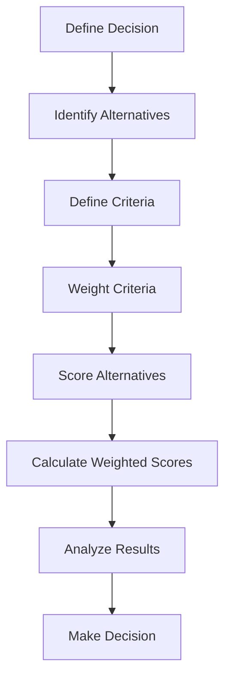

# Trade-Off Evaluation

> **Core skill:** Senior engineers systematically evaluate alternatives with multiple competing criteria, making transparent decisions that balance technical, business, and operational factors.

## Why This Matters

Engineering decisions rarely have a single "best" option. They involve trade-offs:
- **Speed vs quality:** Ship fast with known issues, or delay for polish?
- **Flexibility vs simplicity:** Build for future needs, or keep it simple?
- **Performance vs cost:** Optimize for speed, or minimize infrastructure costs?
- **Build vs buy:** Custom control, or proven third-party solution?

Without structured evaluation, decisions are based on:
- **Gut feel:** Inconsistent and hard to justify
- **Loudest voice:** Ignores important perspectives
- **Recency bias:** Overweights recent events
- **Single criterion:** Optimizes one factor at the expense of others

Structured trade-off evaluation makes decisions transparent, repeatable, and defensible.

## Trade-Off Evaluation Framework



### Step 1: Define the Decision

**Questions to answer:**
- What are we trying to decide?
- What is the context and constraints?
- Who are the stakeholders?
- What is the decision timeline?

**Example:**
```
Decision: Which message queue should we use for our event-driven architecture?
Context: Processing 1M events/day, need guaranteed delivery, 99.99% uptime
Constraints: Must integrate with existing systems, team has limited queue experience
Stakeholders: Engineering team, SRE team, product team
Timeline: Decision needed in 2 weeks for Q3 architecture planning
```

### Step 2: Identify Alternatives

**Include realistic options:**
- **Status quo:** Current approach (if applicable)
- **Option A:** First alternative
- **Option B:** Second alternative
- **Option C:** Third alternative (if applicable)

**Example:**
```
Alternative 1: Apache Kafka (open-source, self-hosted)
Alternative 2: Amazon SQS (managed service)
Alternative 3: RabbitMQ (open-source, self-hosted)
Alternative 4: Continue with current Redis-based queue
```

### Step 3: Define Criteria

**Categories of criteria:**

**Technical criteria:**
- Performance (throughput, latency)
- Scalability (horizontal scaling, capacity)
- Reliability (uptime, durability, fault tolerance)
- Maintainability (complexity, monitoring, debugging)
- Security (encryption, access control, compliance)

**Business criteria:**
- Cost (TCO over 3-5 years)
- Time to market (implementation speed)
- Strategic alignment (enables future capabilities)
- Vendor risk (lock-in, stability, pricing)

**Operational criteria:**
- Team expertise (existing skills, learning curve)
- Integration complexity (effort to connect to existing systems)
- Support quality (vendor support, community, documentation)
- Operational overhead (monitoring, maintenance, upgrades)

**Example criteria for message queue:**
```
1. Throughput (events/second)
2. Latency (milliseconds)
3. Reliability (uptime %)
4. Cost (5-year TCO)
5. Implementation time (weeks)
6. Team learning curve (months to proficiency)
7. Integration effort (weeks)
8. Vendor lock-in risk (1-10 scale, 10 = high risk)
```

### Step 4: Weight Criteria

**Assign weights based on importance:**
- Total weights should sum to 100%
- Use stakeholder input to determine weights
- Consider strategic priorities and constraints

**Example weights:**
```markdown
| Criterion | Weight | Rationale |
|-----------|--------|-----------|
| Reliability | 25% | 99.99% uptime is critical for our SLA |
| Cost | 20% | Budget constraints require cost efficiency |
| Throughput | 15% | Must handle 1M events/day with headroom |
| Implementation time | 15% | Need to deliver in Q3 |
| Team learning curve | 10% | Limited queue experience |
| Integration effort | 10% | Must connect to 5 existing systems |
| Vendor lock-in | 5% | Prefer flexibility but not critical |
| **Total** | **100%** | |
```

### Step 5: Score Alternatives

**Score each alternative on each criterion (1-10 scale):**
- 1 = Poor performance on this criterion
- 10 = Excellent performance on this criterion
- Use data when available; expert judgment when not

**Example scoring:**
```markdown
| Criterion | Weight | Kafka | SQS | RabbitMQ | Redis (Current) |
|-----------|--------|-------|-----|----------|-----------------|
| Reliability | 25% | 9 | 10 | 8 | 6 |
| Cost | 20% | 6 | 7 | 6 | 8 |
| Throughput | 15% | 10 | 8 | 8 | 7 |
| Implementation time | 15% | 5 | 9 | 6 | 10 |
| Learning curve | 10% | 4 | 8 | 6 | 9 |
| Integration effort | 10% | 6 | 8 | 7 | 9 |
| Vendor lock-in | 5% | 9 | 3 | 9 | 9 |
```

### Step 6: Calculate Weighted Scores

**Multiply score by weight for each criterion, then sum:**

```markdown
| Criterion | Weight | Kafka | SQS | RabbitMQ | Redis |
|-----------|--------|-------|-----|----------|-------|
| Reliability | 25% | 9×0.25=2.25 | 10×0.25=2.50 | 8×0.25=2.00 | 6×0.25=1.50 |
| Cost | 20% | 6×0.20=1.20 | 7×0.20=1.40 | 6×0.20=1.20 | 8×0.20=1.60 |
| Throughput | 15% | 10×0.15=1.50 | 8×0.15=1.20 | 8×0.15=1.20 | 7×0.15=1.05 |
| Implementation | 15% | 5×0.15=0.75 | 9×0.15=1.35 | 6×0.15=0.90 | 10×0.15=1.50 |
| Learning curve | 10% | 4×0.10=0.40 | 8×0.10=0.80 | 6×0.10=0.60 | 9×0.10=0.90 |
| Integration | 10% | 6×0.10=0.60 | 8×0.10=0.80 | 7×0.10=0.70 | 9×0.10=0.90 |
| Vendor lock-in | 5% | 9×0.05=0.45 | 3×0.05=0.15 | 9×0.05=0.45 | 9×0.05=0.45 |
| **Total Score** | | **7.15** | **8.20** | **7.05** | **7.90** |
```

### Step 7: Analyze Results

**Interpret the scores:**
- **Highest score:** Best overall fit based on weighted criteria
- **Close scores:** May need additional analysis or discussion
- **Outliers:** One option significantly better or worse

**Example analysis:**
```markdown
## Analysis

### Scores
1. **Amazon SQS:** 8.20 (highest)
2. **Redis (current):** 7.90
3. **Apache Kafka:** 7.15
4. **RabbitMQ:** 7.05

### Key Insights
- SQS wins on reliability (10), implementation speed (9), and learning curve (8)
- SQS has high vendor lock-in risk (score 3), but this criterion has low weight (5%)
- Redis (current) scores well on cost and learning curve, but poor on reliability (6)
- Kafka has highest throughput (10) but longest implementation time (5) and steepest learning curve (4)

### Sensitivity Analysis
If we increase vendor lock-in weight to 20% (from 5%):
- SQS score drops to 7.50
- Kafka score increases to 7.60
- Kafka becomes the winner

This suggests the decision is sensitive to vendor lock-in concerns.
```

### Step 8: Make Decision

**Consider:**
- Weighted scores (quantitative)
- Qualitative factors not captured in scoring
- Sensitivity analysis results
- Stakeholder input and consensus

**Example decision:**
```markdown
## Decision: Amazon SQS

### Rationale
SQS has the highest weighted score (8.20) and excels in our most important
criteria: reliability (10), implementation speed (9), and learning curve (8).

While SQS has vendor lock-in risk, this criterion has low weight (5%) because:
- AWS is a stable, long-term partner
- We can abstract the queue interface to reduce lock-in
- Migration cost is acceptable if we need to switch later

### Conditions
- Abstract queue interface to reduce lock-in (2 weeks additional effort)
- Review vendor lock-in annually; re-evaluate if AWS pricing increases >15%
- Monitor SQS costs monthly; alert if exceeding budget by 20%

### Next Steps
1. Design queue abstraction layer (Week 1)
2. Implement SQS integration (Weeks 2-3)
3. Migrate from Redis queue (Week 4)
4. Monitor and optimize (ongoing)
```

## Decision Matrix Template

```markdown
## Trade-Off Evaluation: [Decision]

### Decision Context
[What are we deciding? What are the constraints and stakeholders?]

### Alternatives
1. [Alternative 1]
2. [Alternative 2]
3. [Alternative 3]

### Criteria and Weights
| Criterion | Weight | Rationale |
|-----------|--------|-----------|
| [Criterion 1] | X% | [Why this weight] |
| [Criterion 2] | X% | [Why this weight] |
| [Criterion 3] | X% | [Why this weight] |
| **Total** | **100%** | |

### Scoring
| Criterion | Weight | Alt 1 | Alt 2 | Alt 3 |
|-----------|--------|-------|-------|-------|
| [Criterion 1] | X% | X (X×weight) | X (X×weight) | X (X×weight) |
| [Criterion 2] | X% | X (X×weight) | X (X×weight) | X (X×weight) |
| [Criterion 3] | X% | X (X×weight) | X (X×weight) | X (X×weight) |
| **Total Score** | | **X** | **X** | **X** |

### Analysis
[Interpretation of scores, key insights, sensitivity analysis]

### Decision
[Which alternative and why, including conditions and next steps]

### Risks and Mitigations
| Risk | Mitigation |
|------|------------|
| [Risk] | [Action] |
```

## Advanced Techniques

### Pairwise Comparison

**When to use:** Many criteria, need to determine weights systematically.

**Process:**
1. Compare each criterion against every other criterion
2. Assign points: 1 = equally important, 2 = more important, 3 = much more important
3. Sum points for each criterion
4. Calculate weights as percentage of total

**Example:**
```markdown
| Criterion | Reliability | Cost | Speed | Total | Weight |
|-----------|-------------|------|-------|-------|--------|
| Reliability | - | 2 | 3 | 5 | 42% |
| Cost | 1 | - | 2 | 3 | 25% |
| Speed | 1 | 1 | - | 2 | 17% |
| Quality | 1 | 2 | 2 | 5 | 17% |
| **Total** | | | | **12** | **100%** |
```

### Analytical Hierarchy Process (AHP)

**When to use:** Complex decisions with multiple levels of criteria.

**Process:**
1. Structure criteria in hierarchy (categories and sub-criteria)
2. Use pairwise comparison at each level
3. Calculate weights and scores
4. Aggregate to final decision

**Example hierarchy:**
```
Goal: Select message queue
├── Technical (50%)
│   ├── Performance (30%)
│   ├── Reliability (40%)
│   └── Scalability (30%)
├── Business (30%)
│   ├── Cost (60%)
│   └── Time to market (40%)
└── Operational (20%)
    ├── Learning curve (50%)
    └── Support quality (50%)
```

### Scenario Analysis

**When to use:** High uncertainty, want to test decision robustness.

**Process:**
1. Define scenarios (optimistic, pessimistic, most likely)
2. Evaluate each alternative under each scenario
3. Choose alternative that performs well across scenarios

**Example:**
```markdown
| Scenario | Kafka | SQS | RabbitMQ |
|----------|-------|-----|----------|
| High growth (10M events/day) | 9 | 7 | 6 |
| Moderate growth (2M events/day) | 7 | 9 | 7 |
| Low growth (500K events/day) | 5 | 8 | 8 |
| **Average** | **7.0** | **8.0** | **7.0** |

**Decision:** SQS performs well across all scenarios; most robust choice.
```

## Common Trade-Offs

### Speed vs Quality

**When to prioritize speed:**
- Time-to-market is critical (competitive pressure, regulatory deadline)
- Quality issues are low-risk and easily fixed
- Fast feedback is more valuable than polish

**When to prioritize quality:**
- Quality issues are high-risk (security, data loss, reputation)
- Rework cost is high (hard to fix later)
- Customer expectations are high

**Balanced approach:**
- Define minimum quality bar (must-haves)
- Ship fast with known limitations (documented)
- Plan quality improvements in next iteration

### Flexibility vs Simplicity

**When to prioritize flexibility:**
- Requirements are uncertain or evolving
- System will be extended in unpredictable ways
- Reuse across multiple contexts

**When to prioritize simplicity:**
- Requirements are stable and well-understood
- Simplicity reduces bugs and maintenance
- Team is small or inexperienced

**Balanced approach:**
- Design for current requirements (YAGNI)
- Use abstractions at natural boundaries
- Refactor when patterns emerge

### Performance vs Cost

**When to prioritize performance:**
- Performance is competitive differentiator
- Latency directly impacts revenue (e-commerce, trading)
- Scale requires optimization

**When to prioritize cost:**
- Performance requirements are modest
- Cost is major constraint (startup, budget pressure)
- Performance can be optimized later if needed

**Balanced approach:**
- Meet performance requirements, not maximize performance
- Optimize hot paths, not entire system
- Use auto-scaling to balance cost and performance

## Trade-Off Anti-Patterns

| Anti-Pattern | Problem | Better Approach |
|--------------|---------|-----------------|
| **Single criterion** | Optimizes one factor, ignores others | Use weighted multi-criteria evaluation |
| **Analysis paralysis** | Over-analyzes, delays decisions | Time-box analysis; accept "good enough" |
| **Gut feel** | Inconsistent, hard to justify | Use structured frameworks |
| **Recency bias** | Overweights recent events | Use historical data and multiple perspectives |
| **Loudest voice** | Ignores important stakeholders | Involve stakeholders in criteria and weighting |
| **Sunk cost** | Continues because of past investment | Base decisions on future costs and benefits |
| **False dichotomy** | Presents only two options | Generate multiple alternatives |

## Practical Applications

### Trade-Off Evaluation Checklist

Before making a decision with trade-offs:

- [ ] Defined the decision clearly with context and constraints
- [ ] Identified 3+ realistic alternatives
- [ ] Defined 5-8 evaluation criteria
- [ ] Weighted criteria based on strategic priorities
- [ ] Scored each alternative on each criterion (1-10)
- [ ] Calculated weighted scores
- [ ] Analyzed results and performed sensitivity analysis
- [ ] Made decision with clear rationale
- [ ] Documented decision for future reference

### Trade-Off Documentation Template

```markdown
## Trade-Off Decision: [Decision]

**Date:** [Date]
**Decision makers:** [Names]
**Status:** [Decided/Under evaluation]

### Context
[Brief description of decision and constraints]

### Alternatives Considered
1. [Alternative 1]
2. [Alternative 2]
3. [Alternative 3]

### Evaluation Summary
| Alternative | Score | Strengths | Weaknesses |
|-------------|-------|-----------|------------|
| [Alt 1] | X | [Key strengths] | [Key weaknesses] |
| [Alt 2] | X | [Key strengths] | [Key weaknesses] |

### Decision
[Which alternative and why]

### Trade-Offs Accepted
- [What we gain] vs [What we give up]
- [Mitigation strategy for what we give up]

### Review Date
[When to re-evaluate the decision]
```

## Success Indicators

- Decisions are made using structured frameworks, not gut feel
- Trade-offs are explicitly identified and accepted
- Stakeholders understand and agree with decision rationale
- Decisions are documented for future reference and learning
- Sensitivity analysis tests key assumptions
- Decisions are reviewed periodically and adjusted if needed

## Related Topics

- [[01_Cost_Benefit_Analysis|Cost-Benefit Analysis]]: Quantifies costs and benefits for trade-off evaluation
- [[02_Build_vs_Buy_Decisions|Build vs Buy Decisions]]: Common trade-off scenario
- [[03_Technical_Debt_ROI|Technical Debt ROI]]: Trade-off between speed and quality
- [[05_Business_Case_Development|Business Case Development]]: Presenting trade-off decisions to stakeholders
- [[03_Architecture_and_Design_Judgment/00_overview|Architecture and Design Judgment]]: Technical trade-offs in architecture

## Summary

Trade-off evaluation is systematically comparing alternatives with multiple competing criteria. Senior engineers use weighted decision matrices to score alternatives on technical, business, and operational criteria. They make decisions transparent by documenting criteria, weights, scores, and rationale. They use advanced techniques like pairwise comparison, AHP, and scenario analysis for complex decisions. They understand common trade-offs (speed vs quality, flexibility vs simplicity, performance vs cost) and make balanced choices that align with strategic priorities. Structured trade-off evaluation makes decisions transparent, repeatable, and defensible.
