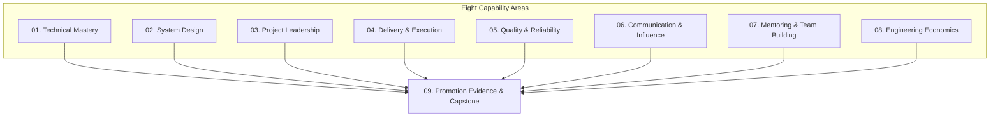

# Promotion Evidence and Capstone

## Overview

This is the capstone capability area that ties together all eight previous areas. It focuses on:

1. **Documenting Impact**: How to collect, organize, and present evidence of senior-level contributions
2. **Building Promotion Packets**: Structuring compelling cases for advancement to Staff/Principal levels
3. **Quantifying Value**: Translating technical work into business and organizational impact
4. **Self-Assessment**: Evaluating readiness against career ladders and identifying gaps
5. **Capstone Project**: Demonstrating mastery across all capability areas through a comprehensive initiative

## Why This Matters

**The Promotion Gap**: Many senior engineers do excellent work but struggle to advance because they:
- Don't document their impact systematically
- Can't articulate their contributions in promotion-friendly language
- Lack evidence of sustained, multi-quarter influence
- Haven't quantified the business value of their work
- Don't understand what promotion committees look for

**Senior vs Staff Distinction**:
- **Senior Engineer**: Owns and delivers complex projects within a team
- **Staff Engineer**: Drives technical strategy across teams, influences architecture decisions, multiplies others' effectiveness, and shapes engineering culture

The jump from Senior to Staff is not just doing more of the same:it's a qualitative shift in scope, influence, and organizational impact.

## The Eight Capability Areas

This capstone area helps you demonstrate mastery across all previous areas:

## Topics in This Area

1. **[[01_Promotion_Packets]]**: Structure, writing, and best practices for promotion documents
2. **[[02_Evidence_Collection]]**: Systematic approaches to documenting impact over time
3. **[[03_Impact_Quantification]]**: Measuring and articulating business and organizational value
4. **[[04_Self_Assessment]]**: Frameworks for evaluating promotion readiness
5. **[[05_Career_Ladders]]**: Understanding what committees look for at Staff/Principal levels
6. **[[06_Capstone_Project]]**: Comprehensive project demonstrating mastery across all areas

## Key Principles

### 1. Document Continuously, Not Retroactively
- Keep a "brag document" updated weekly
- Save positive feedback, metrics, and kudos
- Record decisions you influenced and their outcomes
- Track mentoring impact and knowledge sharing

### 2. Quantify Everything
- Use metrics: latency reduced by X%, costs saved by $Y, MTTR improved from A to B
- Translate technical work into business outcomes
- Show organizational impact beyond your team

### 3. Demonstrate Scope and Influence
- Staff-level work affects multiple teams or the entire organization
- Show how you shaped technical direction beyond your direct responsibilities
- Document cross-team collaboration and influence

### 4. Tell a Compelling Story
- Connect individual contributions to strategic outcomes
- Show progression and increasing responsibility over time
- Highlight moments where you operated at the next level

## Promotion Readiness Checklist

### Technical Mastery
- [ ] Led design and implementation of complex, high-impact systems
- [ ] Made architectural decisions that influenced multiple teams
- [ ] Solved technical problems that others couldn't or wouldn't tackle
- [ ] Established technical standards or patterns adopted organization-wide

### System Design
- [ ] Designed systems handling scale, reliability, or complexity challenges
- [ ] Made and documented significant architectural trade-offs
- [ ] Influenced system design across team or organizational boundaries
- [ ] Mentored others on system design principles

### Project Leadership
- [ ] Led projects spanning multiple teams or quarters
- [ ] Managed dependencies and risks across organizational boundaries
- [ ] Drove technical strategy for major initiatives
- [ ] Influenced roadmap and priorities based on technical insights

### Delivery & Execution
- [ ] Improved delivery processes that benefited multiple teams
- [ ] Established or refined practices adopted organization-wide
- [ ] Drove significant improvements in velocity, quality, or reliability
- [ ] Managed complex, multi-quarter technical initiatives

### Quality & Reliability
- [ ] Led quality or reliability initiatives with measurable impact
- [ ] Reduced incident rates, improved MTTR, or increased uptime
- [ ] Established testing, monitoring, or observability practices
- [ ] Mentored others on quality and reliability best practices

### Communication & Influence
- [ ] Wrote design docs, RFCs, or technical strategies that shaped direction
- [ ] Presented to leadership or cross-org audiences
- [ ] Influenced technical decisions without direct authority
- [ ] Communicated complex technical concepts to non-technical stakeholders

### Mentoring & Team Building
- [ ] Mentored engineers who were subsequently promoted
- [ ] Built or scaled teams, hiring and onboarding key contributors
- [ ] Established mentoring programs or knowledge-sharing practices
- [ ] Created psychological safety and inclusive team culture

### Engineering Economics
- [ ] Made build-vs-buy decisions with documented ROI
- [ ] Quantified technical debt and drove paydown initiatives
- [ ] Presented cost-benefit analyses to leadership
- [ ] Influenced budget or resource allocation based on economic analysis

## Capstone Project Criteria

Your capstone project should demonstrate:

1. **Technical Complexity**: Solves a hard problem requiring deep technical expertise
2. **Organizational Impact**: Affects multiple teams or the entire organization
3. **Strategic Alignment**: Advances business or technical strategy
4. **Leadership**: Shows you drove the initiative, not just participated
5. **Influence**: Demonstrates you influenced others without direct authority
6. **Mentoring**: Includes knowledge transfer and team capability building
7. **Economic Awareness**: Shows understanding of costs, trade-offs, and ROI
8. **Quality Focus**: Delivers reliable, maintainable, well-tested solutions
9. **Communication**: Includes clear documentation and stakeholder communication
10. **Sustainability**: Creates lasting impact beyond your direct involvement

## Example Capstone Projects

### Platform Modernization Initiative
- **Technical**: Led migration from monolith to microservices across 3 teams
- **Impact**: Reduced deployment time from 2 hours to 15 minutes, 95% fewer incidents
- **Leadership**: Drove strategy, coordinated across teams, managed risks
- **Influence**: Convinced skeptical teams, aligned leadership on approach
- **Mentoring**: Trained 12 engineers on new architecture and practices
- **Economics**: Presented $2.5M 3-year ROI to executive team
- **Quality**: Zero-downtime migration, comprehensive testing strategy
- **Communication**: Wrote RFC, presented at all-hands, created runbooks
- **Sustainability**: Established patterns now used by 8 teams

### Observability Transformation
- **Technical**: Designed and implemented observability stack (metrics, logs, traces)
- **Impact**: Reduced MTTR from 4 hours to 45 minutes, 60% fewer escalations
- **Leadership**: Identified problem, proposed solution, drove adoption
- **Influence**: Convinced 5 teams to adopt new practices and tooling
- **Mentoring**: Trained 20 engineers, created observability guild
- **Economics**: Quantified $800K annual savings from faster incident response
- **Quality**: Established SLOs, error budgets, and incident response processes
- **Communication**: Wrote observability strategy, presented to VP Engineering
- **Sustainability**: Guild continues to evolve practices 2 years later

### Developer Productivity Platform
- **Technical**: Built internal platform (CI/CD, testing, deployment automation)
- **Impact**: Reduced developer onboarding from 2 weeks to 2 days, 30% faster delivery
- **Leadership**: Identified pain points, designed solution, drove adoption
- **Influence**: Convinced teams to migrate from custom scripts to platform
- **Mentoring**: Trained platform team, created extensive documentation
- **Economics**: Presented $1.2M annual productivity gain to leadership
- **Quality**: Platform reliability 99.9%, comprehensive testing
- **Communication**: User guides, training sessions, feedback loops
- **Sustainability**: Platform team maintains and evolves independently

## Next Steps

1. **Review**: Audit your work against the promotion readiness checklist
2. **Collect**: Start or enhance your evidence collection practices
3. **Quantify**: Identify metrics and business impact for your major contributions
4. **Plan**: Identify gaps and create a plan to address them
5. **Execute**: If ready, begin drafting your promotion packet
6. **Capstone**: If you need a major initiative to demonstrate Staff-level impact, plan and execute a capstone project

## Summary

This capstone capability area is about making your impact visible and compelling. It's not enough to do great work:you need to document it, quantify it, and present it in a way that demonstrates you're operating at the next level. Whether you're preparing for a Staff promotion or building a portfolio for future opportunities, these skills ensure your contributions are recognized and rewarded.

Remember: **Promotion is not about tenure or effort:it's about demonstrating sustained impact at the next level across multiple dimensions.**

---

## Related Areas

- [[../01_Technical_Mastery/00_overview|01. Technical Mastery]]
- [[../02_System_Design/00_overview|02. System Design]]
- [[../03_Project_Leadership/00_overview|03. Project Leadership]]
- [[../04_Delivery_and_Execution/00_overview|04. Delivery & Execution]]
- [[../05_Quality_Reliability_and_Security/00_overview|05. Quality & Reliability]]
- [[../06_Communication_and_Influence/00_overview|06. Communication & Influence]]
- [[../07_Mentoring_and_Team_Leadership/00_overview|07. Mentoring & Team Leadership]]
- [[../08_Engineering_Economics_and_Trade_Offs/00_overview|08. Engineering Economics]]
