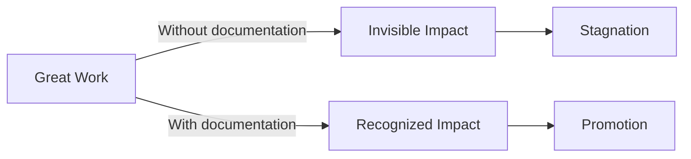

# Promotion Packets

## What is a Promotion Packet?

A promotion packet (also called promo doc, promotion case, or career case) is a structured document that:
- Demonstrates you're operating at the next level
- Provides evidence across multiple competency dimensions
- Quantifies your impact in business and organizational terms
- Tells a compelling story of sustained contribution

**Key Insight**: Promotion packets are not performance reviews. They're evidence-based arguments that you've been performing at the next level for an extended period.

## Why Promotion Packets Matter



**The Documentation Gap**: Many senior engineers do Staff-level work but lack the evidence to prove it. A well-crafted promotion packet bridges this gap.

## Structure of a Strong Promotion Packet

### 1. Executive Summary (1 paragraph)

**Purpose**: Give the committee a quick overview of why you deserve promotion.

**Template**:
```
[Name] has been operating at [next level] for [timeframe]. They have demonstrated
mastery across [X] key areas: [list 2-3 major themes]. Their work has delivered
[quantified impact] while [additional value: mentoring, influence, etc.]. This
packet presents evidence that [name] consistently operates at [next level] scope
and impact.
```

**Example**:
```
Sarah Chen has been operating at Staff Engineer level for the past 18 months.
She has demonstrated mastery across three key areas: architectural leadership,
cross-team influence, and engineering culture development. Her platform
modernization initiative delivered $2.5M in 3-year ROI while reducing deployment
time by 87%. This packet presents evidence that Sarah consistently operates at
Staff Engineer scope and impact.
```

### 2. Scope and Impact Summary (1 page)

**Purpose**: Show the breadth and depth of your influence.

**Template**:
```markdown
## Scope

### Direct Responsibilities
- [List your core projects and systems]
- [Quantify: X services, Y users, $Z revenue]

### Cross-Team Influence
- [Teams you've influenced beyond your own]
- [Initiatives you've shaped]
- [Standards you've established]

### Organizational Impact
- [Company-wide contributions]
- [Culture and process improvements]
- [Strategic initiatives]

## Impact Metrics

| Metric | Before | After | Improvement |
|--------|--------|-------|-------------|
| [Metric 1] | [X] | [Y] | [Z%] |
| [Metric 2] | [X] | [Y] | [Z%] |
| [Metric 3] | [X] | [Y] | [Z%] |

## Timeline
- Q1 2024: [Major milestone]
- Q2 2024: [Major milestone]
- Q3 2024: [Major milestone]
- Q4 2024: [Major milestone]
```

### 3. Detailed Evidence by Competency (3-5 pages)

**Purpose**: Provide specific examples for each competency area.

**Structure for each competency**:
```markdown
## [Competency Name]

### Evidence 1: [Project/Initiative Name]

**Context**: [Brief background and challenge]

**Actions**:
- [What you did, specifically]
- [Technical decisions you made]
- [How you influenced others]

**Impact**:
- [Quantified results]
- [Business value]
- [Organizational benefit]

**Scope**: [Team/cross-team/organizational]

**Artifacts**:
- [Design doc link]
- [Code/PR link]
- [Presentation link]
```

### 4. Peer Feedback (1-2 pages)

**Purpose**: Show that others recognize your impact.

**Types of feedback to include**:
- **Upward**: From managers and leadership
- **Lateral**: From peers and collaborators
- **Downward**: From mentees and reports
- **External**: From customers or partners

**Template**:
```markdown
## Peer Feedback

### [Name], [Role] - [Relationship to you]
"[Specific quote about your impact, influence, or leadership]"

**Context**: [When and why they provided this feedback]

### [Name], [Role] - [Relationship to you]
"[Specific quote about your technical contributions]"

**Context**: [When and why they provided this feedback]
```

**Tips**:
- Get feedback from people outside your immediate team
- Include specific, quantifiable statements
- Show progression over time
- Highlight moments where you operated at the next level

### 5. Growth and Development (0.5-1 page)

**Purpose**: Show self-awareness and continuous improvement.

**Template**:
```markdown
## Growth and Development

### Areas of Growth
- **[Area 1]**: [How you've improved and evidence]
- **[Area 2]**: [How you've improved and evidence]

### Feedback Incorporated
- **[Feedback received]**: [How you acted on it]
- **[Feedback received]**: [How you acted on it]

### Future Development Goals
- **[Goal 1]**: [Plan to achieve it]
- **[Goal 2]**: [Plan to achieve it]
```

### 6. Conclusion (0.5 page)

**Purpose**: Summarize the case and make the ask clear.

**Template**:
```markdown
## Conclusion

[Name] has demonstrated sustained performance at [next level] across:

1. **Technical Excellence**: [Brief summary with metrics]
2. **Organizational Impact**: [Brief summary with examples]
3. **Leadership and Influence**: [Brief summary with scope]

The evidence in this packet shows [name] has been operating at [next level] for
[timeframe]. We recommend promotion to [next level] effective [date].
```

## Writing Best Practices

### 1. Use the STAR Method

**Situation**: Set the context
**Task**: Describe the challenge
**Action**: Explain what you did
**Result**: Quantify the outcome

**Example**:
```
Situation: Our platform had 4-hour deployment cycles and 15% failure rate,
blocking product releases.

Task: As technical lead, I needed to modernize our CI/CD pipeline to enable
continuous delivery.

Action: I designed a new pipeline architecture, led a team of 3 engineers,
coordinated with 5 product teams for migration, and presented the strategy to
VP Engineering.

Result: Reduced deployment time from 4 hours to 15 minutes (94% improvement),
achieved 99.5% success rate, and enabled 3x more frequent releases. This
delivered $1.2M annual productivity gain.
```

### 2. Quantify Everything

**Weak**: "Improved system performance"
**Strong**: "Reduced p99 latency from 800ms to 120ms (85% improvement), enabling 40% more concurrent users"

**Weak**: "Mentored junior engineers"
**Strong**: "Mentored 4 junior engineers; 2 were promoted to mid-level within 12 months, 1 became a team lead"

**Weak**: "Led a successful project"
**Strong**: "Led platform migration affecting 8 teams, 50 services, and 2M daily users, completed on-time with zero customer-facing incidents"

### 3. Show Progression

Demonstrate increasing scope and responsibility:

```
Q1 2024: Owned authentication service (1 team, 3 engineers)
Q2 2024: Led auth platform redesign (2 teams, 8 engineers)
Q3 2024: Drove identity strategy across org (5 teams, 20 engineers)
Q4 2024: Established company-wide security standards (all engineering teams)
```

### 4. Use Active Voice

**Weak**: "The project was completed successfully"
**Strong**: "I led the project to successful completion"

**Weak**: "Improvements were made to the system"
**Strong**: "I architected and implemented system improvements"

### 5. Include Artifacts

Link to tangible evidence:
- Design documents and RFCs
- Code reviews and pull requests
- Presentations and talks
- Blog posts and documentation
- Metrics dashboards
- Incident postmortems

## Common Mistakes

### 1. Focusing on Effort Instead of Impact

**Wrong**: "I worked 60-hour weeks for 6 months"
**Right**: "I delivered the project 2 weeks ahead of schedule, enabling Q3 launch"

### 2. Using Vague Language

**Wrong**: "Significantly improved performance"
**Right**: "Reduced p99 latency by 85% (800ms → 120ms)"

### 3. Ignoring Organizational Impact

**Wrong**: Only discussing technical contributions
**Right**: Showing how your work influenced teams, culture, and strategy

### 4. Not Demonstrating Scope

**Wrong**: Only showing work within your team
**Right**: Showing influence across teams and the organization

### 5. Retroactive Documentation

**Wrong**: Trying to remember what you did 6 months ago
**Right**: Maintaining a brag document and collecting evidence continuously

## Promotion Packet Template

```markdown
# Promotion Packet: [Your Name] - [Current Level] → [Next Level]

## Executive Summary
[1 paragraph summarizing why you deserve promotion]

## Scope and Impact Summary

### Direct Responsibilities
- [List your core projects and systems]

### Cross-Team Influence
- [Teams you've influenced]

### Organizational Impact
- [Company-wide contributions]

### Impact Metrics
| Metric | Before | After | Improvement |
|--------|--------|-------|-------------|
| [Metric 1] | [X] | [Y] | [Z%] |

## Detailed Evidence

### [Competency 1: Technical Excellence]

#### Evidence 1: [Project Name]
**Context**: [Background]
**Actions**: [What you did]
**Impact**: [Quantified results]
**Scope**: [Team/cross-team/org]

#### Evidence 2: [Project Name]
[Same structure]

### [Competency 2: Leadership and Influence]
[Same structure]

### [Competency 3: Mentoring and Team Building]
[Same structure]

### [Competency 4: Strategic Impact]
[Same structure]

## Peer Feedback

### [Name], [Role]
"[Quote]"

### [Name], [Role]
"[Quote]"

## Growth and Development

### Areas of Growth
- [Area and evidence]

### Feedback Incorporated
- [Feedback and action]

### Future Goals
- [Goal and plan]

## Conclusion
[Summary and recommendation]
```

## Review Checklist

Before submitting your promotion packet:

- [ ] Executive summary clearly states the case for promotion
- [ ] All metrics are quantified with before/after comparisons
- [ ] Evidence spans multiple quarters (not just recent work)
- [ ] Examples show progression and increasing scope
- [ ] Peer feedback includes people outside your team
- [ ] Artifacts are linked and accessible
- [ ] Language is active, not passive
- [ ] Impact is framed in business and organizational terms
- [ ] Growth section shows self-awareness
- [ ] Conclusion makes a clear recommendation
- [ ] Document is proofread and error-free
- [ ] Length is appropriate (8-12 pages typical)

## Timeline

### 3-6 Months Before Promotion Review
- Start or enhance your brag document
- Collect peer feedback
- Identify gaps in evidence
- Plan projects to fill gaps

### 1-2 Months Before
- Draft promotion packet
- Get feedback from manager
- Revise and strengthen evidence
- Collect additional peer feedback

### 2-4 Weeks Before
- Finalize packet
- Manager review and edits
- Submit to promotion committee

### After Submission
- Prepare for promotion presentation (if required)
- Anticipate committee questions
- Practice articulating your impact

## Summary

A promotion packet is your evidence-based argument that you're operating at the next level. It requires:

1. **Clear structure**: Executive summary, scope, evidence, feedback, growth, conclusion
2. **Quantified impact**: Metrics, before/after comparisons, business value
3. **Broad scope**: Team, cross-team, and organizational influence
4. **Compelling narrative**: Story of progression and sustained impact
5. **Strong artifacts**: Design docs, code, presentations, metrics
6. **Peer validation**: Feedback from multiple perspectives

**Key Takeaway**: Don't wait until promotion time to start documenting. Maintain a brag document, collect evidence continuously, and build your packet incrementally over time.

---

## Related Topics

- [[02_Evidence_Collection]]: How to systematically document your impact
- [[03_Impact_Quantification]]: Measuring and articulating value
- [[04_Self_Assessment]]: Evaluating your readiness
- [[05_Career_Ladders]]: Understanding what committees look for
