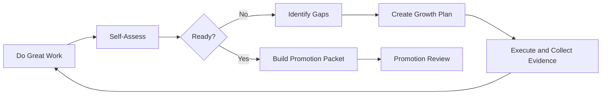
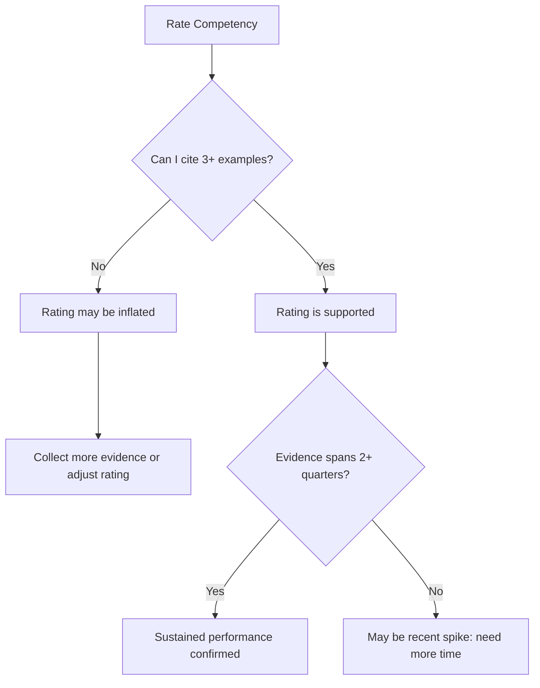
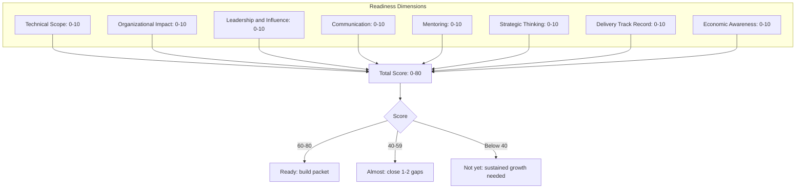

# Self-Assessment

> **Core skill:** Senior engineers evaluate their own readiness objectively, identify gaps honestly, and create targeted plans to close them before pursuing promotion.

## Why Self-Assessment Matters

Self-assessment is the bridge between doing senior-level work and being recognized for it. Without honest self-evaluation:

- **Blind spots persist:** You may not realize where you fall short of the next level
- **Evidence gaps grow:** You collect evidence of your strengths while neglecting weaker areas
- **Timing suffers:** You pursue promotion too early (and get rejected) or too late (and stagnate)
- **Development stalls:** Without knowing your gaps, you cannot plan targeted growth



## Self-Assessment Framework

### Step 1: Understand the Target Level

Before assessing yourself, you must understand what the next level requires.

**Sources:**
- Company career ladder documentation
- Level rubrics and competency matrices
- Conversations with your manager about expectations
- Staff/Principal engineers who have been through the process
- External frameworks (e.g., Staff Engineer by Will Larson)

**Key question:** What does a person at the next level do differently from what I do today?

### Step 2: Rate Yourself Against Each Competency

Use a 1-5 scale for each competency area:

| Rating | Meaning | Description |
|--------|---------|-------------|
| **1** | Developing | Still building foundational skills |
| **2** | Competent | Meets expectations for current level |
| **3** | Proficient | Consistently delivers at current level |
| **4** | Advanced | Frequently operates at next level |
| **5** | Expert | Sustained performance at next level |

**Promotion threshold:** You need most competencies at 4-5, with none below 3.

### Step 3: Gather Evidence for Each Rating

For each self-rating, ask: "What specific evidence supports this rating?"



### Step 4: Identify Gaps

Compare your ratings against the target level requirements:

| Competency | Current Rating | Target Rating | Gap | Priority |
|-----------|---------------|---------------|-----|----------|
| Technical depth | 4 | 5 | -1 | Medium |
| Cross-team influence | 3 | 4 | -1 | High |
| Mentoring | 2 | 4 | -2 | Critical |
| Strategic thinking | 4 | 5 | -1 | Medium |
| Delivery leadership | 5 | 5 | 0 | Done |

**Gap prioritization:**
- **Critical (gap of 2+):** Must address before promotion
- **High (gap of 1 in core area):** Should address before promotion
- **Medium (gap of 1 in secondary area):** Nice to address, not blocking
- **Done (no gap):** Focus on collecting evidence

### Step 5: Create a Gap-Closing Plan

For each gap, define:
1. **What to do:** Specific project, initiative, or activity
2. **Evidence to collect:** What artifacts and metrics will demonstrate growth
3. **Timeline:** When you expect to close the gap
4. **Support needed:** Who can help you (manager, mentor, peers)

**Example:**

```markdown
## Gap: Mentoring (Current: 2, Target: 4)

### What to do
- Take on 2 formal mentees (junior engineers)
- Establish weekly 1:1 meetings with structured goals
- Create 3 technical guides for team onboarding
- Lead 2 brown-bag sessions on system design

### Evidence to collect
- Mentee feedback and progression
- Guide usage metrics and feedback
- Session attendance and ratings
- Manager observation of mentoring quality

### Timeline: 6 months
- Month 1-2: Establish mentoring relationships
- Month 3-4: Create guides, lead first session
- Month 5-6: Lead second session, assess mentee progress

### Support needed
- Manager: Assign mentees, provide feedback on approach
- Senior peer: Co-lead first brown-bag session
```

## The Readiness Scorecard

### Promotion Readiness Score

Rate yourself across these dimensions and calculate your overall readiness:



### Scoring Guide

| Dimension | 0-3 | 4-6 | 7-8 | 9-10 |
|-----------|-----|-----|-----|------|
| **Technical Scope** | Single component | Single service | Multiple services | Cross-org systems |
| **Organizational Impact** | Team only | 2-3 teams | Division-wide | Company-wide |
| **Leadership** | Self-directed | Leads small projects | Leads major initiatives | Shapes technical strategy |
| **Communication** | Clear in writing | Good presenter | Influences decisions | Shapes narrative |
| **Mentoring** | Helps peers | Formal mentee | Grows engineers | Builds capability |
| **Strategic Thinking** | Task-focused | Project-focused | Initiative-focused | Strategy-focused |
| **Delivery** | On-time tasks | On-time projects | On-time programs | Predictable at scale |
| **Economic Awareness** | Understands costs | Calculates ROI | Builds business cases | Influences investment |

### Interpreting Your Score

**60-80 (Ready):**
- You are operating at the next level across most dimensions
- Focus on building your promotion packet
- Collect remaining evidence and peer feedback
- Discuss timing with your manager

**40-59 (Almost Ready):**
- You have strong areas but 1-2 significant gaps
- Create a targeted gap-closing plan
- Focus on the lowest-scoring dimensions
- Timeline: 3-6 months to readiness

**Below 40 (Not Yet Ready):**
- You are still growing into your current level
- Focus on sustained performance at current level first
- Build breadth across dimensions before pursuing promotion
- Timeline: 6-12 months of focused development

## Common Self-Assessment Mistakes

### 1. Overestimating Impact

**Problem:** Rating yourself 5 because you feel you are doing great work.
**Reality check:** Can you cite 3+ specific examples with quantified impact spanning 2+ quarters?

### 2. Confusing Effort with Level

**Problem:** "I work 60 hours a week, so I must be Staff level."
**Reality check:** Promotion is about scope and impact, not hours worked. A focused 40-hour week with cross-org impact beats a scattered 60-hour week.

### 3. Ignoring Weak Areas

**Problem:** Focusing self-assessment only on strengths.
**Reality check:** Promotion committees look for breadth. A gap in any core dimension can block promotion.

### 4. Not Seeking External Validation

**Problem:** Self-assessment in isolation.
**Reality check:** Ask your manager, peers, and mentees for their perspective. Their view may differ from yours.

### 5. Recency Bias

**Problem:** Rating based on the last month of work.
**Reality check:** Promotion requires sustained performance. Rate based on the last 6-12 months.

## Self-Assessment Conversation with Your Manager

### Preparing for the Conversation

1. **Complete your self-assessment** before the meeting
2. **Identify 2-3 areas** where you want feedback
3. **Prepare specific questions:** "What would you need to see from me to support a promotion case?"
4. **Bring evidence:** Show examples that support your ratings

### During the Conversation

- **Share your ratings** and ask where your manager agrees or disagrees
- **Listen for gaps** your manager sees that you missed
- **Ask about timing:** "When do you think I could be ready?"
- **Agree on a plan:** What specific work will close remaining gaps?

### After the Conversation

- **Document agreements** in writing (email summary)
- **Update your gap-closing plan** based on feedback
- **Schedule follow-up** check-ins (monthly or quarterly)
- **Adjust timeline** if needed

## Quarterly Self-Assessment Ritual

Make self-assessment a regular practice, not a one-time event:

### Q1 Review (January)
- Review previous year's accomplishments
- Set growth goals for the year
- Identify projects that will build target competencies
- Update brag document

### Q2 Review (April)
- Check progress against growth goals
- Adjust plan if needed
- Collect mid-year feedback from manager and peers
- Update evidence collection

### Q3 Review (July)
- Assess readiness score
- Identify remaining gaps
- Intensify focus on weakest areas
- Begin drafting promotion packet if on track

### Q4 Review (October)
- Final readiness assessment
- Complete promotion packet if ready
- Plan next year's development if not yet ready
- Celebrate growth regardless of outcome

## Tools for Self-Assessment

### 1. Readiness Spreadsheet

Track your ratings over time:

| Competency | Q1 | Q2 | Q3 | Q4 | Trend |
|-----------|----|----|----|----|----|
| Technical Scope | 3 | 3 | 4 | 4 | ↑ |
| Org Impact | 2 | 3 | 3 | 4 | ↑ |
| Leadership | 3 | 3 | 3 | 4 | ↑ |
| Communication | 4 | 4 | 4 | 5 | ↑ |
| Mentoring | 2 | 2 | 3 | 3 | ↑ |
| Strategic Thinking | 2 | 3 | 3 | 4 | ↑ |
| Delivery | 4 | 4 | 5 | 5 | → |
| Economics | 2 | 2 | 3 | 3 | ↑ |

### 2. Feedback Tracker

Log all feedback received:

| Date | Source | Type | Content | Action Taken |
|------|--------|------|---------|-------------|
| 2024-01-15 | Manager | 1:1 | "Need more cross-team visibility" | Started presenting at guild meetings |
| 2024-02-10 | Peer | 360 | "Great technical depth, could delegate more" | Delegated auth service to mid-level engineer |
| 2024-03-05 | Mentee | 1:1 | "Your system design sessions are really helpful" | Increased frequency to weekly |

### 3. Evidence Gap Analysis

| Competency | Evidence Count | Quarters Covered | Quality | Gap |
|-----------|---------------|-----------------|---------|-----|
| Technical Scope | 8 | Q1-Q4 | Strong | None |
| Org Impact | 3 | Q3-Q4 | Moderate | Need Q1-Q2 evidence |
| Mentoring | 1 | Q4 only | Weak | Critical gap |

## Summary

Self-assessment is the foundation of intentional career development. It requires:

1. **Understanding the target:** Know what the next level requires
2. **Honest self-rating:** Rate against evidence, not feelings
3. **Gap identification:** Find where you fall short and prioritize
4. **Targeted planning:** Create specific plans to close each gap
5. **Regular review:** Assess quarterly, not just at promotion time
6. **External validation:** Seek feedback from manager, peers, and mentees

**Key Takeaway:** Self-assessment is not a one-time exercise before promotion. It is a quarterly ritual that keeps your career development intentional and evidence-based. The engineers who advance consistently are those who know exactly where they stand and what they need to do next.

---

## Related Topics

- [[01_Promotion_Packets]]: Structuring your promotion case
- [[02_Evidence_Collection]]: Systematic documentation of impact
- [[03_Impact_Quantification]]: Measuring and articulating value
- [[05_Career_Ladders]]: Understanding level expectations
- [[06_Capstone_Project]]: Demonstrating mastery across all areas
