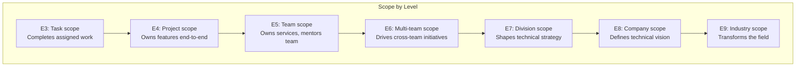
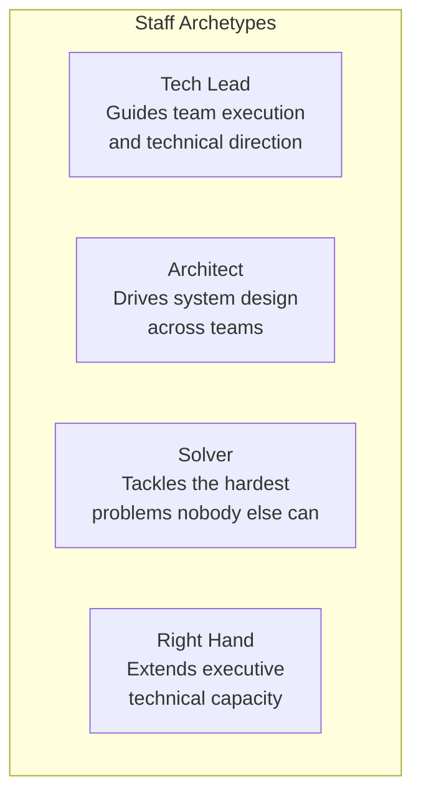
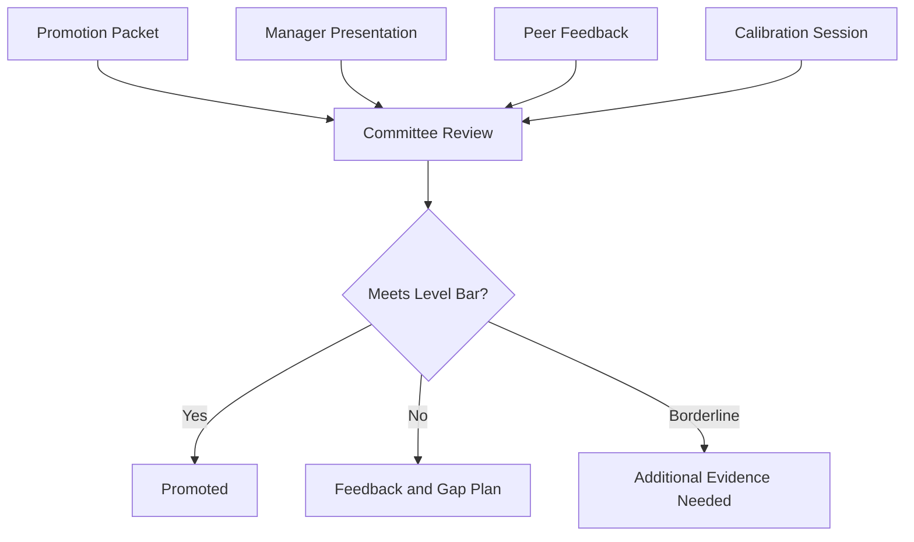
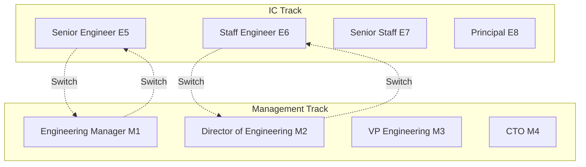
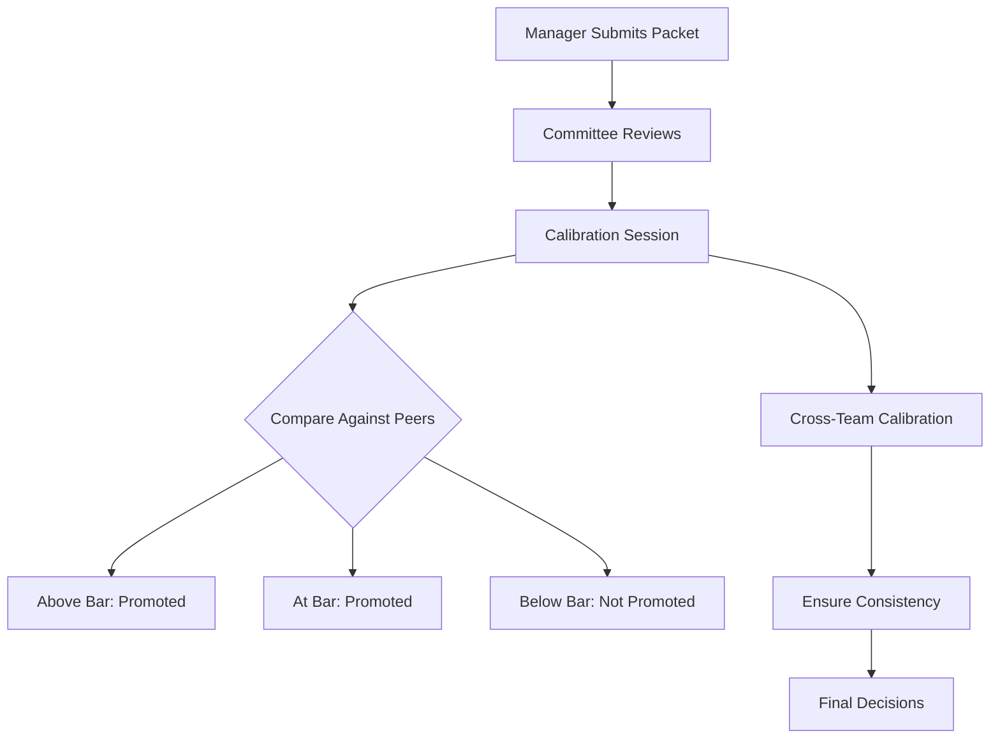

# Career Ladders

> **Core skill:** Senior engineers understand how career ladders work, what promotion committees evaluate, and how to position their work against level expectations.

## Why Understanding Career Ladders Matters

Career ladders define the progression framework within your organization. Understanding them helps you:

- **Target the right behaviors:** Know what distinguishes each level
- **Align your work:** Choose projects and initiatives that demonstrate next-level impact
- **Communicate effectively:** Use the language of your ladder in self-assessments and promotion packets
- **Set realistic timelines:** Understand typical time-in-level and progression expectations


**The critical transition:** Senior to Staff is the hardest jump in most engineering careers. It requires a qualitative shift in scope, not just more output.

## Typical Engineering Career Ladder

### Level Overview

| Level | Typical Title | Scope | Time-in-Level | Key Differentiator |
|-------|-------------|-------|---------------|-------------------|
| **E3** | Junior/Associate | Task | 1-2 years | Executes defined tasks with guidance |
| **E4** | Mid-Level | Project | 2-4 years | Owns and delivers projects independently |
| **E5** | Senior | Team/Service | 3-5 years | Owns complex systems, mentors others |
| **E6** | Staff | Multi-team/Org | 4-7 years | Drives technical strategy across teams |
| **E7** | Senior Staff | Division | 5-10 years | Shapes technical direction for business unit |
| **E8** | Principal | Company | 7-15 years | Influences industry, defines technical vision |
| **E9** | Distinguished | Industry | 10+ years | Transforms the field |

### Scope Progression



## Senior to Staff: The Critical Transition

### What Changes

| Dimension | Senior (E5) | Staff (E6) |
|-----------|-------------|------------|
| **Scope** | Owns a team's technical direction | Influences multiple teams' technical direction |
| **Problem type** | Well-defined complex problems | Ambiguous, cross-cutting problems |
| **Influence** | Direct authority within team | Influence without authority across teams |
| **Time horizon** | Quarterly to annual | Annual to multi-year |
| **Decision type** | Technical implementation | Technical strategy and trade-offs |
| **Communication** | Team and adjacent teams | Leadership, cross-org, external |
| **Mentoring** | Mentors 1-2 engineers | Raises capability of entire teams |
| **Accountability** | Team outcomes | Organizational outcomes |

### The Four Staff Engineer Archetypes

Based on Will Larson's "Staff Engineer" framework:



| Archetype | Focus | Key Skill | Typical Scope |
|-----------|-------|-----------|---------------|
| **Tech Lead** | Team execution | Technical leadership + people skills | 1-2 teams |
| **Architect** | System design | Deep technical breadth + trade-off analysis | Division |
| **Solver** | Hard problems | Deep technical depth + persistence | Cross-org (as needed) |
| **Right Hand** | Executive leverage | Strategic thinking + communication | Company |

**Key insight:** Most Staff promotions happen through the Tech Lead or Architect archetypes. Solvers and Right Hands are rarer and require specific organizational contexts.

## What Promotion Committees Evaluate

### The Promotion Committee's Perspective



### Evaluation Dimensions

Most committees evaluate across these dimensions:

#### 1. Technical Excellence
- **Depth:** Expertise in your domain
- **Breadth:** Understanding across multiple areas
- **Judgment:** Making sound technical decisions under uncertainty
- **Innovation:** Creating novel solutions to hard problems

#### 2. Impact and Scope
- **Scale:** How many people/teams/systems are affected
- **Duration:** Is the impact sustained or one-time
- **Significance:** How important is the impact to the business
- **Originality:** Did you identify and solve the problem, or were you assigned it

#### 3. Leadership and Influence
- **Direction:** Setting technical direction for others
- **Persuasion:** Influencing decisions without authority
- **Coordination:** Aligning multiple teams toward shared goals
- **Culture:** Shaping engineering culture and practices

#### 4. Communication
- **Clarity:** Explaining complex topics simply
- **Audience:** Reaching technical and non-technical stakeholders
- **Documentation:** Creating lasting artifacts (RFCs, strategies, guides)
- **Facilitation:** Driving productive discussions and decisions

#### 5. Mentorship and Multiplier Effect
- **Direct mentoring:** Growing individual engineers
- **Knowledge sharing:** Creating guides, talks, workshops
- **Process improvement:** Making teams more effective
- **Hiring:** Building strong teams

### What Committees Look For: The Signals

| Signal | What It Means | How to Demonstrate |
|--------|--------------|-------------------|
| **Scope expansion** | You took on work beyond your team | Led cross-team initiative, influenced adjacent teams |
| **Problem identification** | You found problems others missed | Identified technical debt, proposed solutions before crisis |
| **Sustained impact** | Your contributions last beyond your involvement | Established practices still in use, systems still running |
| **Multiplier effect** | You make others more effective | Mentoring, tools, documentation, process improvements |
| **Strategic alignment** | Your work advances business goals | Connected technical work to business outcomes |
| **Influence without authority** | People follow your lead voluntarily | RFCs adopted, standards followed, teams seek your input |

### Common Committee Questions

1. **"Is this person already operating at the next level?"**
   - Not "could they" or "will they": are they already doing it?

2. **"Is the impact sustained?"**
   - One great quarter is not enough. Show 2-4 quarters of consistent performance.

3. **"What is the scope?"**
   - Team-level impact is Senior. Multi-team or org-level impact is Staff.

4. **"Did they drive this, or were they assigned?"**
   - Staff engineers identify problems and propose solutions. They are not just executors.

5. **"Who would notice if this person left?"**
   - Staff engineers have influence beyond their immediate team. Multiple teams would feel the loss.

## Level Rubrics: How to Read Them

### Typical Rubric Structure

Most companies use rubrics with dimensions and level-specific descriptions:

| Dimension | Senior (E5) | Staff (E6) |
|-----------|-------------|------------|
| **Technical** | Expert in their domain. Solves complex technical problems. | Expert across multiple domains. Solves ambiguous, cross-cutting problems. |
| **Impact** | Delivers significant projects for their team. | Drives initiatives that affect multiple teams or the organization. |
| **Leadership** | Mentors junior engineers. Leads technical discussions within team. | Influences technical direction across teams. Raises capability of multiple teams. |
| **Communication** | Communicates clearly to team and adjacent teams. | Communicates effectively to leadership, cross-org, and external audiences. |

### How to Use Rubrics

1. **Read your level:** Understand what is expected at your current level
2. **Read the next level:** Identify what you need to demonstrate
3. **Gap analysis:** Where do you fall between levels?
4. **Evidence mapping:** Map your work against the next-level descriptions
5. **Language alignment:** Use rubric language in your promotion packet

### Rubric Limitations

- **Rubrics are guidelines, not checklists:** Meeting every bullet does not guarantee promotion
- **Interpretation varies:** Different committee members may interpret rubrics differently
- **Context matters:** The same work may be Senior at one company and Staff at another
- **Rubrics lag reality:** They may not capture emerging areas like SRE or platform engineering

## Career Ladder Variations

### IC vs Management Track



**Key points:**
- IC and Management tracks are parallel, not hierarchical
- Switching tracks is common and does not mean "failing" at one
- Staff Engineer and Engineering Manager are typically equivalent in level and compensation
- The best organizations value both tracks equally

### Company Size and Ladder Depth

| Company Size | Typical Ladder Depth | Notes |
|-------------|---------------------|-------|
| **Startup (1-50)** | E3-E5 | Flat structure, titles matter less |
| **Small (50-200)** | E3-E6 | May have Staff, rarely Principal |
| **Medium (200-1000)** | E3-E7 | Full ladder, meaningful distinctions |
| **Large (1000+)** | E3-E9 | Deep ladder, highly structured |
| **FAANG** | E3-E9+ | Most granular, extensive calibration |

### Industry Variations

- **FAANG/Big Tech:** Highly structured, extensive calibration, committee-driven
- **Startups:** Informal, founder-driven, title inflation common
- **Enterprise:** Slower progression, tenure-weighted, process-heavy
- **Consulting:** Client-facing skills weighted heavily, utilization metrics
- **Open Source/Infrastructure:** Community impact, reputation-based

## Building Your Career Ladder Strategy

### Step 1: Map Your Current Position

- What level are you at now?
- How long have you been at this level?
- What are your strongest dimensions?
- Where are your gaps?

### Step 2: Understand Your Company's Process

- How are promotion decisions made? (Committee, manager, calibration)
- What is the typical time-in-level for your target?
- What evidence format does your company use?
- Who are the decision-makers?

### Step 3: Identify the Delta

Compare your current performance against the next level:

```markdown
## My Delta: Senior to Staff

### Where I am at Staff level:
- Technical depth in platform engineering
- Cross-team influence through RFC process
- Mentoring track record (3 promotions)

### Where I am at Senior level:
- Scope still mostly team-focused
- Limited strategic thinking evidence
- Economic analysis needs strengthening

### What I need to close:
- Lead a cross-org initiative (scope expansion)
- Present to leadership (communication)
- Build a business case for technical investment (economics)
```

### Step 4: Create a Timeline

| Quarter | Focus Area | Target Project | Evidence Goal |
|---------|-----------|---------------|---------------|
| Q1 2025 | Scope expansion | Lead platform migration | Cross-team coordination |
| Q2 2025 | Strategic influence | Write technical strategy RFC | Leadership presentation |
| Q3 2025 | Economic awareness | Build ROI case for tooling | Approved investment |
| Q4 2025 | Packet assembly | Compile all evidence | Submit promotion packet |

### Step 5: Get Alignment

- **Manager:** Ensure they support your timeline and can advocate for you
- **Mentor:** Get advice from someone who has been through the process
- **Peers:** Build relationships with Staff engineers who can provide feedback
- **Skip-level:** Ensure your manager's manager knows your aspirations

## Calibration and Promotion Cycles

### How Calibration Works



**Calibration** is the process where managers and committees compare candidates across teams to ensure consistent standards. This means:

- Your promotion depends partly on how your peers are performing
- A strong year for your team may raise the bar
- Cross-team visibility helps: if other managers know your work, calibration is easier

### Promotion Cycle Timing

| Activity | Typical Timing | Duration |
|----------|---------------|----------|
| **Evidence collection** | Ongoing | Continuous |
| **Self-assessment** | 3-6 months before | 1-2 weeks |
| **Packet drafting** | 2-3 months before | 2-4 weeks |
| **Manager review** | 1-2 months before | 1-2 weeks |
| **Submission** | Per company cycle | Deadline-driven |
| **Committee review** | After submission | 2-4 weeks |
| **Calibration** | After review | 1-2 weeks |
| **Decision** | End of cycle | Announced |

### What to Do If You Are Not Promoted

1. **Get specific feedback:** "What would you need to see to support my promotion next cycle?"
2. **Do not take it personally:** Calibration is relative, not absolute
3. **Update your gap plan:** Focus on the specific feedback received
4. **Maintain momentum:** Continue collecting evidence and closing gaps
5. **Discuss timeline:** Agree with your manager on when to try again

## Summary

Career ladders provide the framework for engineering progression. Understanding them requires:

1. **Level awareness:** Know what distinguishes each level, especially the Senior-to-Staff jump
2. **Committee perspective:** Understand what evaluators look for: scope, impact, influence, sustainability
3. **Rubric literacy:** Read and use your company's level rubrics effectively
4. **Gap analysis:** Compare your current performance against the next level
5. **Strategic planning:** Create a timeline with specific projects to close gaps
6. **Process understanding:** Know how calibration works and when to submit

**Key Takeaway:** The Senior-to-Staff transition is not about doing more of what made you Senior. It is a qualitative shift from team-level ownership to multi-team influence. Understand the delta, close it deliberately, and document everything.

---

## Related Topics

- [[01_Promotion_Packets]]: Structuring your promotion case
- [[03_Impact_Quantification]]: Measuring and articulating value
- [[04_Self_Assessment]]: Evaluating your readiness
- [[06_Capstone_Project]]: Demonstrating mastery across all areas
